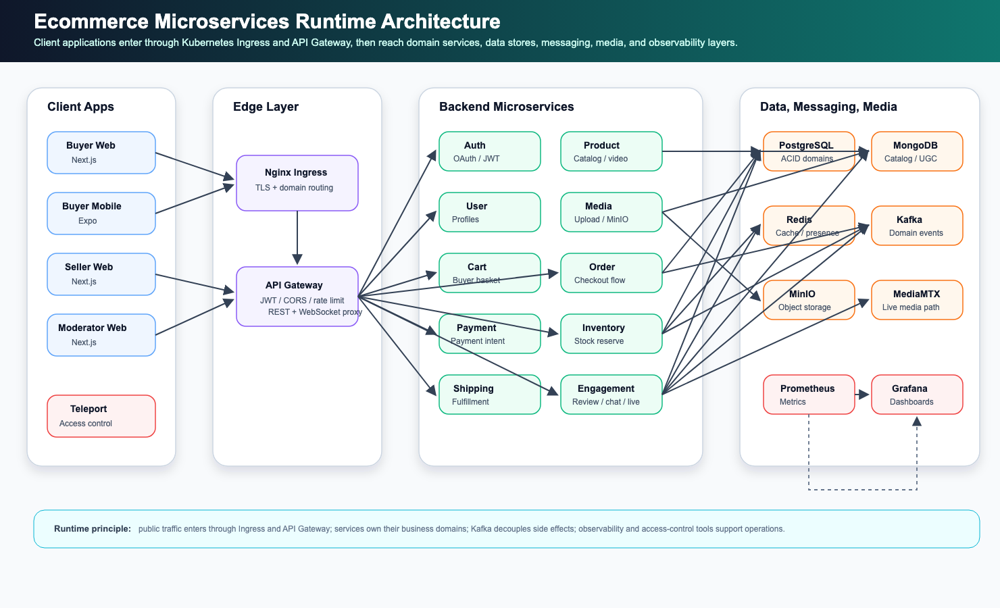

<p align="center">
  
  
  
  
</p>

<h1 align="center">Ecommerce Microservices Platform</h1>

<p align="center">
  A production-like ecommerce platform built as a microservices monorepo, with Go services, a NestJS authentication service, Next.js web apps, an Expo mobile app, event-driven workflows, and realtime commerce features.
</p>

---

## Overview

This project is an end-to-end ecommerce platform designed to demonstrate how a modern commerce system can be built and operated using microservices.

The platform includes:

- Buyer web and mobile experiences.
- Seller dashboard for product, order, video, live, and analytics workflows.
- Moderator dashboard for content moderation.
- API Gateway as the single public API entry point.
- Authentication with email/password, Google OAuth, JWT sessions, refresh tokens, and role-based access control.
- Commerce services for catalog, cart, checkout, order, payment, inventory, shipping, and review flows.
- Realtime services for buyer-seller chat and livestream commerce.
- Media storage and playback through MinIO and MediaMTX.
- Analytics and recommendation features, including FP-Growth association-rule mining.
- Local Docker Compose runtime, with optional ELK log collection through `docker-compose.elk.yml`.

## High-Level Runtime Architecture



## DevSecOps And Observability Status

This repository uses the new GitLab-centered DevSecOps pipeline defined in `.gitlab-ci.yml`. It is not the old legacy flow based on manual deployment or Jenkins-style jobs.

The implemented pipeline validates changed services, runs security scans, builds images, scans image tarballs, publishes images to Harbor when configured, and updates the dev Helm values for GitOps promotion.

Current status:

- GitLab CI currently runs changed-target discovery, scoped validation, Gitleaks, Semgrep, Trivy filesystem scan, Docker image build, Trivy image scan, SBOM generation, optional registry publishing, and Helm dev values update.
- Local ELK is available through `docker-compose.elk.yml` and stores logs in `ecommerce-logs-local-*`.
- Harbor, Argo CD, Kyverno, Cosign, Prometheus/Grafana, and in-cluster ELK require real environment setup before production use.
- RAG-based risk gating is not part of the current pipeline; it is documented separately as a research proposal in [RAG-based DevSecOps risk gate proposal](./docs/devsecops/rag-risk-gate-proposal.md).

Detailed pipeline stages, diagrams, required variables, rollout boundaries, and the draw.io architecture are documented in [DevSecOps platform design](./docs/devsecops/new-platform-design.md).

## Repository Organization

```txt
ecommerce-microservices/
├── services/
│   ├── api-gateway/              # Go API gateway and public API router
│   ├── auth-service/             # NestJS authentication, OAuth, JWT, sessions, MFA
│   ├── user-service/             # User profiles and addresses
│   ├── product-service/          # Product catalog, shops, shoppable videos
│   ├── media-service/            # Media upload/download and MinIO integration
│   ├── cart-service/             # Shopping cart and price snapshots
│   ├── order-service/            # Order lifecycle and checkout orchestration
│   ├── payment-service/          # Payment intent and payment event handling
│   ├── inventory-service/        # Stock, reservation, and inventory events
│   ├── shipping-service/         # Shipment and delivery tracking
│   ├── notification-service/     # Email/notification delivery
│   ├── analytics-service/        # Metrics, events, reports, FP-Growth recommendations
│   ├── review-service/           # Product ratings and reviews
│   ├── chat-service/             # Buyer-seller realtime chat
│   └── live-service/             # Livestream commerce sessions and live events
│
├── frontend/
│   ├── apps/
│   │   ├── buyer-web/            # Buyer-facing Next.js web application
│   │   ├── seller/               # Seller dashboard
│   │   ├── moderator/            # Moderator dashboard
│   │   └── buyer-mobile/         # Expo / React Native buyer mobile application
│   └── packages/                 # Shared frontend contracts and utilities
│
├── packages/backend-shared/      # Shared NestJS/backend utilities
├── shared/                       # Shared contracts, Kafka topics, proto files, types
├── infrastructure/               # Legacy/reference Docker and Kafka assets
├── deploy/                       # Helm, Argo CD, Kyverno, and observability assets
└── docs/                         # Architecture, API docs, operations docs, runbooks
```

## Backend Service Inventory

| Service | Runtime | Responsibility |
|---|---|---|
| `api-gateway` | Go | Public API routing, JWT validation, CORS, rate limiting, metrics |
| `auth-service` | NestJS / TypeScript | Login, registration, Google OAuth, JWT, refresh tokens, sessions, MFA |
| `user-service` | Go | Buyer/seller profile and address management |
| `product-service` | Go | Product catalog, shops, product assets, shoppable video metadata |
| `media-service` | Go | Media object storage integration through MinIO |
| `cart-service` | Go | Buyer cart, item snapshots, cart validation |
| `order-service` | Go | Checkout, order status lifecycle, order audit logs |
| `payment-service` | Go | Payment intents, payment status, payment events |
| `inventory-service` | Go | Stock levels, reservations, inventory outbox events |
| `shipping-service` | Go | Shipment creation and tracking events |
| `notification-service` | Go | Notification and email event processing |
| `analytics-service` | Go | Business events, dashboards, seller KPIs, recommendation rules |
| `review-service` | Go | Ratings, reviews, review summaries |
| `chat-service` | Go | Conversations, messages, WebSocket delivery, chat events |
| `live-service` | Go | Live sessions, product pinning, live chat, viewer presence, live events |

## Frontend Applications

| Application | Runtime | Main users |
|---|---|---|
| `frontend/apps/buyer-web` | Next.js | Buyers browsing products, videos, livestreams, cart, checkout, orders, chat |
| `frontend/apps/buyer-mobile` | Expo / React Native | Mobile buyer experience |
| `frontend/apps/seller` | Next.js | Sellers managing products, orders, videos, livestreams, analytics |
| `frontend/apps/moderator` | Next.js | Moderators reviewing products, videos, and safety-related chat issues |

## Core Business Flows

### Authentication And Authorization

The authentication flow is handled by `auth-service`.

- Email/password login issues an internal JWT session.
- Google OAuth verifies the user's Google identity first, then the system issues its own JWT tokens.
- `accessToken` is sent as `Authorization: Bearer <token>` when calling protected APIs.
- `refreshToken` is used to rotate sessions and obtain a new access token.
- The API Gateway validates JWTs before forwarding protected requests to downstream services.
- Role-based access control separates buyer, seller, moderator, support, admin, and super admin access.

### Buyer Checkout

```txt
Buyer -> API Gateway -> Cart Service -> Order Service
      -> Inventory Service -> Payment Service -> Shipping Service
      -> Notification Service -> Analytics Service
```

The checkout workflow is designed around explicit state transitions and event-driven side effects. Orders are stored in PostgreSQL, while inventory, payment, shipping, notification, and analytics workflows can react through Kafka events and outbox records.

### Shoppable Video

Seller video content is managed through the product and media services:

```txt
Seller Web -> API Gateway -> Product Service -> Media Service -> MinIO
Moderator approval -> Published video feed
Buyer watches video -> product click/comment/cart/order events -> Analytics
```

This allows buyers to discover products through short videos and move directly from content to product detail, cart, or checkout.

### Livestream Commerce

Livestream commerce combines live media playback, realtime room state, product pinning, chat, and analytics:

```txt
Seller Web -> Live Service -> Live Session / Product Pinning
Seller media publish -> MediaMTX
Buyer playback -> MediaMTX
Buyer/Seller realtime state -> Live WebSocket -> Live Service
Live events -> Kafka -> Analytics
```

### Buyer-Seller Chat

Chat is built around conversation documents, message persistence, Redis Pub/Sub, WebSocket delivery, and Kafka events:

```txt
Buyer/Seller -> API Gateway -> Chat Service
Chat Service -> MongoDB for messages
Chat Service -> Redis Pub/Sub for realtime fan-out
Chat Service -> Kafka for notification and analytics events
```

### FP-Growth Recommendations

The analytics service includes an FP-Growth recommendation module. Completed orders are transformed into product baskets, then frequent itemsets and association rules are mined to recommend products commonly purchased together.

```txt
Completed Orders -> Recommendation Transactions -> FP-Growth Trainer
-> Association Rules -> Product/Cart Recommendations -> Buyer UI + Seller Analytics
```

The main implementation is in:

```txt
services/analytics-service/internal/recommendation/fpgrowth.go
```

## Local Runtime

The default local stack is managed through Docker Compose:

```bash
docker compose up
```

Or use the local helper script:

```bash
./start-service.sh --build
```

Run the local stack with ELK log collection:

```bash
docker compose -f docker-compose.yml -f docker-compose.elk.yml up -d --build
```

The equivalent helper command is:

```bash
./start-service.sh --elk --build
```

Kibana is available at:

```txt
http://localhost:5601
```

Use the Kibana data view:

```txt
ecommerce-logs-local-*
```

Service-specific Dockerfiles remain under `services/*/Dockerfile`. The active local ELK assets are under `deploy/observability/elk`; older infrastructure folders are retained for reference and service-specific development.

## Documentation

Key documents:

- [System design](./docs/architecture/system-design.md)
- [Data flow](./docs/architecture/data-flow.md)
- [Kafka events](./docs/architecture/kafka-events.md)
- [Security](./docs/architecture/security.md)
- [DevSecOps platform design](./docs/devsecops/new-platform-design.md)
- [RAG-based DevSecOps risk gate proposal](./docs/devsecops/rag-risk-gate-proposal.md)
- [Local ELK guide](./deploy/observability/elk/README.md)
- [DevSecOps draw.io diagram](./docs/diagram/devsecops-current-target.drawio)
- [API documentation](./docs/api/README.md)
- [Development standards](./docs/development/code-standards.md)

## License

Licensed under the [MIT License](./LICENSE).
