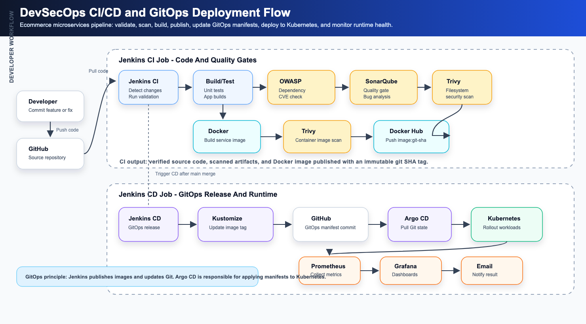

<p align="center">
  
  
  
  
  
  
</p>

<h1 align="center">Ecommerce Microservices Platform</h1>

<p align="center">
  A production-like ecommerce platform built as a microservices monorepo, with Go services, a NestJS authentication service, Next.js web apps, an Expo mobile app, event-driven workflows, realtime commerce features, and a Jenkins + Argo CD GitOps deployment flow on Kubernetes.
</p>

---

## Overview

This project is an end-to-end ecommerce platform designed to demonstrate how a modern commerce system can be built, deployed, monitored, and operated using microservices and DevSecOps practices.

The platform includes:

- Buyer web and mobile experiences.
- Seller dashboard for product, order, video, live, and analytics workflows.
- Moderator dashboard for content moderation.
- API Gateway as the single public API entry point.
- Authentication with email/password, Google OAuth, JWT sessions, refresh tokens, and role-based access control.
- Commerce services for catalog, cart, checkout, order, payment, inventory, shipping, and review flows.
- Realtime services for buyer-seller chat and livestream commerce.
- Media storage and playback through MinIO and MediaMTX.
- Analytics and recommendation features, including FP-Growth association-rule mining.
- Kubernetes deployment with Jenkins CI/CD, Docker Hub images, Argo CD GitOps, Rancher, Teleport, Prometheus, and Grafana.

## High-Level Runtime Architecture


## Repository Organization

```txt
ecommerce-microservices/
├── services/
│   ├── api-gateway/              # Go API gateway and public API router
│   ├── auth-service/             # NestJS authentication, OAuth, JWT, sessions, MFA
│   ├── user-service/             # User profiles and addresses
│   ├── product-service/          # Product catalog, shops, shoppable videos
│   ├── media-service/            # Media upload/download and MinIO integration
│   ├── cart-service/             # Shopping cart and price snapshots
│   ├── order-service/            # Order lifecycle and checkout orchestration
│   ├── payment-service/          # Payment intent and payment event handling
│   ├── inventory-service/        # Stock, reservation, and inventory events
│   ├── shipping-service/         # Shipment and delivery tracking
│   ├── notification-service/     # Email/notification delivery
│   ├── analytics-service/        # Metrics, events, reports, FP-Growth recommendations
│   ├── review-service/           # Product ratings and reviews
│   ├── chat-service/             # Buyer-seller realtime chat
│   └── live-service/             # Livestream commerce sessions and live events
│
├── frontend/
│   ├── apps/
│   │   ├── buyer-web/            # Buyer-facing Next.js web application
│   │   ├── seller/               # Seller dashboard
│   │   ├── moderator/            # Moderator dashboard
│   │   └── buyer-mobile/         # Expo / React Native buyer mobile application
│   └── packages/                 # Shared frontend contracts and utilities
│
├── packages/backend-shared/      # Shared NestJS/backend utilities
├── shared/                       # Shared contracts, Kafka topics, proto files, types
├── infrastructure/               # Docker, Kubernetes, monitoring, logging, Terraform
├── cicd/                         # Jenkins pipelines and CI/CD helper scripts
└── docs/                         # Architecture, API docs, deployment guides, runbooks
```

## Backend Service Inventory

| Service | Runtime | Responsibility |
|---|---|---|
| `api-gateway` | Go | Public API routing, JWT validation, CORS, rate limiting, metrics |
| `auth-service` | NestJS / TypeScript | Login, registration, Google OAuth, JWT, refresh tokens, sessions, MFA |
| `user-service` | Go | Buyer/seller profile and address management |
| `product-service` | Go | Product catalog, shops, product assets, shoppable video metadata |
| `media-service` | Go | Media object storage integration through MinIO |
| `cart-service` | Go | Buyer cart, item snapshots, cart validation |
| `order-service` | Go | Checkout, order status lifecycle, order audit logs |
| `payment-service` | Go | Payment intents, payment status, payment events |
| `inventory-service` | Go | Stock levels, reservations, inventory outbox events |
| `shipping-service` | Go | Shipment creation and tracking events |
| `notification-service` | Go | Notification and email event processing |
| `analytics-service` | Go | Business events, dashboards, seller KPIs, recommendation rules |
| `review-service` | Go | Ratings, reviews, review summaries |
| `chat-service` | Go | Conversations, messages, WebSocket delivery, chat events |
| `live-service` | Go | Live sessions, product pinning, live chat, viewer presence, live events |

## Frontend Applications

| Application | Runtime | Main users |
|---|---|---|
| `frontend/apps/buyer-web` | Next.js | Buyers browsing products, videos, livestreams, cart, checkout, orders, chat |
| `frontend/apps/buyer-mobile` | Expo / React Native | Mobile buyer experience |
| `frontend/apps/seller` | Next.js | Sellers managing products, orders, videos, livestreams, analytics |
| `frontend/apps/moderator` | Next.js | Moderators reviewing products, videos, and safety-related chat issues |

## Core Business Flows

### Authentication And Authorization

The authentication flow is handled by `auth-service`.

- Email/password login issues an internal JWT session.
- Google OAuth verifies the user's Google identity first, then the system issues its own JWT tokens.
- `accessToken` is sent as `Authorization: Bearer <token>` when calling protected APIs.
- `refreshToken` is used to rotate sessions and obtain a new access token.
- The API Gateway validates JWTs before forwarding protected requests to downstream services.
- Role-based access control separates buyer, seller, moderator, support, admin, and super admin access.

### Buyer Checkout

```txt
Buyer -> API Gateway -> Cart Service -> Order Service
      -> Inventory Service -> Payment Service -> Shipping Service
      -> Notification Service -> Analytics Service
```

The checkout workflow is designed around explicit state transitions and event-driven side effects. Orders are stored in PostgreSQL, while inventory, payment, shipping, notification, and analytics workflows can react through Kafka events and outbox records.

### Shoppable Video

Seller video content is managed through the product and media services:

```txt
Seller Web -> API Gateway -> Product Service -> Media Service -> MinIO
Moderator approval -> Published video feed
Buyer watches video -> product click/comment/cart/order events -> Analytics
```

This allows buyers to discover products through short videos and move directly from content to product detail, cart, or checkout.

### Livestream Commerce

Livestream commerce combines live media playback, realtime room state, product pinning, chat, and analytics:

```txt
Seller Web -> Live Service -> Live Session / Product Pinning
Seller media publish -> MediaMTX
Buyer playback -> MediaMTX
Buyer/Seller realtime state -> Live WebSocket -> Live Service
Live events -> Kafka -> Analytics
```

### Buyer-Seller Chat

Chat is built around conversation documents, message persistence, Redis Pub/Sub, WebSocket delivery, and Kafka events:

```txt
Buyer/Seller -> API Gateway -> Chat Service
Chat Service -> MongoDB for messages
Chat Service -> Redis Pub/Sub for realtime fan-out
Chat Service -> Kafka for notification and analytics events
```

### FP-Growth Recommendations

The analytics service includes an FP-Growth recommendation module. Completed orders are transformed into product baskets, then frequent itemsets and association rules are mined to recommend products commonly purchased together.

```txt
Completed Orders -> Recommendation Transactions -> FP-Growth Trainer
-> Association Rules -> Product/Cart Recommendations -> Buyer UI + Seller Analytics
```

The main implementation is in:

```txt
services/analytics-service/internal/recommendation/fpgrowth.go
```

## Deployment And DevSecOps Flow

The project is deployed using a Jenkins-driven CI/CD pipeline and Argo CD GitOps.

The current public environment is a production-like development environment:

```txt
Kubernetes namespace: ecommerce-dev
Argo CD application: ecommerce-dev
Kustomize overlay: infrastructure/kubernetes/overlays/dev
Docker image repository prefix: docker.io/vantruong179/ecommerce-microservices-*
```

Public application URLs:

```txt
https://api.dt-commerce.site
https://buyer.dt-commerce.site
https://seller.dt-commerce.site
https://moderator.dt-commerce.site
https://argocd.dt-commerce.site
https://rancher.dt-commerce.site
https://grafana.dt-commerce.site
https://teleport.dt-commerce.site
```

### CI/CD Pipeline Diagram

The diagram below is a clean version of the deployment flow represented in the reference image.



### Pull Request Validation Flow

Pull requests are validation-only.

```txt
Developer branch
-> Pull Request into main
-> Jenkins detects impacted services/apps
-> Test/build changed targets
-> Trivy filesystem scan
-> Optional OWASP Dependency Check
-> Optional SonarQube analysis
-> No Docker push
-> No Kubernetes deployment
```

### Main Branch Deployment Flow

Deployments happen after code is merged into `main`.

```txt
Merge into main
-> Jenkins CI detects impacted services/apps
-> Test/build
-> Filesystem scan
-> Docker build
-> Docker image scan
-> Push image to Docker Hub using the git short SHA tag
-> Jenkins CD updates the image tag in Kustomize
-> Jenkins commits the GitOps change back to GitHub
-> Argo CD syncs the manifest
-> Kubernetes rolls out the new version
```

Important rule:

```txt
Pushing a Docker image does not deploy the application by itself.
The cluster changes only when the GitOps manifest tag changes and Argo CD syncs it.
```

## Kubernetes Deployment Model

The Kubernetes manifests are organized with Kustomize:

```txt
infrastructure/kubernetes/base
infrastructure/kubernetes/overlays/dev
```

The runtime layer includes:

- Deployments and Services for backend microservices.
- Deployments and Services for frontend web applications.
- Stateful/demo data services such as PostgreSQL, MongoDB, Redis, Kafka, and MinIO.
- MediaMTX for livestream ingest and playback.
- Ingress resources for public domains.
- TLS certificates through cert-manager.
- Node placement through labels such as `workload=app` and `workload=data`.

Example rollout verification:

```bash
kubectl -n ecommerce-dev get pods
kubectl -n ecommerce-dev get deploy
kubectl -n ecommerce-dev rollout status deploy/api-gateway
kubectl -n ecommerce-dev get ingress
```

## Operations Tooling

| Tool | Role in this project |
|---|---|
| Jenkins | Runs CI/CD pipelines, tests, scans, builds images, and triggers GitOps updates |
| Docker Hub | Stores immutable service images tagged by git commit SHA |
| Argo CD | Watches Git and syncs Kubernetes manifests into the cluster |
| Kubernetes | Runs the actual workloads, restarts pods, handles rollouts, and manages service discovery |
| Rancher | Provides a web UI for Kubernetes administration, pod logs, events, resources, and cluster health |
| Teleport | Provides controlled SSH and Kubernetes access with user roles and auditability |
| Prometheus | Collects infrastructure and application metrics |
| Grafana | Visualizes metrics and dashboards for nodes, pods, services, and application health |
| Trivy | Scans source filesystems and Docker images for vulnerabilities |
| OWASP Dependency Check | Detects known vulnerable dependencies |
| SonarQube | Checks code quality, bugs, vulnerabilities, duplication, and quality gates |

## Deployment Verification

Check the latest GitOps commit and image tag:

```bash
git fetch origin main
git log origin/main --oneline -5
git show origin/main:infrastructure/kubernetes/overlays/dev/kustomization.yaml | grep -A2 api-gateway
```

Check the running image in Kubernetes:

```bash
kubectl -n ecommerce-dev get deploy api-gateway -o jsonpath='{.spec.template.spec.containers[0].image}{"\n"}'
kubectl -n ecommerce-dev rollout status deploy/api-gateway
```

Check Argo CD:

```txt
Application: ecommerce-dev
Sync Status: Synced
Health Status: Healthy
Last Sync Revision: commit containing the GitOps image tag update
```

## Documentation

Key documents:

- [System design](./docs/architecture/system-design.md)
- [Data flow](./docs/architecture/data-flow.md)
- [Kafka events](./docs/architecture/kafka-events.md)
- [Security](./docs/architecture/security.md)
- [CI/CD design](./docs/deployment/automated-gitops-cicd-design.md)
- [Manual Kubernetes deployment runbook](./docs/deployment/manual-k8s-build-and-deploy-runbook.md)
- [DevSecOps tools operator guide](./docs/deployment/devsecops-tools-operator-guide.md)
- [DevSecOps presentation script](./docs/deployment/devsecops-tools-presentation-script.md)
- [API documentation](./docs/api/README.md)
- [Development standards](./docs/development/code-standards.md)

## License

Licensed under the [MIT License](./LICENSE).
