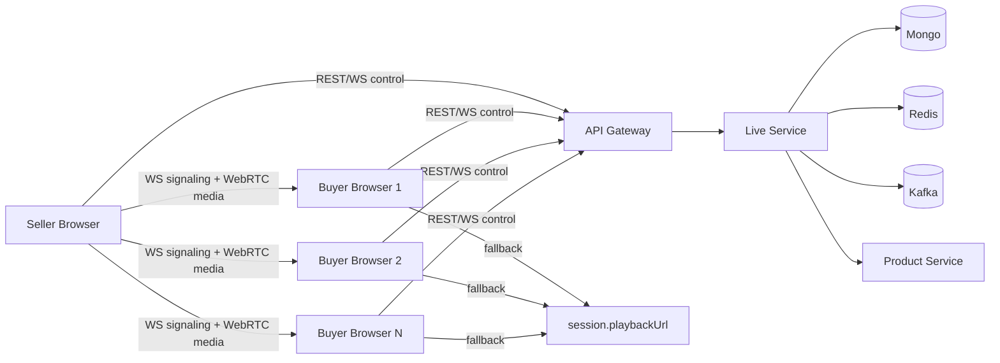
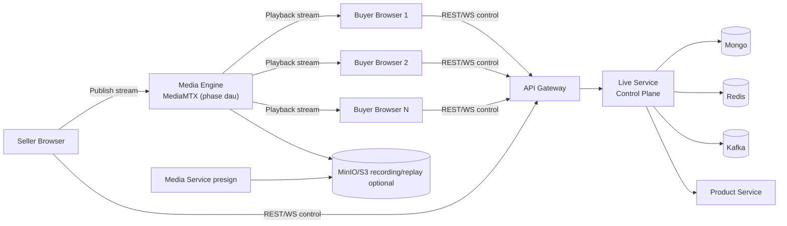
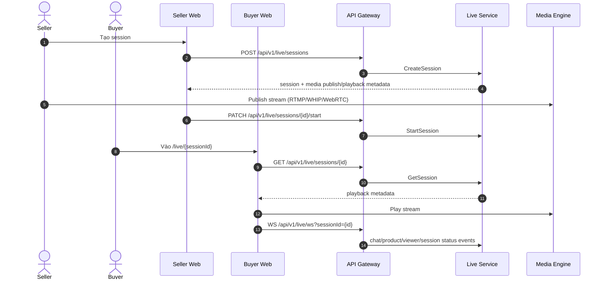

# Livestream Migration Plan (Repo-Grounded)

Last updated: 2026-05-17
Primary objective: chuyển luồng livestream hiện tại từ WebRTC P2P sang mô hình production có media engine trung gian, tái sử dụng tối đa service hiện có, không tạo business microservice mới.

## 1) Scope và boundary

Phạm vi thay đổi chính:

- Backend: `services/live-service`, `services/api-gateway`, `services/media-service` (mức tối thiểu).
- Frontend: `frontend/apps/seller`, `frontend/apps/buyer-web`.
- Infra: `docker-compose.yml`.

Boundary cứng:

- `live-service` tiếp tục là control plane (session/chat/pin/product click/viewer/event).
- Không nhét RTP/transcoding/SFU logic vào Go service.
- Media engine (MediaMTX/LiveKit) là infrastructure layer.

## 2) Hiện trạng code trong repo (As-Is)

## 2.1 Backend hiện tại

`live-service` đang có đầy đủ nghiệp vụ live:

- REST lifecycle + pin product + tracking: `services/live-service/internal/router/router.go`.
- WS realtime + signaling P2P: `services/live-service/internal/handler/ws_handler.go`.
- State transition + event publish + broadcast: `services/live-service/internal/service/live_service.go`.
- Session schema hiện có `playbackUrl`, `sourceType=EXTERNAL_URL`: `services/live-service/internal/domain/live.go`.
- Mongo collections: `live_sessions`, `live_session_products`, `live_messages`: `services/live-service/internal/repository/live_repository.go`.

`api-gateway` đã proxy đủ live routes và WS:

- `services/api-gateway/internal/router/router.go`.
- Timeout cho live/chat đang set dài (`24h`) trong `docker-compose.yml`.

`media-service` hiện là storage/presign service, không phải media plane realtime:

- Router và endpoints presign: `services/media-service/internal/router/router.go`.
- Upload video hiện có hard limit `50MB` ở `services/media-service/internal/service/storage_service.go`.

## 2.2 Frontend hiện tại

Seller app đang thực sự chạy mô hình P2P broadcaster:

- Trang vận hành live + camera/screen capture + RTCPeerConnection + signaling:
  - `frontend/apps/seller/src/app/marketing/live-video/page.tsx`.
- Gửi WS signaling event:
  - `live:webrtc:broadcaster-ready`
  - `live:webrtc:offer`
  - `live:webrtc:answer`
  - `live:webrtc:ice-candidate`

Buyer app đang xem live theo ưu tiên:

1. Cố kết nối WebRTC từ seller qua signaling WS.
2. Nếu chưa có stream thì fallback `session.playbackUrl` (`<video src=...>`).

File chính:

- `frontend/apps/buyer-web/src/app/live/[sessionId]/page.tsx`.
- `frontend/apps/buyer-web/src/lib/api/live.ts`.

Proxy routes frontend -> live-service:

- Seller proxy: `frontend/apps/seller/src/app/api/seller/live/*`.
- Buyer proxy: `frontend/apps/buyer-web/src/app/api/buyer/live/*`.

## 2.3 Compose hiện tại

- Có `live-service`, `api-gateway`, `mongo`, `redis`, `kafka`, `minio`.
- Chưa có MediaMTX/LiveKit service trong `docker-compose.yml`.

## 2.4 Kết luận hiện trạng

- Repo hiện tại là hybrid: nghiệp vụ live tốt, video path vẫn thiên P2P.
- `playbackUrl` hiện dùng làm fallback/manual source hơn là media pipeline thật.
- Đây là nền rất tốt để migrate sang production flow mà không phá kiến trúc hiện có.

## 3) Mục tiêu kiến trúc đích (To-Be)

## 3.1 Nguyên tắc

- Seller publish đúng 1 upstream stream lên media engine.
- Buyer playback từ media engine (HLS/LL-HLS/WebRTC), không nhận stream trực tiếp từ seller.
- WS của `live-service` vẫn phục vụ chat/pin/viewer/session-status/events.
- Signaling P2P giữ lại như fallback mode trong giai đoạn chuyển đổi.

## 3.2 Sơ đồ luồng hiện tại (As-Is)

## 3.3 Sơ đồ luồng production target (To-Be)

## 3.4 Sequence production target

## 4) Khác biệt cốt lõi As-Is vs To-Be

| Hạng mục | As-Is | To-Be |
|---|---|---|
| Video path | Seller -> từng buyer (P2P) | Seller -> Media Engine -> nhiều buyer |
| Vai trò `live-service` | Business + signaling P2P | Business + media metadata orchestration |
| Buyer playback | WebRTC peer, fallback URL | Media playback chính thức |
| Scale | phụ thuộc máy seller | phụ thuộc media infra |
| Độ ổn định | giảm nhanh khi đông viewer | ổn định hơn cho multi-viewer |

## 5) Thiết kế migration bám theo code hiện tại

## 5.1 Chọn media engine giai đoạn đầu

Khuyến nghị cho repo hiện tại: MediaMTX trước.

Lý do:

- Compose-based project, dễ thêm container nhanh.
- Phù hợp mục tiêu simulation production tại local.
- Giảm độ phức tạp so với chuyển thẳng qua LiveKit.

## 5.2 Cách tái sử dụng service hiện có

- `live-service`: giữ nguyên REST/WS nghiệp vụ; mở rộng schema + API response media metadata.
- `api-gateway`: gần như không đổi route vì đã proxy theo prefix `/api/live*`.
- `media-service`: giữ vai trò presign cho thumbnail/recording/replay (không xử lý luồng realtime).
- `analytics-service`: tiếp tục consume event; bổ sung event QoE phía frontend/backend.

## 5.3 Mở rộng data model `LiveSession` (backward-compatible)

File đích sửa: `services/live-service/internal/domain/live.go` và repository mapping.

Đề xuất field mới:

- `mediaProvider`: `P2P` | `MEDIAMTX` | `LIVEKIT`
- `ingestProtocol`: `RTMP` | `WHIP` | `WEBRTC`
- `ingestUrl`: seller publish endpoint
- `streamName` hoặc `streamKey`
- `playbackProtocol`: `HLS` | `LL_HLS` | `WEBRTC`
- `playbackUrl`: giữ field cũ, đổi ý nghĩa thành canonical playback URL
- `playbackToken` (optional, nếu cần)
- `mediaStatus`: `IDLE` | `READY` | `LIVE` | `DEGRADED` | `ENDED`

Compatibility rule:

- Nếu session không có metadata mới, frontend tiếp tục mode cũ (P2P + fallback) bằng feature flag.

## 5.4 API contract mở rộng (không phá API hiện có)

Routes giữ nguyên:

- `POST /api/v1/live/sessions`
- `PATCH /api/v1/live/sessions/{id}/start|pause|end`
- `GET /api/v1/live/sessions/{id}`

Mở rộng response `session` với object `media`:

- `provider`
- `publish` (`protocol`, `url`, `streamKey`)
- `playback` (`protocol`, `url`, optional token)
- `status`

## 5.5 WS strategy trong giai đoạn migration

Giữ lại event nghiệp vụ hiện tại:

- `live:message:*`
- `live:product:*`
- `live:viewer:count`
- `live:session:status`

Thu hẹp dần signaling P2P:

- `live:webrtc:*` chuyển thành legacy mode.

Bổ sung event media status:

- `live:media:ready`
- `live:media:degraded`
- `live:media:ended`

## 6) Plan triển khai chi tiết theo phase

## 6.1 Phase P0 - Baseline và feature flags

Mục tiêu:

- Có dual-mode rõ ràng trước khi thay video path.

Việc làm chi tiết:

- Thêm config vào `services/live-service/internal/config/config.go`:
  - `LIVE_MEDIA_MODE=p2p_legacy|media_engine`
  - `LIVE_MEDIA_PROVIDER=MEDIAMTX|LIVEKIT`
  - `LIVE_MEDIA_INGEST_BASE_URL`
  - `LIVE_MEDIA_PLAYBACK_BASE_URL`
  - `LIVE_MEDIA_PLAYBACK_PROTOCOL`
- Add typed config tests tương ứng tại `services/live-service/internal/config/config_test.go`.

Tiêu chí done:

- Chạy mode cũ và mode mới bằng env mà không crash.

## 6.2 Phase P1 - Infra MediaMTX local

Mục tiêu:

- Chạy được media engine trong stack local hiện tại.

Việc làm chi tiết:

- Cập nhật `docker-compose.yml` thêm service `mediamtx`.
- Mở cổng ingest/playback cần thiết.
- Tạo profile hoặc block comment runbook ngay trong docs.

Tiêu chí done:

- Có thể publish test stream vào MediaMTX.
- Có thể lấy URL playback (HLS/LL-HLS) xem trực tiếp.

## 6.3 Phase P2 - Live session media metadata backend

Mục tiêu:

- `live-service` tự cấp metadata publish/playback cho từng session.

Việc làm chi tiết:

- Sửa domain: `services/live-service/internal/domain/live.go`.
- Sửa repository mapping/index nếu cần: `services/live-service/internal/repository/live_repository.go`.
- Sửa create/update/get flows: `services/live-service/internal/service/live_service.go`.
- Sửa DTO handler nếu cần validation mới: `services/live-service/internal/handler/live_handler.go`.
- Cập nhật tests:
  - `services/live-service/internal/service/live_service_test.go`
  - `services/live-service/internal/handler/ws_handler_test.go` (nếu payload thay đổi)

Tiêu chí done:

- `GET session detail` trả đủ metadata media để frontend không phải hardcode.

## 6.4 Phase P3 - Seller publish flow migration

Mục tiêu:

- Seller publish lên media engine thay vì đẩy trực tiếp cho buyer.

Việc làm chi tiết:

- Refactor `frontend/apps/seller/src/app/marketing/live-video/page.tsx`:
  - Tách module capture media khỏi signaling.
  - Bỏ dependency bắt buộc vào `RTCPeerConnection` cho mode production.
  - Dùng metadata từ session để publish.
- Giữ P2P branch dưới feature flag để rollback nhanh.

Tiêu chí done:

- Seller chỉ có 1 upstream stream khi mode `media_engine` bật.

## 6.5 Phase P4 - Buyer playback flow migration

Mục tiêu:

- Buyer playback từ media engine là primary path.

Việc làm chi tiết:

- Refactor `frontend/apps/buyer-web/src/app/live/[sessionId]/page.tsx`:
  - Chuyển WebRTC peer path thành optional/legacy.
  - Phát stream từ `session.media.playback` (HLS/LL-HLS/WebRTC tùy protocol).
  - Giữ WS cho chat/pin/viewer/status.
- Cập nhật typed interfaces ở:
  - `frontend/apps/buyer-web/src/lib/api/types.ts`
  - `frontend/apps/seller/src/lib/api/types.ts`

Tiêu chí done:

- Buyer xem ổn định dù seller không P2P tới viewer.

## 6.6 Phase P5 - QoE metrics + analytics

Mục tiêu:

- So sánh được quality trước/sau migration.

Việc làm chi tiết:

- Emit thêm metrics event từ frontend/backend:
  - first-frame time
  - buffering count
  - playback error code
  - publish reconnect count
- Đẩy về Kafka qua `live-service` event path.

Tiêu chí done:

- Có dashboard/summary tối thiểu để đánh giá P2P vs media-engine.

## 6.7 Phase P6 - Hardening + rollback

Mục tiêu:

- Đảm bảo production-like vận hành an toàn.

Việc làm chi tiết:

- Timeout/retry/circuit cho media metadata và publish session lifecycle.
- Runbook sự cố thường gặp.
- Rollback về `p2p_legacy` qua env flag không cần revert code.

Tiêu chí done:

- Có thể rollback trong vài phút khi media engine lỗi.

## 7) Validation plan theo AGENTS.md

L0 (smoke, ngay mỗi phase):

- Unit test config/parser/mapper mới.

L1 (service scope):

- `cd services/live-service && go test ./...`
- `cd services/api-gateway && go test ./...` (nếu đổi route/timeout)
- `npm --workspace @frontend/seller run build`
- `npm --workspace @frontend/buyer-web run build`

L2 (integration local):

- Compose up + MediaMTX.
- Kịch bản e2e:
  - create -> start -> publish -> watch -> chat -> pin -> end.

L3 (monorepo full):

- Chỉ chạy khi thay đổi cross-cutting rộng.

## 8) Kịch bản test bắt buộc

- Case 1: 1 seller + 1 buyer full lifecycle pass.
- Case 2: 1 seller + nhiều buyer (>=20) vẫn xem ổn.
- Case 3: buyer vào giữa phiên vẫn xem được ngay.
- Case 4: seller reconnect publish sau mất mạng ngắn.
- Case 5: chat/pin/viewer count không regression.
- Case 6: end session thì playback và trạng thái đồng bộ.
- Case 7: tắt media engine tạm thời, UI báo degrade hợp lý.
- Case 8: bật lại `p2p_legacy` chạy được.

## 9) Risk register

- Risk: lệch trạng thái `LIVE` nhưng chưa có stream thật.
  - Mitigation: readiness check media trước/sau `start`.
- Risk: schema session thay đổi làm vỡ frontend typing.
  - Mitigation: thêm field mới theo kiểu optional + versioned parse.
- Risk: recording/replay lớn hơn giới hạn upload hiện tại `50MB` ở media-service.
  - Mitigation: tách cơ chế recording path khỏi presign upload giới hạn nhỏ.
- Risk: rollout đồng thời seller và buyer gây mismatch.
  - Mitigation: dual-mode + feature flags + canary.

## 10) Checklist mốc triển khai (đánh dấu dần)

Hướng dẫn:

- Khi hoàn tất mốc nào, đổi `[ ]` thành `[x]`.
- Không nhảy mốc nếu chưa pass tiêu chí của mốc trước.

- [x] M0 - Repo baseline và cờ cấu hình
- [x] M1 - MediaMTX local infrastructure
- [x] M2 - `live-service` media metadata orchestration
- [x] M3 - Seller publish flow migration
- [ ] M4 - Buyer playback flow migration
- [ ] M5 - QoE analytics và monitoring
- [ ] M6 - Hardening và rollback drill
- [ ] M7 - Production-simulation sign-off

## 11) Detailed task checklist theo file

- [x] `services/live-service/internal/config/config.go`
- [x] `services/live-service/internal/config/config_test.go`
- [x] `services/live-service/internal/domain/live.go`
- [x] `services/live-service/internal/repository/live_repository.go`
- [x] `services/live-service/internal/service/live_service.go`
- [x] `services/live-service/internal/service/live_service_test.go`
- [ ] `services/live-service/internal/handler/live_handler.go`
- [ ] `services/live-service/internal/handler/ws_handler.go`
- [ ] `services/live-service/internal/handler/ws_handler_test.go`
- [x] `docker-compose.yml` (add `mediamtx`)
- [x] `frontend/apps/seller/src/app/marketing/live-video/page.tsx`
- [x] `frontend/apps/seller/src/lib/api/types.ts`
- [ ] `frontend/apps/buyer-web/src/app/live/[sessionId]/page.tsx`
- [x] `frontend/apps/buyer-web/src/lib/api/types.ts`
- [x] `docs/architecture/livestream-service-development-plan.md` (cập nhật trạng thái mỗi phase)

## 12) Definition of Done

Migration được xem là xong khi thỏa tất cả:

- Mode `media_engine` hoạt động end-to-end tại local stack hiện tại.
- Seller không còn phải truyền media trực tiếp đến từng buyer trong mode production.
- Buyer playback ổn định từ media engine.
- `live-service` vẫn giữ nguyên nghiệp vụ cốt lõi, không tách thêm business service.
- Checklist mốc M0-M7 đã tick đầy đủ và có bằng chứng test tương ứng.
