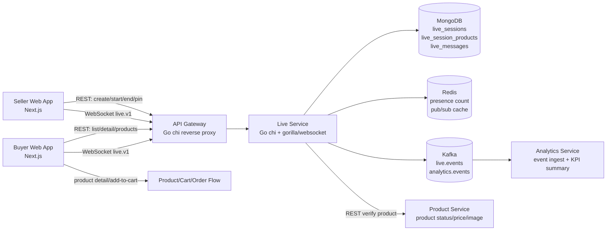
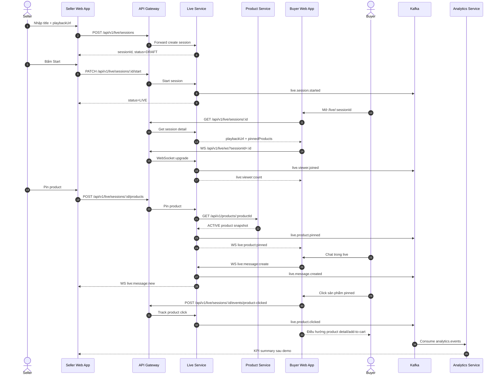
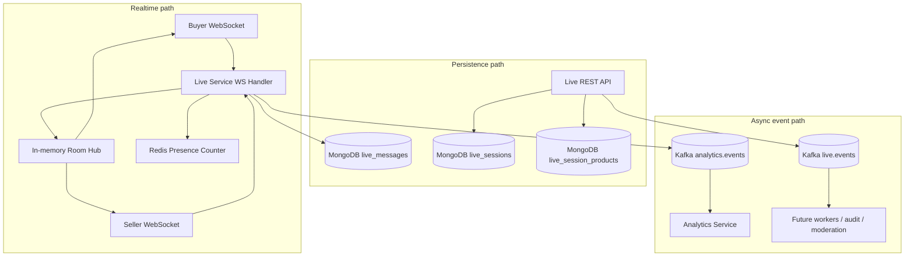
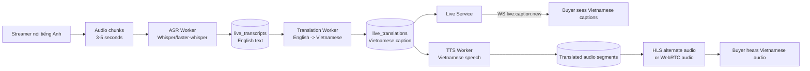

# Livestream Service Development Plan

Last updated: 2026-05-16  
Scope: `services/live-service`, `api-gateway`, `product-service`, `analytics-service`, `seller`, `buyer-web`

## 1) Mục tiêu

Xây dựng một `live-service` riêng cho Livestream Commerce, có thể demo local theo hướng thực tế:

- Seller tạo phiên livestream, start/end session.
- Buyer vào xem, chat realtime, thấy sản phẩm được pin.
- Buyer click sản phẩm trong live để xem chi tiết hoặc thêm vào giỏ.
- Hệ thống ghi event để analytics đo được hiệu quả live.
- Kiến trúc sẵn sàng mở rộng cho phụ đề, dịch ngôn ngữ, và audio dubbing sau MVP.

Quyết định kiến trúc chính:

- Tách `live-service` riêng ngay từ đầu.
- Không nhét live domain vào `chat-service`.
- MVP không làm ingest/transcoding thật, dùng `playbackUrl` HLS/MP4 để demo ổn định.
- Thiết kế data/event/WebSocket sao cho sau này thêm AI translation không phải đập lại service.

## 1.1) Trạng thái triển khai hiện tại

| Phase | Tên phase | Trạng thái | Bằng chứng |
|---|---|---|---|
| Phase 0 | Architecture Foundation | DONE | `live-service` build/run được, gateway route + compose config pass |
| Phase 1 | Live Session Domain | DONE | Unit test state machine pass |
| Phase 2 | Product Pinning | DONE | Unit test happy/failure path + smoke pin product pass |
| Phase 3 | WebSocket Realtime | DONE | WebSocket integration test + smoke WS ack pass |
| Phase 4 | Frontend MVP | TODO | Chưa triển khai UI seller/buyer |
| Phase 5 | Kafka Analytics | TODO | Chưa triển khai analytics summary |
| Phase 6 | Translation Caption MVP | TODO | Chưa triển khai transcript/translation |
| Phase 7 | ASR and Audio Dubbing | TODO | Chưa triển khai audio pipeline |

Test evidence mới nhất:

```txt
cd services/live-service && go test ./...
cd services/api-gateway && go test ./...
docker compose config --quiet
./scripts/test-live-service-smoke.sh
```

Kết quả: pass. Smoke script đã verify create/start/pin/get detail/WebSocket message ack/end session qua `api-gateway`.

## 2) Tại sao cần `live-service` riêng

Livestream không chỉ là chat. Domain này sẽ phát triển thành một hệ thống riêng gồm:

- Live session lifecycle.
- Viewer presence.
- Live room WebSocket.
- Live chat theo room.
- Pin/unpin sản phẩm.
- Commerce event tracking.
- Transcript theo thời gian.
- Dịch phụ đề realtime.
- Dubbing audio theo ngôn ngữ.
- Moderation nội dung live.
- Recording/replay.

Nếu để trong `chat-service`, service đó sẽ bị trộn giữa private buyer-seller chat và live room realtime. Hai loại workload này khác nhau:

| Capability | `chat-service` | `live-service` |
|---|---|---|
| Private chat 1-1 | Có | Không |
| Support/order conversation | Có | Không |
| Live room nhiều viewer | Không | Có |
| Viewer count/presence | Không | Có |
| Product pinning | Không | Có |
| Transcript/translation | Không | Có |
| Live analytics events | Không | Có |
| Media session metadata | Không | Có |

## 3) Kiến trúc tổng quan

```txt
frontend/apps/seller
  -> api-gateway
    -> live-service
      -> MongoDB: live_sessions, live_products, live_messages, live_transcripts
      -> Redis: room presence, pub/sub, short-lived counters
      -> Kafka: live.events, analytics.events
      -> product-service: verify product snapshot

frontend/apps/buyer-web
  -> api-gateway
    -> live-service REST + WebSocket

analytics-service
  <- Kafka analytics.events

future translation worker
  <- Kafka live.audio.chunked or live.transcript.created
  -> live-service: translated caption/audio metadata
```

### 3.1 Sơ đồ kiến trúc công nghệ MVP



Ý nghĩa:

- `api-gateway` là entrypoint duy nhất cho frontend.
- `live-service` sở hữu live session, room realtime, pinned products và live messages.
- `product-service` chỉ cung cấp product truth, không chứa logic livestream.
- `analytics-service` nhận event bất đồng bộ để tính KPI.

### 3.2 Sơ đồ luồng demo MVP end-to-end



### 3.3 Sơ đồ realtime và event tracking



Luồng realtime ưu tiên độ trễ thấp qua WebSocket. Luồng analytics đi Kafka để không làm chậm thao tác live chính.

### 3.4 Sơ đồ mở rộng dịch ngôn ngữ sau MVP



Triển khai theo thứ tự:

1. Text caption demo: nhập transcript English giả lập, dịch sang Vietnamese caption.
2. ASR caption thật: tách audio chunk, chạy speech-to-text, gửi caption realtime.
3. Voice dubbing: thêm TTS và delivery audio tiếng Việt.

## 4) Công nghệ đề xuất

Backend:

- Language: Go.
- HTTP router: `chi`, giống các Go service hiện có.
- WebSocket: `gorilla/websocket`, giống `chat-service`.
- Database: MongoDB.
- Cache/realtime fanout: Redis pub/sub.
- Event bus: Kafka.
- Auth: JWT middleware tương thích các service hiện tại.
- Response envelope: dùng chuẩn `success`, `data`, `meta`.

Frontend:

- Seller app: `frontend/apps/seller`.
- Buyer app: `frontend/apps/buyer-web`.
- Video player MVP: native `<video>` cho MP4 hoặc `hls.js` cho HLS.
- Realtime client: WebSocket native hoặc wrapper service trong `src/lib/api/live.ts`.

AI/translation sau MVP:

- ASR: Whisper/faster-whisper hoặc API provider.
- Translation: OpenAI/Google Translate/local model.
- TTS: OpenAI TTS/Google TTS/local TTS.
- Caption delivery: WebSocket.
- Audio delivery sau cùng: alternate HLS audio track hoặc WebRTC audio track.

## 5) Service ownership

`live-service` sở hữu:

- `live_sessions`
- `live_session_products`
- `live_messages`
- `live_viewer_events`
- `live_transcripts`
- `live_translations`
- WebSocket room `/live/ws`
- Kafka event `live.*`

`product-service` sở hữu:

- Product truth: status, price, image, seller ownership.
- API để `live-service` lấy snapshot trước khi pin.

`cart/order/payment` giữ nguyên ownership:

- Click từ live chỉ điều hướng hoặc gọi add-to-cart.
- Checkout không nằm trong `live-service`.

`analytics-service` sở hữu:

- Ingest event từ `analytics.events`.
- Tổng hợp KPI live.
- Dashboard/report endpoint.

## 6) Cấu trúc thư mục `live-service`

```txt
services/live-service/
  cmd/
    server/
      main.go
  internal/
    auth/
      context.go
      jwt.go
    config/
      config.go
    domain/
      errors.go
      live.go
      events.go
      roles.go
    handler/
      health_handler.go
      live_handler.go
      ws_handler.go
    httpx/
      httpx.go
    middleware/
      context.go
      logger.go
      recovery.go
      request_id.go
    repository/
      live_repository.go
    service/
      health_service.go
      live_service.go
      presence_service.go
      product_client.go
      redis_service.go
      translation_service.go
    events/
      publisher.go
      dispatcher.go
    websocket/
      hub.go
      client.go
      protocol.go
  migrations/
  Dockerfile
  go.mod
  go.sum
```

Ghi chú:

- Handler chỉ validate input, auth, gọi service.
- Service xử lý state machine và business rules.
- Repository chỉ xử lý MongoDB.
- WebSocket hub tách riêng để sau này scale room/presence dễ hơn.
- `translation_service.go` ban đầu chỉ là interface/stub, chưa cần implement AI ngay.

## 7) Data model

### 7.1 `live_sessions`

```json
{
  "_id": "ObjectId",
  "sessionId": "string",
  "sellerId": "string",
  "title": "string",
  "description": "string",
  "thumbnailUrl": "string",
  "playbackUrl": "string",
  "sourceType": "EXTERNAL_URL",
  "status": "DRAFT | SCHEDULED | LIVE | ENDED | CANCELLED",
  "defaultLanguage": "en",
  "supportedLanguages": ["en", "vi"],
  "metricsSnapshot": {
    "viewerPeak": 0,
    "messageCount": 0,
    "productClickCount": 0,
    "addToCartCount": 0
  },
  "scheduledAt": "datetime",
  "startedAt": "datetime",
  "endedAt": "datetime",
  "createdAt": "datetime",
  "updatedAt": "datetime"
}
```

Indexes:

- Unique `{ sessionId: 1 }`
- `{ sellerId: 1, status: 1, createdAt: -1 }`
- `{ status: 1, startedAt: -1 }`

### 7.2 `live_session_products`

```json
{
  "_id": "ObjectId",
  "sessionId": "string",
  "productId": "string",
  "sellerId": "string",
  "nameSnapshot": "string",
  "priceSnapshot": 100000,
  "currencySnapshot": "VND",
  "imageSnapshot": "string",
  "statusSnapshot": "ACTIVE",
  "pinStatus": "PINNED | UNPINNED",
  "sortOrder": 1,
  "pinnedAt": "datetime",
  "unpinnedAt": "datetime",
  "pinnedBy": "string"
}
```

Indexes:

- `{ sessionId: 1, pinStatus: 1, pinnedAt: -1 }`
- `{ sessionId: 1, productId: 1 }`

### 7.3 `live_messages`

```json
{
  "_id": "ObjectId",
  "messageId": "string",
  "sessionId": "string",
  "senderId": "string",
  "senderRole": "BUYER | CUSTOMER | SELLER | ADMIN",
  "text": "string",
  "clientMessageId": "string",
  "language": "vi",
  "status": "VISIBLE | HIDDEN | DELETED",
  "createdAt": "datetime"
}
```

Indexes:

- Unique sparse `{ sessionId: 1, clientMessageId: 1 }`
- `{ sessionId: 1, createdAt: -1 }`

### 7.4 `live_transcripts` hậu MVP

```json
{
  "_id": "ObjectId",
  "transcriptId": "string",
  "sessionId": "string",
  "sourceLanguage": "en",
  "startMs": 12000,
  "endMs": 16000,
  "text": "Hello everyone, today we have a flash sale.",
  "confidence": 0.92,
  "createdAt": "datetime"
}
```

### 7.5 `live_translations` hậu MVP

```json
{
  "_id": "ObjectId",
  "translationId": "string",
  "sessionId": "string",
  "transcriptId": "string",
  "sourceLanguage": "en",
  "targetLanguage": "vi",
  "text": "Xin chào mọi người, hôm nay chúng ta có flash sale.",
  "audioUrl": "string",
  "status": "TEXT_READY | AUDIO_READY | FAILED",
  "createdAt": "datetime"
}
```

## 8) REST API MVP

Base path: `/api/v1/live`

### Seller APIs

| Method | Path | Auth | Mô tả |
|---|---|---|---|
| `POST` | `/sessions` | `SELLER`, `ADMIN`, `SUPER_ADMIN` | Tạo live session |
| `GET` | `/sessions/my` | `SELLER`, `ADMIN`, `SUPER_ADMIN` | Danh sách live của seller |
| `GET` | `/sessions/:sessionId` | Public/private theo status | Chi tiết session |
| `PATCH` | `/sessions/:sessionId` | Owner/staff | Cập nhật title, thumbnail, playbackUrl |
| `PATCH` | `/sessions/:sessionId/start` | Owner/staff | Chuyển `DRAFT/SCHEDULED -> LIVE` |
| `PATCH` | `/sessions/:sessionId/end` | Owner/staff | Chuyển `LIVE -> ENDED` |
| `POST` | `/sessions/:sessionId/products` | Owner/staff | Pin product |
| `DELETE` | `/sessions/:sessionId/products/:productId` | Owner/staff | Unpin product |

### Buyer APIs

| Method | Path | Auth | Mô tả |
|---|---|---|---|
| `GET` | `/sessions` | Public | List live đang diễn ra |
| `GET` | `/sessions/:sessionId/products` | Public | List pinned products |
| `POST` | `/sessions/:sessionId/events/product-clicked` | Public/buyer | Track click product |
| `POST` | `/sessions/:sessionId/events/add-to-cart` | Buyer | Track add-to-cart từ live |

### Translation APIs hậu MVP

| Method | Path | Auth | Mô tả |
|---|---|---|---|
| `GET` | `/sessions/:sessionId/transcripts` | Viewer | Lấy transcript theo timeline |
| `GET` | `/sessions/:sessionId/translations?lang=vi` | Viewer | Lấy phụ đề đã dịch |
| `PATCH` | `/sessions/:sessionId/languages` | Owner/staff | Bật/tắt ngôn ngữ hỗ trợ |

## 9) WebSocket protocol

Endpoint:

```txt
GET /api/v1/live/ws?sessionId=<sessionId>
Subprotocol: live.v1
```

Client -> server:

```json
{ "type": "live:join", "sessionId": "..." }
{ "type": "live:leave", "sessionId": "..." }
{ "type": "live:message:create", "text": "Xin chào", "clientMessageId": "uuid" }
{ "type": "live:product:pin", "productId": "..." }
{ "type": "live:translation:subscribe", "language": "vi" }
```

Server -> client:

```json
{ "type": "live:session:status", "status": "LIVE" }
{ "type": "live:viewer:count", "count": 23 }
{ "type": "live:message:new", "message": {} }
{ "type": "live:product:pinned", "product": {} }
{ "type": "live:product:unpinned", "productId": "..." }
{ "type": "live:caption:new", "language": "vi", "text": "...", "startMs": 12000, "endMs": 16000 }
```

MVP cần:

- Join room.
- Broadcast chat.
- Broadcast pinned/unpinned product.
- Broadcast status change.
- Broadcast viewer count.

Hậu MVP cần:

- Subscribe language.
- Broadcast caption theo ngôn ngữ.
- Broadcast translation status.

## 10) Kafka events

Topic đề xuất:

- `live.events`: domain event cho live-service.
- `analytics.events`: event copy để analytics-service ingest.
- `audit.events`: optional cho action seller/staff.

Event MVP:

```txt
live.session.created
live.session.started
live.session.ended
live.viewer.joined
live.viewer.left
live.message.created
live.product.pinned
live.product.unpinned
live.product.clicked
live.add_to_cart.clicked
```

Event hậu MVP:

```txt
live.transcript.created
live.translation.created
live.translation.failed
live.audio.translation.created
```

Event envelope:

```json
{
  "eventId": "uuid",
  "eventType": "live.product.pinned",
  "aggregateId": "sessionId",
  "occurredAt": "2026-05-16T10:00:00Z",
  "payload": {},
  "metadata": {
    "requestId": "...",
    "actorId": "...",
    "actorRole": "SELLER",
    "service": "live-service"
  }
}
```

## 11) Product integration

Khi seller pin product:

1. `live-service` nhận `productId`.
2. Check session tồn tại, seller có quyền, status là `LIVE` hoặc `SCHEDULED`.
3. Gọi `product-service` lấy product public/managed detail.
4. Verify product `ACTIVE`.
5. Verify product thuộc seller hoặc staff có quyền.
6. Lưu snapshot vào `live_session_products`.
7. Broadcast `live:product:pinned`.
8. Publish `live.product.pinned`.

Không nên lưu dependency runtime trực tiếp giữa service. Chỉ giao tiếp qua REST/gRPC/Kafka.

## 12) Analytics MVP

KPI cần demo:

- `concurrent_viewers_peak`
- `viewer_join_count`
- `chat_messages_per_min`
- `pinned_product_count`
- `pinned_product_click_ctr`
- `live_add_to_cart_count`
- `session_duration_sec`

Triển khai tối thiểu:

- `live-service` publish event sang `analytics.events`.
- `analytics-service` ingest raw event hiện có.
- Thêm query/report theo `eventType` và `sessionId`.
- Nếu chưa kịp dashboard, có thể làm endpoint summary:

```txt
GET /api/v1/analytics/live/sessions/:sessionId/summary
```

## 13) Frontend plan

### Seller app

Target files:

- `frontend/apps/seller/src/app/marketing/live-video/page.tsx`
- `frontend/apps/seller/src/lib/api/live.ts`
- `frontend/apps/seller/src/app/api/seller/live/*`

Màn hình seller MVP:

- Form tạo session: title, description, thumbnail, playbackUrl.
- Danh sách session của seller.
- Nút Start/End.
- Ô nhập productId hoặc picker từ sản phẩm của seller.
- Pinned products panel.
- Chat/announcement panel.
- Metrics mini panel: viewers, messages, clicks.

### Buyer app

Target files:

- `frontend/apps/buyer-web/src/app/live/[sessionId]/page.tsx`
- `frontend/apps/buyer-web/src/app/live/page.tsx`
- `frontend/apps/buyer-web/src/lib/api/live.ts`
- `frontend/apps/buyer-web/src/app/api/buyer/live/*`

Màn hình buyer MVP:

- Video player.
- Live status.
- Viewer count.
- Chat panel.
- Pinned products rail.
- Product click -> product detail/cart.
- Caption panel sau MVP.
- Language selector sau MVP.

## 14) Translation roadmap

### Stage A: Text caption demo

Mục tiêu:

- Chứng minh live có phụ đề dịch tiếng Việt.
- Chưa cần xử lý audio thật.

Cách làm:

- Seller nhập text English trong panel transcript giả lập.
- `live-service` tạo `live.transcript.created`.
- Translation worker dịch English -> Vietnamese.
- Buyer nhận `live:caption:new` qua WebSocket.

Ưu điểm:

- Demo được ý tưởng dịch realtime.
- Ít rủi ro hơn xử lý audio.
- Dễ giải thích với giảng viên.

### Stage B: ASR caption thật

Mục tiêu:

- Từ audio/video stream sinh transcript English.

Cách làm:

- Tách audio chunk 3-5 giây.
- Chạy Whisper/faster-whisper.
- Lưu `live_transcripts`.
- Dịch sang `live_translations`.
- Gửi caption qua WebSocket.

Độ trễ chấp nhận:

- 3-8 giây cho đồ án.

### Stage C: Dubbing audio

Mục tiêu:

- Buyer chọn nghe tiếng Việt.

Cách làm:

- Transcript English -> translation Vietnamese.
- Translation Vietnamese -> TTS audio segment.
- Ghép audio segment theo timeline.
- Delivery qua alternate audio track hoặc WebSocket/WebRTC audio.

Đây là phase khó nhất, nên để sau khi commerce live và caption chạy ổn.

## 15) Phase triển khai chi tiết

### Phase 0: Architecture foundation

Thời lượng: 2-3 ngày.

Deliverables:

- Tạo skeleton `services/live-service`.
- Copy pattern từ Go services hiện có.
- Health/readiness endpoints.
- Config/env validation.
- Dockerfile.
- Compose service entry.
- API gateway route.

Validation:

```txt
cd services/live-service && go test ./...
curl http://localhost:<port>/api/v1/health
```

### Phase 1: Live session domain

Thời lượng: 4-5 ngày.

Deliverables:

- Domain model `LiveSession`.
- Repository MongoDB + indexes.
- APIs create/list/get/update/start/end.
- State machine:
  - `DRAFT -> SCHEDULED`
  - `DRAFT -> LIVE`
  - `SCHEDULED -> LIVE`
  - `LIVE -> ENDED`
  - `DRAFT/SCHEDULED -> CANCELLED`
- Idempotency cho start/end.

Validation:

- Unit test state transition.
- Service test create/start/end.
- API smoke bằng curl/Postman.

### Phase 2: Pin product commerce

Thời lượng: 3-4 ngày.

Deliverables:

- Product client gọi `product-service`.
- Pin/unpin product APIs.
- Snapshot product vào `live_session_products`.
- Broadcast placeholder event nội bộ.
- Event `live.product.pinned`, `live.product.unpinned`.

Validation:

- Pin product active thành công.
- Product inactive trả lỗi rõ.
- Seller không sở hữu product bị từ chối nếu không phải staff.

### Phase 3: WebSocket room + live chat

Thời lượng: 5-6 ngày.

Deliverables:

- `/api/v1/live/ws?sessionId=...`.
- Join/leave room.
- Redis presence count.
- Broadcast chat.
- Persist `live_messages`.
- Rate limit message.
- Reconnect behavior.

Validation:

- 2 browser tabs nhận message realtime.
- Restart 1 tab không làm hỏng room.
- Message idempotent bằng `clientMessageId`.

### Phase 4: Seller and buyer UI MVP

Thời lượng: 5-7 ngày.

Deliverables:

- Seller page gọi API thật.
- Buyer live listing.
- Buyer live detail `/live/[sessionId]`.
- Player dùng `playbackUrl`.
- Pinned product rail.
- Chat panel.
- Product click tracking.

Validation:

- Demo local seller/buyer end-to-end.
- Mobile layout không vỡ.
- Browser refresh vẫn load lại session state.

### Phase 5: Kafka analytics

Thời lượng: 3-5 ngày.

Deliverables:

- Outbox hoặc publisher cho live events.
- Publish vào `live.events` và `analytics.events`.
- Analytics summary theo session.
- Seller thấy counters cơ bản.

Validation:

- Kafka event xuất hiện khi start/pin/chat/click/end.
- Analytics summary trả đúng số liệu sau demo flow.

### Phase 6: Translation caption MVP

Thời lượng: 5-7 ngày.

Deliverables:

- `live_transcripts`.
- `live_translations`.
- API/manual input transcript cho seller hoặc dev demo.
- Translation worker đơn giản.
- Buyer subscribe language.
- Caption Vietnamese realtime qua WebSocket.

Validation:

- Seller nhập English transcript.
- Buyer chọn Vietnamese.
- Buyer nhận phụ đề tiếng Việt trong live room.

### Phase 7: Real ASR and audio dubbing

Thời lượng: 2-4 tuần.

Deliverables:

- Audio chunk pipeline.
- ASR worker.
- Translation worker production-like.
- TTS worker.
- Audio segment storage.
- Buyer chọn audio tiếng Việt.

Validation:

- Độ trễ caption < 8 giây.
- Độ trễ audio dịch < 15 giây.
- Có fallback caption khi TTS lỗi.

## 16) Environment variables

```txt
APP_NAME=live-service
APP_ENV=development
PORT=3013
API_PREFIX=api/v1

MONGO_URI=mongodb://mongo:27017
MONGO_DATABASE=ecommerce_live

REDIS_ENABLED=true
REDIS_URL=redis://redis:6379

JWT_ACCESS_SECRET=<same as gateway/auth>
WS_ALLOWED_ORIGINS=http://localhost:3000,http://localhost:3001

KAFKA_ENABLED=true
KAFKA_CLIENT_ID=live-service
KAFKA_BROKERS=kafka:29092
LIVE_EVENTS_TOPIC=live.events
ANALYTICS_EVENTS_TOPIC=analytics.events
AUDIT_EVENTS_TOPIC=audit.events

PRODUCT_SERVICE_BASE_URL=http://product-service:3003

TRANSLATION_ENABLED=false
TRANSLATION_PROVIDER=stub
ASR_PROVIDER=stub
TTS_PROVIDER=stub
```

## 17) Local demo script

1. Start infra/services bằng `docker-compose`.
2. Seed seller account và buyer account.
3. Seed ít nhất 5 active products.
4. Seller tạo live session với `playbackUrl` MP4/HLS.
5. Seller bấm Start.
6. Buyer mở `/live/:sessionId`.
7. Buyer gửi chat.
8. Seller pin 2 sản phẩm.
9. Buyer click product và add-to-cart.
10. Seller nhập transcript English giả lập.
11. Buyer chọn Vietnamese và thấy caption dịch.
12. Seller End session.
13. Mở analytics summary.

## 18) Test strategy

L0:

- Unit test validation.
- Unit test state machine.
- Unit test event payload builder.
- Unit test product snapshot mapper.

L1:

```txt
cd services/live-service && go test ./...
```

L2:

- Smoke script live flow:
  - create session
  - start session
  - pin product
  - join websocket
  - send message
  - track product click
  - end session
- Command: `./scripts/test-live-service-smoke.sh`

L3:

- Full compose local only before final demo.
- Monorepo test only if shared contracts/gateway-wide behavior changed.

## 19) Rủi ro và quyết định kỹ thuật

| Rủi ro | Tác động | Cách giảm |
|---|---|---|
| Video URL lỗi khi demo | Mất phần xem live | Chuẩn bị 2 URL dự phòng và placeholder player |
| WebSocket mất kết nối | Chat/caption không realtime | Auto reconnect, reload state qua REST |
| Product snapshot sai | Pin sai giá/tên | Snapshot tại thời điểm pin, không gọi product liên tục |
| Kafka chưa ổn định local | Analytics không có số liệu | Vẫn lưu DB/counter trong live-service làm fallback |
| Translation chậm | Caption trễ | Chấp nhận 3-8 giây ở phase caption |
| TTS khó đồng bộ | Audio dịch lệch timeline | Làm caption trước, audio dubbing sau |

## 20) Definition of Done MVP

MVP được xem là xong khi:

- Có `services/live-service` chạy được trong compose.
- Seller tạo/start/end live được.
- Buyer xem live bằng `playbackUrl`.
- WebSocket chat realtime hoạt động.
- Seller pin/unpin product, buyer nhận realtime.
- Buyer click product từ live.
- Event live được publish.
- Analytics summary có ít nhất viewers/messages/clicks.
- Có script demo lặp lại được trên máy cá nhân.

## 21) Progress checklist

Quy ước:

- `[ ]` Chưa làm
- `[x]` Đã xong
- `[~]` Đang làm, khi commit thì đổi thành `[x]`

### Phase 0: Foundation

- [x] Tạo `services/live-service` skeleton.
- [x] Thêm `go.mod`, `Dockerfile`, `cmd/server/main.go`.
- [x] Thêm config/env validation.
- [x] Thêm health/readiness/live endpoints.
- [x] Thêm Mongo/Redis/Kafka wiring.
- [x] Thêm service vào `docker-compose.yml`.
- [x] Thêm route từ `api-gateway` tới `live-service`.

### Phase 1: Live Session Domain

- [x] Tạo domain model `LiveSession`.
- [x] Tạo Mongo collection `live_sessions`.
- [x] Tạo indexes cho `live_sessions`.
- [x] Implement `POST /api/v1/live/sessions`.
- [x] Implement `GET /api/v1/live/sessions/my`.
- [x] Implement `GET /api/v1/live/sessions/:sessionId`.
- [x] Implement `PATCH /api/v1/live/sessions/:sessionId`.
- [x] Implement start/end/cancel state transitions.
- [x] Thêm unit test state machine.

### Phase 2: Product Pinning

- [x] Tạo product client.
- [x] Verify product `ACTIVE` trước khi pin.
- [x] Verify seller ownership hoặc staff role.
- [x] Tạo collection `live_session_products`.
- [x] Implement pin product API.
- [x] Implement unpin product API.
- [x] Broadcast product pinned/unpinned event.
- [x] Thêm test product pin happy path.
- [x] Thêm test product inactive/unauthorized path.

### Phase 3: WebSocket Realtime

- [x] Implement `/api/v1/live/ws`.
- [x] Implement join/leave room.
- [x] Implement Redis presence count.
- [x] Implement live chat message.
- [x] Persist `live_messages`.
- [x] Broadcast `live:message:new`.
- [x] Broadcast `live:viewer:count`.
- [x] Broadcast session status.
- [x] Thêm websocket integration test hoặc smoke script.

### Phase 4: Frontend MVP

- [ ] Thêm seller live API client.
- [ ] Seller tạo session bằng API thật.
- [ ] Seller start/end session bằng API thật.
- [ ] Seller pin/unpin product bằng API thật.
- [ ] Thêm buyer live listing page.
- [ ] Thêm buyer `/live/[sessionId]` page.
- [ ] Thêm video player dùng `playbackUrl`.
- [ ] Thêm chat panel realtime.
- [ ] Thêm pinned products rail.
- [ ] Track product click từ buyer.

### Phase 5: Kafka Analytics

- [ ] Thêm `live.events` topic vào shared kafka topics.
- [ ] Thêm live event contracts.
- [ ] Publish `live.session.started`.
- [ ] Publish `live.viewer.joined`.
- [ ] Publish `live.message.created`.
- [ ] Publish `live.product.pinned`.
- [ ] Publish `live.product.clicked`.
- [ ] Publish `live.session.ended`.
- [ ] Analytics ingest live events.
- [ ] Tạo analytics live summary endpoint.

### Phase 6: Translation Caption MVP

- [ ] Tạo `live_transcripts`.
- [ ] Tạo `live_translations`.
- [ ] Implement transcript create API cho demo.
- [ ] Implement translation provider interface.
- [ ] Implement stub/provider dịch English -> Vietnamese.
- [ ] Buyer subscribe language qua WebSocket.
- [ ] Broadcast `live:caption:new`.
- [ ] Thêm caption panel trên buyer live page.

### Phase 7: ASR and Audio Dubbing

- [ ] Thiết kế audio chunk pipeline.
- [ ] Implement ASR worker.
- [ ] Implement translation worker production-like.
- [ ] Implement TTS worker.
- [ ] Lưu audio segment.
- [ ] Buyer chọn audio tiếng Việt.
- [ ] Fallback sang caption nếu audio dịch lỗi.

### Demo Readiness

- [ ] Seed seller/buyer/product data.
- [ ] Chuẩn bị 2 `playbackUrl` dự phòng.
- [x] Viết smoke script end-to-end.
- [ ] Chạy compose local sạch từ đầu.
- [ ] Quay thử demo 1 lần.
- [ ] Ghi lại số liệu analytics sau demo.
- [ ] Chốt slide giải thích kiến trúc.
