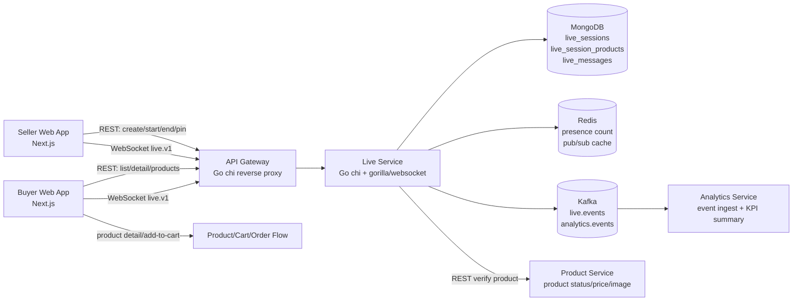
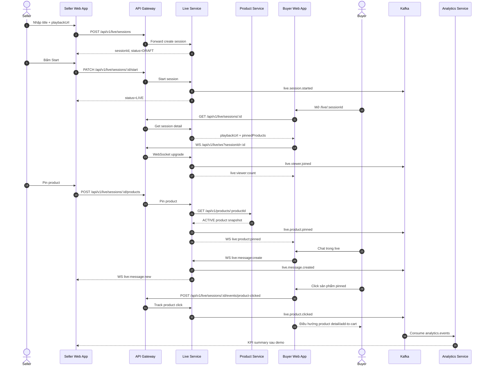
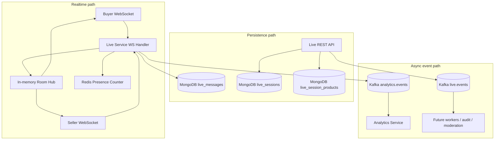
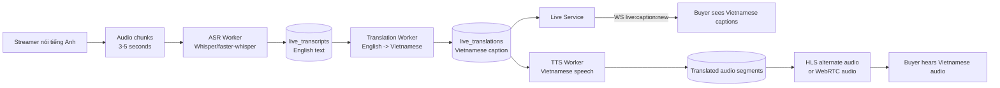
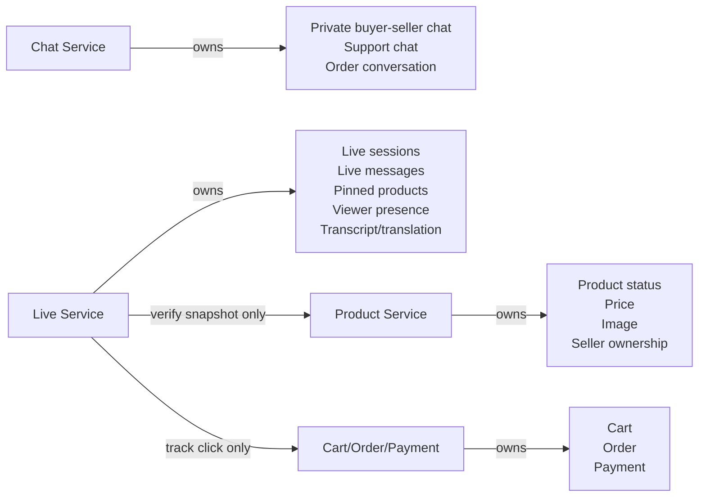

# Livestream Service Diagrams

Last updated: 2026-05-16  
Scope: `live-service` livestream commerce MVP and future translation flow

## 1) Technology Architecture

Ghi chú:

- `api-gateway` là entrypoint duy nhất cho frontend.
- `live-service` sở hữu live session, room realtime, pinned products và live messages.
- `product-service` chỉ cung cấp product truth như status, seller owner, price, image.
- `analytics-service` nhận event bất đồng bộ từ Kafka để tính KPI.

## 2) MVP Demo Flow

## 3) Realtime And Event Tracking

Ghi chú:

- WebSocket dùng cho thao tác cần realtime: viewer count, chat, pinned product update.
- MongoDB lưu state chính để reload page vẫn lấy lại được dữ liệu.
- Kafka dùng cho analytics/audit/worker để không làm chậm live interaction.

## 4) Future Translation Flow

Triển khai theo thứ tự:

1. Text caption demo: nhập transcript English giả lập, dịch sang Vietnamese caption.
2. ASR caption thật: tách audio chunk, chạy speech-to-text, gửi caption realtime.
3. Voice dubbing: thêm TTS và delivery audio tiếng Việt.

## 5) Service Boundary

Ghi chú:

- `live-service` không xử lý checkout.
- `chat-service` không xử lý live room.
- `product-service` là nguồn sự thật về sản phẩm.
