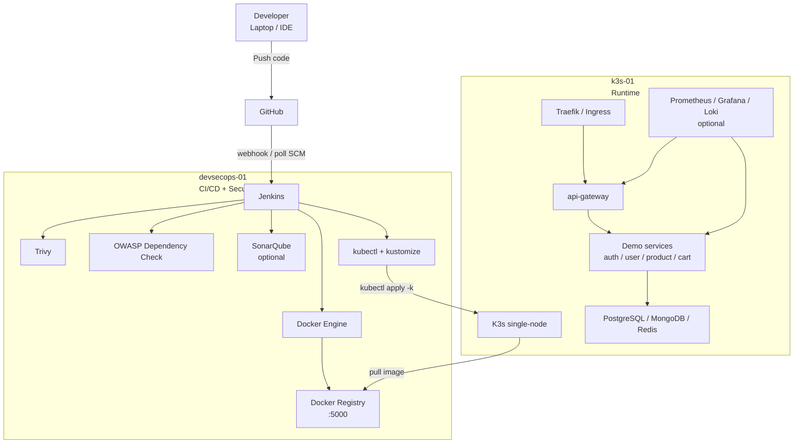
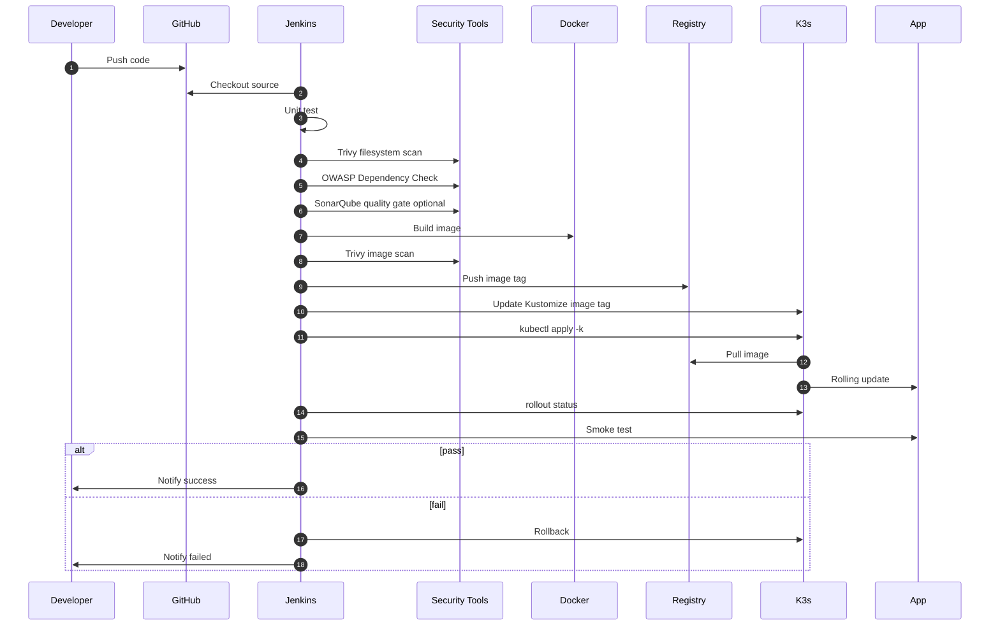
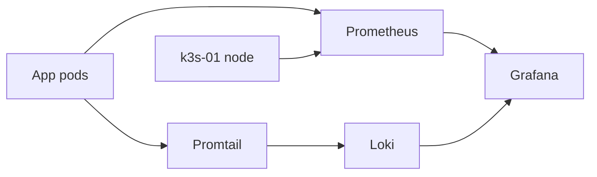

# Kế Hoạch Triển Khai DevSecOps Demo Trên CloudFly/VPS

Tài liệu này mô tả kế hoạch triển khai dự án ecommerce microservices theo hướng **DevSecOps demo** trên VPS/cloud, dùng tối thiểu **2 máy**. File này giữ tên cũ `cloud-vps-c10k-deployment-plan.md` vì đã được tạo trước đó, nhưng phạm vi hiện tại là **demo DevSecOps**, **không tập trung test C10K**.

Mục tiêu là có một môi trường đủ giống thực tế để trình bày:

- CI/CD bằng Jenkins.
- Security scanning bằng Trivy, OWASP Dependency Check, SonarQube optional.
- Build Docker image.
- Push image vào registry nội bộ.
- Deploy lên K3s.
- Smoke test, rollback.
- Public app qua domain HTTPS.
- Theo dõi logs/metrics cơ bản.
- Vận hành: backup, restore, incident, cleanup.

## 1. Kết Luận Nhanh

Phương án khuyến nghị: thuê **2 VPS CloudFly**.

| Máy | Vai trò | CPU | RAM | Disk | Ghi chú |
|---|---|---:|---:|---:|---|
| `devsecops-01` | Jenkins + Docker + Registry + security tools | 4 vCPU | 8GB | 100GB SSD/NVMe | Máy CI/CD |
| `k3s-01` | K3s single-node + app demo + data stores | 4 vCPU | 8GB | 100GB SSD/NVMe | Máy runtime |

Nếu muốn chạy SonarQube ổn hơn:

| Máy | Nâng cấp khuyến nghị |
|---|---|
| `devsecops-01` | 6-8 vCPU, 12-16GB RAM, 150GB disk |
| `k3s-01` | giữ 4 vCPU, 8GB RAM, 100GB disk |

Không cần mua nhiều domain. Chỉ cần **1 domain**, rồi tạo nhiều subdomain:

```txt
api.example.com
jenkins.example.com
grafana.example.com
sonar.example.com
registry.example.com
```

## 2. Mục Tiêu Demo

### Bắt buộc có

- Developer push code lên GitHub.
- Jenkins tự pull code hoặc nhận webhook.
- Jenkins chạy test.
- Jenkins chạy security scan.
- Jenkins build Docker image.
- Jenkins scan Docker image.
- Jenkins push image vào registry.
- Jenkins deploy lên K3s.
- App chạy qua API Gateway.
- Smoke test pass/fail rõ ràng.
- Rollback khi deploy lỗi.

### Nên có

- HTTPS bằng Let’s Encrypt.
- Grafana dashboard đơn giản.
- Logs theo service.
- Email/Telegram/Slack notification.
- Backup/restore demo PostgreSQL/MongoDB.
- Firewall chỉ mở port cần thiết.

### Không cần cho scope này

- C10K load test.
- Multi-node Kubernetes.
- HA database.
- ELK stack.
- Kafka full tuning.
- Full 14 service chạy liên tục.

## 3. Sơ Đồ Tổng Quan 2 VPS



## 4. Sơ Đồ Pipeline DevSecOps



## 5. Domain Và DNS

Bạn chỉ cần mua **1 domain**.

Ví dụ:

```txt
example.com
```

Tạo các DNS record:

| Subdomain | Type | Trỏ tới | Mục đích |
|---|---|---|---|
| `api.example.com` | A | Public IP `k3s-01` | App/API demo |
| `jenkins.example.com` | A | Public IP `devsecops-01` | Jenkins |
| `grafana.example.com` | A | Public IP `k3s-01` hoặc `devsecops-01` | Dashboard |
| `sonar.example.com` | A | Public IP `devsecops-01` | SonarQube optional |
| `registry.example.com` | A | Public IP `devsecops-01` | Registry, nên hạn chế public |

Khuyến nghị bảo mật:

- Public rộng: chỉ `api.example.com`.
- Jenkins/Grafana/Sonar: chỉ mở khi demo hoặc allowlist IP của bạn.
- Registry: không public nếu không cần; dùng private network hoặc firewall.

## 6. Network Và Firewall

### Public ports nên mở

Trên `k3s-01`:

| Port | Dùng cho |
|---:|---|
| 22 | SSH, nên giới hạn IP |
| 80 | HTTP challenge / redirect |
| 443 | HTTPS app/API |

Trên `devsecops-01`:

| Port | Dùng cho |
|---:|---|
| 22 | SSH, nên giới hạn IP |
| 80 | HTTP challenge / redirect |
| 443 | HTTPS Jenkins/Sonar/Grafana nếu public |
| 5000 | Docker Registry, chỉ mở private IP hoặc allowlist |

Không public:

```txt
5432 PostgreSQL
27017 MongoDB
6379 Redis
9092 Kafka
3000 Grafana raw port
8080 Jenkins raw port
9000 SonarQube raw port
```

### UFW mẫu

Trên cả 2 VPS:

```bash
sudo ufw default deny incoming
sudo ufw default allow outgoing
sudo ufw allow 22/tcp
sudo ufw allow 80/tcp
sudo ufw allow 443/tcp
sudo ufw enable
sudo ufw status verbose
```

Nếu cần registry nội bộ:

```bash
sudo ufw allow from <PRIVATE_IP_K3S_01> to any port 5000 proto tcp
```

## 7. Kế Hoạch Dịch Vụ Demo

Không deploy hết 14 service lúc đầu. Demo DevSecOps chỉ cần một slice đủ thể hiện kiến trúc.

### Slice bắt buộc

```txt
api-gateway
auth-service
user-service
product-service
cart-service
PostgreSQL
MongoDB
Redis
```

### Slice mở rộng nếu còn tài nguyên

```txt
order-service
inventory-service
payment-service
Kafka hoặc Redpanda
notification-service
```

### Không bật lúc đầu

```txt
live-service
chat-service
media-service
MediaMTX
analytics-service
ELK
Thanos
```

## 8. Roadmap Triển Khai Tổng Thể

| Giai đoạn | Mục tiêu |
|---|---|
| Phase 0 | Thuê VPS, mua domain, tạo DNS |
| Phase 1 | Bootstrap Linux, user, SSH, firewall |
| Phase 2 | Cài Docker, Registry, Jenkins trên `devsecops-01` |
| Phase 3 | Cài K3s trên `k3s-01` |
| Phase 4 | Chuẩn bị registry pull từ K3s |
| Phase 5 | Tạo manifests/Kustomize cho slice demo |
| Phase 6 | Build/push/deploy thủ công lần đầu |
| Phase 7 | Tạo Jenkins pipeline DevSecOps |
| Phase 8 | Expose domain HTTPS |
| Phase 9 | Monitoring/logging |
| Phase 10 | Backup, rollback, vận hành |

## 9. Phase 0: Thuê VPS Và Chuẩn Bị Domain

### 9.1. Thuê VPS

Tạo 2 máy:

```txt
devsecops-01  4 vCPU / 8GB RAM / 100GB disk
k3s-01        4 vCPU / 8GB RAM / 100GB disk
```

OS:

```txt
Ubuntu Server 22.04 LTS hoặc 24.04 LTS
```

Ghi lại:

```txt
PUBLIC_IP_DEVSECOPS=<ip>
PUBLIC_IP_K3S=<ip>
PRIVATE_IP_DEVSECOPS=<private-ip nếu có>
PRIVATE_IP_K3S=<private-ip nếu có>
```

Nếu CloudFly có private network, bật private network giữa 2 máy. Nếu không có, dùng public IP nhưng firewall port `5000` chỉ allow IP `k3s-01`.

### 9.2. Mua domain và tạo DNS

Ví dụ:

```txt
api.example.com      A  PUBLIC_IP_K3S
jenkins.example.com  A  PUBLIC_IP_DEVSECOPS
grafana.example.com  A  PUBLIC_IP_K3S
sonar.example.com    A  PUBLIC_IP_DEVSECOPS
```

DNS có thể mất vài phút đến vài giờ để propagate.

Kiểm tra:

```bash
dig api.example.com
dig jenkins.example.com
```

## 10. Phase 1: Bootstrap Linux

Chạy trên cả 2 VPS:

```bash
sudo apt update
sudo apt -y upgrade
sudo apt -y install curl wget git vim htop jq unzip ca-certificates gnupg lsb-release ufw fail2ban
```

Tạo user deploy nếu cần:

```bash
sudo adduser deploy
sudo usermod -aG sudo deploy
```

Cấu hình hostname:

```bash
sudo hostnamectl set-hostname devsecops-01
```

Trên máy K3s:

```bash
sudo hostnamectl set-hostname k3s-01
```

Thêm `/etc/hosts` trên cả 2 máy:

```txt
<PRIVATE_OR_PUBLIC_IP_DEVSECOPS> devsecops-01
<PRIVATE_OR_PUBLIC_IP_K3S> k3s-01
```

Kiểm tra tài nguyên:

```bash
free -h
df -h
nproc
ip addr
```

## 11. Phase 2: Cài Docker Trên `devsecops-01`

Chạy trên `devsecops-01`:

```bash
sudo apt update
sudo apt -y install ca-certificates curl gnupg
sudo install -m 0755 -d /etc/apt/keyrings
curl -fsSL https://download.docker.com/linux/ubuntu/gpg | sudo gpg --dearmor -o /etc/apt/keyrings/docker.gpg
sudo chmod a+r /etc/apt/keyrings/docker.gpg
echo \
  "deb [arch=$(dpkg --print-architecture) signed-by=/etc/apt/keyrings/docker.gpg] https://download.docker.com/linux/ubuntu \
  $(. /etc/os-release && echo "$VERSION_CODENAME") stable" | \
  sudo tee /etc/apt/sources.list.d/docker.list > /dev/null
sudo apt update
sudo apt -y install docker-ce docker-ce-cli containerd.io docker-buildx-plugin docker-compose-plugin
sudo usermod -aG docker $USER
```

Logout/login lại rồi kiểm tra:

```bash
docker version
docker buildx version
docker compose version
```

## 12. Phase 3: Cài Local Docker Registry

Chạy trên `devsecops-01`:

```bash
mkdir -p ~/registry-data
docker run -d \
  --name registry \
  --restart unless-stopped \
  -p 5000:5000 \
  -v ~/registry-data:/var/lib/registry \
  registry:2
```

Kiểm tra:

```bash
curl http://localhost:5000/v2/_catalog
curl http://<PUBLIC_OR_PRIVATE_IP_DEVSECOPS>:5000/v2/_catalog
```

Production thật nên dùng TLS/auth cho registry. Demo có thể dùng HTTP nội bộ, nhưng phải khóa firewall.

## 13. Phase 4: Cài Jenkins

Chạy Jenkins bằng Docker để dễ dọn:

```bash
docker volume create jenkins_home
docker run -d \
  --name jenkins \
  --restart unless-stopped \
  -p 8080:8080 \
  -p 50000:50000 \
  -v jenkins_home:/var/jenkins_home \
  -v /var/run/docker.sock:/var/run/docker.sock \
  -u root \
  jenkins/jenkins:lts-jdk21
```

Lấy initial password:

```bash
docker exec jenkins cat /var/jenkins_home/secrets/initialAdminPassword
```

Truy cập tạm:

```txt
http://PUBLIC_IP_DEVSECOPS:8080
```

Sau đó nên đưa Jenkins sau Nginx/Caddy và HTTPS:

```txt
https://jenkins.example.com
```

Plugin nên cài:

- Git.
- Pipeline.
- Docker Pipeline.
- Credentials Binding.
- Blue Ocean optional.
- OWASP Dependency-Check plugin optional.
- SonarQube Scanner optional.

## 14. Phase 5: Cài Security Tools Trên `devsecops-01`

### 14.1. Trivy

```bash
sudo apt-get install -y wget apt-transport-https gnupg lsb-release
wget -qO - https://aquasecurity.github.io/trivy-repo/deb/public.key | sudo gpg --dearmor -o /usr/share/keyrings/trivy.gpg
echo "deb [signed-by=/usr/share/keyrings/trivy.gpg] https://aquasecurity.github.io/trivy-repo/deb $(lsb_release -sc) main" | sudo tee /etc/apt/sources.list.d/trivy.list
sudo apt update
sudo apt -y install trivy
trivy --version
```

Scan source:

```bash
trivy fs --severity HIGH,CRITICAL .
```

Scan image:

```bash
trivy image --severity HIGH,CRITICAL <image>
```

### 14.2. OWASP Dependency Check

Cách nhẹ nhất cho demo là chạy bằng Docker trong pipeline:

```bash
docker run --rm \
  -v "$PWD":/src \
  owasp/dependency-check:latest \
  --scan /src \
  --format HTML \
  --out /src/dependency-check-report
```

Ghi chú: lần chạy đầu tải database khá lâu và tốn disk. Nên cache thư mục data nếu chạy thường xuyên.

### 14.3. SonarQube optional

SonarQube đẹp để demo quality gate, nhưng ăn RAM. Nếu `devsecops-01` chỉ 8GB RAM, chỉ bật khi demo hoặc nâng máy lên 12-16GB RAM.

Chạy thử bằng Docker Compose:

```yaml
services:
  sonarqube:
    image: sonarqube:lts-community
    restart: unless-stopped
    ports:
      - "9000:9000"
    environment:
      SONAR_ES_BOOTSTRAP_CHECKS_DISABLE: "true"
    volumes:
      - sonarqube_data:/opt/sonarqube/data
      - sonarqube_extensions:/opt/sonarqube/extensions
      - sonarqube_logs:/opt/sonarqube/logs

volumes:
  sonarqube_data:
  sonarqube_extensions:
  sonarqube_logs:
```

Nếu SonarQube làm máy chậm, tắt nó và demo bằng Trivy + OWASP trước.

## 15. Phase 6: Cài K3s Trên `k3s-01`

Chạy trên `k3s-01`:

```bash
curl -sfL https://get.k3s.io | sh -s - server \
  --write-kubeconfig-mode 644 \
  --node-name k3s-01
```

Kiểm tra:

```bash
sudo systemctl status k3s --no-pager
kubectl get nodes -o wide
kubectl get pods -A
```

Tạo namespaces:

```bash
kubectl create namespace ecommerce-dev
kubectl create namespace monitoring
kubectl create namespace logging
```

## 16. Phase 7: Cho K3s Pull Image Từ Registry

Trên `k3s-01`, cấu hình registry:

```bash
sudo mkdir -p /etc/rancher/k3s
sudo tee /etc/rancher/k3s/registries.yaml > /dev/null <<'YAML'
mirrors:
  "<IP_DEVSECOPS>:5000":
    endpoint:
      - "http://<IP_DEVSECOPS>:5000"
YAML
sudo systemctl restart k3s
```

Thay `<IP_DEVSECOPS>` bằng private IP nếu có, nếu không thì public IP đã được firewall allowlist.

Test sau khi có image:

```bash
kubectl run test-pull \
  --image=<IP_DEVSECOPS>:5000/ecommerce/api-gateway:dev \
  --restart=Never
kubectl get pod test-pull
kubectl delete pod test-pull
```

## 17. Phase 8: Copy Kubeconfig Sang Jenkins

Trên `k3s-01`:

```bash
sudo cat /etc/rancher/k3s/k3s.yaml
```

Copy nội dung vào Jenkins credential kiểu `Secret file` hoặc mount vào Jenkins:

```bash
mkdir -p ~/.kube
vim ~/.kube/config
chmod 600 ~/.kube/config
```

Sửa:

```yaml
server: https://127.0.0.1:6443
```

thành:

```yaml
server: https://<IP_K3S>:6443
```

Nếu Jenkins container cần đọc kubeconfig:

```bash
docker cp ~/.kube/config jenkins:/var/jenkins_home/.kube/config
docker exec jenkins chown -R jenkins:jenkins /var/jenkins_home/.kube
```

Hoặc mount `$HOME/.kube` vào Jenkins container ngay từ đầu.

## 18. Phase 9: Chuẩn Bị Kubernetes Manifests

Tối thiểu cần có:

```txt
infrastructure/k3s/
  base/
    namespace.yaml
    configmap.yaml
    secret.yaml
    data/
      postgres.yaml
      redis.yaml
      mongo.yaml
    apps/
      api-gateway.yaml
      auth-service.yaml
      user-service.yaml
      product-service.yaml
      cart-service.yaml
    ingress/
      api-gateway-ingress.yaml
    kustomization.yaml
  overlays/
    dev/
      kustomization.yaml
      resource-limits.yaml
```

Resource cho demo:

| Workload | Request | Limit |
|---|---:|---:|
| Go service | `50m / 64Mi` | `300m / 256Mi` |
| API Gateway | `100m / 128Mi` | `500m / 384Mi` |
| Auth NestJS | `100m / 256Mi` | `700m / 768Mi` |
| PostgreSQL | `150m / 384Mi` | `800m / 768Mi` |
| MongoDB | `150m / 384Mi` | `800m / 768Mi` |
| Redis | `50m / 96Mi` | `200m / 192Mi` |

## 19. Phase 10: Build Và Deploy Thủ Công Lần Đầu

Clone repo trên `devsecops-01`:

```bash
git clone <repo-url> ecommerce-microservices
cd ecommerce-microservices
```

Build API Gateway:

```bash
docker buildx build \
  --platform linux/amd64 \
  -t <IP_DEVSECOPS>:5000/ecommerce/api-gateway:dev \
  --push \
  services/api-gateway
```

Ghi chú:

- Nếu CloudFly VPS là x86_64, dùng `linux/amd64`.
- Nếu VPS là ARM64, dùng `linux/arm64`.

Apply manifests:

```bash
kubectl apply -k infrastructure/k3s/overlays/dev
kubectl -n ecommerce-dev get pods -o wide
kubectl -n ecommerce-dev rollout status deploy/api-gateway --timeout=180s
```

Smoke test:

```bash
kubectl -n ecommerce-dev port-forward svc/api-gateway 12000:8080
curl http://localhost:12000/health
curl http://localhost:12000/ready
```

## 20. Phase 11: Expose App Qua Domain HTTPS

K3s mặc định có Traefik. Dùng Traefik trước cho đơn giản.

Ingress mẫu:

```yaml
apiVersion: networking.k8s.io/v1
kind: Ingress
metadata:
  name: api-gateway
  namespace: ecommerce-dev
spec:
  rules:
    - host: api.example.com
      http:
        paths:
          - path: /
            pathType: Prefix
            backend:
              service:
                name: api-gateway
                port:
                  number: 8080
```

HTTPS có 2 hướng:

1. Cài `cert-manager` trong K3s và dùng Let’s Encrypt.
2. Dùng Caddy/Nginx reverse proxy ngoài K3s.

Cho demo, `cert-manager` là hướng Kubernetes-native hơn.

## 21. Phase 12: Jenkins Pipeline

Pipeline nên có các stage:

```txt
Checkout
Test
Trivy filesystem scan
OWASP Dependency Check
SonarQube quality gate optional
Docker build
Trivy image scan
Push registry
Deploy K3s
Rollout status
Smoke test
Notify
Rollback on failure
```

Jenkinsfile mẫu:

```groovy
pipeline {
  agent any

  parameters {
    string(name: 'SERVICE_NAME', defaultValue: 'api-gateway')
    string(name: 'SERVICE_PATH', defaultValue: 'services/api-gateway')
    string(name: 'ENVIRONMENT', defaultValue: 'dev')
  }

  environment {
    REGISTRY = '<IP_DEVSECOPS>:5000'
    IMAGE_TAG = "${env.BUILD_NUMBER}"
    KUBECONFIG = '/var/jenkins_home/.kube/config'
  }

  stages {
    stage('Checkout') {
      steps {
        checkout scm
      }
    }

    stage('Test') {
      steps {
        sh '''
          if [ -f "$SERVICE_PATH/go.mod" ]; then
            cd "$SERVICE_PATH"
            go test ./...
          elif [ -f "$SERVICE_PATH/package.json" ]; then
            npm --prefix "$SERVICE_PATH" test -- --runInBand || true
          fi
        '''
      }
    }

    stage('Trivy FS Scan') {
      steps {
        sh '''
          trivy fs --severity HIGH,CRITICAL --exit-code 0 "$SERVICE_PATH"
        '''
      }
    }

    stage('Dependency Check') {
      steps {
        sh '''
          docker run --rm \
            -v "$PWD":/src \
            owasp/dependency-check:latest \
            --scan /src/$SERVICE_PATH \
            --format HTML \
            --out /src/dependency-check-report || true
        '''
      }
    }

    stage('Build Image') {
      steps {
        sh '''
          docker buildx build \
            --platform linux/amd64 \
            -t "$REGISTRY/ecommerce/$SERVICE_NAME:$IMAGE_TAG" \
            --push \
            "$SERVICE_PATH"
        '''
      }
    }

    stage('Trivy Image Scan') {
      steps {
        sh '''
          trivy image --severity HIGH,CRITICAL --exit-code 0 \
            "$REGISTRY/ecommerce/$SERVICE_NAME:$IMAGE_TAG"
        '''
      }
    }

    stage('Deploy') {
      steps {
        sh '''
          cd infrastructure/k3s/overlays/dev
          kustomize edit set image "$SERVICE_NAME=$REGISTRY/ecommerce/$SERVICE_NAME:$IMAGE_TAG"
          kubectl apply -k .
          kubectl -n ecommerce-dev rollout status deploy/$SERVICE_NAME --timeout=180s
        '''
      }
    }

    stage('Smoke Test') {
      steps {
        sh '''
          kubectl -n ecommerce-dev get pods
          kubectl -n ecommerce-dev run smoke-$BUILD_NUMBER \
            --rm -i --restart=Never \
            --image=curlimages/curl:8.7.1 \
            -- curl -fsS http://api-gateway:8080/health
        '''
      }
    }
  }

  post {
    failure {
      sh '''
        kubectl -n ecommerce-dev rollout undo deploy/$SERVICE_NAME || true
      '''
    }
  }
}
```

Trong demo thật, có thể để scan `--exit-code 0` để pipeline không fail ngay khi có vulnerability. Khi muốn demo gate chặn release, đổi thành `--exit-code 1`.

## 22. Security Gate Policy

Đề xuất rule:

| Gate | Demo mode | Strict mode |
|---|---|---|
| Unit test | fail thì stop | fail thì stop |
| Trivy FS HIGH | unstable | stop |
| Trivy FS CRITICAL | stop | stop |
| OWASP CVSS >= 7 | unstable | stop |
| Trivy image HIGH | unstable | stop |
| Trivy image CRITICAL | stop | stop |
| Sonar quality gate | optional | stop |
| Smoke test | stop + rollback | stop + rollback |

Mục tiêu demo:

- Cho thấy pipeline biết phát hiện lỗi.
- Cho thấy có threshold.
- Cho thấy deploy chỉ xảy ra sau scan/build.
- Cho thấy rollback khi smoke test fail.

## 23. Monitoring Và Logging

Với 2 VPS, monitoring nên nhẹ.

### Tối thiểu

- `kubectl top nodes`.
- `kubectl top pods`.
- Logs bằng `kubectl logs`.

### Đẹp hơn để demo

- Prometheus.
- Grafana.
- Loki.
- Promtail.

Sơ đồ:



Dashboard nên có:

- CPU/RAM node.
- Pod restarts.
- API Gateway status.
- API Gateway latency nếu `/metrics` được scrape.
- Logs theo namespace/service.

## 24. Vận Hành Hằng Ngày

### Kiểm tra cluster

```bash
kubectl get nodes -o wide
kubectl get pods -A
kubectl -n ecommerce-dev get deploy,svc,ingress
```

### Kiểm tra rollout

```bash
kubectl -n ecommerce-dev rollout status deploy/api-gateway
kubectl -n ecommerce-dev rollout history deploy/api-gateway
```

### Xem logs

```bash
kubectl -n ecommerce-dev logs deploy/api-gateway --tail=100
kubectl -n ecommerce-dev logs deploy/user-service --tail=100
```

### Xem lỗi gần nhất

```bash
kubectl get events -A --sort-by=.lastTimestamp | tail -50
```

### Dọn Docker trên `devsecops-01`

```bash
docker system df
docker system prune -af
```

## 25. Backup Và Restore

### PostgreSQL backup

```bash
kubectl -n ecommerce-dev exec deploy/postgres -- \
  pg_dump -U postgres -d postgres > postgres-backup.sql
```

Restore:

```bash
kubectl -n ecommerce-dev exec -i deploy/postgres -- \
  psql -U postgres -d postgres < postgres-backup.sql
```

### MongoDB backup

Lấy pod:

```bash
kubectl -n ecommerce-dev get pods -l app=mongo
```

Backup:

```bash
kubectl -n ecommerce-dev exec <mongo-pod> -- \
  mongodump --archive=/tmp/mongo.archive
kubectl -n ecommerce-dev cp <mongo-pod>:/tmp/mongo.archive ./mongo.archive
```

Restore:

```bash
kubectl -n ecommerce-dev cp ./mongo.archive <mongo-pod>:/tmp/mongo.archive
kubectl -n ecommerce-dev exec <mongo-pod> -- \
  mongorestore --archive=/tmp/mongo.archive
```

### Registry backup

Trên `devsecops-01`:

```bash
tar -czf registry-data-$(date +%F).tar.gz ~/registry-data
```

### Jenkins backup

```bash
docker run --rm \
  -v jenkins_home:/data \
  -v "$PWD":/backup \
  alpine \
  tar -czf /backup/jenkins-home-$(date +%F).tar.gz /data
```

## 26. Rollback Và Incident Runbook

### Rollback app

```bash
kubectl -n ecommerce-dev rollout history deploy/api-gateway
kubectl -n ecommerce-dev rollout undo deploy/api-gateway
kubectl -n ecommerce-dev rollout status deploy/api-gateway
```

### Pod CrashLoopBackOff

```bash
kubectl -n ecommerce-dev describe pod <pod>
kubectl -n ecommerce-dev logs <pod> --previous
kubectl get events -A --sort-by=.lastTimestamp | tail -50
```

### ImagePullBackOff

Kiểm tra:

```bash
kubectl -n ecommerce-dev describe pod <pod>
curl http://<IP_DEVSECOPS>:5000/v2/_catalog
sudo cat /etc/rancher/k3s/registries.yaml
```

Nguyên nhân thường gặp:

- K3s chưa cấu hình insecure registry.
- Firewall chặn port `5000`.
- Image tag sai.
- Registry container chết.

### Node DiskPressure

```bash
df -h
sudo du -sh /var/lib/rancher/k3s
sudo du -sh /var/lib/containerd
```

Dọn:

```bash
sudo k3s crictl images
sudo k3s crictl rmi --prune
```

## 27. HTTPS Cho Jenkins Và App

### App trên K3s

Khuyến nghị:

- DNS `api.example.com` trỏ về `k3s-01`.
- Dùng Traefik Ingress.
- Cài cert-manager nếu muốn Let’s Encrypt trong K8s.

### Jenkins trên devsecops-01

Đơn giản nhất dùng Caddy:

```bash
sudo apt install -y debian-keyring debian-archive-keyring apt-transport-https curl
curl -1sLf 'https://dl.cloudsmith.io/public/caddy/stable/gpg.key' | sudo gpg --dearmor -o /usr/share/keyrings/caddy-stable-archive-keyring.gpg
curl -1sLf 'https://dl.cloudsmith.io/public/caddy/stable/debian.deb.txt' | sudo tee /etc/apt/sources.list.d/caddy-stable.list
sudo apt update
sudo apt install -y caddy
```

Caddyfile:

```txt
jenkins.example.com {
  reverse_proxy localhost:8080
}

sonar.example.com {
  reverse_proxy localhost:9000
}
```

Reload:

```bash
sudo caddy reload --config /etc/caddy/Caddyfile
```

## 28. Checklist Demo DevSecOps

Trước khi demo:

- Jenkins truy cập được qua HTTPS.
- K3s node Ready.
- Registry chạy.
- Jenkins có credential GitHub.
- Jenkins có kubeconfig.
- Pipeline chạy được service `api-gateway`.
- Trivy scan có report.
- OWASP Dependency Check có report.
- Image được push vào registry.
- K3s pull được image.
- App expose qua `api.example.com`.
- Smoke test pass.
- Có một kịch bản fail để demo rollback.

Kịch bản demo:

1. Push code.
2. Jenkins tự chạy.
3. Test pass.
4. Security scan chạy.
5. Build image.
6. Scan image.
7. Push registry.
8. Deploy K3s.
9. Rollout status pass.
10. Smoke test pass.
11. Mở `api.example.com/health`.
12. Cho xem logs/Grafana.
13. Demo rollback bằng image lỗi hoặc smoke test lỗi.

## 29. Checklist Vận Hành Sau Demo

Sau demo:

- Tắt SonarQube nếu không dùng.
- Dọn Docker image cũ.
- Backup Jenkins config nếu muốn giữ.
- Backup registry nếu muốn giữ image.
- Xóa public access Jenkins nếu không cần.
- Đổi password Jenkins/Grafana.
- Kiểm tra bill CloudFly.
- Tắt VPS nếu thuê theo giờ và không dùng nữa.

## 30. Mốc Hoàn Thành

Môi trường đạt yêu cầu khi:

- 2 VPS chạy ổn.
- Domain trỏ đúng.
- HTTPS hoạt động.
- Jenkins pipeline chạy từ GitHub.
- Scan source và image hoạt động.
- Image push vào registry.
- K3s deploy app thành công.
- API Gateway public được qua domain.
- Smoke test và rollback hoạt động.
- Có tài liệu vận hành cơ bản.

## 31. Nâng Cấp Sau Này

Khi cần giống production hơn:

- Tách database ra VPS riêng.
- Thêm worker K3s thứ hai.
- Thêm monitoring VPS riêng.
- Thêm Argo CD.
- Thêm SonarQube server riêng.
- Thêm TLS/auth cho Docker Registry.
- Thêm Terraform/OpenTofu để tạo hạ tầng tự động.
- Thêm NetworkPolicy trong K3s.
- Thêm backup tự động lên object storage.

## 32. Lưu Ý Theo Repo Hiện Tại

- Root `docker-compose.yml` là nguồn tham chiếu env var tốt.
- `infrastructure/k3s` hiện có nhiều placeholder, cần viết manifest thật trước.
- `cicd/Jenkinsfile` hiện cần hoàn thiện theo pipeline ở tài liệu này.
- Nên deploy theo slice, không bật full 14 service lúc đầu.
- Nếu VPS là x86_64, build image `linux/amd64`.
- Nếu VPS là ARM64, build image `linux/arm64`.
- Kafka nên để optional trong demo đầu tiên vì tốn RAM.
- `live-service`, `chat-service`, MediaMTX nên để sau.

## 33. Tham Khảo

- K3s Quick Start: https://docs.k3s.io/quick-start
- Docker Engine on Ubuntu: https://docs.docker.com/engine/install/ubuntu/
- Jenkins Docker image: https://hub.docker.com/r/jenkins/jenkins
- Trivy: https://aquasecurity.github.io/trivy/
- OWASP Dependency Check: https://owasp.org/www-project-dependency-check/
- SonarQube Community Build: https://docs.sonarsource.com/sonarqube-community-build/
- Caddy: https://caddyserver.com/docs/
