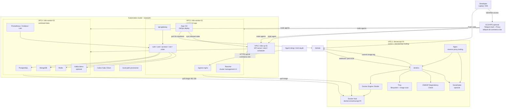
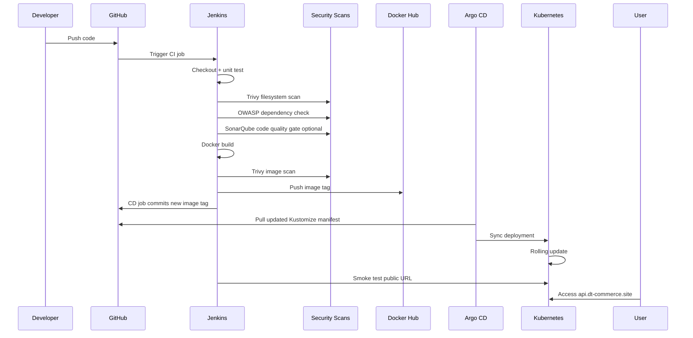

# Kế Hoạch Triển Khai DevSecOps Demo Trên 4 VPS Với Kubernetes Chuẩn

Tài liệu này mô tả phương án triển khai dự án ecommerce microservices trên **4 VPS CloudFly/VPS** bằng **Kubernetes chuẩn cài bằng kubeadm**. Mục tiêu chính là mô phỏng cách một dự án thật được build, scan, deploy, monitor và vận hành theo hướng **DevSecOps**.

Ghi chú quan trọng: tên file có chữ `c10k`, nhưng phương án 4 VPS trong tài liệu này ưu tiên **demo DevSecOps + Kubernetes thực tế**, không tối ưu để benchmark C10K nặng. Nếu sau này muốn test C10K nghiêm túc, nên bổ sung máy load test riêng và nâng cấu hình worker/app.

Nếu bạn muốn làm từ từ theo kiểu checklist cho người mới, bắt đầu từ file:

```txt
docs/deployment/start-here-end-to-end-runbook.md
```

Trước khi triển khai thật, rà file checklist cá nhân hóa:

```txt
docs/deployment/personalization-values-checklist.md
```

## 1. Kết Luận Kiến Trúc

Bạn quyết định dùng **4 VPS**, nên phương án hợp lý nhất là:

```txt
VPS 1: devsecops-01      Jenkins + Docker Hub push + security scans
VPS 2: k8s-cp-01         Kubernetes control-plane
VPS 3: k8s-worker-01     App workloads
VPS 4: k8s-worker-02     Data + observability workloads
```

Với 4 VPS, bạn học được gần với thực tế hơn so với chạy tất cả trên 1-2 máy:

- CI/CD tách khỏi runtime Kubernetes.
- Control-plane không chạy workload nặng.
- App và data store được tách worker.
- Có chỗ để thực hành node label, nodeSelector, rollout, rollback, monitoring, logging.
- Có thể public domain để người khác truy cập demo.
- Có thể mô phỏng pipeline DevSecOps giống môi trường staging nhỏ.

## 2. Cấu Hình Tối Thiểu

Đây là cấu hình tối thiểu nên thuê nếu muốn chạy ổn cho demo DevSecOps:

| Máy | Vai trò | CPU tối thiểu | RAM tối thiểu | Disk tối thiểu | Ghi chú |
|---|---|---:|---:|---:|---|
| `devsecops-01` | Jenkins, Docker, Trivy, OWASP Dependency Check, optional SonarQube | 4 vCPU | 8GB | 100GB | Máy build image, scan và push Docker Hub |
| `k8s-cp-01` | Kubernetes API server, etcd, scheduler, controller-manager | 2 vCPU | 4GB | 60GB | Không chạy app nặng |
| `k8s-worker-01` | API Gateway và microservices demo | 4 vCPU | 8GB | 100GB | Worker chính cho app |
| `k8s-worker-02` | PostgreSQL, MongoDB, Redis, Kafka demo, Prometheus/Grafana/Loki | 4 vCPU | 8GB | 120GB | Worker data/observability |

Tổng tối thiểu:

```txt
14 vCPU
28GB RAM
380GB disk
```

Nếu ngân sách cho phép, nâng cấp theo thứ tự ưu tiên:

| Ưu tiên | Nâng cấp | Vì sao |
|---:|---|---|
| 1 | `k8s-worker-02` lên 8 vCPU / 16GB RAM / 150-200GB disk | Data store, Kafka, monitoring ăn RAM và disk nhiều nhất |
| 2 | `devsecops-01` lên 8 vCPU / 16GB RAM | Jenkins build nhiều image nhanh hơn, SonarQube đỡ chậm |
| 3 | `k8s-worker-01` lên 8 vCPU / 16GB RAM | Chạy nhiều microservice replica hơn |
| 4 | `k8s-cp-01` lên 4 vCPU / 8GB RAM | Control-plane ổn hơn khi cluster lớn lên |

### Đánh Giá Theo Docker Compose Local Hiện Tại

Số liệu tham khảo từ máy local khi chạy Docker Compose full stack:

```txt
Images:        19.46GB, reclaimable 11.8GB
Containers:    26 total, 21 active
Volumes:        2.177GB
Build cache:    5.334GB, reclaimable 4.592GB
```

RAM runtime khi idle khá nhẹ:

| Thành phần | RAM xấp xỉ khi idle | Nhận xét |
|---|---:|---|
| Kafka | 467MiB | Thành phần nền nặng nhất trong compose hiện tại |
| MongoDB | 293MiB | Tăng theo dữ liệu/catalog/chat/review |
| MinIO | 142MiB | Ổn cho demo media nhỏ |
| Auth NestJS | 104MiB | Nặng hơn Go service nhưng vẫn ổn |
| PostgreSQL | 70MiB | Idle nhẹ, sẽ tăng theo query/data |
| Mỗi Go service | 15-30MiB | Rất phù hợp để chạy nhiều service 1 replica |

Kết luận từ số liệu này:

- Cấu hình **4 VPS tối thiểu** trong plan này đủ để deploy demo DevSecOps/staging nhỏ.
- App service hiện khá nhẹ, nên `k8s-worker-01` cấu hình `4 vCPU / 8GB RAM` là hợp lý để chạy 1 replica/service.
- Điểm dễ nghẽn nhất là `k8s-worker-02`, vì máy này gánh PostgreSQL, MongoDB, Redis, Kafka, MinIO và monitoring.
- `devsecops-01` cần disk đủ rộng vì Docker image và build cache tăng nhanh sau nhiều lần build.
- Con số local đang là trạng thái idle; khi có traffic, seed data, Kafka nhiều topic hoặc Prometheus/Loki retention dài, RAM và disk sẽ tăng rõ rệt.

Khuyến nghị thực tế:

| Trường hợp | Cấu hình nên dùng |
|---|---|
| Demo DevSecOps tiết kiệm | Giữ đúng cấu hình tối thiểu 4 VPS |
| Demo thoải mái hơn | Nâng `k8s-worker-02` lên 8 vCPU / 16GB RAM / 150-200GB disk |
| Có SonarQube và build nhiều image | Nâng thêm `devsecops-01` lên 8 vCPU / 16GB RAM / 150GB disk |
| Muốn test tải/C10K nghiêm túc | Thêm máy load test riêng và nâng `k8s-worker-01` |

Khi deploy lên Kubernetes, nên bắt đầu với:

```txt
1 replica/service
Prometheus retention 2-3 ngày
Loki retention 1-3 ngày
Kafka demo nhỏ, ít partition
Không bật ELK trên cấu hình tối thiểu
Không dùng tag latest làm tag deploy chính
```

## 3. Vai Trò Từng VPS

### `devsecops-01`

Máy này đóng vai trò như server CI/CD trong công ty:

- Nhận webhook hoặc pull code từ GitHub.
- Chạy Jenkins pipeline.
- Build Docker image cho service.
- Chạy unit test/lint nếu có.
- Chạy Trivy filesystem scan.
- Chạy OWASP Dependency Check.
- Chạy Trivy image scan.
- Push image vào Docker Hub.
- Commit image tag vào Git để Argo CD deploy vào Kubernetes.
- Gửi kết quả pipeline qua email/Slack nếu muốn.

Không nên chạy workload production trên máy này. Đây là máy tooling.

### `k8s-cp-01`

Máy này là control-plane Kubernetes:

- `kube-apiserver`
- `etcd`
- `kube-scheduler`
- `kube-controller-manager`
- `kubectl` admin
- Calico/Cilium control components

Không nên deploy PostgreSQL, MongoDB, Kafka hoặc app nặng lên control-plane. Trong lab vẫn có thể untaint control-plane, nhưng với 4 VPS thì không cần.

### `k8s-worker-01`

Máy này chạy app layer:

- `api-gateway`
- `auth-service`
- `user-service`
- `product-service`
- `cart-service`
- `order-service`
- Các service demo khác nếu đủ RAM
- `ingress-nginx`

Node này sẽ được label:

```txt
workload=app
```

### `k8s-worker-02`

Máy này chạy data/infra layer:

- PostgreSQL
- MongoDB
- Redis
- Kafka demo nếu cần
- MinIO nếu demo media upload
- Prometheus
- Grafana
- Loki/Promtail nếu bật logging

Node này sẽ được label:

```txt
workload=data
```

## 4. Sơ Đồ Tổng Quan



## 5. Sơ Đồ Luồng CI/CD



## 6. Domain Và DNS

Chỉ cần mua **1 domain**. Không cần mua nhiều domain. Dùng subdomain là đủ.

Ví dụ bạn mua:

```txt
dt-commerce.site
```

Cấu hình DNS:

| Subdomain | Trỏ tới | Mục đích |
|---|---|---|
| `api.dt-commerce.site` | Public IP `k8s-worker-01` hoặc Load Balancer | Public API/app |
| `jenkins.dt-commerce.site` | Public IP `devsecops-01` | Jenkins UI |
| `teleport.dt-commerce.site` | Public IP EC2/VPS Teleport | Zero-trust access vào SSH/K8s |
| `argocd.dt-commerce.site` | Public IP `k8s-worker-01` | Argo CD UI/API |
| `rancher.dt-commerce.site` | Public IP `k8s-worker-01` | Rancher cluster management |
| `grafana.dt-commerce.site` | Public IP `k8s-worker-01` | Grafana qua ingress |
| `sonar.dt-commerce.site` | Public IP `devsecops-01` | SonarQube optional |

Khuyến nghị cho lab:

- Public `api.dt-commerce.site` cho người khác truy cập demo.
- Public `jenkins.dt-commerce.site`, `argocd.dt-commerce.site`, `rancher.dt-commerce.site`, `teleport.dt-commerce.site` nhưng bật login mạnh/MFA và giới hạn IP nếu được.
- Docker image dùng Docker Hub, không cần public registry riêng trên VPS.
- Sau khi Teleport chạy ổn, có thể khóa SSH public của 4 VPS và chỉ SSH qua Teleport.
- Nếu chưa mua domain, có thể test tạm bằng public IP trước.

## 7. Network Và Firewall

Nếu CloudFly có private network, hãy bật private network cho cả 4 VPS. Dùng private IP cho các kết nối nội bộ:

```txt
devsecops-01 -> k8s-cp-01:6443
k8s-cp-01 <-> k8s-worker-01/k8s-worker-02
```

### Port public nên mở

| Máy | Port public | Ghi chú |
|---|---|---|
| `devsecops-01` | 22, 80, 443 | SSH, reverse proxy Jenkins/Sonar |
| `k8s-cp-01` | 22, 6443 allowlist | Kubernetes API chỉ nên allow IP của bạn và `devsecops-01` |
| `k8s-worker-01` | 22, 80, 443 | Ingress public cho app |
| `k8s-worker-02` | 22, 80, 443 optional | Chỉ mở nếu public Grafana qua ingress/node này |

### Port nội bộ cần cho Kubernetes

| Port | Mục đích |
|---:|---|
| 6443 | Kubernetes API server |
| 2379-2380 | etcd |
| 10250 | kubelet |
| 10257 | kube-controller-manager |
| 10259 | kube-scheduler |
| 30000-32767 | NodePort nếu dùng |
| 179 | Calico BGP nếu dùng Calico mode BGP |
| 4789 | VXLAN nếu dùng overlay network |

Với lab, có thể dùng UFW nhưng phải cẩn thận để không chặn traffic CNI.

## 8. Roadmap Triển Khai

| Phase | Mục tiêu |
|---|---|
| Phase 0 | Thuê 4 VPS, chuẩn bị domain, ghi IP |
| Phase 1 | Bootstrap Linux, SSH, firewall, hostname |
| Phase 2 | Cài Docker, chuẩn bị Docker Hub credential, Jenkins trên `devsecops-01` |
| Phase 3 | Cài containerd trên 3 node Kubernetes |
| Phase 4 | Cài kubeadm/kubelet/kubectl |
| Phase 5 | Init control-plane |
| Phase 6 | Join 2 worker |
| Phase 7 | Cài CNI |
| Phase 8 | Cài ingress-nginx, StorageClass, metrics-server |
| Phase 9 | Label node và chia workload |
| Phase 10 | Kiểm tra Kubernetes pull image từ Docker Hub |
| Phase 11 | Chuẩn bị kubeconfig admin cho DevOps/fallback |
| Phase 12 | Deploy app slice thủ công để smoke test |
| Phase 13 | Cấu hình domain, HTTPS, cert-manager |
| Phase 14 | Cài Argo CD GitOps |
| Phase 15 | Cài Rancher quản trị cluster |
| Phase 16 | Cài Teleport access gateway optional |
| Phase 17 | Cấu hình Jenkins CI/CD đầy đủ |
| Phase 18 | Monitoring/logging |
| Phase 19 | Vận hành, backup, rollback |

## 9. Phase 0: Thuê VPS Và Ghi Thông Tin

Thuê 4 VPS Ubuntu:

```txt
devsecops-01    4 vCPU / 8GB RAM / 100GB disk
k8s-cp-01       2 vCPU / 4GB RAM / 60GB disk
k8s-worker-01   4 vCPU / 8GB RAM / 100GB disk
k8s-worker-02   4 vCPU / 8GB RAM / 120GB disk
```

OS khuyến nghị:

```txt
Ubuntu Server 22.04 LTS
```

Ubuntu 24.04 LTS cũng dùng được, nhưng nếu muốn ít lỗi tài liệu/cộng đồng hơn thì chọn 22.04 LTS.

Ghi lại IP:

```txt
PUBLIC_IP_DEVSECOPS=
PUBLIC_IP_CP=
PUBLIC_IP_WORKER_APP=
PUBLIC_IP_WORKER_DATA=

PRIVATE_IP_DEVSECOPS=
PRIVATE_IP_CP=
PRIVATE_IP_WORKER_APP=
PRIVATE_IP_WORKER_DATA=
```

Nếu nhà cung cấp không có private network, tạm dùng public IP giữa các máy nhưng firewall phải allowlist chặt.

## 10. Phase 1: Bootstrap Linux

Chạy trên cả 4 VPS:

```bash
sudo apt update
sudo apt -y upgrade
sudo apt -y install curl wget git vim htop jq unzip ca-certificates gnupg lsb-release ufw fail2ban apt-transport-https
```

Đặt hostname đúng trên từng máy:

```bash
# devsecops-01
sudo hostnamectl set-hostname devsecops-01

# k8s-cp-01
sudo hostnamectl set-hostname k8s-cp-01

# k8s-worker-01
sudo hostnamectl set-hostname k8s-worker-01

# k8s-worker-02
sudo hostnamectl set-hostname k8s-worker-02
```

Thêm `/etc/hosts` trên cả 4 máy:

```txt
<PRIVATE_IP_DEVSECOPS>    devsecops-01
<PRIVATE_IP_CP>           k8s-cp-01
<PRIVATE_IP_WORKER_APP>   k8s-worker-01
<PRIVATE_IP_WORKER_DATA>  k8s-worker-02
```

Tắt swap trên 3 node Kubernetes:

```bash
sudo swapoff -a
sudo sed -i '/ swap / s/^/#/' /etc/fstab
```

Load kernel modules trên 3 node Kubernetes:

```bash
sudo tee /etc/modules-load.d/k8s.conf > /dev/null <<'EOF'
overlay
br_netfilter
EOF

sudo modprobe overlay
sudo modprobe br_netfilter
```

Sysctl trên 3 node Kubernetes:

```bash
sudo tee /etc/sysctl.d/99-kubernetes-cri.conf > /dev/null <<'EOF'
net.bridge.bridge-nf-call-iptables  = 1
net.bridge.bridge-nf-call-ip6tables = 1
net.ipv4.ip_forward                 = 1
EOF

sudo sysctl --system
```

## 11. Phase 2: Cài DevSecOps Server

Thực hiện trên `devsecops-01`.

### Cài Docker

```bash
sudo apt update
sudo apt -y install ca-certificates curl gnupg
sudo install -m 0755 -d /etc/apt/keyrings
curl -fsSL https://download.docker.com/linux/ubuntu/gpg | sudo gpg --dearmor -o /etc/apt/keyrings/docker.gpg
sudo chmod a+r /etc/apt/keyrings/docker.gpg

echo \
  "deb [arch=$(dpkg --print-architecture) signed-by=/etc/apt/keyrings/docker.gpg] https://download.docker.com/linux/ubuntu \
  $(. /etc/os-release && echo "$VERSION_CODENAME") stable" | \
  sudo tee /etc/apt/sources.list.d/docker.list > /dev/null

sudo apt update
sudo apt -y install docker-ce docker-ce-cli containerd.io docker-buildx-plugin docker-compose-plugin
sudo usermod -aG docker $USER
```

Đăng xuất SSH rồi đăng nhập lại để group `docker` có hiệu lực.

### Chuẩn Bị Docker Hub

Để tiết kiệm chi phí, plan này dùng **Docker Hub** thay cho registry tự host trên VPS. Bạn không cần chạy thêm registry container trên `devsecops-01`, không cần mở thêm port public cho image, và không cần cấu hình pull image kiểu HTTP nội bộ.

Trong tài liệu này, namespace mặc định là:

```txt
docker.io/vantruong179
```

Repo Docker Hub của bạn đang dùng prefix `ecommerce-microservices-`, nên image sẽ có dạng:

```txt
docker.io/vantruong179/ecommerce-microservices-api-gateway:dev
docker.io/vantruong179/ecommerce-microservices-auth-service:dev
docker.io/vantruong179/ecommerce-microservices-user-service:dev
docker.io/vantruong179/ecommerce-microservices-product-service:dev
docker.io/vantruong179/ecommerce-microservices-cart-service:dev
```

Các bước cần làm:

1. Tạo tài khoản Docker Hub nếu chưa có.
2. Tạo repository cho từng service, hoặc để Jenkins push lần đầu nếu namespace cho phép tạo repo tự động:

```txt
ecommerce-microservices-api-gateway
ecommerce-microservices-auth-service
ecommerce-microservices-user-service
ecommerce-microservices-product-service
ecommerce-microservices-cart-service
```

3. Tạo Docker Hub Access Token:

```txt
Docker Hub -> Account Settings -> Security -> New Access Token
```

4. Tạo Jenkins credential:

| Field | Giá trị |
|---|---|
| Kind | Username with password |
| ID | `dockerhub-credentials` |
| Username | Docker Hub username |
| Password | Docker Hub access token |

Nếu muốn build/push thủ công trên `devsecops-01`, login một lần:

```bash
docker login
```

Sau đó test push image nhỏ:

```bash
docker pull alpine:3.20
docker tag alpine:3.20 docker.io/vantruong179/smoke-alpine:3.20
docker push docker.io/vantruong179/smoke-alpine:3.20
docker pull docker.io/vantruong179/smoke-alpine:3.20
```

### Chạy Jenkins

```bash
docker volume create jenkins_home

docker run -d \
  --name jenkins \
  --restart unless-stopped \
  -p 8080:8080 \
  -p 50000:50000 \
  -v jenkins_home:/var/jenkins_home \
  -v /var/run/docker.sock:/var/run/docker.sock \
  -u root \
  jenkins/jenkins:lts-jdk21
```

Lấy mật khẩu ban đầu:

```bash
docker exec jenkins cat /var/jenkins_home/secrets/initialAdminPassword
```

Plugin Jenkins nên cài:

```txt
Pipeline
Git
GitHub
GitHub Branch Source
Docker Pipeline
Credentials Binding
Pipeline: Build Step
Workspace Cleanup
JUnit
OWASP Dependency-Check
Email Extension optional
```

### Cài tool trong Jenkins container

Pipeline chạy bên trong container `jenkins`, nên các tool như `docker`, `kubectl`, `trivy` phải có trong container này. Chạy trên `devsecops-01`:

```bash
docker exec -u root -it jenkins bash
```

Trong shell của container Jenkins:

```bash
apt-get update
apt-get install -y curl wget git make ca-certificates gnupg lsb-release

install -m 0755 -d /etc/apt/keyrings
curl -fsSL https://download.docker.com/linux/debian/gpg | gpg --dearmor -o /etc/apt/keyrings/docker.gpg
chmod a+r /etc/apt/keyrings/docker.gpg
echo "deb [arch=$(dpkg --print-architecture) signed-by=/etc/apt/keyrings/docker.gpg] https://download.docker.com/linux/debian $(. /etc/os-release && echo "$VERSION_CODENAME") stable" \
  > /etc/apt/sources.list.d/docker.list
apt-get update
apt-get install -y docker-ce-cli

curl -sfL https://raw.githubusercontent.com/aquasecurity/trivy/main/contrib/install.sh | \
  sh -s -- -b /usr/local/bin

curl -LO "https://dl.k8s.io/release/v1.30.0/bin/linux/amd64/kubectl"
chmod +x kubectl
mv kubectl /usr/local/bin/kubectl

docker version
kubectl version --client
trivy --version
exit
```

Pipeline CI chính dùng Docker image cho OWASP Dependency Check và Sonar Scanner, nên Jenkins container không cần cài `dependency-check.sh` hoặc `sonar-scanner` trực tiếp.

### Cài Nginx Reverse Proxy Cho Jenkins/Sonar

Nginx trên `devsecops-01` đóng vai trò web server/reverse proxy cho tooling giống sơ đồ bạn muốn:

```txt
jenkins.dt-commerce.site  -> localhost:8080
sonar.dt-commerce.site    -> localhost:9000
```

Cài Nginx và Certbot:

```bash
sudo apt -y install nginx certbot python3-certbot-nginx
sudo cp infrastructure/nginx/devsecops-nginx.conf /etc/nginx/sites-available/devsecops.conf
sudo ln -sf /etc/nginx/sites-available/devsecops.conf /etc/nginx/sites-enabled/devsecops.conf
sudo nginx -t
sudo systemctl reload nginx
```

Sau khi DNS `jenkins.dt-commerce.site` và `sonar.dt-commerce.site` đã trỏ về public IP `devsecops-01`, cấp HTTPS:

```bash
sudo certbot --nginx \
  -d jenkins.dt-commerce.site \
  -d sonar.dt-commerce.site
```

Nếu chưa dùng SonarQube, chỉ cấp domain Jenkins trước:

```bash
sudo certbot --nginx -d jenkins.dt-commerce.site
```

### Chạy SonarQube Optional

Nếu muốn giống sơ đồ có quality gate SonarQube:

```bash
sudo sysctl -w vm.max_map_count=524288
sudo sysctl -w fs.file-max=131072

docker volume create sonarqube_data
docker volume create sonarqube_logs
docker volume create sonarqube_extensions

docker run -d \
  --name sonarqube \
  --restart unless-stopped \
  -p 9000:9000 \
  -v sonarqube_data:/opt/sonarqube/data \
  -v sonarqube_logs:/opt/sonarqube/logs \
  -v sonarqube_extensions:/opt/sonarqube/extensions \
  sonarqube:lts-community
```

Truy cập `https://sonar.dt-commerce.site`, đổi mật khẩu admin, tạo token rồi lưu vào Jenkins credential dạng Secret text với ID:

```txt
sonar-token
```

## 12. Phase 3: Cài containerd Trên Node Kubernetes

Chạy trên:

```txt
k8s-cp-01
k8s-worker-01
k8s-worker-02
```

Command:

```bash
sudo apt update
sudo apt -y install containerd
sudo mkdir -p /etc/containerd
containerd config default | sudo tee /etc/containerd/config.toml > /dev/null
sudo sed -i 's/SystemdCgroup = false/SystemdCgroup = true/' /etc/containerd/config.toml
sudo systemctl restart containerd
sudo systemctl enable containerd
sudo systemctl status containerd --no-pager
```

## 13. Phase 4: Cài kubeadm/kubelet/kubectl

Chạy trên:

```txt
k8s-cp-01
k8s-worker-01
k8s-worker-02
```

Command:

```bash
sudo apt-get update
sudo apt-get install -y apt-transport-https ca-certificates curl gpg
sudo mkdir -p /etc/apt/keyrings

curl -fsSL https://pkgs.k8s.io/core:/stable:/v1.30/deb/Release.key | \
  sudo gpg --dearmor -o /etc/apt/keyrings/kubernetes-apt-keyring.gpg

echo 'deb [signed-by=/etc/apt/keyrings/kubernetes-apt-keyring.gpg] https://pkgs.k8s.io/core:/stable:/v1.30/deb/ /' | \
  sudo tee /etc/apt/sources.list.d/kubernetes.list

sudo apt-get update
sudo apt-get install -y kubelet kubeadm kubectl
sudo apt-mark hold kubelet kubeadm kubectl
```

Kiểm tra:

```bash
kubeadm version
kubelet --version
kubectl version --client
```

## 14. Phase 5: Init Control-Plane

Chạy trên `k8s-cp-01`:

```bash
sudo kubeadm init \
  --apiserver-advertise-address=<PRIVATE_IP_CP> \
  --pod-network-cidr=192.168.0.0/16 \
  --node-name k8s-cp-01
```

Sau khi init xong:

```bash
mkdir -p $HOME/.kube
sudo cp -i /etc/kubernetes/admin.conf $HOME/.kube/config
sudo chown $(id -u):$(id -g) $HOME/.kube/config
kubectl get nodes
```

Lưu lại command `kubeadm join` mà output in ra. Nếu lỡ mất, tạo lại:

```bash
kubeadm token create --print-join-command
```

## 15. Phase 6: Cài CNI

Ví dụ dùng Calico:

```bash
kubectl apply -f https://raw.githubusercontent.com/projectcalico/calico/v3.28.0/manifests/calico.yaml
```

Kiểm tra:

```bash
kubectl get pods -n kube-system
kubectl get nodes -o wide
```

Control-plane chỉ `Ready` sau khi CNI chạy ổn.

## 16. Phase 7: Join Hai Worker

Chạy trên `k8s-worker-01`:

```bash
sudo kubeadm join <PRIVATE_IP_CP>:6443 --token <token> \
  --discovery-token-ca-cert-hash sha256:<hash> \
  --node-name k8s-worker-01
```

Chạy trên `k8s-worker-02`:

```bash
sudo kubeadm join <PRIVATE_IP_CP>:6443 --token <token> \
  --discovery-token-ca-cert-hash sha256:<hash> \
  --node-name k8s-worker-02
```

Kiểm tra trên control-plane:

```bash
kubectl get nodes -o wide
```

Kết quả mong muốn:

```txt
k8s-cp-01        Ready    control-plane
k8s-worker-01    Ready    <none>
k8s-worker-02    Ready    <none>
```

## 17. Phase 8: Label Node Và Chia Workload

Label node:

```bash
kubectl label node k8s-worker-01 workload=app
kubectl label node k8s-worker-02 workload=data
```

Kiểm tra:

```bash
kubectl get nodes --show-labels
```

Khi viết manifest, app service dùng:

```yaml
nodeSelector:
  workload: app
```

Data store và observability dùng:

```yaml
nodeSelector:
  workload: data
```

Nếu chưa muốn sửa toàn bộ manifest ngay, có thể deploy trước rồi tối ưu nodeSelector sau. Nhưng về mặt học DevOps/K8s, nên làm để thấy cách chia workload trong cluster.

## 18. Phase 9: Cài Addons Cần Thiết

### metrics-server

```bash
kubectl apply -f https://github.com/kubernetes-sigs/metrics-server/releases/latest/download/components.yaml
```

Nếu metrics-server lỗi TLS kubelet trong lab:

```bash
kubectl -n kube-system patch deployment metrics-server --type=json \
  -p='[{"op":"add","path":"/spec/template/spec/containers/0/args/-","value":"--kubelet-insecure-tls"}]'
```

### ingress-nginx

```bash
kubectl apply -f https://raw.githubusercontent.com/kubernetes/ingress-nginx/controller-v1.11.2/deploy/static/provider/baremetal/deploy.yaml
```

Với VPS không có cloud LoadBalancer, có 2 cách:

| Cách | Mô tả | Khuyến nghị |
|---|---|---|
| NodePort | Ingress expose qua port 30000-32767, reverse proxy ngoài vào NodePort | Dễ hiểu |
| hostNetwork/hostPort | Ingress dùng trực tiếp port 80/443 trên worker | Gọn cho lab |

Để end-to-end dễ nhất trên VPS, dùng `hostNetwork` và ép ingress-nginx chạy trên `k8s-worker-01`:

```bash
kubectl -n ingress-nginx patch deployment ingress-nginx-controller --type='merge' -p='{
  "spec": {
    "template": {
      "spec": {
        "hostNetwork": true,
        "dnsPolicy": "ClusterFirstWithHostNet",
        "nodeSelector": {
          "kubernetes.io/os": "linux",
          "workload": "app"
        }
      }
    }
  }
}'

kubectl -n ingress-nginx rollout status deploy/ingress-nginx-controller --timeout=180s
kubectl -n ingress-nginx get pod -o wide
```

Sau bước này, DNS `api.dt-commerce.site` trỏ về public IP của `k8s-worker-01`, còn firewall của `k8s-worker-01` phải mở `80/443`.

### local-path-provisioner

```bash
kubectl apply -f https://raw.githubusercontent.com/rancher/local-path-provisioner/master/deploy/local-path-storage.yaml
kubectl patch storageclass local-path -p '{"metadata":{"annotations":{"storageclass.kubernetes.io/is-default-class":"true"}}}'
```

Kiểm tra:

```bash
kubectl get storageclass
```

## 19. Phase 10: Kiểm Tra Kubernetes Pull Image Từ Docker Hub

Vì plan này dùng Docker Hub, Kubernetes node pull image qua HTTPS mặc định. Bạn không cần cấu hình `hosts.toml` hoặc cấu hình HTTP nội bộ cho containerd.

Chạy trên từng node Kubernetes để kiểm tra containerd pull được image public từ Docker Hub:

```bash
sudo ctr --namespace k8s.io images pull docker.io/library/alpine:3.20
```

Nếu các repository Docker Hub của bạn để **public**, Kubernetes không cần thêm secret pull image. Đây là cách đơn giản nhất cho demo/portfolio.

Nếu muốn để image **private**, tạo `imagePullSecret` trong namespace `ecommerce-dev`:

```bash
kubectl -n ecommerce-dev create secret docker-registry dockerhub-pull-secret \
  --docker-server=https://index.docker.io/v1/ \
  --docker-username='<DOCKERHUB_USERNAME>' \
  --docker-password='<DOCKERHUB_ACCESS_TOKEN>' \
  --docker-email='<EMAIL>' \
  --dry-run=client -o yaml | kubectl apply -f -
```

Sau đó thêm `imagePullSecrets` vào Deployment hoặc ServiceAccount. Với lần triển khai đầu tiên, nên để repo public để giảm lỗi cấu hình:

```yaml
imagePullSecrets:
  - name: dockerhub-pull-secret
```

Lưu ý Docker Hub có pull rate limit. Với lab 4 VPS và vài service demo thì thường ổn. Nếu sau này deploy nhiều lần/ngày hoặc scale nhiều node, cân nhắc dùng Docker Hub paid plan, GitHub Container Registry, hoặc registry riêng có TLS/auth.

## 20. Phase 11: Kubeconfig Admin Cho DevOps/Fallback

Trên `k8s-cp-01`:

```bash
sudo cat /etc/kubernetes/admin.conf
```

Copy nội dung vào Jenkins credential dạng secret file hoặc đặt trong `devsecops-01`:

```bash
mkdir -p ~/.kube
vim ~/.kube/config
chmod 600 ~/.kube/config
```

Sửa server trong kubeconfig:

```yaml
server: https://<PRIVATE_IP_CP>:6443
```

Test trên `devsecops-01`:

```bash
kubectl get nodes -o wide
kubectl get pods -A
```

Trong luồng chính GitOps, Jenkins không cần kubeconfig để deploy. Kubeconfig này chỉ dùng để bạn quản trị cluster từ `devsecops-01` hoặc chạy pipeline fallback `cicd/pipelines/deploy-dev.groovy` khi cần debug nhanh. Không dùng admin kubeconfig lâu dài cho production.

## 21. Phase 12: Deploy App Slice Thủ Công

Không nên deploy toàn bộ 14 service ngay từ đầu. Bắt đầu bằng slice nhỏ:

```txt
api-gateway
auth-service
user-service
product-service
cart-service
PostgreSQL
MongoDB
Redis
```

Repo đã có manifest Kubernetes chuẩn cho slice này:

```txt
infrastructure/kubernetes/base
infrastructure/kubernetes/overlays/dev
infrastructure/kubernetes/addons/cert-manager
```

Manifest mặc định dùng:

```txt
Namespace: ecommerce-dev
Docker Hub: docker.io/vantruong179
Repo prefix: ecommerce-microservices-
Image tag: dev
Ingress:   api.dt-commerce.site
Storage:   local-path
```

### 21.1 Build Và Push Image Lần Đầu

Chạy trên `devsecops-01`:

```bash
cd ~/ecommerce-microservices

docker login

REGISTRY=docker.io/vantruong179
IMAGE_REPO_PREFIX=ecommerce-microservices-
TAG=dev
SERVICES="api-gateway auth-service user-service product-service cart-service"

for svc in $SERVICES; do
  docker build -t "$REGISTRY/$IMAGE_REPO_PREFIX$svc:$TAG" "services/$svc"
  docker push "$REGISTRY/$IMAGE_REPO_PREFIX$svc:$TAG"
done
```

Kiểm tra image đã push lên Docker Hub:

```bash
docker pull docker.io/vantruong179/ecommerce-microservices-api-gateway:dev
docker image inspect docker.io/vantruong179/ecommerce-microservices-api-gateway:dev
```

### 21.2 Tạo Namespace Và Secret

Chạy trên máy có `kubectl` admin, thường là `k8s-cp-01` hoặc `devsecops-01` sau khi đã copy kubeconfig:

```bash
kubectl create namespace ecommerce-dev --dry-run=client -o yaml | kubectl apply -f -
kubectl create namespace monitoring --dry-run=client -o yaml | kubectl apply -f -
kubectl create namespace logging --dry-run=client -o yaml | kubectl apply -f -
```

Tạo secret cho demo. Với môi trường thật, thay toàn bộ giá trị `dev-*` bằng secret riêng và không commit vào Git:

```bash
kubectl -n ecommerce-dev create secret generic ecommerce-secrets \
  --from-literal=POSTGRES_USER=postgres \
  --from-literal=POSTGRES_PASSWORD='postgres' \
  --from-literal=POSTGRES_DB=postgres \
  --from-literal=JWT_SECRET='dev-shared-jwt-access-secret-min-32-chars' \
  --from-literal=JWT_ACCESS_SECRET='dev-shared-jwt-access-secret-min-32-chars' \
  --from-literal=JWT_REFRESH_SECRET='dev-shared-jwt-refresh-secret-min-32-chars' \
  --from-literal=JWT_MFA_SECRET='dev-shared-jwt-mfa-secret-min-32-chars' \
  --from-literal=REFRESH_TOKEN_PEPPER='dev-refresh-token-pepper-16chars' \
  --from-literal=GOOGLE_OAUTH_CLIENT_ID='dev-google-client-id.apps.googleusercontent.com' \
  --from-literal=GOOGLE_OAUTH_CLIENT_SECRET='dev-google-client-secret' \
  --dry-run=client -o yaml | kubectl apply -f -
```

Nếu muốn tạo từ file để dễ kiểm tra format, xem template:

```txt
infrastructure/kubernetes/base/secret.example.yaml
```

### 21.3 Deploy Bằng Kustomize

Chạy:

```bash
kubectl apply -k infrastructure/kubernetes/overlays/dev
```

Theo dõi data layer trước:

```bash
kubectl -n ecommerce-dev rollout status deploy/postgres --timeout=240s
kubectl -n ecommerce-dev rollout status deploy/mongo --timeout=240s
kubectl -n ecommerce-dev rollout status deploy/redis --timeout=180s
kubectl -n ecommerce-dev get pvc
```

Theo dõi app layer:

```bash
kubectl -n ecommerce-dev rollout status deploy/auth-service --timeout=240s
kubectl -n ecommerce-dev rollout status deploy/user-service --timeout=240s
kubectl -n ecommerce-dev rollout status deploy/product-service --timeout=240s
kubectl -n ecommerce-dev rollout status deploy/cart-service --timeout=240s
kubectl -n ecommerce-dev rollout status deploy/api-gateway --timeout=240s
```

Kiểm tra service:

```bash
kubectl -n ecommerce-dev get deploy
kubectl -n ecommerce-dev get svc
kubectl -n ecommerce-dev get ingress
kubectl -n ecommerce-dev logs deploy/api-gateway --tail=100
```

### 21.4 Smoke Test Trước Khi Có HTTPS

Nếu domain/cert chưa sẵn sàng, test bằng port-forward:

```bash
kubectl -n ecommerce-dev port-forward svc/api-gateway 8080:8080
```

Mở terminal khác:

```bash
curl -fsS http://127.0.0.1:8080/health
curl -fsS http://127.0.0.1:8080/api/v1/products
```

Nếu cần debug service nội bộ:

```bash
kubectl -n ecommerce-dev logs deploy/auth-service --tail=100
kubectl -n ecommerce-dev logs deploy/user-service --tail=100
kubectl -n ecommerce-dev logs deploy/product-service --tail=100
kubectl -n ecommerce-dev logs deploy/cart-service --tail=100
```

Lưu ý: `/ready` của `api-gateway` hiện kiểm tra đủ URL của 14 service. Khi mới deploy slice nhỏ, dùng `/health` cho smoke test. Sau khi deploy đủ 14 service, `/ready` mới nên được dùng làm readiness nghiêm ngặt.

## 22. Phase 13: HTTPS Và Domain Cho Kubernetes

Với Kubernetes chuẩn, không có Traefik mặc định như K3s. Bạn dùng:

```txt
ingress-nginx
cert-manager
Let's Encrypt ClusterIssuer
Ingress host api.dt-commerce.site
```

Luồng app public:

```txt
Internet -> api.dt-commerce.site -> k8s-worker-01:80/443 -> ingress-nginx -> api-gateway -> services
```

Các DNS cần trỏ về public IP `k8s-worker-01`:

```txt
api.dt-commerce.site
argocd.dt-commerce.site
rancher.dt-commerce.site
grafana.dt-commerce.site
```

### 22.1 Cài cert-manager

```bash
kubectl apply -f https://github.com/cert-manager/cert-manager/releases/download/v1.15.3/cert-manager.yaml

kubectl -n cert-manager rollout status deploy/cert-manager --timeout=180s
kubectl -n cert-manager rollout status deploy/cert-manager-webhook --timeout=180s
kubectl -n cert-manager rollout status deploy/cert-manager-cainjector --timeout=180s
```

ClusterIssuer đã có sẵn ở:

```txt
infrastructure/kubernetes/addons/cert-manager/cluster-issuer.yaml
```

Sửa email thật của bạn nếu không dùng `vantruong1305.vn@gmail.com`:

```bash
sed -i 's/vantruong1305.vn@gmail.com/<YOUR_EMAIL>/g' infrastructure/kubernetes/addons/cert-manager/cluster-issuer.yaml
kubectl apply -f infrastructure/kubernetes/addons/cert-manager/cluster-issuer.yaml
```

### 22.2 Kiểm Tra HTTPS App

Apply lại app ingress:

```bash
kubectl apply -k infrastructure/kubernetes/overlays/dev
```

Kiểm tra:

```bash
kubectl get certificate -A
kubectl -n ecommerce-dev describe ingress api-gateway
kubectl -n ecommerce-dev describe certificate api-dt-commerce-site-tls
curl -I https://api.dt-commerce.site/health
```

Các lỗi thường gặp:

| Lỗi | Cách kiểm tra |
|---|---|
| DNS chưa trỏ đúng IP | `dig +short api.dt-commerce.site` phải ra public IP `k8s-worker-01` |
| Port 80 bị chặn | `curl -I http://api.dt-commerce.site/health` từ ngoài internet |
| ingress-nginx chưa dùng hostNetwork | `kubectl -n ingress-nginx get pod -o wide` phải nằm trên `k8s-worker-01` |
| Email ClusterIssuer chưa đúng | `kubectl describe clusterissuer letsencrypt-http01` |

## 23. Phase 14: Argo CD GitOps

Argo CD là phần `Deploy on K8s` trong sơ đồ. Jenkins không deploy trực tiếp vào cluster trong luồng chính; Jenkins chỉ build image rồi commit tag image mới vào Git. Argo CD theo dõi Git và tự sync Kubernetes.

### 23.1 Cài Argo CD

Chạy trên máy có kubeconfig admin:

```bash
kubectl create namespace argocd --dry-run=client -o yaml | kubectl apply -f -
kubectl apply -n argocd -f https://raw.githubusercontent.com/argoproj/argo-cd/stable/manifests/install.yaml

kubectl -n argocd rollout status deploy/argocd-server --timeout=300s
kubectl -n argocd rollout status deploy/argocd-repo-server --timeout=300s
kubectl -n argocd rollout status statefulset/argocd-application-controller --timeout=300s
```

Expose Argo CD qua ingress:

```bash
kubectl apply -k infrastructure/kubernetes/addons/argocd
kubectl -n argocd get ingress
```

Lấy password admin ban đầu:

```bash
kubectl -n argocd get secret argocd-initial-admin-secret \
  -o jsonpath='{.data.password}' | base64 -d
echo
```

Truy cập:

```txt
https://argocd.dt-commerce.site
```

Manifest Application đã trỏ về repo thật:

```txt
https://github.com/truong-devops/ecommerce-microservices.git
Path: infrastructure/kubernetes/overlays/dev
```

Nếu repo chuyển sang private, thêm repo credential trong Argo CD trước khi apply Application.

### 23.2 Luồng GitOps Sau Khi Có Argo CD

```txt
Developer push code
-> Jenkins CI job test/scan/build/push image
-> Jenkins CD job sửa infrastructure/kubernetes/overlays/dev/kustomization.yaml
-> Jenkins CD job commit/push vào GitHub
-> Argo CD thấy Git thay đổi và sync vào Kubernetes
-> Jenkins CD job smoke test api.dt-commerce.site
```

## 24. Phase 15: Rancher Cluster Management

Rancher giúp bạn xem cluster, node, namespace, workload, logs và resource bằng UI. Với lab 4 VPS này, Rancher chạy ngay trong Kubernetes cluster, expose bằng:

```txt
https://rancher.dt-commerce.site
```

Rancher cài bằng Helm và dùng ingress-nginx + cert-manager để lấy Let's Encrypt certificate.

### 24.1 Cài Helm

Chạy trên máy có kubeconfig admin:

```bash
curl https://raw.githubusercontent.com/helm/helm/main/scripts/get-helm-3 | bash
helm version
```

### 24.2 Cài Rancher

```bash
helm repo add rancher-latest https://releases.rancher.com/server-charts/latest
helm repo update

kubectl create namespace cattle-system --dry-run=client -o yaml | kubectl apply -f -
```

Nếu muốn dùng email Let's Encrypt khác `vantruong1305.vn@gmail.com`, sửa:

```txt
infrastructure/kubernetes/addons/rancher/values.yaml
```

```bash
helm upgrade --install rancher rancher-latest/rancher \
  --namespace cattle-system \
  -f infrastructure/kubernetes/addons/rancher/values.yaml \
  --set bootstrapPassword='<RANCHER_ADMIN_PASSWORD>'
```

Theo dõi:

```bash
kubectl -n cattle-system rollout status deploy/rancher --timeout=600s
kubectl -n cattle-system get pods
kubectl -n cattle-system get ingress
kubectl get certificate -A | grep rancher
```

Truy cập `https://rancher.dt-commerce.site`, đăng nhập bằng password bootstrap rồi đổi password.

Với cấu hình tối thiểu, giữ `replicas=1`. Khi có thêm worker hoặc muốn HA thật, tăng replica Rancher và tách workload data ra node mạnh hơn.

## 25. Phase 16: Teleport Access Gateway Optional

Được, Teleport có thể cài trên **server/cloud khác**, ví dụ một EC2 riêng. Với lab này, đó là phương án nên dùng nếu bạn muốn mô hình access chuyên nghiệp hơn:

```txt
EC2/VPS riêng: teleport-access-01
Domain:        teleport.dt-commerce.site
Vai trò:       Teleport Auth + Proxy
Kết nối tới:   4 VPS qua Teleport node agent
Kết nối tới:   Kubernetes qua teleport-kube-agent Helm chart
```

Không nên nhét Teleport vào `devsecops-01` nếu ngân sách cho phép thêm máy nhỏ, vì `devsecops-01` đã có Jenkins, Docker build, Trivy, SonarQube optional và Nginx. Tách Teleport riêng giúp khi Jenkins hoặc cluster lỗi, bạn vẫn còn đường truy cập an toàn vào hạ tầng.

### 25.1 Cấu Hình Gợi Ý Cho Teleport EC2

| Thành phần | Khuyến nghị |
|---|---|
| Instance | EC2 `t3.small` hoặc VPS 2 vCPU / 2-4GB RAM |
| OS | Ubuntu 22.04 LTS |
| Disk | 30-50GB |
| DNS | `teleport.dt-commerce.site` trỏ về public IP EC2 |
| Public port | `443/tcp` |
| SSH public | `22/tcp` chỉ mở tạm cho IP cá nhân lúc bootstrap |

Sau khi Teleport chạy ổn:

```txt
Chỉ để public 443 trên Teleport.
Khóa SSH public 22 của 4 VPS app/devsecops/cp/worker nếu bạn đã join node agent thành công.
```

### 25.2 Cài Teleport Auth + Proxy Trên EC2

Chạy trên EC2 Teleport:

```bash
sudo apt update
sudo apt -y install curl ca-certificates
curl https://goteleport.com/static/install.sh | bash -s
```

Copy config mẫu:

```bash
sudo mkdir -p /etc/teleport
sudo cp infrastructure/teleport/teleport-ec2.yaml.sample /etc/teleport/teleport.yaml
sudo vi /etc/teleport/teleport.yaml
```

Trong file, kiểm tra:

```txt
cluster_name: teleport.dt-commerce.site
public_addr: teleport.dt-commerce.site:443
acme.email: vantruong1305.vn@gmail.com hoặc email thật của bạn
```

Start Teleport:

```bash
sudo systemctl enable teleport
sudo systemctl restart teleport
sudo systemctl status teleport --no-pager
```

Tạo user admin đầu tiên:

```bash
sudo tctl users add admin --roles=editor,access --logins=root,ubuntu
```

Mở link invite được in ra, đăng nhập và cấu hình MFA.

### 25.3 Join 4 VPS Vào Teleport SSH

Trên EC2 Teleport, tạo token cho node agent:

```bash
sudo tctl tokens add --type=node --ttl=1h
```

Trên từng VPS (`devsecops-01`, `k8s-cp-01`, `k8s-worker-01`, `k8s-worker-02`), cài Teleport:

```bash
sudo apt update
sudo apt -y install curl ca-certificates
curl https://goteleport.com/static/install.sh | bash -s
```

Tạo config từ mẫu:

```bash
sudo mkdir -p /etc/teleport
sudo cp infrastructure/teleport/node-agent.yaml.sample /etc/teleport/teleport.yaml
sudo vi /etc/teleport/teleport.yaml
```

Sửa:

```txt
nodename: devsecops-01 hoặc k8s-cp-01/k8s-worker-01/k8s-worker-02
auth_token: token vừa tạo
proxy_server: teleport.dt-commerce.site:443
```

Start agent:

```bash
sudo systemctl enable teleport
sudo systemctl restart teleport
sudo systemctl status teleport --no-pager
```

Kiểm tra từ laptop:

```bash
tsh login --proxy=teleport.dt-commerce.site
tsh ls
tsh ssh ubuntu@devsecops-01
```

### 25.4 Join Kubernetes Vào Teleport

Teleport hỗ trợ Kubernetes access qua `teleport-kube-agent` Helm chart. Cách này giúp bạn vào cluster qua Teleport thay vì phát kubeconfig admin lung tung.

Trên EC2 Teleport, tạo token cho kube agent:

```bash
sudo tctl tokens add --type=kube --ttl=1h
```

Trên máy có kubeconfig admin, cài agent vào cluster:

```bash
helm repo add teleport https://charts.releases.teleport.dev
helm repo update

kubectl create namespace teleport-agent --dry-run=client -o yaml | kubectl apply -f -

cp infrastructure/teleport/kube-agent-values.yaml.sample /tmp/kube-agent-values.yaml
vi /tmp/kube-agent-values.yaml

helm upgrade --install teleport-kube-agent teleport/teleport-kube-agent \
  --namespace teleport-agent \
  -f /tmp/kube-agent-values.yaml
```

Trong `/tmp/kube-agent-values.yaml`, sửa:

```txt
authToken: token vừa tạo
proxyAddr: teleport.dt-commerce.site:443
kubeClusterName: ecommerce-kubeadm-dev
```

Kiểm tra:

```bash
kubectl -n teleport-agent rollout status statefulset/teleport-kube-agent --timeout=300s
tsh kube ls
tsh kube login ecommerce-kubeadm-dev
kubectl get nodes
```

### 25.5 Teleport Trong Mô Hình Tổng Thể

```txt
Laptop
  -> teleport.dt-commerce.site
  -> SSH devsecops-01 / k8s-cp-01 / worker nodes
  -> Kubernetes access qua teleport-kube-agent

Public app traffic vẫn đi:
Internet -> api.dt-commerce.site -> ingress-nginx -> api-gateway
```

Teleport không thay Nginx, không thay ingress-nginx, không thay Argo CD/Rancher. Teleport là lớp truy cập bảo mật cho người vận hành.

## 26. Phase 17: Jenkins Pipeline DevSecOps Đầy Đủ

Repo hiện có 3 pipeline:

| Pipeline | Script path | Mục đích |
|---|---|---|
| CI chính | `cicd/pipelines/ci-build-dev.groovy` | Test, Trivy fs, OWASP, Sonar optional, build image, Trivy image, push Docker Hub |
| CD GitOps chính | `cicd/pipelines/cd-gitops-dev.groovy` | Cập nhật image tag trong Kustomize, commit/push GitHub, chờ Argo CD sync, smoke test |
| Deploy trực tiếp fallback | `cicd/pipelines/deploy-dev.groovy` | Debug nhanh bằng `kubectl set image`, không phải luồng chính |

### 26.1 GitHub Repo

Repo SCM dùng trong Jenkins:

```txt
https://github.com/truong-devops/ecommerce-microservices.git
```

### 26.2 Jenkins Credentials Cần Tạo

Trong Jenkins UI:

```txt
Manage Jenkins -> Credentials -> System -> Global credentials -> Add Credentials
```

Tạo các credential:

| ID | Kind | Dùng cho |
|---|---|---|
| `github-ecommerce-token` | Username with password | Username là GitHub username, password là GitHub PAT có quyền repo write |
| `dockerhub-credentials` | Username with password | Username là Docker Hub username, password là Docker Hub access token |
| `sonar-token` | Secret text | SonarQube token, chỉ cần nếu bật `RUN_SONARQUBE=true` |
| `kubeconfig-ecommerce-dev` | Secret file | Chỉ dùng cho pipeline fallback `deploy-dev.groovy` |

GitHub PAT tối thiểu cần quyền push code vào repo. Nếu repo private, credential này cũng dùng để Jenkins checkout source.
Docker Hub credential dùng access token, không dùng password chính của tài khoản Docker Hub.

### 26.3 Tạo Jenkins CI Job

Tạo job kiểu `Pipeline`:

```txt
Name: ecommerce-dev-ci-build
Definition: Pipeline script from SCM
SCM: Git
Repository URL: https://github.com/truong-devops/ecommerce-microservices.git
Credentials: github-ecommerce-token nếu repo private hoặc cần checkout bằng PAT
Branch: */main
Script Path: cicd/pipelines/ci-build-dev.groovy
```

Parameters quan trọng:

| Parameter | Giá trị mặc định | Ghi chú |
|---|---|---|
| `SERVICES` | `api-gateway,auth-service,user-service,product-service,cart-service` | Slice đầu |
| `REGISTRY` | `docker.io/vantruong179` | Docker Hub namespace |
| `IMAGE_REPO_PREFIX` | `ecommerce-microservices-` | Prefix repo đang có trên Docker Hub |
| `DOCKERHUB_CREDENTIAL_ID` | `dockerhub-credentials` | Credential để Jenkins `docker login` trước khi push |
| `RUN_OWASP_DEPENDENCY_CHECK` | `true` | Có thể tắt lần đầu nếu NVD download quá lâu |
| `RUN_SONARQUBE` | `false` | Bật sau khi SonarQube/token ổn |
| `SONAR_HOST_URL` | `https://sonar.dt-commerce.site` | SonarQube endpoint |
| `SONAR_CREDENTIAL_ID` | `sonar-token` | Secret text credential chứa Sonar token |
| `TRIGGER_CD_JOB` | `true` | CI pass sẽ gọi CD job |
| `CD_JOB_NAME` | `ecommerce-dev-cd-gitops` | Tên job CD bên dưới |

Nếu bật SonarQube, chỉ cần credential `sonar-token` tồn tại. Pipeline sẽ inject token bằng Credentials Binding.

### 26.4 Tạo Jenkins CD GitOps Job

Tạo job kiểu `Pipeline`:

```txt
Name: ecommerce-dev-cd-gitops
Definition: Pipeline script from SCM
SCM: Git
Repository URL: https://github.com/truong-devops/ecommerce-microservices.git
Credentials: github-ecommerce-token
Branch: */main
Script Path: cicd/pipelines/cd-gitops-dev.groovy
```

Parameters mặc định:

| Parameter | Giá trị mặc định | Ghi chú |
|---|---|---|
| `SERVICES` | `api-gateway,auth-service,user-service,product-service,cart-service` | Phải khớp CI |
| `IMAGE_TAG` | rỗng | CI job truyền git short SHA sang |
| `REGISTRY` | `docker.io/vantruong179` | Docker Hub namespace |
| `IMAGE_REPO_PREFIX` | `ecommerce-microservices-` | Prefix repo đang có trên Docker Hub |
| `KUSTOMIZE_DIR` | `infrastructure/kubernetes/overlays/dev` | Argo CD đang watch path này |
| `GIT_BRANCH` | `main` | Branch Argo CD watch |
| `GITHUB_REPO` | `https://github.com/truong-devops/ecommerce-microservices.git` | Repo thật |
| `GITHUB_CREDENTIAL_ID` | `github-ecommerce-token` | Credential push Git |
| `API_BASE_URL` | `https://api.dt-commerce.site` | Smoke test |

### 26.5 GitHub Webhook

Trong GitHub repo:

```txt
Settings -> Webhooks -> Add webhook
Payload URL: https://jenkins.dt-commerce.site/github-webhook/
Content type: application/json
Events: Just the push event
Active: checked
```

Trong Jenkins job `ecommerce-dev-ci-build`, bật trigger:

```txt
GitHub hook trigger for GITScm polling
```

Nếu webhook chưa dùng được, có thể chạy job thủ công trước.

### 26.6 Image Tag Và Rollback

CI push image:

```txt
docker.io/vantruong179/ecommerce-microservices-api-gateway:<git-short-sha>
docker.io/vantruong179/ecommerce-microservices-auth-service:<git-short-sha>
docker.io/vantruong179/ecommerce-microservices-user-service:<git-short-sha>
docker.io/vantruong179/ecommerce-microservices-product-service:<git-short-sha>
docker.io/vantruong179/ecommerce-microservices-cart-service:<git-short-sha>
```

CD commit image tag vào:

```txt
infrastructure/kubernetes/overlays/dev/kustomization.yaml
```

Rollback theo GitOps:

```bash
git revert <commit-cd-gitops>
git push origin main
```

Argo CD sẽ tự sync về image tag trước đó.

## 27. Phase 18: Monitoring Và Logging

### Tối thiểu

```bash
kubectl top nodes
kubectl top pods -A
kubectl logs -n ecommerce-dev deploy/api-gateway --tail=100
kubectl get events -A --sort-by=.lastTimestamp | tail -50
```

### Đẹp hơn cho portfolio

| Thành phần | Chạy ở đâu | Mục đích |
|---|---|---|
| Prometheus | `k8s-worker-02` | Thu metrics |
| Grafana | `k8s-worker-02` | Dashboard |
| Loki | `k8s-worker-02` | Lưu log |
| Promtail | DaemonSet trên worker | Đẩy log |
| Alertmanager | `k8s-worker-02` | Cảnh báo |

Với worker data chỉ 8GB RAM, cài monitoring vừa phải:

```txt
Prometheus retention: 2-3 ngày
Loki retention: 1-3 ngày
Không bật dashboard quá nặng
```

Dashboard nên có:

- CPU/RAM từng node.
- Pod restart count.
- API Gateway request rate.
- HTTP 4xx/5xx.
- Latency p95/p99 nếu service đã expose metric.
- Disk usage của worker data.

## 28. Phase 19: Vận Hành Hằng Ngày

### Check cluster

```bash
kubectl get nodes -o wide
kubectl get pods -A
kubectl get deploy -n ecommerce-dev
kubectl get ingress -A
```

### Check lỗi nhanh

```bash
kubectl get events -A --sort-by=.lastTimestamp | tail -50
kubectl -n ecommerce-dev describe pod <pod-name>
kubectl -n ecommerce-dev logs <pod-name> --previous
```

### Check control-plane

Trên `k8s-cp-01`:

```bash
sudo systemctl status kubelet --no-pager
sudo crictl ps
sudo crictl images
sudo journalctl -u kubelet -n 100 --no-pager
```

### Check disk

```bash
df -h
sudo du -sh /var/lib/containerd
sudo du -sh /var/lib/kubelet
```

Nếu disk gần đầy:

```bash
sudo crictl images
sudo crictl rmi --prune
```

### Rollout và rollback

```bash
kubectl -n ecommerce-dev rollout history deploy/api-gateway
kubectl -n ecommerce-dev rollout undo deploy/api-gateway
kubectl -n ecommerce-dev rollout status deploy/api-gateway --timeout=180s
```

### Scale service

```bash
kubectl -n ecommerce-dev scale deploy/api-gateway --replicas=2
kubectl -n ecommerce-dev get pods -o wide
```

### Restart service

```bash
kubectl -n ecommerce-dev rollout restart deploy/api-gateway
kubectl -n ecommerce-dev rollout status deploy/api-gateway
```

## 29. Backup Và Khôi Phục

### Backup etcd

Trên `k8s-cp-01`:

```bash
sudo ETCDCTL_API=3 etcdctl snapshot save /root/etcd-snapshot.db \
  --endpoints=https://127.0.0.1:2379 \
  --cacert=/etc/kubernetes/pki/etcd/ca.crt \
  --cert=/etc/kubernetes/pki/etcd/server.crt \
  --key=/etc/kubernetes/pki/etcd/server.key
```

Lưu snapshot ra ngoài máy:

```bash
scp root@<PUBLIC_IP_CP>:/root/etcd-snapshot.db ./etcd-snapshot.db
```

### Backup data store

PostgreSQL:

```bash
kubectl -n ecommerce-dev exec deploy/postgres -- pg_dumpall -U postgres > postgres-backup.sql
```

MongoDB:

```bash
kubectl -n ecommerce-dev exec deploy/mongodb -- mongodump --archive=/tmp/mongo.archive
kubectl -n ecommerce-dev cp deploy/mongodb:/tmp/mongo.archive ./mongo.archive
```

Redis:

```bash
kubectl -n ecommerce-dev exec deploy/redis -- redis-cli SAVE
```

Trong lab, backup có thể chạy thủ công. Trong môi trường thật, nên dùng CronJob và lưu backup ra object storage.

## 30. Security Checklist

- SSH chỉ dùng key, tắt password login nếu được.
- Port `6443` chỉ allow IP cá nhân và `devsecops-01`.
- Docker Hub dùng access token riêng cho Jenkins, không dùng password chính của tài khoản.
- Nếu dùng Teleport, sau khi node agent chạy ổn thì khóa SSH public của 4 VPS, chỉ giữ break-glass IP cá nhân nếu cần.
- Jenkins bắt buộc có user/password mạnh.
- Argo CD và Rancher bắt buộc đổi password mặc định, bật MFA nếu dùng lâu dài.
- Teleport bắt buộc bật MFA cho user admin và không dùng token join dài hạn.
- GitHub PAT trong Jenkins chỉ cấp quyền tối thiểu cần thiết.
- Không commit secret vào Git.
- Secret Kubernetes dùng `Secret`, không để plaintext trong manifest public.
- Image scan fail thì không deploy.
- Dependency scan fail mức nghiêm trọng thì chặn pipeline.
- Không dùng `latest` cho production-like deploy.
- Tách namespace `ecommerce-dev`, `monitoring`, `logging`.
- Bật NetworkPolicy sau khi app chạy ổn.

## 31. Resource Request Gợi Ý

Với cấu hình tối thiểu, set request/limit thấp để cluster không bị nghẹt.

| Workload | Request CPU | Request RAM | Limit CPU | Limit RAM |
|---|---:|---:|---:|---:|
| `api-gateway` | 100m | 128Mi | 500m | 512Mi |
| Go service nhỏ | 100m | 128Mi | 500m | 512Mi |
| `auth-service` NestJS | 200m | 256Mi | 1 | 1Gi |
| PostgreSQL demo | 500m | 1Gi | 2 | 2Gi |
| MongoDB demo | 500m | 1Gi | 2 | 2Gi |
| Redis | 100m | 256Mi | 500m | 512Mi |
| Kafka demo | 1 | 2Gi | 2 | 4Gi |
| Prometheus | 500m | 1Gi | 1 | 2Gi |
| Grafana | 100m | 256Mi | 500m | 512Mi |
| Rancher | 500m | 1Gi | 1 | 2Gi |
| Teleport EC2/VPS riêng | 1-2 vCPU | 2-4Gi | - | - |

Không deploy toàn bộ 14 services cùng replica cao ngay từ đầu. Bắt đầu 1 replica/service, sau đó tăng dần.

## 32. Thứ Tự Demo Nên Làm

Để học và trình bày giống role DevOps/DevSecOps:

1. Dựng 4 VPS và network.
2. Dựng Kubernetes bằng kubeadm.
3. Join 2 worker.
4. Label node app/data.
5. Dựng Jenkins và cấu hình Docker Hub credential.
6. Build/push 1 image thủ công lên Docker Hub.
7. Deploy `api-gateway` thủ công.
8. Thêm data store cơ bản.
9. Viết Jenkins pipeline cho 1 service.
10. Thêm Trivy filesystem scan.
11. Thêm OWASP Dependency Check.
12. Thêm Trivy image scan.
13. Cấu hình Argo CD watch overlay dev.
14. Tạo Jenkins CI job build/scan/push image.
15. Tạo Jenkins CD GitOps job cập nhật tag vào Git.
16. Cấu hình domain/HTTPS.
17. Cài Rancher để quản trị cluster.
18. Cài Teleport trên EC2/VPS riêng và join 4 VPS + Kubernetes.
19. Khóa dần SSH public sau khi Teleport chạy ổn.
20. Thêm Prometheus/Grafana.
21. Demo rollback bằng Git revert.
22. Demo xem log/metric khi service lỗi.

## 33. Khi Nào Cần Nâng Cấp

Nâng cấp khi gặp các dấu hiệu:

| Dấu hiệu | Nên làm |
|---|---|
| Jenkins build chậm, scan lâu | Nâng `devsecops-01` |
| PostgreSQL/MongoDB/Kafka hay OOM | Nâng `k8s-worker-02` |
| App nhiều request bị timeout | Nâng `k8s-worker-01` hoặc tăng replica |
| Control-plane phản hồi chậm | Nâng `k8s-cp-01` |
| Disk worker data gần đầy | Tăng disk `k8s-worker-02` |
| Muốn HA thật | Thêm control-plane thứ 2/3 và load balancer |

## 34. K8s Có Đáng Dùng Trong Phương Án 4 VPS Không

Với 4 VPS, câu trả lời là **có**, nếu mục tiêu của bạn là học nghiêm túc:

- `kubeadm` giống cách dựng Kubernetes self-managed ngoài đời hơn K3s.
- Bạn hiểu rõ control-plane, worker, CNI, Ingress, StorageClass.
- Bạn có môi trường đủ tốt để demo CI/CD, security scan, deploy, rollback, monitoring.
- Portfolio sẽ thuyết phục hơn so với chỉ chạy `docker compose`.

Nếu mục tiêu chỉ là demo nhanh, ít lỗi và tiết kiệm tiền hơn, K3s vẫn dễ hơn. Nhưng với quyết định thuê 4 VPS, Kubernetes chuẩn là lựa chọn hợp lý để học đúng nền tảng.

## 35. Checklist Hoàn Thành

- 4 VPS chạy Ubuntu ổn định.
- Hostname và `/etc/hosts` đúng.
- Docker Hub credential trong Jenkins hoạt động.
- Jenkins chạy và truy cập được.
- `kubeadm init` thành công trên `k8s-cp-01`.
- Calico/Cilium chạy ổn.
- `k8s-worker-01` và `k8s-worker-02` join thành công.
- Node label `workload=app` và `workload=data` đúng.
- ingress-nginx chạy.
- local-path StorageClass hoạt động.
- Kubernetes node pull được image từ Docker Hub.
- Jenkins CI/CD job tạo được image và commit GitOps tag.
- Argo CD sync app từ repo GitHub.
- Rancher truy cập được qua `rancher.dt-commerce.site`.
- Teleport truy cập được qua `teleport.dt-commerce.site`.
- `tsh ssh` vào được 4 VPS và `tsh kube login` vào được cluster.
- App slice deploy thành công.
- `api.dt-commerce.site/health` truy cập được.
- Pipeline có test/scan/build/push và CD GitOps.
- Rollout status pass.
- Rollback hoạt động.
- Có ít nhất một security scan report.
- Có dashboard Grafana cơ bản.

## 36. Hướng Nâng Cấp Sau Lab

- Tách PostgreSQL/MongoDB ra VPS riêng hoặc managed database.
- Nếu Docker Hub không còn phù hợp, chuyển sang registry có TLS/auth đầy đủ.
- Thêm kube-prometheus-stack.
- Thêm Loki/Promtail.
- Thêm NetworkPolicy.
- Thêm Horizontal Pod Autoscaler.
- Thêm Terraform/OpenTofu để dựng lại hạ tầng.
- Thêm worker thứ 3 nếu muốn test tải lớn hơn.
- Thêm HA control-plane nếu muốn mô phỏng production sâu hơn.

## 37. Tham Khảo

- Kubernetes kubeadm install: https://kubernetes.io/docs/setup/production-environment/tools/kubeadm/install-kubeadm/
- Kubernetes create cluster with kubeadm: https://kubernetes.io/docs/setup/production-environment/tools/kubeadm/create-cluster-kubeadm/
- Docker Hub access tokens: https://docs.docker.com/security/for-developers/access-tokens/
- Calico quickstart: https://docs.tigera.io/calico/latest/getting-started/kubernetes/quickstart
- ingress-nginx bare metal: https://kubernetes.github.io/ingress-nginx/deploy/baremetal/
- metrics-server: https://github.com/kubernetes-sigs/metrics-server
- Argo CD install: https://argo-cd.readthedocs.io/en/stable/getting_started/
- Rancher install on Kubernetes: https://ranchermanager.docs.rancher.com/getting-started/installation-and-upgrade/install-upgrade-on-a-kubernetes-cluster
- Rancher Helm chart options: https://ranchermanager.docs.rancher.com/getting-started/installation-and-upgrade/installation-references/helm-chart-options
- Teleport Linux install: https://goteleport.com/docs/installation/linux/
- Teleport kube agent Helm chart: https://goteleport.com/docs/reference/helm-reference/teleport-kube-agent/
