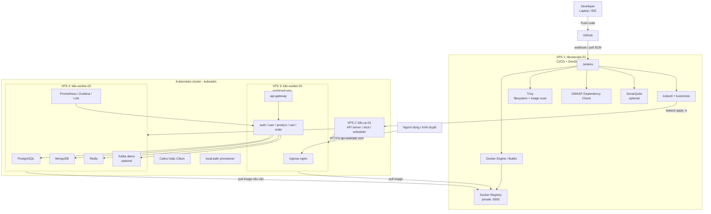
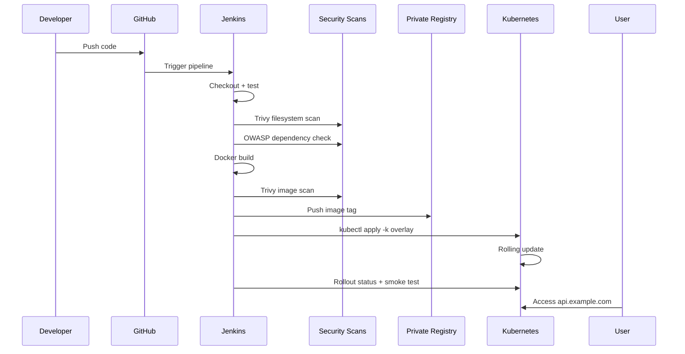

# Kế Hoạch Triển Khai DevSecOps Demo Trên 4 VPS Với Kubernetes Chuẩn

Tài liệu này mô tả phương án triển khai dự án ecommerce microservices trên **4 VPS CloudFly/VPS** bằng **Kubernetes chuẩn cài bằng kubeadm**. Mục tiêu chính là mô phỏng cách một dự án thật được build, scan, deploy, monitor và vận hành theo hướng **DevSecOps**.

Ghi chú quan trọng: tên file có chữ `c10k`, nhưng phương án 4 VPS trong tài liệu này ưu tiên **demo DevSecOps + Kubernetes thực tế**, không tối ưu để benchmark C10K nặng. Nếu sau này muốn test C10K nghiêm túc, nên bổ sung máy load test riêng và nâng cấu hình worker/app.

## 1. Kết Luận Kiến Trúc

Bạn quyết định dùng **4 VPS**, nên phương án hợp lý nhất là:

```txt
VPS 1: devsecops-01      Jenkins + Docker Registry + security scans
VPS 2: k8s-cp-01         Kubernetes control-plane
VPS 3: k8s-worker-01     App workloads
VPS 4: k8s-worker-02     Data + observability workloads
```

Với 4 VPS, bạn học được gần với thực tế hơn so với chạy tất cả trên 1-2 máy:

- CI/CD tách khỏi runtime Kubernetes.
- Control-plane không chạy workload nặng.
- App và data store được tách worker.
- Có chỗ để thực hành node label, nodeSelector, rollout, rollback, monitoring, logging.
- Có thể public domain để người khác truy cập demo.
- Có thể mô phỏng pipeline DevSecOps giống môi trường staging nhỏ.

## 2. Cấu Hình Tối Thiểu

Đây là cấu hình tối thiểu nên thuê nếu muốn chạy ổn cho demo DevSecOps:

| Máy | Vai trò | CPU tối thiểu | RAM tối thiểu | Disk tối thiểu | Ghi chú |
|---|---|---:|---:|---:|---|
| `devsecops-01` | Jenkins, Docker, Registry, Trivy, OWASP Dependency Check, optional SonarQube | 4 vCPU | 8GB | 100GB | Máy build image và chạy scan |
| `k8s-cp-01` | Kubernetes API server, etcd, scheduler, controller-manager | 2 vCPU | 4GB | 60GB | Không chạy app nặng |
| `k8s-worker-01` | API Gateway và microservices demo | 4 vCPU | 8GB | 100GB | Worker chính cho app |
| `k8s-worker-02` | PostgreSQL, MongoDB, Redis, Kafka demo, Prometheus/Grafana/Loki | 4 vCPU | 8GB | 120GB | Worker data/observability |

Tổng tối thiểu:

```txt
14 vCPU
28GB RAM
380GB disk
```

Nếu ngân sách cho phép, nâng cấp theo thứ tự ưu tiên:

| Ưu tiên | Nâng cấp | Vì sao |
|---:|---|---|
| 1 | `k8s-worker-02` lên 8 vCPU / 16GB RAM / 150-200GB disk | Data store, Kafka, monitoring ăn RAM và disk nhiều nhất |
| 2 | `devsecops-01` lên 8 vCPU / 16GB RAM | Jenkins build nhiều image nhanh hơn, SonarQube đỡ chậm |
| 3 | `k8s-worker-01` lên 8 vCPU / 16GB RAM | Chạy nhiều microservice replica hơn |
| 4 | `k8s-cp-01` lên 4 vCPU / 8GB RAM | Control-plane ổn hơn khi cluster lớn lên |

### Đánh Giá Theo Docker Compose Local Hiện Tại

Số liệu tham khảo từ máy local khi chạy Docker Compose full stack:

```txt
Images:        19.46GB, reclaimable 11.8GB
Containers:    26 total, 21 active
Volumes:        2.177GB
Build cache:    5.334GB, reclaimable 4.592GB
```

RAM runtime khi idle khá nhẹ:

| Thành phần | RAM xấp xỉ khi idle | Nhận xét |
|---|---:|---|
| Kafka | 467MiB | Thành phần nền nặng nhất trong compose hiện tại |
| MongoDB | 293MiB | Tăng theo dữ liệu/catalog/chat/review |
| MinIO | 142MiB | Ổn cho demo media nhỏ |
| Auth NestJS | 104MiB | Nặng hơn Go service nhưng vẫn ổn |
| PostgreSQL | 70MiB | Idle nhẹ, sẽ tăng theo query/data |
| Mỗi Go service | 15-30MiB | Rất phù hợp để chạy nhiều service 1 replica |

Kết luận từ số liệu này:

- Cấu hình **4 VPS tối thiểu** trong plan này đủ để deploy demo DevSecOps/staging nhỏ.
- App service hiện khá nhẹ, nên `k8s-worker-01` cấu hình `4 vCPU / 8GB RAM` là hợp lý để chạy 1 replica/service.
- Điểm dễ nghẽn nhất là `k8s-worker-02`, vì máy này gánh PostgreSQL, MongoDB, Redis, Kafka, MinIO và monitoring.
- `devsecops-01` cần disk đủ rộng vì Docker image và build cache tăng nhanh sau nhiều lần build.
- Con số local đang là trạng thái idle; khi có traffic, seed data, Kafka nhiều topic hoặc Prometheus/Loki retention dài, RAM và disk sẽ tăng rõ rệt.

Khuyến nghị thực tế:

| Trường hợp | Cấu hình nên dùng |
|---|---|
| Demo DevSecOps tiết kiệm | Giữ đúng cấu hình tối thiểu 4 VPS |
| Demo thoải mái hơn | Nâng `k8s-worker-02` lên 8 vCPU / 16GB RAM / 150-200GB disk |
| Có SonarQube và build nhiều image | Nâng thêm `devsecops-01` lên 8 vCPU / 16GB RAM / 150GB disk |
| Muốn test tải/C10K nghiêm túc | Thêm máy load test riêng và nâng `k8s-worker-01` |

Khi deploy lên Kubernetes, nên bắt đầu với:

```txt
1 replica/service
Prometheus retention 2-3 ngày
Loki retention 1-3 ngày
Kafka demo nhỏ, ít partition
Không bật ELK trên cấu hình tối thiểu
Không dùng tag latest làm tag deploy chính
```

## 3. Vai Trò Từng VPS

### `devsecops-01`

Máy này đóng vai trò như server CI/CD trong công ty:

- Nhận webhook hoặc pull code từ GitHub.
- Chạy Jenkins pipeline.
- Build Docker image cho service.
- Chạy unit test/lint nếu có.
- Chạy Trivy filesystem scan.
- Chạy OWASP Dependency Check.
- Chạy Trivy image scan.
- Push image vào Docker Registry nội bộ.
- Dùng `kubectl` deploy vào Kubernetes.
- Gửi kết quả pipeline qua email/Slack nếu muốn.

Không nên chạy workload production trên máy này. Đây là máy tooling.

### `k8s-cp-01`

Máy này là control-plane Kubernetes:

- `kube-apiserver`
- `etcd`
- `kube-scheduler`
- `kube-controller-manager`
- `kubectl` admin
- Calico/Cilium control components

Không nên deploy PostgreSQL, MongoDB, Kafka hoặc app nặng lên control-plane. Trong lab vẫn có thể untaint control-plane, nhưng với 4 VPS thì không cần.

### `k8s-worker-01`

Máy này chạy app layer:

- `api-gateway`
- `auth-service`
- `user-service`
- `product-service`
- `cart-service`
- `order-service`
- Các service demo khác nếu đủ RAM
- `ingress-nginx`

Node này sẽ được label:

```txt
workload=app
```

### `k8s-worker-02`

Máy này chạy data/infra layer:

- PostgreSQL
- MongoDB
- Redis
- Kafka demo nếu cần
- MinIO nếu demo media upload
- Prometheus
- Grafana
- Loki/Promtail nếu bật logging

Node này sẽ được label:

```txt
workload=data
```

## 4. Sơ Đồ Tổng Quan



## 5. Sơ Đồ Luồng CI/CD



## 6. Domain Và DNS

Chỉ cần mua **1 domain**. Không cần mua nhiều domain. Dùng subdomain là đủ.

Ví dụ bạn mua:

```txt
example.com
```

Cấu hình DNS:

| Subdomain | Trỏ tới | Mục đích |
|---|---|---|
| `api.example.com` | Public IP `k8s-worker-01` hoặc Load Balancer | Public API/app |
| `jenkins.example.com` | Public IP `devsecops-01` | Jenkins UI |
| `grafana.example.com` | Public IP `k8s-worker-02` hoặc reverse proxy | Grafana |
| `sonar.example.com` | Public IP `devsecops-01` | SonarQube optional |
| `registry.example.com` | Public IP `devsecops-01` | Registry, nên hạn chế public |

Khuyến nghị cho lab:

- Public `api.example.com` cho người khác truy cập demo.
- Public `jenkins.example.com` nhưng bật login mạnh và giới hạn IP nếu được.
- Không public registry rộng rãi. Registry nên chỉ cho các node K8s pull qua private IP.
- Nếu chưa mua domain, có thể test tạm bằng public IP trước.

## 7. Network Và Firewall

Nếu CloudFly có private network, hãy bật private network cho cả 4 VPS. Dùng private IP cho các kết nối nội bộ:

```txt
devsecops-01 -> k8s-cp-01:6443
k8s-worker-01 -> devsecops-01:5000
k8s-worker-02 -> devsecops-01:5000
k8s-cp-01 <-> k8s-worker-01/k8s-worker-02
```

### Port public nên mở

| Máy | Port public | Ghi chú |
|---|---|---|
| `devsecops-01` | 22, 80, 443 | SSH, reverse proxy Jenkins/Sonar |
| `k8s-cp-01` | 22, 6443 allowlist | Kubernetes API chỉ nên allow IP của bạn và `devsecops-01` |
| `k8s-worker-01` | 22, 80, 443 | Ingress public cho app |
| `k8s-worker-02` | 22, 80, 443 optional | Chỉ mở nếu public Grafana qua ingress/node này |

### Port nội bộ cần cho Kubernetes

| Port | Mục đích |
|---:|---|
| 6443 | Kubernetes API server |
| 2379-2380 | etcd |
| 10250 | kubelet |
| 10257 | kube-controller-manager |
| 10259 | kube-scheduler |
| 30000-32767 | NodePort nếu dùng |
| 179 | Calico BGP nếu dùng Calico mode BGP |
| 4789 | VXLAN nếu dùng overlay network |

Với lab, có thể dùng UFW nhưng phải cẩn thận để không chặn traffic CNI.

## 8. Roadmap Triển Khai

| Phase | Mục tiêu |
|---|---|
| Phase 0 | Thuê 4 VPS, chuẩn bị domain, ghi IP |
| Phase 1 | Bootstrap Linux, SSH, firewall, hostname |
| Phase 2 | Cài Docker, Registry, Jenkins trên `devsecops-01` |
| Phase 3 | Cài containerd trên 3 node Kubernetes |
| Phase 4 | Cài kubeadm/kubelet/kubectl |
| Phase 5 | Init control-plane |
| Phase 6 | Join 2 worker |
| Phase 7 | Cài CNI |
| Phase 8 | Cài ingress-nginx, StorageClass, metrics-server |
| Phase 9 | Label node và chia workload |
| Phase 10 | Cấu hình registry pull cho containerd |
| Phase 11 | Chuẩn bị kubeconfig cho Jenkins |
| Phase 12 | Deploy app slice thủ công |
| Phase 13 | Tạo Jenkins pipeline DevSecOps |
| Phase 14 | Cấu hình domain + HTTPS |
| Phase 15 | Monitoring/logging |
| Phase 16 | Vận hành, backup, rollback |

## 9. Phase 0: Thuê VPS Và Ghi Thông Tin

Thuê 4 VPS Ubuntu:

```txt
devsecops-01    4 vCPU / 8GB RAM / 100GB disk
k8s-cp-01       2 vCPU / 4GB RAM / 60GB disk
k8s-worker-01   4 vCPU / 8GB RAM / 100GB disk
k8s-worker-02   4 vCPU / 8GB RAM / 120GB disk
```

OS khuyến nghị:

```txt
Ubuntu Server 22.04 LTS
```

Ubuntu 24.04 LTS cũng dùng được, nhưng nếu muốn ít lỗi tài liệu/cộng đồng hơn thì chọn 22.04 LTS.

Ghi lại IP:

```txt
PUBLIC_IP_DEVSECOPS=
PUBLIC_IP_CP=
PUBLIC_IP_WORKER_APP=
PUBLIC_IP_WORKER_DATA=

PRIVATE_IP_DEVSECOPS=
PRIVATE_IP_CP=
PRIVATE_IP_WORKER_APP=
PRIVATE_IP_WORKER_DATA=
```

Nếu nhà cung cấp không có private network, tạm dùng public IP giữa các máy nhưng firewall phải allowlist chặt.

## 10. Phase 1: Bootstrap Linux

Chạy trên cả 4 VPS:

```bash
sudo apt update
sudo apt -y upgrade
sudo apt -y install curl wget git vim htop jq unzip ca-certificates gnupg lsb-release ufw fail2ban apt-transport-https
```

Đặt hostname đúng trên từng máy:

```bash
# devsecops-01
sudo hostnamectl set-hostname devsecops-01

# k8s-cp-01
sudo hostnamectl set-hostname k8s-cp-01

# k8s-worker-01
sudo hostnamectl set-hostname k8s-worker-01

# k8s-worker-02
sudo hostnamectl set-hostname k8s-worker-02
```

Thêm `/etc/hosts` trên cả 4 máy:

```txt
<PRIVATE_IP_DEVSECOPS>    devsecops-01
<PRIVATE_IP_CP>           k8s-cp-01
<PRIVATE_IP_WORKER_APP>   k8s-worker-01
<PRIVATE_IP_WORKER_DATA>  k8s-worker-02
```

Tắt swap trên 3 node Kubernetes:

```bash
sudo swapoff -a
sudo sed -i '/ swap / s/^/#/' /etc/fstab
```

Load kernel modules trên 3 node Kubernetes:

```bash
sudo tee /etc/modules-load.d/k8s.conf > /dev/null <<'EOF'
overlay
br_netfilter
EOF

sudo modprobe overlay
sudo modprobe br_netfilter
```

Sysctl trên 3 node Kubernetes:

```bash
sudo tee /etc/sysctl.d/99-kubernetes-cri.conf > /dev/null <<'EOF'
net.bridge.bridge-nf-call-iptables  = 1
net.bridge.bridge-nf-call-ip6tables = 1
net.ipv4.ip_forward                 = 1
EOF

sudo sysctl --system
```

## 11. Phase 2: Cài DevSecOps Server

Thực hiện trên `devsecops-01`.

### Cài Docker

```bash
sudo apt update
sudo apt -y install ca-certificates curl gnupg
sudo install -m 0755 -d /etc/apt/keyrings
curl -fsSL https://download.docker.com/linux/ubuntu/gpg | sudo gpg --dearmor -o /etc/apt/keyrings/docker.gpg
sudo chmod a+r /etc/apt/keyrings/docker.gpg

echo \
  "deb [arch=$(dpkg --print-architecture) signed-by=/etc/apt/keyrings/docker.gpg] https://download.docker.com/linux/ubuntu \
  $(. /etc/os-release && echo "$VERSION_CODENAME") stable" | \
  sudo tee /etc/apt/sources.list.d/docker.list > /dev/null

sudo apt update
sudo apt -y install docker-ce docker-ce-cli containerd.io docker-buildx-plugin docker-compose-plugin
sudo usermod -aG docker $USER
```

Đăng xuất SSH rồi đăng nhập lại để group `docker` có hiệu lực.

### Chạy Docker Registry nội bộ

```bash
mkdir -p ~/registry-data

docker run -d \
  --name registry \
  --restart unless-stopped \
  -p 5000:5000 \
  -v ~/registry-data:/var/lib/registry \
  registry:2
```

Test registry:

```bash
curl http://localhost:5000/v2/_catalog
```

### Chạy Jenkins

```bash
docker volume create jenkins_home

docker run -d \
  --name jenkins \
  --restart unless-stopped \
  -p 8080:8080 \
  -p 50000:50000 \
  -v jenkins_home:/var/jenkins_home \
  -v /var/run/docker.sock:/var/run/docker.sock \
  -u root \
  jenkins/jenkins:lts-jdk21
```

Lấy mật khẩu ban đầu:

```bash
docker exec jenkins cat /var/jenkins_home/secrets/initialAdminPassword
```

Plugin Jenkins nên cài:

```txt
Pipeline
Git
Docker Pipeline
Credentials Binding
Workspace Cleanup
JUnit
OWASP Dependency-Check
Email Extension optional
```

### Cài tool trên Jenkins host

```bash
sudo apt -y install openjdk-21-jdk make

curl -sfL https://raw.githubusercontent.com/aquasecurity/trivy/main/contrib/install.sh | \
  sudo sh -s -- -b /usr/local/bin

curl -LO "https://dl.k8s.io/release/v1.30.0/bin/linux/amd64/kubectl"
chmod +x kubectl
sudo mv kubectl /usr/local/bin/kubectl
```

## 12. Phase 3: Cài containerd Trên Node Kubernetes

Chạy trên:

```txt
k8s-cp-01
k8s-worker-01
k8s-worker-02
```

Command:

```bash
sudo apt update
sudo apt -y install containerd
sudo mkdir -p /etc/containerd
containerd config default | sudo tee /etc/containerd/config.toml > /dev/null
sudo sed -i 's/SystemdCgroup = false/SystemdCgroup = true/' /etc/containerd/config.toml
sudo systemctl restart containerd
sudo systemctl enable containerd
sudo systemctl status containerd --no-pager
```

## 13. Phase 4: Cài kubeadm/kubelet/kubectl

Chạy trên:

```txt
k8s-cp-01
k8s-worker-01
k8s-worker-02
```

Command:

```bash
sudo apt-get update
sudo apt-get install -y apt-transport-https ca-certificates curl gpg
sudo mkdir -p /etc/apt/keyrings

curl -fsSL https://pkgs.k8s.io/core:/stable:/v1.30/deb/Release.key | \
  sudo gpg --dearmor -o /etc/apt/keyrings/kubernetes-apt-keyring.gpg

echo 'deb [signed-by=/etc/apt/keyrings/kubernetes-apt-keyring.gpg] https://pkgs.k8s.io/core:/stable:/v1.30/deb/ /' | \
  sudo tee /etc/apt/sources.list.d/kubernetes.list

sudo apt-get update
sudo apt-get install -y kubelet kubeadm kubectl
sudo apt-mark hold kubelet kubeadm kubectl
```

Kiểm tra:

```bash
kubeadm version
kubelet --version
kubectl version --client
```

## 14. Phase 5: Init Control-Plane

Chạy trên `k8s-cp-01`:

```bash
sudo kubeadm init \
  --apiserver-advertise-address=<PRIVATE_IP_CP> \
  --pod-network-cidr=192.168.0.0/16 \
  --node-name k8s-cp-01
```

Sau khi init xong:

```bash
mkdir -p $HOME/.kube
sudo cp -i /etc/kubernetes/admin.conf $HOME/.kube/config
sudo chown $(id -u):$(id -g) $HOME/.kube/config
kubectl get nodes
```

Lưu lại command `kubeadm join` mà output in ra. Nếu lỡ mất, tạo lại:

```bash
kubeadm token create --print-join-command
```

## 15. Phase 6: Cài CNI

Ví dụ dùng Calico:

```bash
kubectl apply -f https://raw.githubusercontent.com/projectcalico/calico/v3.28.0/manifests/calico.yaml
```

Kiểm tra:

```bash
kubectl get pods -n kube-system
kubectl get nodes -o wide
```

Control-plane chỉ `Ready` sau khi CNI chạy ổn.

## 16. Phase 7: Join Hai Worker

Chạy trên `k8s-worker-01`:

```bash
sudo kubeadm join <PRIVATE_IP_CP>:6443 --token <token> \
  --discovery-token-ca-cert-hash sha256:<hash> \
  --node-name k8s-worker-01
```

Chạy trên `k8s-worker-02`:

```bash
sudo kubeadm join <PRIVATE_IP_CP>:6443 --token <token> \
  --discovery-token-ca-cert-hash sha256:<hash> \
  --node-name k8s-worker-02
```

Kiểm tra trên control-plane:

```bash
kubectl get nodes -o wide
```

Kết quả mong muốn:

```txt
k8s-cp-01        Ready    control-plane
k8s-worker-01    Ready    <none>
k8s-worker-02    Ready    <none>
```

## 17. Phase 8: Label Node Và Chia Workload

Label node:

```bash
kubectl label node k8s-worker-01 workload=app
kubectl label node k8s-worker-02 workload=data
```

Kiểm tra:

```bash
kubectl get nodes --show-labels
```

Khi viết manifest, app service dùng:

```yaml
nodeSelector:
  workload: app
```

Data store và observability dùng:

```yaml
nodeSelector:
  workload: data
```

Nếu chưa muốn sửa toàn bộ manifest ngay, có thể deploy trước rồi tối ưu nodeSelector sau. Nhưng về mặt học DevOps/K8s, nên làm để thấy cách chia workload trong cluster.

## 18. Phase 9: Cài Addons Cần Thiết

### metrics-server

```bash
kubectl apply -f https://github.com/kubernetes-sigs/metrics-server/releases/latest/download/components.yaml
```

Nếu metrics-server lỗi TLS kubelet trong lab:

```bash
kubectl -n kube-system patch deployment metrics-server --type=json \
  -p='[{"op":"add","path":"/spec/template/spec/containers/0/args/-","value":"--kubelet-insecure-tls"}]'
```

### ingress-nginx

```bash
kubectl apply -f https://raw.githubusercontent.com/kubernetes/ingress-nginx/controller-v1.11.2/deploy/static/provider/baremetal/deploy.yaml
```

Với VPS không có cloud LoadBalancer, có 2 cách:

| Cách | Mô tả | Khuyến nghị |
|---|---|---|
| NodePort | Ingress expose qua port 30000-32767, reverse proxy ngoài vào NodePort | Dễ hiểu |
| hostNetwork/hostPort | Ingress dùng trực tiếp port 80/443 trên worker | Gọn cho lab |

Để đơn giản, có thể để ingress-nginx chạy trên `k8s-worker-01` và public `api.example.com` về public IP của `k8s-worker-01`.

### local-path-provisioner

```bash
kubectl apply -f https://raw.githubusercontent.com/rancher/local-path-provisioner/master/deploy/local-path-storage.yaml
kubectl patch storageclass local-path -p '{"metadata":{"annotations":{"storageclass.kubernetes.io/is-default-class":"true"}}}'
```

Kiểm tra:

```bash
kubectl get storageclass
```

## 19. Phase 10: Cấu Hình Registry Cho containerd

Chạy trên:

```txt
k8s-cp-01
k8s-worker-01
k8s-worker-02
```

Tạo thư mục:

```bash
sudo mkdir -p /etc/containerd/certs.d/<PRIVATE_IP_DEVSECOPS>:5000
```

Tạo `hosts.toml`:

```bash
sudo tee /etc/containerd/certs.d/<PRIVATE_IP_DEVSECOPS>:5000/hosts.toml > /dev/null <<'EOF'
server = "http://<PRIVATE_IP_DEVSECOPS>:5000"

[host."http://<PRIVATE_IP_DEVSECOPS>:5000"]
  capabilities = ["pull", "resolve", "push"]
  skip_verify = true
EOF
```

Restart:

```bash
sudo systemctl restart containerd
sudo systemctl restart kubelet
```

Test từ worker:

```bash
sudo ctr images pull <PRIVATE_IP_DEVSECOPS>:5000/test-image:latest
```

Nếu dùng registry public domain/TLS sau này, nên chuyển sang:

```txt
registry.example.com
TLS certificate hợp lệ
basic auth hoặc token auth
```

## 20. Phase 11: Kubeconfig Cho Jenkins

Trên `k8s-cp-01`:

```bash
sudo cat /etc/kubernetes/admin.conf
```

Copy nội dung vào Jenkins credential dạng secret file hoặc đặt trong `devsecops-01`:

```bash
mkdir -p ~/.kube
vim ~/.kube/config
chmod 600 ~/.kube/config
```

Sửa server trong kubeconfig:

```yaml
server: https://<PRIVATE_IP_CP>:6443
```

Test trên `devsecops-01`:

```bash
kubectl get nodes -o wide
kubectl get pods -A
```

Trong thực tế, không nên dùng admin kubeconfig lâu dài. Sau khi lab chạy ổn, hãy tạo ServiceAccount riêng cho Jenkins với quyền deploy vào namespace cần thiết.

## 21. Phase 12: Deploy App Slice Thủ Công

Không nên deploy toàn bộ 14 service ngay từ đầu. Bắt đầu bằng slice nhỏ:

```txt
api-gateway
auth-service
user-service
product-service
cart-service
PostgreSQL
MongoDB
Redis
```

Tạo namespace:

```bash
kubectl create namespace ecommerce-dev
kubectl create namespace monitoring
kubectl create namespace logging
```

Deploy bằng Kustomize nếu manifest hiện có tương thích:

```bash
kubectl apply -k infrastructure/k3s/overlays/dev
kubectl -n ecommerce-dev get pods -o wide
kubectl -n ecommerce-dev rollout status deploy/api-gateway --timeout=180s
```

Nếu overlay `infrastructure/k3s/overlays/dev` còn tên `k3s`, vẫn có thể dùng trên kubeadm nếu manifest Kubernetes chuẩn. Sau này có thể đổi tên folder thành `infrastructure/kubernetes/overlays/dev` cho rõ nghĩa.

Kiểm tra service:

```bash
kubectl -n ecommerce-dev get deploy
kubectl -n ecommerce-dev get svc
kubectl -n ecommerce-dev get ingress
kubectl -n ecommerce-dev logs deploy/api-gateway --tail=100
```

## 22. Phase 13: Jenkins Pipeline DevSecOps

Pipeline nên có các stage:

```txt
Checkout
Install dependencies
Unit test
Trivy filesystem scan
OWASP Dependency Check
Docker build
Trivy image scan
Docker push
Update image tag
kubectl apply -k
Rollout status
Smoke test
Rollback nếu fail
Archive reports
Notify
```

Luồng đơn giản:

```txt
GitHub -> Jenkins -> Test/Scan -> Build image -> Push registry -> Deploy K8s -> Smoke test
```

Quy tắc tag image:

```txt
<PRIVATE_IP_DEVSECOPS>:5000/api-gateway:<git-short-sha>
<PRIVATE_IP_DEVSECOPS>:5000/auth-service:<git-short-sha>
```

Không nên dùng `latest` cho deploy chính vì rollback khó hơn. Có thể push thêm `latest` để tiện debug, nhưng manifest nên dùng tag theo commit SHA.

Smoke test tối thiểu:

```bash
curl -f https://api.example.com/health
```

Rollback khi fail:

```bash
kubectl -n ecommerce-dev rollout undo deploy/api-gateway
kubectl -n ecommerce-dev rollout status deploy/api-gateway --timeout=180s
```

## 23. Phase 14: HTTPS Và Domain

Với Kubernetes chuẩn, không có Traefik mặc định như K3s. Bạn cần tự chọn.

Khuyến nghị:

```txt
ingress-nginx
cert-manager
Let's Encrypt ClusterIssuer
Ingress host api.example.com
```

Luồng:

```txt
Internet -> api.example.com -> k8s-worker-01:80/443 -> ingress-nginx -> api-gateway -> services
```

Các bước:

1. DNS `api.example.com` trỏ về public IP `k8s-worker-01`.
2. Cài `cert-manager`.
3. Tạo `ClusterIssuer` Let's Encrypt.
4. Tạo Ingress cho `api.example.com`.
5. Kiểm tra certificate được cấp.

Lệnh kiểm tra:

```bash
kubectl get certificate -A
kubectl describe certificate -n ecommerce-dev
curl -I https://api.example.com/health
```

## 24. Phase 15: Monitoring Và Logging

### Tối thiểu

```bash
kubectl top nodes
kubectl top pods -A
kubectl logs -n ecommerce-dev deploy/api-gateway --tail=100
kubectl get events -A --sort-by=.lastTimestamp | tail -50
```

### Đẹp hơn cho portfolio

| Thành phần | Chạy ở đâu | Mục đích |
|---|---|---|
| Prometheus | `k8s-worker-02` | Thu metrics |
| Grafana | `k8s-worker-02` | Dashboard |
| Loki | `k8s-worker-02` | Lưu log |
| Promtail | DaemonSet trên worker | Đẩy log |
| Alertmanager | `k8s-worker-02` | Cảnh báo |

Với worker data chỉ 8GB RAM, cài monitoring vừa phải:

```txt
Prometheus retention: 2-3 ngày
Loki retention: 1-3 ngày
Không bật dashboard quá nặng
```

Dashboard nên có:

- CPU/RAM từng node.
- Pod restart count.
- API Gateway request rate.
- HTTP 4xx/5xx.
- Latency p95/p99 nếu service đã expose metric.
- Disk usage của worker data.

## 25. Phase 16: Vận Hành Hằng Ngày

### Check cluster

```bash
kubectl get nodes -o wide
kubectl get pods -A
kubectl get deploy -n ecommerce-dev
kubectl get ingress -A
```

### Check lỗi nhanh

```bash
kubectl get events -A --sort-by=.lastTimestamp | tail -50
kubectl -n ecommerce-dev describe pod <pod-name>
kubectl -n ecommerce-dev logs <pod-name> --previous
```

### Check control-plane

Trên `k8s-cp-01`:

```bash
sudo systemctl status kubelet --no-pager
sudo crictl ps
sudo crictl images
sudo journalctl -u kubelet -n 100 --no-pager
```

### Check disk

```bash
df -h
sudo du -sh /var/lib/containerd
sudo du -sh /var/lib/kubelet
```

Nếu disk gần đầy:

```bash
sudo crictl images
sudo crictl rmi --prune
```

### Rollout và rollback

```bash
kubectl -n ecommerce-dev rollout history deploy/api-gateway
kubectl -n ecommerce-dev rollout undo deploy/api-gateway
kubectl -n ecommerce-dev rollout status deploy/api-gateway --timeout=180s
```

### Scale service

```bash
kubectl -n ecommerce-dev scale deploy/api-gateway --replicas=2
kubectl -n ecommerce-dev get pods -o wide
```

### Restart service

```bash
kubectl -n ecommerce-dev rollout restart deploy/api-gateway
kubectl -n ecommerce-dev rollout status deploy/api-gateway
```

## 26. Backup Và Khôi Phục

### Backup etcd

Trên `k8s-cp-01`:

```bash
sudo ETCDCTL_API=3 etcdctl snapshot save /root/etcd-snapshot.db \
  --endpoints=https://127.0.0.1:2379 \
  --cacert=/etc/kubernetes/pki/etcd/ca.crt \
  --cert=/etc/kubernetes/pki/etcd/server.crt \
  --key=/etc/kubernetes/pki/etcd/server.key
```

Lưu snapshot ra ngoài máy:

```bash
scp root@<PUBLIC_IP_CP>:/root/etcd-snapshot.db ./etcd-snapshot.db
```

### Backup data store

PostgreSQL:

```bash
kubectl -n ecommerce-dev exec deploy/postgres -- pg_dumpall -U postgres > postgres-backup.sql
```

MongoDB:

```bash
kubectl -n ecommerce-dev exec deploy/mongodb -- mongodump --archive=/tmp/mongo.archive
kubectl -n ecommerce-dev cp deploy/mongodb:/tmp/mongo.archive ./mongo.archive
```

Redis:

```bash
kubectl -n ecommerce-dev exec deploy/redis -- redis-cli SAVE
```

Trong lab, backup có thể chạy thủ công. Trong môi trường thật, nên dùng CronJob và lưu backup ra object storage.

## 27. Security Checklist

- SSH chỉ dùng key, tắt password login nếu được.
- Port `6443` chỉ allow IP cá nhân và `devsecops-01`.
- Registry không public rộng.
- Jenkins bắt buộc có user/password mạnh.
- Không commit secret vào Git.
- Secret Kubernetes dùng `Secret`, không để plaintext trong manifest public.
- Image scan fail thì không deploy.
- Dependency scan fail mức nghiêm trọng thì chặn pipeline.
- Không dùng `latest` cho production-like deploy.
- Tách namespace `ecommerce-dev`, `monitoring`, `logging`.
- Bật NetworkPolicy sau khi app chạy ổn.

## 28. Resource Request Gợi Ý

Với cấu hình tối thiểu, set request/limit thấp để cluster không bị nghẹt.

| Workload | Request CPU | Request RAM | Limit CPU | Limit RAM |
|---|---:|---:|---:|---:|
| `api-gateway` | 100m | 128Mi | 500m | 512Mi |
| Go service nhỏ | 100m | 128Mi | 500m | 512Mi |
| `auth-service` NestJS | 200m | 256Mi | 1 | 1Gi |
| PostgreSQL demo | 500m | 1Gi | 2 | 2Gi |
| MongoDB demo | 500m | 1Gi | 2 | 2Gi |
| Redis | 100m | 256Mi | 500m | 512Mi |
| Kafka demo | 1 | 2Gi | 2 | 4Gi |
| Prometheus | 500m | 1Gi | 1 | 2Gi |
| Grafana | 100m | 256Mi | 500m | 512Mi |

Không deploy toàn bộ 14 services cùng replica cao ngay từ đầu. Bắt đầu 1 replica/service, sau đó tăng dần.

## 29. Thứ Tự Demo Nên Làm

Để học và trình bày giống role DevOps/DevSecOps:

1. Dựng 4 VPS và network.
2. Dựng Kubernetes bằng kubeadm.
3. Join 2 worker.
4. Label node app/data.
5. Dựng Jenkins và Registry.
6. Build/push 1 image thủ công.
7. Deploy `api-gateway` thủ công.
8. Thêm data store cơ bản.
9. Viết Jenkins pipeline cho 1 service.
10. Thêm Trivy filesystem scan.
11. Thêm OWASP Dependency Check.
12. Thêm Trivy image scan.
13. Deploy tự động bằng Jenkins.
14. Cấu hình domain/HTTPS.
15. Thêm Prometheus/Grafana.
16. Demo rollback.
17. Demo xem log/metric khi service lỗi.

## 30. Khi Nào Cần Nâng Cấp

Nâng cấp khi gặp các dấu hiệu:

| Dấu hiệu | Nên làm |
|---|---|
| Jenkins build chậm, scan lâu | Nâng `devsecops-01` |
| PostgreSQL/MongoDB/Kafka hay OOM | Nâng `k8s-worker-02` |
| App nhiều request bị timeout | Nâng `k8s-worker-01` hoặc tăng replica |
| Control-plane phản hồi chậm | Nâng `k8s-cp-01` |
| Disk worker data gần đầy | Tăng disk `k8s-worker-02` |
| Muốn HA thật | Thêm control-plane thứ 2/3 và load balancer |

## 31. K8s Có Đáng Dùng Trong Phương Án 4 VPS Không

Với 4 VPS, câu trả lời là **có**, nếu mục tiêu của bạn là học nghiêm túc:

- `kubeadm` giống cách dựng Kubernetes self-managed ngoài đời hơn K3s.
- Bạn hiểu rõ control-plane, worker, CNI, Ingress, StorageClass.
- Bạn có môi trường đủ tốt để demo CI/CD, security scan, deploy, rollback, monitoring.
- Portfolio sẽ thuyết phục hơn so với chỉ chạy `docker compose`.

Nếu mục tiêu chỉ là demo nhanh, ít lỗi và tiết kiệm tiền hơn, K3s vẫn dễ hơn. Nhưng với quyết định thuê 4 VPS, Kubernetes chuẩn là lựa chọn hợp lý để học đúng nền tảng.

## 32. Checklist Hoàn Thành

- 4 VPS chạy Ubuntu ổn định.
- Hostname và `/etc/hosts` đúng.
- Docker Registry trên `devsecops-01` hoạt động.
- Jenkins chạy và truy cập được.
- `kubeadm init` thành công trên `k8s-cp-01`.
- Calico/Cilium chạy ổn.
- `k8s-worker-01` và `k8s-worker-02` join thành công.
- Node label `workload=app` và `workload=data` đúng.
- ingress-nginx chạy.
- local-path StorageClass hoạt động.
- containerd pull được image từ registry nội bộ.
- Jenkins dùng được kubeconfig.
- App slice deploy thành công.
- `api.example.com/health` truy cập được.
- Pipeline có test/scan/build/push/deploy.
- Rollout status pass.
- Rollback hoạt động.
- Có ít nhất một security scan report.
- Có dashboard Grafana cơ bản.

## 33. Hướng Nâng Cấp Sau Lab

- Tách PostgreSQL/MongoDB ra VPS riêng hoặc managed database.
- Dùng registry có TLS/auth đầy đủ.
- Thêm Argo CD để GitOps.
- Thêm cert-manager để cấp HTTPS tự động.
- Thêm kube-prometheus-stack.
- Thêm Loki/Promtail.
- Thêm NetworkPolicy.
- Thêm Horizontal Pod Autoscaler.
- Thêm Terraform/OpenTofu để dựng lại hạ tầng.
- Thêm worker thứ 3 nếu muốn test tải lớn hơn.
- Thêm HA control-plane nếu muốn mô phỏng production sâu hơn.

## 34. Tham Khảo

- Kubernetes kubeadm install: https://kubernetes.io/docs/setup/production-environment/tools/kubeadm/install-kubeadm/
- Kubernetes create cluster with kubeadm: https://kubernetes.io/docs/setup/production-environment/tools/kubeadm/create-cluster-kubeadm/
- containerd registry config: https://github.com/containerd/containerd/blob/main/docs/hosts.md
- Calico quickstart: https://docs.tigera.io/calico/latest/getting-started/kubernetes/quickstart
- ingress-nginx bare metal: https://kubernetes.github.io/ingress-nginx/deploy/baremetal/
- metrics-server: https://github.com/kubernetes-sigs/metrics-server
