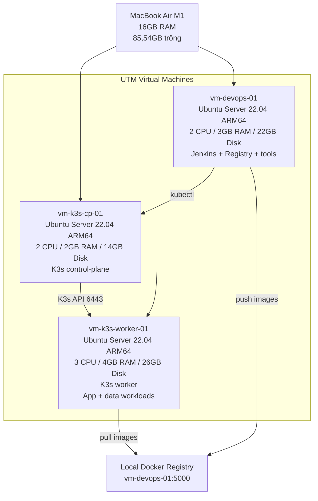
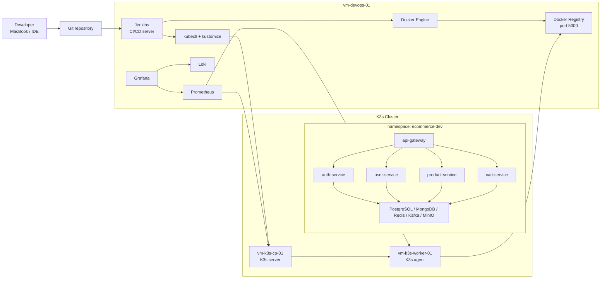
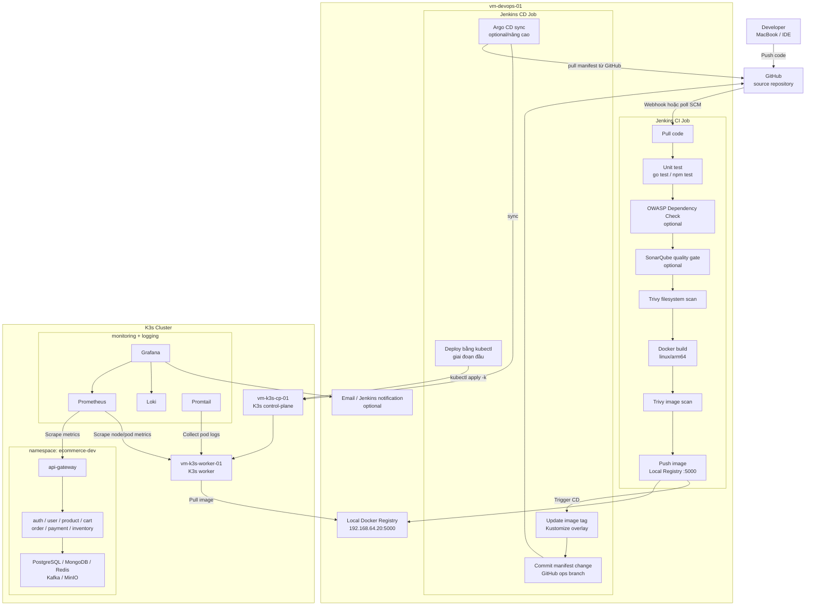
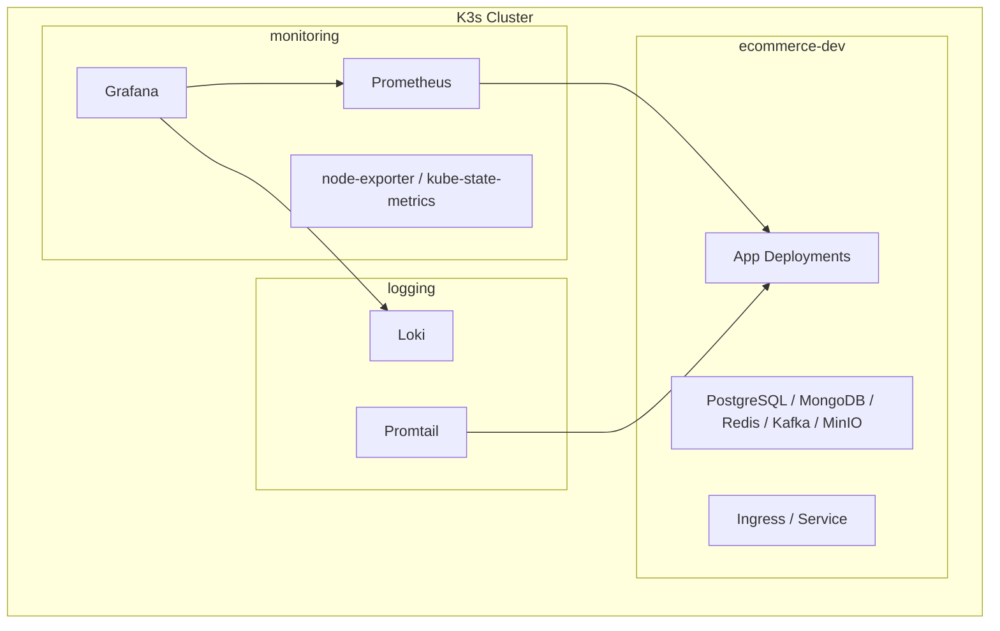
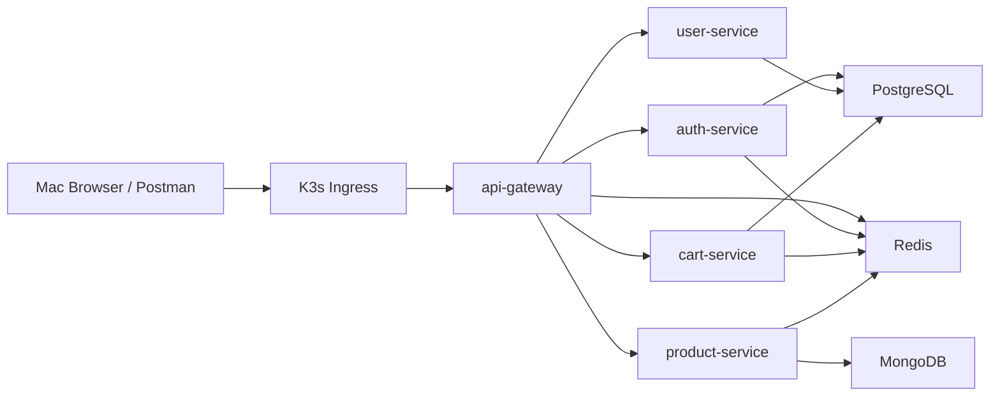
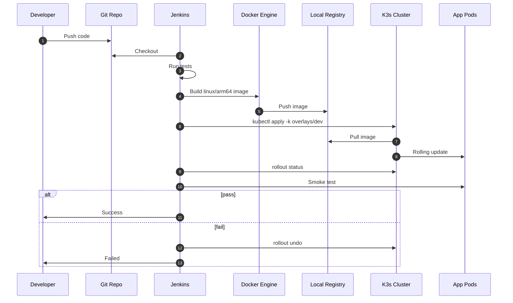
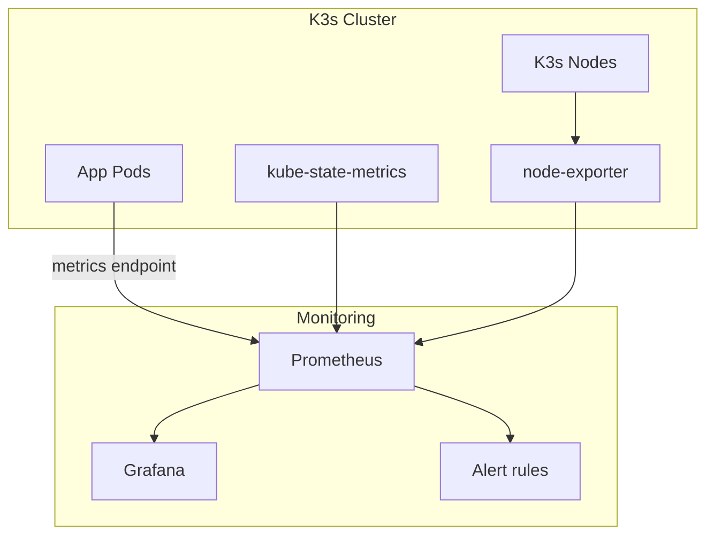
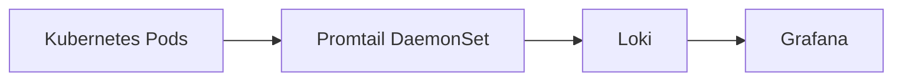

# Triển Khai On-Prem Lab 3 VM Bằng UTM, Ubuntu 22.04 Và K3s

Tài liệu này là plan triển khai chi tiết cho MacBook Air M1 16GB RAM, hiện còn khoảng `85,54GB` dung lượng trống. Mục tiêu là mô phỏng cách một dự án microservices thật được vận hành bởi role DevOps: tạo VM, dựng Kubernetes, build image, push registry, deploy app, quan sát metrics/logs, smoke test và rollback.

Phương án chính dùng 3 VM:

- `vm-k3s-cp-01`: Kubernetes control-plane.
- `vm-k3s-worker-01`: Kubernetes worker chạy app + data store.
- `vm-devops-01`: Jenkins + Docker Registry + công cụ deploy + monitoring/logging nhẹ.

Không triển khai full production thật trên laptop. Lab này ưu tiên mô phỏng đúng quy trình vận hành production với tài nguyên vừa đủ.

## 1. Điều Kiện Máy Hiện Tại

Theo ảnh dung lượng bạn gửi:

| Hạng mục | Giá trị |
|---|---:|
| Tổng disk Macintosh HD | `245,11GB` |
| Đã dùng | `159,57GB` |
| Còn trống | `85,54GB` |
| RAM máy | `16GB` |
| Chip | Apple Silicon M1 |
| Công cụ VM | UTM |
| OS trong VM | Ubuntu Server 22.04 ARM64 |

Nguyên tắc disk:

- Tổng disk cấp cho VM chỉ nên khoảng `60-65GB`.
- Luôn giữ lại ít nhất `15-20GB` cho macOS, IDE, browser, swap, cache và file tạm.
- Không tạo snapshot UTM lúc đầu.
- Nếu disk Mac xuống dưới `15GB`, dừng lab và dọn image/log trước khi build tiếp.

## 2. Sơ Đồ Tổng Quan



## 3. Vì Sao Chọn 3 VM

Thiết kế 6 VM ban đầu rất đúng về mặt role thực tế, nhưng quá nặng cho máy hiện tại. Với 3 VM, bạn vẫn học được các mảng DevOps quan trọng:

| Kỹ năng DevOps | Có học được không | Ghi chú |
|---|---|---|
| Provision VM | Có | UTM + Ubuntu Server |
| Linux server administration | Có | SSH, package, service, disk |
| Kubernetes bootstrap | Có | K3s server + agent |
| CI/CD | Có | Jenkins chạy ngoài cluster |
| Container registry | Có | Docker Registry nội bộ |
| Kubernetes deployment | Có | Kustomize + kubectl |
| Config/Secret management | Có | ConfigMap + Secret |
| Health check/probes | Có | readiness/liveness |
| Monitoring | Có | Prometheus/Grafana nhẹ |
| Logging | Có | Loki/Promtail nhẹ |
| Rollback | Có | `kubectl rollout undo` |
| Backup/restore | Có | PostgreSQL/Mongo/MinIO demo |
| HA worker scheduling | Chưa đầy đủ | Cần thêm worker thứ hai sau này |

## 4. Tài Nguyên VM

### Cấu hình chính

| VM | Role | CPU | RAM | Disk | Ghi chú |
|---|---:|---:|---:|---:|---|
| `vm-k3s-cp-01` | K3s control-plane | 2 | 2GB | 14GB | Chỉ chạy control-plane và system pod |
| `vm-k3s-worker-01` | K3s worker | 3 | 4GB | 26GB | Chạy app + PostgreSQL/Mongo/Redis/Kafka/MinIO |
| `vm-devops-01` | DevOps tools | 2 | 3GB | 22GB | Jenkins, Registry, kubectl, kustomize, Docker |

Tổng VM:

| Tài nguyên | Tổng |
|---|---:|
| CPU cấp cho VM | 7 vCPU |
| RAM cấp cho VM | 9GB |
| Disk cấp cho VM | 62GB |
| Disk còn lại cho macOS/cache | khoảng 20GB |

### Giới hạn vận hành

- Không bật tất cả backend services cùng lúc ngay ngày đầu.
- Không dùng ELK. Dùng Loki.
- Không dùng Harbor. Dùng Docker Registry.
- Không chạy nhiều replica.
- Không dùng Ubuntu Desktop trong VM.
- Không build image liên tục mà không prune Docker.

## 5. Sơ Đồ Công Nghệ



### 5.1. Sơ Đồ CI/CD Hệ Thống Theo Mô Hình Tham Khảo

Sơ đồ dưới đây vẽ lại luồng trong hình bạn gửi, nhưng điều chỉnh cho lab 3 VM của dự án này. Trong giai đoạn đầu, nên chạy Jenkins + Docker Registry + K3s trước. SonarQube và Argo CD được đặt là optional/nâng cao vì chúng sẽ ăn thêm RAM/disk.



Luồng CI:

1. Developer push code lên GitHub.
2. Jenkins CI job pull code.
3. Chạy test theo service.
4. Chạy dependency/security scan.
5. Build image `linux/arm64`.
6. Scan image.
7. Push image lên local registry `192.168.64.20:5000`.

Luồng CD:

1. Jenkins CD job nhận image tag mới.
2. Update image tag trong Kustomize overlay.
3. Giai đoạn đầu: Jenkins chạy `kubectl apply -k`.
4. Giai đoạn nâng cao: Jenkins commit manifest, Argo CD pull GitHub và sync xuống K3s.
5. Kubernetes pull image từ local registry và rolling update pod.
6. Prometheus/Grafana/Loki quan sát metrics và logs.
7. Jenkins hoặc Grafana gửi notification nếu pipeline/deployment lỗi.

Khuyến nghị cho máy hiện tại:

- Bắt buộc trước: Jenkins, Docker, local registry, K3s, Trivy.
- Có thể thêm sau: OWASP Dependency Check.
- Nên để sau khi lab ổn định: SonarQube, Argo CD.
- Không cài đồng thời SonarQube + Argo CD + full monitoring nếu Mac còn dưới `25GB` trống.

## 6. Quy Ước IP Và Hostname

Bạn có thể dùng IP khác tùy UTM network, nhưng nên giữ một bảng cố định.

| Hostname | IP ví dụ | Vai trò |
|---|---|---|
| `vm-k3s-cp-01` | `192.168.64.10` | K3s control-plane |
| `vm-k3s-worker-01` | `192.168.64.11` | K3s worker |
| `vm-devops-01` | `192.168.64.20` | Jenkins + registry |

Nếu UTM Shared Network không cho đặt IP tĩnh dễ dàng, bạn có thể bắt đầu bằng DHCP, sau đó ghi lại IP bằng:

```bash
ip addr
hostname -I
```

Khi đã cần ổn định hơn, chuyển sang static IP bằng Netplan trên từng VM. Tên interface có thể là `enp0s1`, `ens3` hoặc tên khác, cần kiểm tra trước bằng `ip link`.

Ví dụ Netplan:

```yaml
network:
  version: 2
  ethernets:
    enp0s1:
      dhcp4: no
      addresses:
        - 192.168.64.10/24
      routes:
        - to: default
          via: 192.168.64.1
      nameservers:
        addresses:
          - 1.1.1.1
          - 8.8.8.8
```

Áp dụng:

```bash
sudo netplan try
sudo netplan apply
```

## 7. Tạo VM Trong UTM

Tạo 3 VM bằng UTM:

1. Chọn `Create a New Virtual Machine`.
2. Chọn `Virtualize`, không chọn `Emulate`.
3. Chọn `Linux`.
4. Chọn ISO Ubuntu Server 22.04 ARM64.
5. Cấu hình CPU/RAM/disk đúng bảng ở phần 4.
6. Network chọn `Shared Network` trước.
7. Trong lúc cài Ubuntu, bật `Install OpenSSH server`.
8. Không cài GUI.
9. Không tạo snapshot.

Sau khi cài xong, đặt hostname:

```bash
sudo hostnamectl set-hostname vm-k3s-cp-01
```

Thay hostname tương ứng trên từng VM:

```bash
sudo hostnamectl set-hostname vm-k3s-worker-01
sudo hostnamectl set-hostname vm-devops-01
```

Thêm `/etc/hosts` trên cả 3 VM:

```txt
192.168.64.10 vm-k3s-cp-01
192.168.64.11 vm-k3s-worker-01
192.168.64.20 vm-devops-01
```

## 8. Bootstrap Ubuntu 22.04 Trên Từng VM

Chạy trên cả 3 VM:

```bash
sudo apt update
sudo apt -y upgrade
sudo apt -y install curl wget git vim htop net-tools ca-certificates gnupg lsb-release openssh-server unzip jq
sudo systemctl enable --now ssh
```

Kiểm tra tài nguyên:

```bash
free -h
df -h
nproc
ip addr
```

Từ Mac, test SSH:

```bash
ssh <user>@192.168.64.10
ssh <user>@192.168.64.11
ssh <user>@192.168.64.20
```

Gợi ý tạo `~/.ssh/config` trên Mac:

```sshconfig
Host k3s-cp
  HostName 192.168.64.10
  User ubuntu

Host k3s-worker
  HostName 192.168.64.11
  User ubuntu

Host devops
  HostName 192.168.64.20
  User ubuntu
```

## 9. Chuẩn Bị Repo Cho ARM64

Repo hiện có nhiều Dockerfile Go hard-code:

```dockerfile
GOARCH=amd64
```

Trên Ubuntu ARM64 VM, cần sửa sang multi-arch:

```dockerfile
ARG TARGETOS=linux
ARG TARGETARCH
RUN CGO_ENABLED=0 GOOS=$TARGETOS GOARCH=$TARGETARCH go build -trimpath -ldflags="-s -w" -o /service ./cmd/server
```

Việc này nên làm trước khi Jenkins build image. Nếu chưa sửa, image có thể build ra binary `amd64`, không chạy native trên worker ARM64.

Các service nên sửa trước:

- `services/api-gateway/Dockerfile`
- `services/user-service/Dockerfile`
- `services/product-service/Dockerfile`
- `services/cart-service/Dockerfile`
- `services/auth-service/Dockerfile` không cần `GOARCH`, nhưng cần kiểm tra image Node chạy ARM64.

## 10. Cài K3s Cluster

### 10.1. Cài control-plane

Chạy trên `vm-k3s-cp-01`:

```bash
curl -sfL https://get.k3s.io | sh -s - server \
  --write-kubeconfig-mode 644 \
  --node-name vm-k3s-cp-01
```

Kiểm tra:

```bash
sudo systemctl status k3s --no-pager
kubectl get nodes -o wide
kubectl get pods -A
```

Lấy token join worker:

```bash
sudo cat /var/lib/rancher/k3s/server/node-token
```

### 10.2. Cài worker

Chạy trên `vm-k3s-worker-01`:

```bash
curl -sfL https://get.k3s.io | K3S_URL=https://192.168.64.10:6443 K3S_TOKEN=<NODE_TOKEN> sh -s - agent \
  --node-name vm-k3s-worker-01
```

Quay lại control-plane kiểm tra:

```bash
kubectl get nodes -o wide
kubectl get pods -A
```

Kỳ vọng:

```txt
vm-k3s-cp-01       Ready   control-plane,master
vm-k3s-worker-01   Ready   <none>
```

### 10.3. Label node

Chạy trên control-plane:

```bash
kubectl label node vm-k3s-worker-01 node-role=app
kubectl label node vm-k3s-worker-01 storage-role=lab-data
```

Vì chỉ có 1 worker, app và data store sẽ cùng nằm trên worker này. Control-plane ưu tiên để chạy control-plane/system pod.

## 11. Copy Kubeconfig Sang VM DevOps

Trên `vm-k3s-cp-01`:

```bash
sudo cat /etc/rancher/k3s/k3s.yaml
```

Copy nội dung sang `vm-devops-01`:

```bash
mkdir -p ~/.kube
vim ~/.kube/config
chmod 600 ~/.kube/config
```

Sửa server trong kubeconfig từ:

```yaml
server: https://127.0.0.1:6443
```

thành:

```yaml
server: https://192.168.64.10:6443
```

Trên `vm-devops-01`, cài `kubectl` qua K3s binary hoặc package tùy bạn. Cách đơn giản:

```bash
curl -LO "https://dl.k8s.io/release/stable.txt"
KUBECTL_VERSION=$(cat stable.txt)
curl -LO "https://dl.k8s.io/release/${KUBECTL_VERSION}/bin/linux/arm64/kubectl"
chmod +x kubectl
sudo mv kubectl /usr/local/bin/kubectl
rm stable.txt
kubectl get nodes
```

Nếu command trên lỗi vì network hoặc version, cài `kubectl` theo tài liệu Kubernetes chính thức rồi chạy lại `kubectl get nodes`.

## 12. Cài Docker Trên VM DevOps

Chạy trên `vm-devops-01`. Cài theo Docker apt repository:

```bash
sudo apt update
sudo apt -y install ca-certificates curl gnupg
sudo install -m 0755 -d /etc/apt/keyrings
curl -fsSL https://download.docker.com/linux/ubuntu/gpg | sudo gpg --dearmor -o /etc/apt/keyrings/docker.gpg
sudo chmod a+r /etc/apt/keyrings/docker.gpg
echo \
  "deb [arch=$(dpkg --print-architecture) signed-by=/etc/apt/keyrings/docker.gpg] https://download.docker.com/linux/ubuntu \
  $(. /etc/os-release && echo "$VERSION_CODENAME") stable" | \
  sudo tee /etc/apt/sources.list.d/docker.list > /dev/null
sudo apt update
sudo apt -y install docker-ce docker-ce-cli containerd.io docker-buildx-plugin docker-compose-plugin
sudo usermod -aG docker $USER
```

Logout/login lại SSH rồi kiểm tra:

```bash
docker version
docker buildx version
docker compose version
```

Dọn Docker định kỳ:

```bash
docker system df
docker system prune -af
```

## 13. Cài Local Docker Registry

Chạy trên `vm-devops-01`:

```bash
mkdir -p ~/registry-data
docker run -d \
  --name registry \
  --restart unless-stopped \
  -p 5000:5000 \
  -v ~/registry-data:/var/lib/registry \
  registry:2
```

Kiểm tra:

```bash
curl http://localhost:5000/v2/_catalog
curl http://192.168.64.20:5000/v2/_catalog
```

Vì đây là registry HTTP nội bộ cho lab, K3s nodes cần được cấu hình insecure registry.

Trên `vm-k3s-cp-01` và `vm-k3s-worker-01`, tạo file:

```bash
sudo mkdir -p /etc/rancher/k3s
sudo tee /etc/rancher/k3s/registries.yaml > /dev/null <<'YAML'
mirrors:
  "192.168.64.20:5000":
    endpoint:
      - "http://192.168.64.20:5000"
YAML
```

Restart K3s:

Trên control-plane:

```bash
sudo systemctl restart k3s
```

Trên worker:

```bash
sudo systemctl restart k3s-agent
```

Test pull bằng pod tạm sau khi có image trong registry.

## 14. Cài Jenkins Trên VM DevOps

Để nhẹ và dễ dọn, lab này chạy Jenkins bằng Docker container thay vì cài trực tiếp bằng apt.

Tạo volume:

```bash
docker volume create jenkins_home
```

Chạy Jenkins:

```bash
docker run -d \
  --name jenkins \
  --restart unless-stopped \
  -p 8080:8080 \
  -p 50000:50000 \
  -v jenkins_home:/var/jenkins_home \
  -v /var/run/docker.sock:/var/run/docker.sock \
  -v $HOME/.kube:/var/jenkins_home/.kube \
  -u root \
  jenkins/jenkins:lts-jdk21
```

Ghi chú bảo mật:

- Mount Docker socket và chạy Jenkins container bằng `root` chỉ phù hợp cho lab cá nhân.
- Production thật nên dùng agent riêng, least privilege, credential isolation và registry có TLS/auth.

Lấy initial password:

```bash
docker exec jenkins cat /var/jenkins_home/secrets/initialAdminPassword
```

Mở Jenkins trên Mac:

```txt
http://192.168.64.20:8080
```

Plugin nên cài:

- Git.
- Pipeline.
- Docker Pipeline.
- Credentials Binding.
- Kubernetes CLI hoặc dùng shell `kubectl`.

## 15. Namespace Và Layout Kubernetes

Tạo namespace:

```bash
kubectl create namespace ecommerce-dev
kubectl create namespace monitoring
kubectl create namespace logging
```

Sơ đồ namespace:



## 16. Chiến Lược Deploy Theo Slice

Vì chỉ có 1 worker 4GB RAM, không deploy tất cả service ngay.

### Slice 1: Nền tảng tối thiểu

Deploy trước:

- PostgreSQL.
- Redis.
- MongoDB.
- API Gateway.
- `auth-service`.
- `user-service`.
- `product-service`.
- `cart-service`.

Mục tiêu:

- Test K3s deploy.
- Test registry pull.
- Test API Gateway health.
- Test service-to-data-store.

### Slice 2: Order flow

Thêm:

- Kafka single broker.
- `order-service`.
- `inventory-service`.
- `payment-service`.

Mục tiêu:

- Test event flow cơ bản.
- Test outbox/consumer logs.
- Test rollback khi service lỗi.

### Slice 3: Supporting services

Thêm từng service một:

- `shipping-service`.
- `notification-service`.
- `analytics-service`.
- `review-service`.
- `media-service`.

### Slice 4: Realtime/video

Chỉ bật khi còn RAM/disk:

- `chat-service`.
- `live-service`.
- MediaMTX nếu cần demo livestream.

## 17. Sơ Đồ Deploy Slice 1



## 18. Cấu Trúc Manifest Nên Tạo

Hiện `infrastructure/k3s` trong repo đang là placeholder. Nên triển khai theo Kustomize:

```txt
infrastructure/k3s/
  base/
    namespace.yaml
    configmap.yaml
    secret.yaml
    data/
      postgres.yaml
      redis.yaml
      mongo.yaml
      kafka.yaml
      minio.yaml
    apps/
      api-gateway.yaml
      auth-service.yaml
      user-service.yaml
      product-service.yaml
      cart-service.yaml
    ingress/
      api-gateway-ingress.yaml
    kustomization.yaml
  overlays/
    dev/
      kustomization.yaml
      resource-limits.yaml
      replicas-patch.yaml
```

Quy tắc:

- `base` chứa manifest dùng chung.
- `overlays/dev` chứa image tag, resource nhỏ, replica = 1.
- Secret lab có thể dùng giá trị dev, nhưng không dùng secret production.
- Không import runtime code giữa services.
- Không sửa shared contract nếu chỉ đang làm deploy lab.

## 19. ConfigMap Và Secret Mẫu

ConfigMap:

```yaml
apiVersion: v1
kind: ConfigMap
metadata:
  name: ecommerce-config
  namespace: ecommerce-dev
data:
  APP_ENV: development
  API_PREFIX: api/v1
  POSTGRES_HOST: postgres
  POSTGRES_PORT: "5432"
  REDIS_URL: redis://redis:6379
  MONGODB_PRODUCT_URL: mongodb://mongo:27017/ecommerce_product
  KAFKA_BROKERS: kafka:9092
  MINIO_ENDPOINT: minio:9000
```

Secret:

```yaml
apiVersion: v1
kind: Secret
metadata:
  name: ecommerce-secret
  namespace: ecommerce-dev
type: Opaque
stringData:
  JWT_ACCESS_SECRET: dev-shared-jwt-access-secret-min-32-chars
  JWT_SECRET: dev-shared-jwt-access-secret-min-32-chars
  POSTGRES_USER: postgres
  POSTGRES_PASSWORD: postgres
  MINIO_ROOT_USER: minioadmin
  MINIO_ROOT_PASSWORD: minioadmin
```

## 20. Resource Requests/Limits Cho Lab

Giữ thấp để không làm worker chết vì RAM.

| Workload | Request | Limit |
|---|---:|---:|
| Go service | `50m CPU / 64Mi RAM` | `300m CPU / 256Mi RAM` |
| API Gateway | `100m CPU / 128Mi RAM` | `500m CPU / 384Mi RAM` |
| NestJS service | `100m CPU / 256Mi RAM` | `500m CPU / 512Mi RAM` |
| PostgreSQL | `150m CPU / 384Mi RAM` | `800m CPU / 768Mi RAM` |
| MongoDB | `150m CPU / 384Mi RAM` | `800m CPU / 768Mi RAM` |
| Redis | `50m CPU / 96Mi RAM` | `200m CPU / 192Mi RAM` |
| Kafka single broker | `300m CPU / 768Mi RAM` | `1 CPU / 1.25Gi RAM` |
| MinIO | `100m CPU / 192Mi RAM` | `500m CPU / 384Mi RAM` |
| Prometheus | `100m CPU / 384Mi RAM` | `500m CPU / 768Mi RAM` |
| Grafana | `50m CPU / 128Mi RAM` | `300m CPU / 256Mi RAM` |
| Loki | `100m CPU / 256Mi RAM` | `500m CPU / 512Mi RAM` |

Nếu pod Pending hoặc OOMKilled:

```bash
kubectl -n ecommerce-dev describe pod <pod-name>
kubectl top nodes
kubectl top pods -A
```

## 21. Probes Chuẩn

API Gateway:

```yaml
livenessProbe:
  httpGet:
    path: /live
    port: 8080
readinessProbe:
  httpGet:
    path: /ready
    port: 8080
```

Go domain services:

```yaml
livenessProbe:
  httpGet:
    path: /api/v1/live
    port: 8080
readinessProbe:
  httpGet:
    path: /api/v1/ready
    port: 8080
```

NestJS (`auth-service` only):

```yaml
livenessProbe:
  httpGet:
    path: /api/v1/health
    port: 8080
readinessProbe:
  httpGet:
    path: /api/v1/health
    port: 8080
```

Nếu service thực tế khác path, kiểm tra router/health controller trước khi apply.

## 22. Build Và Push Image Thủ Công Trước Khi Có Jenkins

Trên `vm-devops-01`, clone repo:

```bash
git clone <repo-url> ecommerce-microservices
cd ecommerce-microservices
```

Build thử API Gateway:

```bash
docker buildx build \
  --platform linux/arm64 \
  -t 192.168.64.20:5000/ecommerce/api-gateway:dev \
  --push \
  services/api-gateway
```

Build thử `user-service`:

```bash
docker buildx build \
  --platform linux/arm64 \
  -t 192.168.64.20:5000/ecommerce/user-service:dev \
  --push \
  services/user-service
```

Kiểm tra registry:

```bash
curl http://192.168.64.20:5000/v2/_catalog
```

## 23. Deploy Bằng Kustomize

Ví dụ `infrastructure/k3s/overlays/dev/kustomization.yaml`:

```yaml
apiVersion: kustomize.config.k8s.io/v1beta1
kind: Kustomization
namespace: ecommerce-dev
resources:
  - ../../base
images:
  - name: api-gateway
    newName: 192.168.64.20:5000/ecommerce/api-gateway
    newTag: dev
  - name: user-service
    newName: 192.168.64.20:5000/ecommerce/user-service
    newTag: dev
patches:
  - path: resource-limits.yaml
```

Apply:

```bash
kubectl apply -k infrastructure/k3s/overlays/dev
kubectl -n ecommerce-dev get pods -o wide
kubectl -n ecommerce-dev get svc
```

Wait rollout:

```bash
kubectl -n ecommerce-dev rollout status deploy/api-gateway --timeout=180s
kubectl -n ecommerce-dev rollout status deploy/user-service --timeout=180s
```

Logs:

```bash
kubectl -n ecommerce-dev logs deploy/api-gateway --tail=100
kubectl -n ecommerce-dev logs deploy/user-service --tail=100
```

## 24. Expose API Gateway

K3s mặc định có Traefik. Với lab này, dùng Traefik trước cho nhẹ.

Ingress mẫu:

```yaml
apiVersion: networking.k8s.io/v1
kind: Ingress
metadata:
  name: api-gateway
  namespace: ecommerce-dev
spec:
  rules:
    - host: ecommerce.local
      http:
        paths:
          - path: /
            pathType: Prefix
            backend:
              service:
                name: api-gateway
                port:
                  number: 8080
```

Trên Mac, thêm `/etc/hosts`:

```txt
192.168.64.11 ecommerce.local
```

Nếu Traefik NodePort/LoadBalancer không expose đúng IP trong UTM, dùng port-forward lúc đầu:

```bash
kubectl -n ecommerce-dev port-forward svc/api-gateway 12000:8080
```

Test:

```bash
curl http://localhost:12000/health
curl http://localhost:12000/ready
```

## 25. Jenkins Pipeline

Sơ đồ pipeline:



Pipeline parameter nên có:

| Parameter | Ví dụ |
|---|---|
| `SERVICE_NAME` | `api-gateway` |
| `SERVICE_PATH` | `services/api-gateway` |
| `IMAGE_TAG` | Git SHA |
| `ENVIRONMENT` | `dev` |

Jenkinsfile mẫu:

```groovy
pipeline {
  agent any

  parameters {
    string(name: 'SERVICE_NAME', defaultValue: 'api-gateway')
    string(name: 'SERVICE_PATH', defaultValue: 'services/api-gateway')
    string(name: 'ENVIRONMENT', defaultValue: 'dev')
  }

  environment {
    REGISTRY = '192.168.64.20:5000'
    IMAGE_TAG = "${env.BUILD_NUMBER}"
    KUBECONFIG = '/var/jenkins_home/.kube/config'
  }

  stages {
    stage('Checkout') {
      steps {
        checkout scm
      }
    }

    stage('Test') {
      steps {
        sh '''
          if [ -f "$SERVICE_PATH/go.mod" ]; then
            cd "$SERVICE_PATH"
            go test ./...
          elif [ -f "$SERVICE_PATH/package.json" ]; then
            npm --prefix "$SERVICE_PATH" test -- --runInBand || true
          fi
        '''
      }
    }

    stage('Build and Push') {
      steps {
        sh '''
          docker buildx build \
            --platform linux/arm64 \
            -t "$REGISTRY/ecommerce/$SERVICE_NAME:$IMAGE_TAG" \
            --push \
            "$SERVICE_PATH"
        '''
      }
    }

    stage('Deploy') {
      steps {
        sh '''
          cd infrastructure/k3s/overlays/dev
          kustomize edit set image "$SERVICE_NAME=$REGISTRY/ecommerce/$SERVICE_NAME:$IMAGE_TAG"
          kubectl apply -k .
          kubectl -n ecommerce-dev rollout status deploy/$SERVICE_NAME --timeout=180s
        '''
      }
    }

    stage('Smoke Test') {
      steps {
        sh '''
          kubectl -n ecommerce-dev get pods
          curl -fsS http://api-gateway.ecommerce-dev.svc.cluster.local:8080/health || exit 1
        '''
      }
    }
  }

  post {
    failure {
      sh '''
        kubectl -n ecommerce-dev rollout undo deploy/$SERVICE_NAME || true
      '''
    }
  }
}
```

Ghi chú: Jenkinsfile trên là mẫu để học. Khi triển khai thật trong repo, cần chỉnh theo workspace hiện có, command test thật của từng service, và cách Jenkins checkout repo.

## 26. Monitoring Nhẹ

Với 3 VM, monitoring nên bắt đầu tối thiểu:

- metrics-server.
- Prometheus.
- Grafana.
- node-exporter.
- kube-state-metrics.

Sơ đồ:



Dashboard cần có:

- Node CPU/RAM/disk.
- Pod restart count.
- Deployment replicas available/unavailable.
- API Gateway request rate/latency/status nếu metrics đã expose.
- PostgreSQL/Mongo/Redis/Kafka availability.

Alert lab:

- Node disk > 85%.
- Node memory > 85%.
- Pod restart liên tục.
- Deployment unavailable > 2 phút.
- API Gateway health fail.

## 27. Logging Nhẹ

Không dùng ELK. Dùng Loki + Promtail.



Log queries nên dùng:

```logql
{namespace="ecommerce-dev"}
{namespace="ecommerce-dev", app="api-gateway"}
{namespace="ecommerce-dev"} |= "error"
{namespace="ecommerce-dev"} |= "panic"
{namespace="ecommerce-dev"} |= "outbox"
```

## 28. Backup Và Restore Demo

### PostgreSQL

Backup:

```bash
kubectl -n ecommerce-dev exec deploy/postgres -- \
  pg_dump -U postgres -d postgres > postgres-backup.sql
```

Restore:

```bash
kubectl -n ecommerce-dev exec -i deploy/postgres -- \
  psql -U postgres -d postgres < postgres-backup.sql
```

### MongoDB

Backup:

```bash
kubectl -n ecommerce-dev exec deploy/mongo -- \
  mongodump --archive=/tmp/mongo.archive
kubectl -n ecommerce-dev cp mongo-xxxxx:/tmp/mongo.archive ./mongo.archive
```

Restore:

```bash
kubectl -n ecommerce-dev cp ./mongo.archive mongo-xxxxx:/tmp/mongo.archive
kubectl -n ecommerce-dev exec deploy/mongo -- \
  mongorestore --archive=/tmp/mongo.archive
```

Tên pod Mongo cần lấy bằng:

```bash
kubectl -n ecommerce-dev get pods -l app=mongo
```

## 29. Rollback Và Incident Drill

Rollback image:

```bash
kubectl -n ecommerce-dev rollout history deploy/api-gateway
kubectl -n ecommerce-dev rollout undo deploy/api-gateway
kubectl -n ecommerce-dev rollout status deploy/api-gateway
```

Restart pod:

```bash
kubectl -n ecommerce-dev delete pod -l app=api-gateway
kubectl -n ecommerce-dev get pods -w
```

Xem sự cố:

```bash
kubectl -n ecommerce-dev describe pod <pod-name>
kubectl -n ecommerce-dev logs <pod-name> --previous
kubectl get events -A --sort-by=.lastTimestamp
```

Drill nên làm:

- Deploy image tag sai rồi rollback.
- Tắt Redis và xem app lỗi thế nào.
- Tắt Kafka và quan sát consumer/producer log.
- Làm full disk giả lập trên worker rồi xem alert.
- Kill pod API Gateway và quan sát Deployment tạo lại.

## 30. Checklist Triển Khai Từ Đầu Đến Cuối

### Ngày 1: VM và SSH

- Tạo 3 VM trong UTM.
- Cài Ubuntu Server 22.04 ARM64.
- Bật OpenSSH.
- Đặt hostname.
- Cấu hình IP.
- SSH được từ Mac vào cả 3 VM.

### Ngày 2: K3s

- Cài K3s server trên control-plane.
- Join worker.
- `kubectl get nodes` thấy 2 node Ready.
- Label worker.
- Copy kubeconfig sang DevOps VM.

### Ngày 3: DevOps VM

- Cài Docker.
- Chạy Docker Registry.
- Chạy Jenkins.
- Jenkins truy cập được từ Mac.
- Jenkins chạy được `docker version` và `kubectl get nodes`.

### Ngày 4: Image đầu tiên

- Sửa Dockerfile Go multi-arch.
- Build/push `api-gateway`.
- Build/push `user-service`.
- Registry thấy image.

### Ngày 5: K8s manifests

- Tạo namespace.
- Tạo ConfigMap/Secret.
- Tạo Deployment/Service cho PostgreSQL, Redis, MongoDB.
- Tạo Deployment/Service cho API Gateway và 1 service.
- Apply bằng Kustomize.

### Ngày 6: Jenkins deploy

- Tạo Jenkins pipeline.
- Build image từ Jenkins.
- Push registry.
- Deploy bằng `kubectl apply -k`.
- Smoke test.
- Rollback thử.

### Ngày 7: Observability

- Cài Prometheus/Grafana nhẹ.
- Cài Loki/Promtail.
- Tạo dashboard cơ bản.
- Viết alert cơ bản.
- Làm incident drill.

## 31. Definition Of Done

Lab đạt mục tiêu khi:

- 3 VM chạy ổn, Mac còn ít nhất 15GB trống.
- K3s cluster có 2 node Ready.
- Jenkins chạy ở `vm-devops-01`.
- Local registry chạy ở `192.168.64.20:5000`.
- Jenkins build được ít nhất 1 Go service và 1 NestJS service.
- Image pull được từ K3s worker.
- `api-gateway` expose được qua port-forward hoặc Ingress.
- Ít nhất 4 service trong Slice 1 chạy Ready.
- PostgreSQL, MongoDB, Redis chạy Ready.
- Smoke test health/ready pass.
- Rollback thử thành công.
- Grafana xem được metrics cơ bản.
- Loki xem được log theo namespace/service.

## 32. Lưu Ý Riêng Cho Dự Án Này

- `docker-compose.yml` ở root là tài liệu tham chiếu tốt cho env var và service dependency.
- `infrastructure/k3s` hiện có nhiều file placeholder, cần viết manifest thật trước khi apply.
- `cicd/Jenkinsfile` hiện cần bổ sung nội dung thật.
- API Gateway có `/health`, `/ready`, `/live`, `/metrics`.
- Nhiều Go service có `/api/v1/health`, `/api/v1/ready`, `/api/v1/live`.
- Kafka nên là single broker trong lab.
- MinIO chỉ bật khi test media-service.
- MediaMTX/live-service để sau vì có thể làm lab nặng hơn.

## 33. Nguồn Tham Khảo Chính

- K3s Quick Start: https://docs.k3s.io/quick-start
- K3s configuration: https://docs.k3s.io/installation/configuration
- Docker Engine on Ubuntu: https://docs.docker.com/engine/install/ubuntu/
- Jenkins Linux installation: https://www.jenkins.io/doc/book/installing/linux/
- Jenkins Debian stable packages: https://pkg.jenkins.io/debian-stable/
