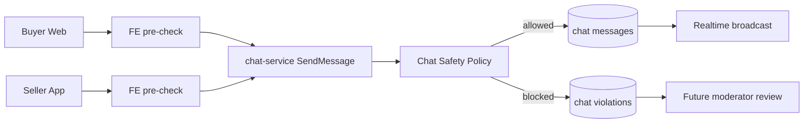
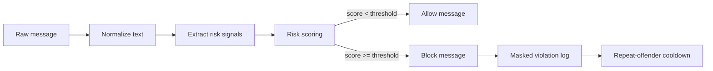

# Chat Safety Guardrails Implementation Plan

Status: Phases 1-6 implemented; rollout/manual verification pending
Last updated: 2026-05-20

## 1. Goal

Triển khai lớp kiểm soát nội dung chat giữa buyer và seller để hạn chế trao đổi thông tin liên hệ, địa chỉ, tài khoản thanh toán hoặc điều hướng giao dịch ra ngoài sàn.

Mục tiêu chính:

- Buyer và seller vẫn có thể hỏi đáp về sản phẩm, đơn hàng, vận chuyển và bảo hành trong phạm vi sàn.
- Không cho gửi số điện thoại, email, địa chỉ, link ngoài, tài khoản ngân hàng hoặc lời mời giao dịch ngoài sàn.
- Backend là nơi chặn chính để không bị bypass bằng cách gọi API trực tiếp.
- Frontend cảnh báo sớm để người dùng hiểu vì sao không gửi được.
- Có log vi phạm để sau này moderator hoặc hệ thống có thể xử lý tài khoản lặp lại hành vi xấu.

Non-goals giai đoạn đầu:

- Không dùng AI moderation ở MVP.
- Không tự động khóa tài khoản ngay từ đầu.
- Không đọc/chặn tin nhắn cũ đã tồn tại.
- Không thay đổi tên hiển thị buyer/seller trong chat.
- Không tạo thêm service mới.

## 2. Scope

Backend owner:

- `services/chat-service`
- Có thể cần cập nhật `shared` nếu sau này muốn chuẩn hóa contract, nhưng MVP chưa bắt buộc.

Frontend owner:

- `frontend/apps/buyer-web`
- `frontend/apps/seller`

Moderator owner, phase sau:

- `frontend/apps/moderator`
- Có thể thêm API route moderator nếu cần xem log vi phạm.

## 3. High-Level Flow

```txt
Người dùng nhập tin nhắn
-> FE kiểm tra nhanh bằng rule nhẹ
-> nếu nghi ngờ vi phạm: hiện cảnh báo và không gửi
-> nếu hợp lệ: gửi API chat-service
-> chat-service kiểm tra rule chính
-> hợp lệ: lưu message và broadcast realtime
-> vi phạm: không lưu message, ghi violation log, trả lỗi rõ ràng
```



## 4. Policy Rules

### 4.1 Detection Strategy

Không dùng regex/keyword thô làm lớp duy nhất vì seller/buyer có thể lách bằng cách chèn dấu, cách chữ, viết không dấu hoặc viết số bằng chữ. Policy nên chạy theo pipeline:

```txt
Raw text
-> normalize
-> extract signals
-> calculate risk score
-> allow/block
-> log masked violation if blocked
-> apply cooldown if repeated
```



### 4.2 Text Normalization

Normalize trước khi detect để chống lách:

- Lowercase.
- Trim và collapse whitespace.
- Bỏ dấu tiếng Việt:
  - `số điện thoại` -> `so dien thoai`
  - `địa chỉ` -> `dia chi`
- Chuẩn hóa ký tự phân cách:
  - `z a l o`, `z.a.l.o`, `z-a-l-o`, `z_a_l_o` -> `zalo`
  - `s đ t`, `s.đ.t`, `s-d-t` -> `sdt`
- Chuẩn hóa chữ số tiếng Việt:
  - `không, khong` -> `0`
  - `một, mot` -> `1`
  - `hai` -> `2`
  - `ba` -> `3`
  - `bốn, bon, tư, tu` -> `4`
  - `năm, nam, lăm, lam` -> `5`
  - `sáu, sau` -> `6`
  - `bảy, bay` -> `7`
  - `tám, tam` -> `8`
  - `chín, chin` -> `9`
- Chuẩn hóa ký tự dễ giả số trong vùng có số:
  - `o`, `O` gần cụm số -> `0`
  - `l`, `i` gần cụm số -> `1`
- Tạo nhiều bản normalized:
  - `normalizedText`: bản còn khoảng trắng để detect cụm từ.
  - `compactText`: bản bỏ khoảng trắng/ký tự phân cách để bắt kiểu lách.
  - `digitStream`: gom chữ số trong từng đoạn ngắn để detect phone.

Ví dụ:

```txt
"kb z a l o mình nha 0 chín 0 một hai ba 4567"
-> normalizedText: "kb zalo minh nha 0 9 0 1 2 3 4567"
-> compactText: "kbzalominhnha0901234567"
-> digitStream: "0901234567"
```

### 4.3 Risk Signals

Mỗi signal có `ruleId`, `score`, `evidenceType`. Một tin nhắn có thể dính nhiều signal.

Blocked/high-risk signals:

- Phone number:
  - `0901234567`
  - `090 123 4567`
  - `090.123.4567`
  - `090-123-4567`
  - `+84901234567`
  - `không chín không một hai ba bốn năm sáu bảy`
  - score đề xuất: `90`
- Email:
  - `name@example.com`
  - score đề xuất: `90`
- External link:
  - `http://`, `https://`, `www.`
  - domain-like text: `abc.com`, `abc.vn`, `abc.net`, `abc.org`
  - score đề xuất: `80`
- External contact platform:
  - `zalo`, `facebook`, `fb`, `messenger`, `telegram`, `tele`, `viber`, `whatsapp`, `instagram`, `ig`, `tiktok inbox`
  - score đề xuất: `60`
- External-contact intent:
  - `kb`, `ket ban`, `add`, `nhan rieng`, `goi minh`, `inbox`, `ib`, `qua app khac`, `lien he ngoai`
  - score đề xuất: `40`
- Off-platform payment:
  - `chuyen khoan`, `ck`, `stk`, `so tai khoan`, `ngan hang`, `bank`, `momo`, `viettelpay`, `zalopay`
  - score đề xuất: `90`
- Address exchange:
  - `dia chi`, `nha toi`, `qua lay`, `giao ngoai`, `ship ngoai`, `toi o`, `den lay`
  - score đề xuất: `70`

### 4.4 Risk Scoring

Không block chỉ vì một keyword yếu. Dùng threshold để chống lách nhưng giảm false positive.

Đề xuất:

```txt
blockThreshold = 80
warnThreshold = 50
```

Examples:

```txt
"zalo" -> 60 -> warn/block tùy strict mode
"kb zalo mình nha" -> 40 + 60 = 100 -> block
"0901234567" -> 90 -> block
"z a l o 0 chín 0..." -> 60 + 90 = 150 -> block
"áo size 42 còn không" -> 0 -> allow
"đơn EMX4000001 giao chưa" -> 0 -> allow
```

Strict mode đề xuất cho marketplace:

- `phone_number`, `email`, `external_link`, `off_platform_payment`: block ngay.
- `external_contact_platform`: block nếu đi kèm intent hoặc lặp lại.
- `address_exchange`: block nếu có từ hành động nhận/giao/lấy trực tiếp.

### 4.5 Blocked Content Categories

Các category cần detect:

- Thông tin liên hệ cá nhân.
- Link hoặc nền tảng chat ngoài.
- Thanh toán/giao dịch ngoài sàn.
- Trao đổi địa chỉ trực tiếp.
- Cố tình lách chính sách bằng cách chèn dấu/cách chữ/viết số bằng chữ.

### 4.6 Allowed Content

Không nên chặn các nội dung hợp lệ:

- Hỏi size, màu, chất liệu, tồn kho.
- Hỏi phí ship trong sàn.
- Hỏi thời gian giao hàng.
- Hỏi chính sách đổi trả.
- Hỏi tình trạng đơn hàng.
- Mã đơn hàng nội bộ của sàn.
- SKU hoặc mã sản phẩm.

### 4.7 Error Message

Thông báo nên ngắn, dễ hiểu:

```txt
Tin nhắn chứa thông tin liên hệ hoặc giao dịch ngoài sàn nên không thể gửi.
```

Frontend có thể hiển thị thêm:

```txt
Bạn chỉ nên trao đổi về sản phẩm, đơn hàng và hỗ trợ mua bán trong eMall.
```

## 5. Backend Design

### 5.1 Add Chat Safety Policy Module

Tạo module trong `services/chat-service`, ví dụ:

```txt
services/chat-service/internal/service/chat_safety.go
services/chat-service/internal/service/chat_safety_test.go
```

API nội bộ đề xuất:

```go
type ChatSafetyDecision struct {
    Allowed    bool
    Action     string
    Score      int
    Reason     string
    RuleID     string
    Signals    []ChatSafetySignal
    MaskedText string
}

type ChatSafetySignal struct {
    RuleID       string
    Score        int
    EvidenceType string
}

func ValidateChatMessage(text string) ChatSafetyDecision
```

Rule ID đề xuất:

- `phone_number`
- `email`
- `external_link`
- `external_contact_platform`
- `external_contact_intent`
- `off_platform_payment`
- `address_exchange`
- `obfuscated_contact`

Helper nội bộ nên tách nhỏ:

```go
func NormalizeChatText(text string) NormalizedChatText
func ExtractChatSafetySignals(normalized NormalizedChatText) []ChatSafetySignal
func ScoreChatSafetySignals(signals []ChatSafetySignal) int
func MaskSensitiveChatText(text string, signals []ChatSafetySignal) string
```

`NormalizedChatText` nên giữ ít nhất:

```go
type NormalizedChatText struct {
    Original       string
    NormalizedText string
    CompactText    string
    DigitStreams   []string
}
```

### 5.2 Enforce In SendMessage

Trong `services/chat-service/internal/service/chat_service.go`:

- Gọi `ValidateChatMessage(req.Text)` trước khi tạo message.
- Nếu `Allowed == false`:
  - Không lưu message vào `messages`.
  - Không broadcast WebSocket.
  - Ghi violation log.
  - Trả `400 BAD_REQUEST` hoặc `422 UNPROCESSABLE_ENTITY`.

Lỗi backend đề xuất:

```json
{
  "code": "CHAT_MESSAGE_BLOCKED",
  "message": "Tin nhắn chứa thông tin liên hệ hoặc giao dịch ngoài sàn nên không thể gửi.",
  "details": {
    "ruleId": "phone_number",
    "score": 90
  }
}
```

### 5.3 Violation Log

MVP có 2 lựa chọn:

Option A, nhẹ nhất:

- Log structured bằng logger hiện tại.
- Chưa tạo collection/table mới.

Option B, tốt hơn cho moderator sau này:

- Tạo collection MongoDB mới trong chat-service: `chat_violations`.

Schema đề xuất:

```txt
id
conversationId
senderId
senderRole
ruleId
score
signals
textPreview
createdAt
```

Lưu ý:

- `textPreview` nên mask bớt dữ liệu nhạy cảm.
- Không lưu nguyên số điện thoại/email nếu không cần thiết.

Ví dụ mask:

```txt
"0901234567" -> "09******67"
"abc@gmail.com" -> "a***@gmail.com"
```

MVP khuyến nghị: làm Option B nếu không quá tốn, vì sau này dễ hiển thị trong moderator.

### 5.4 Repository Changes

Nếu dùng Option B:

- Thêm model/doc cho `chat_violations`.
- Thêm method:

```go
CreateViolation(ctx, input CreateViolationInput) error
ListViolations(ctx, filter ListViolationsFilter) (...)
CountRecentViolations(ctx, senderId string, since time.Time) (...)
```

MVP chỉ cần `CreateViolation`.

### 5.5 Rate/Repeat Handling

Nên thiết kế ngay từ đầu để sau này bật cooldown dễ hơn.

MVP:

- Log mọi lần bị block.
- Đếm số violation gần đây theo `senderId`.

Phase sau hoặc bật bằng config:

- Nếu user vi phạm `>= 3 lần / 10 phút`:
  - Trả lỗi mạnh hơn.
  - Có thể tạm disable gửi chat trong 10 phút.
- Nếu user vi phạm `>= 10 lần / 24 giờ`:
  - Đưa vào moderator review.
  - Có thể giới hạn tần suất gửi chat.

Không nên khóa tài khoản ngay ở MVP.

### 5.6 Config

Không hard-code threshold nếu có thể tránh. Dùng config/env:

```txt
CHAT_SAFETY_BLOCK_THRESHOLD=80
CHAT_SAFETY_WARN_THRESHOLD=50
CHAT_SAFETY_COOLDOWN_ENABLED=false
CHAT_SAFETY_COOLDOWN_LIMIT=3
CHAT_SAFETY_COOLDOWN_WINDOW_MINUTES=10
CHAT_SAFETY_COOLDOWN_DURATION_MINUTES=10
```

## 6. Frontend Design

### 6.1 Shared FE Rule Helper

Tạo helper dùng chung cho buyer-web và seller hoặc copy nhỏ theo app nếu chưa có shared package phù hợp.

Đề xuất nếu muốn gọn:

```txt
frontend/apps/buyer-web/src/lib/chat-safety.ts
frontend/apps/seller/src/lib/chat-safety.ts
```

API:

```ts
export function validateChatText(text: string): {
  allowed: boolean;
  score: number;
  message?: string;
};
```

FE rule không cần hoàn hảo, chỉ để UX tốt hơn. Backend vẫn là nguồn kiểm tra chính.

Lưu ý bảo mật:

- Không cần đưa toàn bộ keyword/rule backend xuống FE.
- FE chỉ nên check nhóm rõ ràng như phone/email/link để cảnh báo sớm.
- Rule chống lách mạnh phải nằm ở backend để người dùng không đọc JS rồi né rule.

### 6.2 Buyer Web Changes

Các nơi cần gắn:

- `frontend/apps/buyer-web/src/components/home/buyer-chat-drawer.tsx`
- `frontend/apps/buyer-web/src/app/chat/page.tsx`

Behavior:

- Khi nhập nội dung bị nghi ngờ:
  - Hiện cảnh báo dưới input.
  - Disable nút gửi hoặc chặn khi bấm gửi.
- Placeholder nên đổi thành:

```txt
Chỉ trao đổi về sản phẩm và đơn hàng trên eMall...
```

### 6.3 Seller App Changes

Các nơi cần gắn:

- `frontend/apps/seller/src/app/customer-care/chat/page.tsx`

Behavior:

- Tương tự buyer.
- Nếu backend trả `CHAT_MESSAGE_BLOCKED`, hiển thị message tiếng Việt dễ hiểu.

### 6.4 Live Chat And Video Comments

Nên áp dụng cùng rule cho:

- `frontend/apps/buyer-web/src/app/live/[sessionId]/page.tsx`
- `frontend/apps/buyer-web/src/app/videos/page.tsx`
- `frontend/apps/seller/src/app/marketing/live-video/page.tsx`

Nhưng có thể đưa vào phase sau nếu muốn giữ MVP nhỏ.

## 7. API Contract

### 7.1 Send Message Error

Áp dụng cho:

```txt
POST /chat/conversations/{id}/messages
WebSocket event send_message
```

HTTP response:

```json
{
  "success": false,
  "error": {
    "code": "CHAT_MESSAGE_BLOCKED",
    "message": "Tin nhắn chứa thông tin liên hệ hoặc giao dịch ngoài sàn nên không thể gửi.",
    "details": {
      "ruleId": "phone_number",
      "score": 90
    }
  }
}
```

WebSocket error:

```json
{
  "type": "error",
  "code": "CHAT_MESSAGE_BLOCKED",
  "message": "Tin nhắn chứa thông tin liên hệ hoặc giao dịch ngoài sàn nên không thể gửi.",
  "details": {
    "ruleId": "phone_number",
    "score": 90
  }
}
```

## 8. Phase Plan

### Phase 1: Backend Policy MVP

Goal:

- Chặn tin nhắn nhạy cảm ở `chat-service`.

Tasks:

- Tạo `chat_safety.go`.
- Implement text normalization:
  - Bỏ dấu tiếng Việt.
  - Chuẩn hóa khoảng trắng/ký tự phân cách.
  - Bắt `z a l o`, `s đ t`, `0 chín 0`.
  - Tạo `normalizedText`, `compactText`, `digitStreams`.
- Implement signal extraction:
  - Phone number.
  - Email.
  - External link.
  - External platform.
  - External contact intent.
  - Off-platform payment.
  - Address exchange.
- Implement risk scoring và threshold.
- Implement masking sensitive text.
- Thêm unit test cho:
  - Phone number.
  - Phone number bị cách/chèn dấu.
  - Phone number viết bằng chữ tiếng Việt.
  - Email.
  - External link.
  - Zalo/Facebook/Telegram bị cách chữ.
  - Bank transfer keywords.
  - Combo intent + platform như `kb zalo`.
  - Valid product questions.
- Gắn vào HTTP `SendMessage`.
- Gắn vào WebSocket `send_message`.
- Trả error code `CHAT_MESSAGE_BLOCKED`.

Validation:

```txt
cd services/chat-service && go test ./...
```

### Phase 2: Violation Logging

Goal:

- Có dữ liệu để biết ai đang cố trao đổi ngoài sàn.

Tasks:

- Thêm collection/table `chat_violations`.
- Thêm repository method `CreateViolation`.
- Khi blocked, lưu:
  - `conversationId`
  - `senderId`
  - `senderRole`
  - `ruleId`
  - `textPreview` đã mask
  - `createdAt`
- Unit test repository/service nếu có memory repo trong test.

Validation:

```txt
cd services/chat-service && go test ./...
```

### Phase 3: Buyer FE Warning

Goal:

- Buyer thấy cảnh báo trước khi gửi.

Tasks:

- Tạo helper `chat-safety.ts`.
- Gắn vào buyer chat drawer.
- Gắn vào buyer chat page.
- Hiển thị warning dưới input.
- Xử lý backend error `CHAT_MESSAGE_BLOCKED`.

Validation:

```txt
npm --workspace frontend/apps/buyer-web run build
```

Manual test:

- Gửi `shop cho mình sdt 0901234567`.
- Gửi `nhắn zalo nhé`.
- Gửi `kb z a l o mình nha 0 chín 0...`.
- Gửi `áo này còn size M không`.

### Phase 4: Seller FE Warning

Goal:

- Seller cũng bị chặn/cảnh báo khi gửi thông tin liên hệ hoặc rủ giao dịch ngoài sàn.

Tasks:

- Tạo helper `chat-safety.ts` trong seller app.
- Gắn vào seller customer-care chat.
- Hiển thị warning dưới input.
- Xử lý backend error `CHAT_MESSAGE_BLOCKED`.

Validation:

```txt
npm --workspace frontend/apps/seller run build
```

Manual test:

- Seller gửi `qua zalo shop tư vấn`.
- Seller gửi `chuyển khoản số tài khoản...`.
- Seller gửi `z.a.l.o shop nha`.
- Seller gửi `sản phẩm còn màu đen`.

### Phase 5: Live Chat And Video Comments

Goal:

- Cùng chính sách áp dụng cho live chat/video comments nếu các luồng này cũng dùng để giao tiếp buyer-seller.

Tasks:

- Xác định service đang nhận live/video comment:
  - `services/live-service`
  - video comment endpoint hiện tại.
- Reuse rule hoặc tạo policy tương đương.
- Gắn FE cảnh báo ở live/video pages.

Validation:

```txt
go test ./... trong service liên quan
npm --workspace frontend/apps/buyer-web run build
npm --workspace frontend/apps/seller run build
```

### Phase 6: Moderator Review

Goal:

- Moderator xem được các vi phạm nhiều lần.

Tasks:

- Thêm API list violations, giới hạn role moderator/admin.
- Thêm trang moderator đơn giản:
  - Filter theo user.
  - Filter theo rule.
  - Filter theo thời gian.
- Hiển thị masked preview, không hiển thị nguyên thông tin nhạy cảm.

Validation:

```txt
npm --workspace frontend/apps/moderator run build
```

## 9. Test Cases

Blocked:

```txt
0901234567
090 123 4567
+84901234567
abc@gmail.com
https://facebook.com/abc
shop nhắn zalo cho mình
cho mình số tài khoản
chuyển khoản ngoài app được không
qua địa chỉ nhà mình lấy
```

Allowed:

```txt
Áo này còn size M không?
Shop giao trong bao lâu?
Sản phẩm này có bảo hành không?
Mã đơn hàng EMX4000001 của mình đang ở đâu?
Mình muốn đổi màu đen được không?
```

Edge cases:

```txt
size 42 còn không
iPhone 15 Pro Max còn hàng không
giảm 10% được không
đơn 4000001 giao chưa
```

Các edge case trên không nên bị chặn chỉ vì có số ngắn hoặc mã sản phẩm.

## 10. Rollout Plan

1. Deploy backend ở chế độ log-only nếu muốn đo false positive trước.
2. Bật block cho nhóm chắc chắn: phone, email, external link, off-platform payment.
3. Bật scoring cho nhóm dễ false positive: platform/contact intent/address.
4. Deploy FE warning.
5. Theo dõi violation log 1-2 ngày.
6. Điều chỉnh threshold/rule.
7. Sau đó mới bật cooldown hoặc moderator queue.

## 11. Risks

False positive:

- Chặn nhầm mã sản phẩm, size, mã đơn hàng.
- Chặn nhầm khi người dùng nhắc tên nền tảng trong ngữ cảnh không rủ liên hệ.
- Giảm bằng scoring thay vì block mọi keyword yếu.
- Whitelist pattern mã đơn hàng, SKU, size phổ biến.

False negative:

- Người dùng viết lách luật: `z a l o`, `0 chín 0...`.
- Giảm bằng normalize, compact text, digit stream, scoring nhiều signal.
- Vẫn có thể lách bằng hình ảnh; phase sau cần OCR/moderation nếu hỗ trợ gửi ảnh trong chat.

Privacy:

- Violation log không nên lưu nguyên thông tin nhạy cảm.
- Chỉ lưu masked preview.

Performance:

- Regex/rule chạy trên text ngắn nên chi phí thấp.

## 12. Checklist

### Backend

- [x] Tạo `chat_safety.go` trong `services/chat-service`.
- [x] Implement normalize bỏ dấu tiếng Việt.
- [x] Implement compact text để bắt cách chữ/chèn dấu.
- [x] Implement digit stream để bắt số điện thoại bị tách/ký tự chen giữa.
- [x] Implement map chữ số tiếng Việt sang số.
- [x] Implement signal `phone_number`.
- [x] Implement signal `email`.
- [x] Implement signal `external_link`.
- [x] Implement signal `external_contact_platform`.
- [x] Implement signal `external_contact_intent`.
- [x] Implement signal `off_platform_payment`.
- [x] Implement signal `address_exchange`.
- [x] Implement risk scoring.
- [ ] Implement block/warn threshold qua config.
- [x] Implement mask sensitive text.
- [x] Gắn policy vào HTTP `SendMessage`.
- [x] Gắn policy vào WebSocket `send_message`.
- [x] Trả error code `CHAT_MESSAGE_BLOCKED`.
- [x] Trả `score` và `ruleId` trong error details.
- [x] Thêm unit test cho blocked cases.
- [x] Thêm unit test cho obfuscated cases.
- [x] Thêm unit test cho allowed cases.

### Violation Log

- [x] Thiết kế schema `chat_violations`.
- [x] Thêm repository method `CreateViolation`.
- [x] Lưu `score` và `signals`.
- [x] Mask phone/email/link trong `textPreview`.
- [x] Ghi violation khi message bị block.
- [x] Thêm hàm đếm violation gần đây theo `senderId`.
- [x] Test log violation.

### Buyer FE

- [x] Tạo helper validate chat text.
- [x] Gắn warning vào buyer chat drawer.
- [x] Gắn warning vào buyer chat page.
- [x] Xử lý backend error `CHAT_MESSAGE_BLOCKED`.
- [x] Build buyer-web pass.

### Seller FE

- [x] Tạo helper validate chat text.
- [x] Gắn warning vào seller chat page.
- [x] Xử lý backend error `CHAT_MESSAGE_BLOCKED`.
- [x] Build seller pass.

### Live/Video

- [x] Kiểm tra live chat đang dùng service nào.
- [x] Gắn policy backend cho live chat nếu cần.
- [x] Gắn warning FE cho buyer live page.
- [x] Gắn warning FE cho seller live page.
- [x] Gắn warning FE cho video comments nếu cần.

### Moderator

- [x] Thêm API list violations.
- [x] Thêm moderator page xem violations.
- [x] Thêm filter theo rule/user/time.
- [x] Build moderator pass.

### Rollout

- [ ] Test manual blocked messages.
- [ ] Test manual allowed messages.
- [ ] Kiểm tra false positive.
- [ ] Deploy backend.
- [ ] Deploy FE.
- [ ] Theo dõi violation log.
