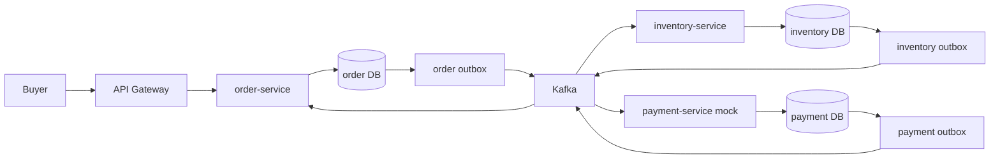
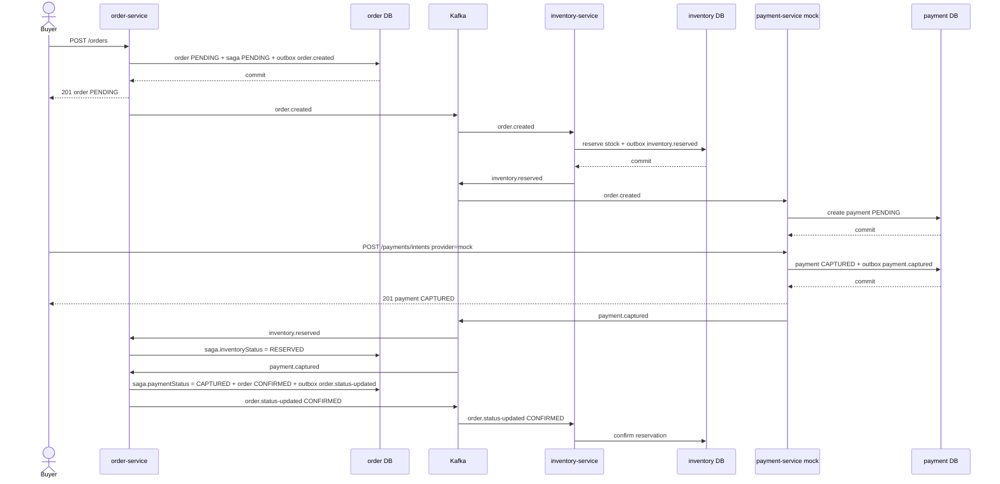
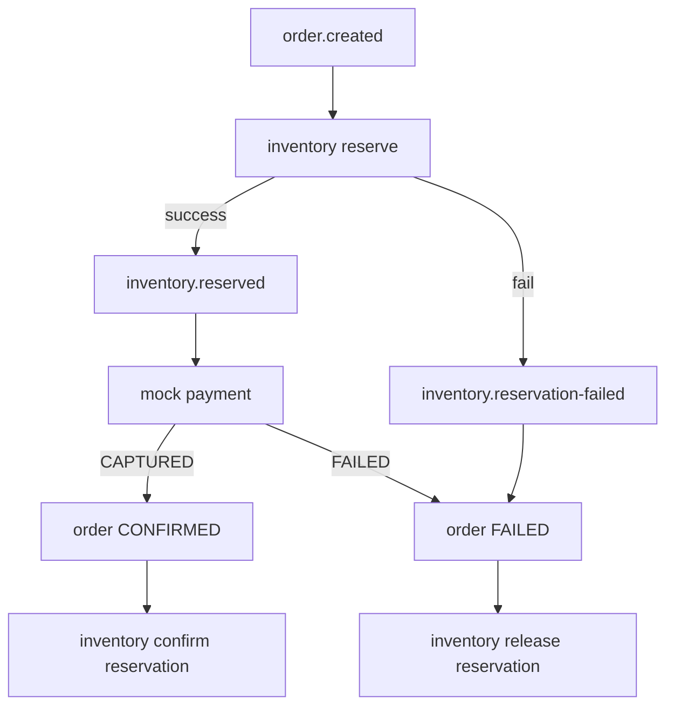
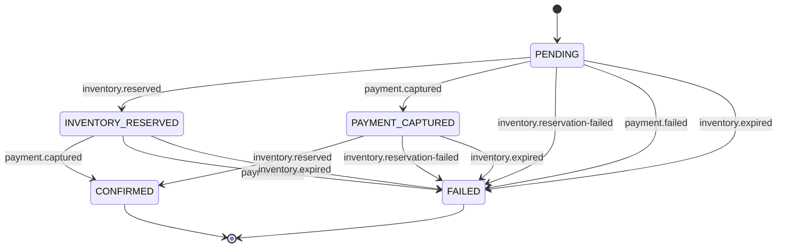

# Checkout Saga Production-Like Implementation Plan

Status: implemented and Docker/Kafka/Postgres E2E verified
Last updated: 2026-05-20

Implementation note:

- Checkout saga MVP đã được triển khai trong `order-service`, `inventory-service`, `payment-service` và `shared/kafka`.
- Đã verify bằng unit tests, DB integration test có `CHECKOUT_SAGA_TEST_DATABASE_URL`, và 3 Docker E2E scripts:
  - `scripts/test-checkout-saga.sh`
  - `scripts/test-checkout-saga-inventory-failure.sh`
  - `scripts/test-checkout-saga-payment-failure.sh`
- Metrics tối thiểu có ở `order-service` qua `/metrics` và `/api/v1/metrics`.

## 1. Goal

Triển khai checkout saga thực tế cho ecommerce flow quan trọng nhất:

```txt
order-service + inventory-service + payment-service
```

Điểm quan trọng: **không triển khai thanh toán thật**. `payment-service` trong plan này được dùng như:

- payment ledger: lưu trạng thái payment của order.
- mock payment driver: giả lập `CAPTURED` hoặc `FAILED` để test checkout.
- event producer: phát `payment.captured` hoặc `payment.failed` cho saga.

Mục tiêu production-like:

- Không dùng distributed transaction giữa order DB, inventory DB, payment DB.
- Có outbox để publish event bền vững.
- Có consumer deduplication để chống Kafka duplicate delivery.
- Có saga state để xử lý event lệch thứ tự.
- Có compensation rõ ràng khi inventory hoặc mock payment fail.
- Có unit test, integration test, query debug và checklist triển khai.

Non-goals:

- Không VNPay, MoMo, Stripe, webhook thật.
- Không tạo `saga-service` riêng.
- Không đưa shipping vào MVP.
- Không dùng schema registry ở phase đầu.
- Không refactor toàn bộ service.

## 2. Current Repo Baseline

Đã có:

- `order-service` tạo order `PENDING`, status history, audit log, outbox `order.created`.
- `order-service` có transition `PENDING -> CONFIRMED | CANCELLED | FAILED`.
- `inventory-service` có reserve, release, confirm reservation.
- `inventory-service` có outbox: `inventory.reserved`, `inventory.released`, `inventory.confirmed`, `inventory.expired`.
- `payment-service` có mock gateway, payment intent, refund giả, webhook giả, outbox payment events.
- `payment-service` đã consume `order.created` để auto-create payment `PENDING`.
- 3 service đều là Go service theo `cmd/internal`, có repository/service/event layer.

Thiếu để chạy saga thực tế:

- `inventory-service` chưa consume `order.created` để reserve tự động.
- `inventory-service` chưa có event chuẩn `inventory.reservation-failed`.
- `order-service` chưa consume `inventory.events`.
- `order-service` chưa consume `payment.events`.
- Chưa có `order_saga_states`.
- Chưa có `processed_events` cho Kafka consumer idempotency.
- `docker-compose.yml` hiện đang để `KAFKA_ENABLED: 'false'` cho `inventory-service`.

## 3. Production-Like Design

Chọn `order-service` làm **saga coordinator nhẹ**.

Lý do:

- Order là aggregate trung tâm của checkout.
- Frontend/seller/support quan tâm order status hơn payment/internal reservation.
- `order-service` đã có status history, audit log, idempotency và outbox.
- Không cần thêm service mới.

Trách nhiệm:

| Service | Trách nhiệm |
|---|---|
| `order-service` | Tạo order, giữ saga state, quyết định `CONFIRMED` hoặc `FAILED`, phát `order.status-updated` |
| `inventory-service` | Reserve, release, confirm stock reservation, phát inventory result |
| `payment-service` | Mock payment ledger, phát `payment.captured` hoặc `payment.failed` |
| Kafka | Event transport, at-least-once delivery |
| Outbox | Đảm bảo event không mất khi DB commit thành công nhưng Kafka tạm lỗi |

Production rule:

- Order chỉ `CONFIRMED` khi:

```txt
inventoryStatus = RESERVED
paymentStatus = CAPTURED
```

- Order `FAILED` khi:

```txt
inventoryStatus = FAILED | EXPIRED
paymentStatus = FAILED
```

Không dùng `AUTHORIZED` cho MVP vì chưa có thanh toán thật. Nếu mock payment trả `AUTHORIZED`, coi đó là trạng thái trung gian và không confirm order.

## 4. Target Flow

### 4.1 Happy Path

```txt
1. Buyer creates order.
2. order-service creates order PENDING + saga PENDING.
3. order-service publishes order.created through outbox.
4. inventory-service consumes order.created.
5. inventory-service reserves stock.
6. inventory-service publishes inventory.reserved.
7. payment-service consumes order.created and creates payment PENDING.
8. Buyer creates mock payment intent.
9. payment-service mock gateway returns CAPTURED.
10. payment-service publishes payment.captured.
11. order-service consumes inventory.reserved and payment.captured.
12. order-service updates order to CONFIRMED.
13. order-service publishes order.status-updated CONFIRMED.
14. inventory-service consumes order.status-updated CONFIRMED.
15. inventory-service confirms reservation and decrements stock.
```

### 4.2 Inventory Failure

```txt
1. order-service creates order PENDING.
2. inventory-service consumes order.created.
3. inventory-service cannot reserve stock.
4. inventory-service publishes inventory.reservation-failed.
5. order-service consumes inventory.reservation-failed.
6. order-service marks order FAILED.
7. payment-service rejects later payment intent because order is not payable.
```

### 4.3 Mock Payment Failure

```txt
1. order-service creates order PENDING.
2. inventory-service reserves stock.
3. payment-service mock gateway returns FAILED.
4. payment-service publishes payment.failed.
5. order-service marks order FAILED.
6. order-service publishes order.status-updated FAILED.
7. inventory-service releases active reservation.
```

### 4.4 Reservation Expiry

```txt
1. inventory-service reservation TTL expires before payment succeeds.
2. inventory-service publishes inventory.expired.
3. order-service marks order FAILED if order is still PENDING.
4. Any later payment success becomes manual-review case, not auto-confirm.
```

## 5. Diagrams

### 5.1 Service Flow



### 5.2 Happy Path Sequence



### 5.3 Failure Compensation



### 5.4 Saga State Machine



## 6. Event Contract

### 6.1 Minimum Envelope

Current publishers already use:

```json
{
  "eventType": "order.created",
  "payload": {},
  "occurredAt": "timestamp"
}
```

Production-like improvement:

```json
{
  "eventId": "uuid",
  "eventType": "order.created",
  "payload": {},
  "occurredAt": "timestamp"
}
```

MVP rule:

- Add `eventId` if implementation scope allows.
- If not, dedupe by `topic + partition + offset`.
- Keep topics unchanged.

### 6.2 Topics

- `order.events`
- `inventory.events`
- `payment.events`

### 6.3 Required Event Types

Order:

- `order.created`
- `order.status-updated`

Inventory:

- `inventory.reserved`
- `inventory.reservation-failed`
- `inventory.released`
- `inventory.confirmed`
- `inventory.expired`

Payment:

- `payment.captured`
- `payment.failed`

Do not require these in MVP:

- `payment.authorized`
- `payment.cancelled`
- `payment.refunded`
- real gateway webhook events

### 6.4 order.created Payload

`order.created` must include enough data for inventory reserve:

```json
{
  "orderId": "uuid",
  "orderNumber": "ORD-...",
  "userId": "uuid",
  "status": "PENDING",
  "totalAmount": 100.5,
  "currency": "USD",
  "items": [
    {
      "productId": "uuid",
      "sku": "SKU-001",
      "quantity": 2,
      "unitPrice": 50.25,
      "totalPrice": 100.5
    }
  ],
  "metadata": {
    "requestId": "request-id",
    "occurredAt": "timestamp",
    "actorId": "user-id",
    "actorRole": "CUSTOMER"
  }
}
```

### 6.5 inventory.reservation-failed Payload

Add this contract:

```json
{
  "orderId": "uuid",
  "reason": "INSUFFICIENT_STOCK",
  "message": "Insufficient stock for SKU SKU-001",
  "items": [
    {
      "sku": "SKU-001",
      "requestedQuantity": 2,
      "availableQuantity": 0
    }
  ],
  "metadata": {
    "requestId": "request-id",
    "occurredAt": "timestamp",
    "actorId": "system",
    "actorRole": "SERVICE"
  }
}
```

### 6.6 payment.captured/payment.failed Payload

Use current payment event payload:

```json
{
  "paymentId": "uuid",
  "orderId": "uuid",
  "userId": "uuid",
  "sellerId": null,
  "provider": "mock",
  "providerPaymentId": "mock_pay_xxx",
  "status": "CAPTURED",
  "amount": 100.5,
  "refundedAmount": 0,
  "currency": "USD",
  "metadata": {
    "requestId": "request-id",
    "occurredAt": "timestamp",
    "actorId": "user-id",
    "actorRole": "CUSTOMER"
  }
}
```

## 7. Data Model

### 7.1 order_saga_states

Add to `order-service`.

```sql
CREATE TABLE IF NOT EXISTS order_saga_states (
  order_id uuid PRIMARY KEY REFERENCES orders(id) ON DELETE CASCADE,
  saga_status varchar(32) NOT NULL DEFAULT 'PENDING',
  inventory_status varchar(32) NOT NULL DEFAULT 'PENDING',
  payment_status varchar(32) NOT NULL DEFAULT 'PENDING',
  inventory_event_id varchar(128),
  payment_event_id varchar(128),
  failure_code varchar(128),
  failure_reason varchar(500),
  created_at timestamptz NOT NULL DEFAULT now(),
  updated_at timestamptz NOT NULL DEFAULT now()
);

CREATE INDEX IF NOT EXISTS idx_order_saga_states_saga_status
  ON order_saga_states(saga_status);

CREATE INDEX IF NOT EXISTS idx_order_saga_states_updated_at
  ON order_saga_states(updated_at);
```

Suggested values:

```txt
saga_status: PENDING, COMPLETED, FAILED
inventory_status: PENDING, RESERVED, FAILED, RELEASED, CONFIRMED, EXPIRED
payment_status: PENDING, CAPTURED, FAILED
```

Why needed:

- Payment event can arrive before inventory event.
- Inventory event can arrive before payment event.
- Duplicate event must not create duplicate transitions.
- Order status alone cannot explain partial progress.

### 7.2 processed_events

Add to every service that consumes Kafka in this saga:

- `order-service`
- `inventory-service`
- `payment-service`

```sql
CREATE TABLE IF NOT EXISTS processed_events (
  id uuid PRIMARY KEY DEFAULT gen_random_uuid(),
  event_id varchar(128) NOT NULL,
  event_type varchar(128) NOT NULL,
  topic varchar(128) NOT NULL,
  partition integer NOT NULL,
  offset_value bigint NOT NULL,
  processed_at timestamptz NOT NULL DEFAULT now(),
  UNIQUE(event_id),
  UNIQUE(topic, partition, offset_value)
);
```

Consumer transaction rule:

```txt
begin tx
-> insert processed_events
-> if duplicate: commit and skip
-> apply business transition
-> write outbox event if needed
-> commit tx
-> commit Kafka offset
```

## 8. Phase Plan

### Phase 0: Contract Check And Scope Lock

Goal: verify current repo behavior and lock MVP scope.

Tasks:

- Confirm `order.created` contains `items`.
- Update `shared/kafka/events/order.events.ts` if `items` is missing.
- Add `inventory.reservation-failed` to `shared/kafka/events/inventory.events.ts`.
- Keep `payment-service` mock-only.
- Decide confirmation rule: only `payment.captured` confirms order.

Validation:

```bash
npm --workspace shared run build
```

Unit test target:

- Shared contracts compile.
- No runtime behavior changes.

### Phase 1: Foundation State And Deduplication

Goal: add durable state before wiring new consumers.

Files:

- `services/order-service/migrations/0002_checkout_saga.sql`
- `services/order-service/internal/domain/domain.go`
- `services/order-service/internal/repository/order_repository.go`
- `services/order-service/internal/service/order_service.go`
- `services/*/migrations/*processed_events*.sql`

Tasks:

- Add `order_saga_states`.
- Add `processed_events` to `order-service`, `inventory-service`, `payment-service`.
- Add repository methods for saga state.
- Add repository methods for event dedupe.
- Create saga state in same transaction as order creation.

Unit tests:

- `CreateOrder` creates saga state.
- Order creation rollback does not leave saga state.
- Idempotency replay does not duplicate saga state.
- `TryMarkEventProcessed` returns false on first event.
- `TryMarkEventProcessed` returns true on duplicate `eventId`.
- `TryMarkEventProcessed` returns true on duplicate `topic + partition + offset`.

Validation:

```bash
cd services/order-service && go test ./...
cd services/inventory-service && go test ./...
cd services/payment-service && go test ./...
```

### Phase 2: Inventory Reservation From order.created

Goal: inventory automatically reserves stock when order is created.

Files:

- `services/inventory-service/internal/config/config.go`
- `services/inventory-service/internal/events/consumer.go`
- `services/inventory-service/internal/service/inventory_service.go`
- `services/inventory-service/internal/repository/inventory_repository.go`
- `docker-compose.yml`

Tasks:

- Add config:
  - `ORDER_EVENTS_TOPIC`
  - `ORDER_EVENTS_CONSUMER_GROUP`
- Make inventory consumer read `order.events`.
- Handle `order.created`.
- Parse `orderId`, `items[].sku`, `items[].quantity`.
- Call service method directly, not HTTP handler.
- On success, use existing outbox `inventory.reserved`.
- On business failure, persist `inventory.reservation-failed`.
- Enable `KAFKA_ENABLED: 'true'` for `inventory-service` in compose.

Recommended method:

```go
func (s *InventoryService) ReserveInventoryFromOrderCreated(ctx context.Context, event OrderCreatedEvent, meta EventMeta) error
```

Unit tests:

- Valid `order.created` reserves stock.
- Multi-SKU order reserves all items.
- Duplicate `order.created` does not reserve twice.
- Insufficient stock publishes `inventory.reservation-failed`.
- Missing SKU publishes `inventory.reservation-failed`.
- Malformed event with no `orderId` is skipped and logged.

Validation:

```bash
cd services/inventory-service && go test ./...
```

### Phase 3: order-service Reacts To inventory.events

Goal: order knows whether inventory is ready or failed.

Files:

- `services/order-service/internal/config/config.go`
- `services/order-service/internal/events/consumer.go`
- `services/order-service/internal/service/order_saga_service.go`
- `services/order-service/internal/repository/order_repository.go`
- `services/order-service/cmd/server/main.go`

Tasks:

- Add consumer for `inventory.events`.
- Handle `inventory.reserved`.
- Handle `inventory.reservation-failed`.
- Handle `inventory.expired`.
- On `inventory.reserved`:
  - set `inventory_status=RESERVED`.
  - if `payment_status=CAPTURED`, confirm order.
- On `inventory.reservation-failed`:
  - set `inventory_status=FAILED`.
  - set order `FAILED` if order is still pending.
- On `inventory.expired`:
  - set `inventory_status=EXPIRED`.
  - set order `FAILED` if order is still pending.

Unit tests:

- `inventory.reserved` updates saga only if payment pending.
- `inventory.reserved` after payment captured confirms order.
- `inventory.reservation-failed` fails pending order.
- `inventory.expired` fails pending order.
- Duplicate inventory event is ignored.
- Unknown order id is logged and skipped.
- Inventory failure after already confirmed order logs inconsistency and does not downgrade order.

Validation:

```bash
cd services/order-service && go test ./...
```

### Phase 4: Mock Payment Finalization

Goal: payment-service remains mock-only but drives final checkout state.

Files:

- `services/payment-service/internal/service/order_events_consumer.go`
- `services/payment-service/internal/service/payment_service.go`
- `services/payment-service/internal/service/gateway.go`
- `services/order-service/internal/events/consumer.go`
- `services/order-service/internal/service/order_saga_service.go`

Tasks in payment-service:

- Keep `MockPaymentGateway`.
- Do not implement real gateway.
- Ensure default mock payment intent returns `CAPTURED`.
- Ensure request with `simulatedStatus=FAILED` returns `FAILED`.
- Add dedupe to existing `order.created` consumer.
- Confirm auto-created pending payment can attach payment intent.

Tasks in order-service:

- Add consumer for `payment.events`.
- Handle `payment.captured`.
- Handle `payment.failed`.
- On `payment.captured`:
  - set `payment_status=CAPTURED`.
  - if `inventory_status=RESERVED`, confirm order.
- On `payment.failed`:
  - set `payment_status=FAILED`.
  - fail order if order is still pending.

Unit tests in payment-service:

- `order.created` creates one pending payment.
- Duplicate `order.created` does not create duplicate payment.
- Payment intent attaches to auto-created pending payment.
- Default mock payment emits `payment.captured`.
- `simulatedStatus=FAILED` emits `payment.failed`.

Unit tests in order-service:

- `payment.captured` before inventory reserved keeps order pending.
- `payment.captured` after inventory reserved confirms order.
- `payment.failed` fails pending order.
- Duplicate payment event is ignored.
- Payment failure after confirmed order logs inconsistency and does not downgrade order.

Validation:

```bash
cd services/payment-service && go test ./...
cd services/order-service && go test ./...
```

### Phase 5: Inventory Compensation And Finalization

Goal: inventory follows final order decision.

Files:

- `services/inventory-service/internal/events/consumer.go`
- `services/inventory-service/internal/service/inventory_service.go`

Tasks:

- Consume `order.status-updated`.
- If status is `CONFIRMED`, confirm active reservation.
- If status is `FAILED` or `CANCELLED`, release active reservation.
- For Kafka-triggered settlement, missing active reservation should be idempotent success.
- Keep manual API stricter: missing reservation can still return not found.

Unit tests:

- `order.status-updated CONFIRMED` confirms active reservation.
- Confirm decrements `reserved` and `on_hand`.
- Duplicate confirm does not decrement twice.
- `order.status-updated FAILED` releases active reservation.
- Release decrements `reserved` only.
- Duplicate release does not decrement twice.
- Missing reservation from Kafka event is skipped without error.

Validation:

```bash
cd services/inventory-service && go test ./...
```

### Phase 6: Production Hardening

Goal: make the saga supportable in production-like dev/staging.

Tasks:

- Add pending order timeout policy:
  - If saga still `PENDING` after reservation TTL + grace period, mark order `FAILED`.
- Add stuck saga query and runbook.
- Add structured logs.
- Add metrics.
- Add integration scripts.
- Add manual recovery procedure.

Suggested logs:

```txt
requestId
correlationId/orderId
eventId
eventType
paymentId
sagaStatus
inventoryStatus
paymentStatus
```

Suggested metrics:

```txt
checkout_saga_started_total
checkout_saga_confirmed_total
checkout_saga_failed_total
checkout_saga_duplicate_event_total
checkout_saga_duration_seconds
checkout_saga_stuck_pending_total
```

Stuck saga query:

```sql
SELECT *
FROM order_saga_states
WHERE saga_status = 'PENDING'
  AND updated_at < now() - interval '15 minutes';
```

Manual recovery rule:

- Retry event replay first.
- If inventory failed or expired, mark order `FAILED`.
- If payment captured but inventory failed, keep order `FAILED` and flag manual refund/reconciliation.
- Never manually change stock without matching inventory movement.

Validation:

```bash
./scripts/test-checkout-saga.sh
./scripts/test-checkout-saga-inventory-failure.sh
./scripts/test-checkout-saga-payment-failure.sh
```

## 9. Integration Test Guide

### 9.1 Start Local Stack

```bash
docker compose up -d kafka postgres redis mongo product-service order-service inventory-service payment-service api-gateway
```

Health checks:

```bash
curl -sS http://localhost:12016/api/v1/health
curl -sS http://localhost:12013/api/v1/health
curl -sS http://localhost:12017/api/v1/health
```

### 9.2 Service Tests

```bash
cd services/order-service && go test ./...
cd services/inventory-service && go test ./...
cd services/payment-service && go test ./...
```

### 9.3 Contract Tests

Run if `shared/kafka` changes:

```bash
npm --workspace shared run build
npm --workspace shared run test
```

### 9.4 Happy Path Script

Add `scripts/test-checkout-saga.sh`.

Script should:

```txt
1. Ensure stock exists for test SKU.
2. Create order with Idempotency-Key.
3. Poll order until status PENDING.
4. Poll inventory reservation until ACTIVE.
5. Create mock payment intent.
6. Poll payment until CAPTURED.
7. Poll order until CONFIRMED.
8. Poll inventory reservation until CONFIRMED.
9. Assert stock on_hand decreased and reserved decreased.
10. Assert no relevant outbox event is stuck in PENDING/FAILED.
```

### 9.5 Inventory Failure Script

Add `scripts/test-checkout-saga-inventory-failure.sh`.

Script should:

```txt
1. Set stock for test SKU to 0 or request quantity greater than available.
2. Create order.
3. Wait for inventory.reservation-failed.
4. Poll order until FAILED.
5. Assert no active reservation exists.
6. Attempt payment intent and expect rejection because order is not payable.
```

### 9.6 Payment Failure Script

Add `scripts/test-checkout-saga-payment-failure.sh`.

Script should:

```txt
1. Ensure stock exists.
2. Create order.
3. Wait for reservation ACTIVE.
4. Create mock payment intent with simulatedStatus=FAILED.
5. Poll payment until FAILED.
6. Poll order until FAILED.
7. Poll reservation until RELEASED.
8. Assert stock reserved returned to previous value.
```

### 9.7 Useful SQL Debug Queries

Orders:

```sql
SELECT id, status, total_amount, created_at, updated_at
FROM orders
ORDER BY created_at DESC
LIMIT 10;
```

Saga states:

```sql
SELECT *
FROM order_saga_states
ORDER BY updated_at DESC
LIMIT 10;
```

Inventory reservations:

```sql
SELECT order_id, sku, quantity, status, expires_at, created_at, updated_at
FROM inventory_reservations
ORDER BY created_at DESC
LIMIT 10;
```

Payments:

```sql
SELECT order_id, status, amount, currency, provider, created_at, updated_at
FROM payments
ORDER BY created_at DESC
LIMIT 10;
```

Outbox:

```sql
SELECT event_type, status, retry_count, created_at, published_at
FROM outbox_events
ORDER BY created_at DESC
LIMIT 20;
```

Processed events:

```sql
SELECT event_type, topic, partition, offset_value, processed_at
FROM processed_events
ORDER BY processed_at DESC
LIMIT 20;
```

## 10. Unit Test Matrix

### 10.1 order-service

Foundation:

- Create order creates saga state.
- Idempotency replay does not duplicate saga state.
- Processed event duplicate is skipped.

Inventory events:

- `inventory.reserved` updates inventory status.
- `inventory.reserved` after `payment.captured` confirms order.
- `inventory.reservation-failed` fails pending order.
- `inventory.expired` fails pending order.
- Duplicate inventory event does not duplicate status history.

Payment events:

- `payment.captured` updates payment status.
- `payment.captured` before inventory reserved keeps order pending.
- `payment.captured` after inventory reserved confirms order.
- `payment.failed` fails pending order.
- Duplicate payment event does not duplicate status history.

Edge cases:

- Unknown order id.
- Malformed event.
- Conflicting event after terminal order.
- Payment captured after inventory failed.

### 10.2 inventory-service

Order events:

- `order.created` reserves stock.
- Multi-SKU `order.created` reserves all items.
- Duplicate `order.created` does not reserve twice.
- Insufficient stock publishes `inventory.reservation-failed`.
- Missing SKU publishes `inventory.reservation-failed`.

Finalization:

- `order.status-updated CONFIRMED` confirms active reservation.
- Confirm is idempotent.
- `order.status-updated FAILED` releases active reservation.
- Release is idempotent.
- Missing reservation from Kafka settlement is skipped.

### 10.3 payment-service

Mock lifecycle:

- `order.created` auto-creates pending payment.
- Duplicate `order.created` does not duplicate payment.
- Payment intent attaches to pending auto-created payment.
- Default mock intent produces `CAPTURED`.
- `simulatedStatus=FAILED` produces `FAILED`.
- Non-payable order rejects payment intent.
- Amount mismatch rejects payment intent.
- Currency mismatch rejects payment intent.

## 11. Rollout Strategy

Recommended order:

```txt
1. Merge migrations and repository methods.
2. Create saga state on new orders.
3. Enable inventory order.created consumer in local/dev.
4. Enable order inventory.events consumer.
5. Enable order payment.events consumer.
6. Enable inventory order.status-updated compensation.
7. Run integration scripts repeatedly.
8. Enable in default docker-compose.
```

Do not enable all consumers at once. Each phase should be independently testable.

Rollback plan:

- Disable new consumers by env/config.
- Keep order creation working as before.
- Existing saga tables can remain unused.
- If inventory auto-reserve causes issues, disable inventory `order.created` consumer first.

## 12. Definition Of Done

Saga implementation is production-like enough when:

- New order creates `order_saga_states`.
- `inventory-service` reserves automatically from `order.created`.
- Inventory failure marks order `FAILED`.
- Mock payment `CAPTURED` plus inventory `RESERVED` marks order `CONFIRMED`.
- Mock payment `FAILED` marks order `FAILED`.
- Failed order releases reservation.
- Confirmed order confirms reservation and decrements stock.
- Duplicate Kafka events do not duplicate stock or status transitions.
- Out-of-order inventory/payment events still produce correct final status.
- Integration scripts cover happy path, inventory failure and payment failure.
- Stuck saga query/runbook exists.

## 13. Implementation Checklist

### Phase 0: Contract Check

- [ ] Confirm `order.created` includes `items`.
- [ ] Update `shared/kafka/events/order.events.ts` if needed.
- [ ] Add `inventory.reservation-failed` contract.
- [ ] Confirm `payment-service` remains mock-only.
- [ ] Use only `payment.captured` and `payment.failed` for MVP.
- [ ] Run `npm --workspace shared run build`.

### Phase 1: Foundation

- [ ] Add `order_saga_states` migration.
- [ ] Add saga domain types in `order-service`.
- [ ] Add saga repository methods.
- [ ] Add `processed_events` migration to `order-service`.
- [ ] Add `processed_events` migration to `inventory-service`.
- [ ] Add `processed_events` migration to `payment-service`.
- [ ] Create saga state inside `CreateOrder`.
- [ ] Add dedupe repository tests.
- [ ] Run Go tests for all three services.

### Phase 2: Inventory Reservation

- [ ] Add `ORDER_EVENTS_TOPIC` config to `inventory-service`.
- [ ] Add `ORDER_EVENTS_CONSUMER_GROUP` config to `inventory-service`.
- [ ] Consume `order.created`.
- [ ] Reserve inventory from order event.
- [ ] Publish `inventory.reserved` on success.
- [ ] Publish `inventory.reservation-failed` on business failure.
- [ ] Enable `KAFKA_ENABLED=true` for `inventory-service` in compose.
- [ ] Add unit tests for success, insufficient stock, missing SKU and duplicate event.
- [ ] Run `cd services/inventory-service && go test ./...`.

### Phase 3: Order Reacts To Inventory

- [ ] Add inventory events consumer to `order-service`.
- [ ] Handle `inventory.reserved`.
- [ ] Handle `inventory.reservation-failed`.
- [ ] Handle `inventory.expired`.
- [ ] Confirm order only if payment is already captured.
- [ ] Fail order on inventory failure or expiry.
- [ ] Add out-of-order and duplicate unit tests.
- [ ] Run `cd services/order-service && go test ./...`.

### Phase 4: Mock Payment Finalization

- [ ] Add dedupe to `payment-service` order events consumer.
- [ ] Verify order-created payment remains `PENDING`.
- [ ] Verify payment intent attaches to auto-created payment.
- [ ] Verify default mock payment emits `payment.captured`.
- [ ] Verify `simulatedStatus=FAILED` emits `payment.failed`.
- [ ] Add payment events consumer to `order-service`.
- [ ] Handle `payment.captured`.
- [ ] Handle `payment.failed`.
- [ ] Add unit tests for payment-before-inventory and inventory-before-payment.
- [ ] Run Go tests for `payment-service` and `order-service`.

### Phase 5: Inventory Compensation

- [ ] Consume `order.status-updated CONFIRMED`.
- [ ] Confirm active reservation.
- [ ] Consume `order.status-updated FAILED`.
- [ ] Release active reservation.
- [ ] Consume `order.status-updated CANCELLED`.
- [ ] Release active reservation.
- [ ] Make Kafka-triggered confirm/release idempotent.
- [ ] Add confirm/release duplicate tests.
- [ ] Run `cd services/inventory-service && go test ./...`.

### Phase 6: Production Hardening

- [ ] Add pending saga timeout policy.
- [ ] Add stuck saga SQL query.
- [ ] Add structured logs with `orderId`, `eventId`, `eventType`, saga statuses.
- [ ] Add basic saga metrics.
- [ ] Add `scripts/test-checkout-saga.sh`.
- [ ] Add inventory failure integration script.
- [ ] Add payment failure integration script.
- [ ] Document manual recovery cases.

### Final Verification

- [ ] `cd services/order-service && go test ./...`
- [ ] `cd services/inventory-service && go test ./...`
- [ ] `cd services/payment-service && go test ./...`
- [ ] `npm --workspace shared run build`
- [ ] `./scripts/test-checkout-saga.sh`
- [ ] `./scripts/test-checkout-saga-inventory-failure.sh`
- [ ] `./scripts/test-checkout-saga-payment-failure.sh`
- [ ] No stuck `outbox_events` for saga topics.
- [ ] No stuck `order_saga_states` older than expected timeout.
