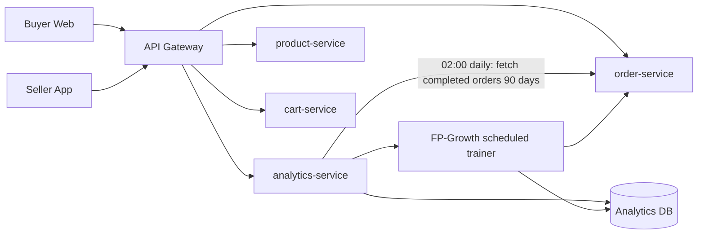
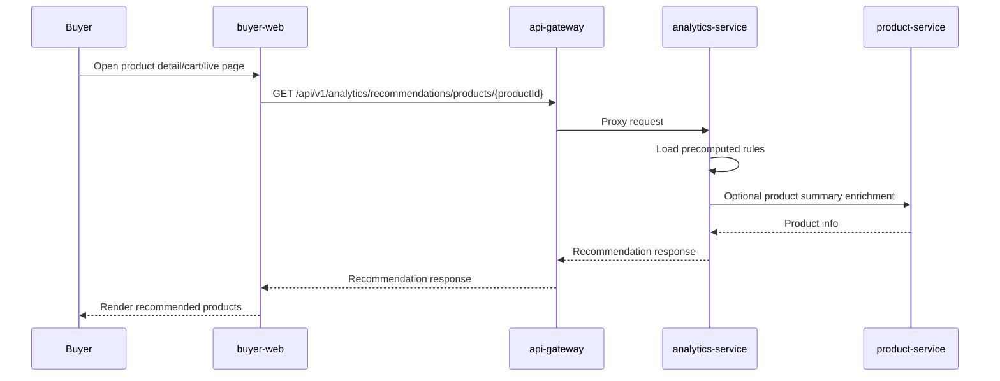
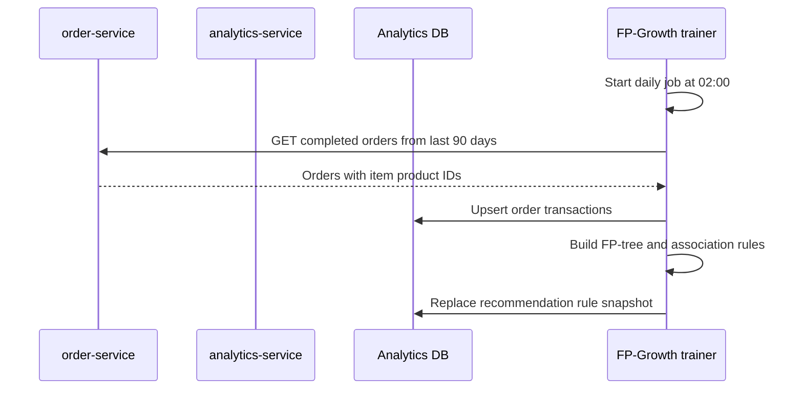
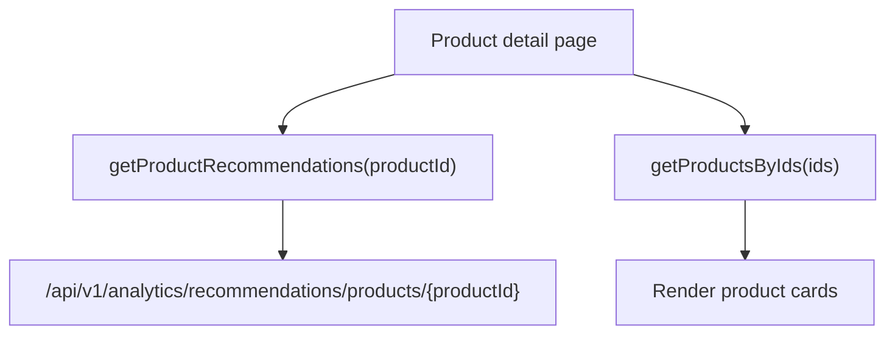

# FP-Growth Recommendation Implementation Plan

Status: MVP implemented; remaining live gateway verification pending
Last updated: 2026-05-19

## 1. Goal

Triển khai recommendation dựa trên FP-Growth cho ecommerce hiện tại mà không tạo thêm service mới.

Mục tiêu chính:

- Gợi ý "thường được mua cùng" trên trang chi tiết sản phẩm.
- Gợi ý sản phẩm nên mua thêm trong giỏ hàng.
- Gợi ý sản phẩm liên quan trong trang video/livestream nếu có product context.
- Cho seller xem insight các cặp sản phẩm hay được mua cùng.

Service owner:

- Backend owner: `services/analytics-service`.
- Gateway owner: `services/api-gateway`.
- Frontend buyer owner: `frontend/apps/buyer-web`.
- Frontend seller owner: `frontend/apps/seller`.

Non-goals giai đoạn đầu:

- Không tạo `recommendation-service` riêng.
- Không dùng AI embedding, LLM, vector database.
- Không cá nhân hóa sâu theo từng user.
- Không chạy FP-Growth realtime trên mỗi request.
- Không query trực tiếp database của service khác.

## 2. Architecture Decision

Recommendation thuộc `analytics-service` vì dữ liệu đầu vào là lịch sử đơn hàng và hành vi mua hàng. `product-service` chỉ nên giữ nghiệp vụ sản phẩm, không nên chứa thuật toán khai phá giao dịch.

Nguyên tắc boundary:

- `analytics-service` lấy completed orders từ `order-service` theo lịch batch hằng ngày.
- `analytics-service` lưu transaction và rule đã tính sẵn trong database riêng.
- `api-gateway` proxy endpoint recommendation.
- Frontend chỉ gọi Gateway, không gọi thẳng service nội bộ.

## 3. High-Level Flow

MVP flow cần nhớ:

```txt
02:00 sáng
-> analytics-service gọi order-service lấy completed orders 90 ngày gần nhất
-> analytics-service chạy FP-Growth
-> analytics-service lưu recommendation_rules

Khi khách mở sản phẩm
-> buyer-web gọi api-gateway
-> api-gateway gọi analytics-service
-> analytics-service đọc recommendation_rules
-> trả kết quả ngay
```



Request flow:



Training flow:



## 4. Current Repo Fit

Existing useful pieces:

- `services/analytics-service` already exists as a Go service.
- `services/analytics-service/internal/repository/analytics_repository.go` already owns analytics persistence patterns.
- `services/api-gateway/internal/router/router.go` already proxies:
  - `/api/analytics`
  - `/api/v1/analytics`
- `frontend/apps/buyer-web` already has a home recommendation section, but it is currently product-list based.

Important decision:

- Keep recommendation endpoints under `/api/v1/analytics/recommendations/...` first.
- Add friendlier frontend route handlers in buyer-web if needed.
- Do not add a new microservice until traffic or ownership requires it.

## 5. Backend Plan

### 5.1 Data Source

Primary source:

- Completed orders from `order-service`.

Batch schedule:

- Run every day at `02:00`.
- Read orders from the last `90` days.
- Store only orders with at least 2 distinct product IDs.

Recommended internal order-service endpoint:

```http
GET /api/v1/orders/internal/completed?from=2026-02-18T00:00:00Z&to=2026-05-19T02:00:00Z&page=1&pageSize=500
```

Access:

- Service-to-service only.
- Require a service token/header, not buyer/seller JWT.
- Do not expose this endpoint publicly in API Gateway.

Minimum response shape:

```json
{
  "items": [
    {
      "orderId": "ord_123",
      "userId": "usr_123",
      "sellerId": "seller_123",
      "completedAt": "2026-05-19T10:00:00Z",
      "items": [
        {
          "productId": "prod_1",
          "sellerId": "seller_123",
          "categoryId": "cat_1",
          "quantity": 1,
          "unitPrice": 120000
        }
      ]
    }
  ],
  "pagination": {
    "page": 1,
    "pageSize": 500,
    "hasNext": false
  }
}
```

Fallback if internal order endpoint is not ready:

- Use seed JSON/CSV data with real local product IDs for local validation.
- Add the internal endpoint before enabling real scheduled training.

Do not:

- Do not let `analytics-service` read order database directly.
- Do not import `order-service` runtime code.
- Do not call buyer-facing order list APIs for training data.

### 5.2 Database Schema

Add migration:

```txt
services/analytics-service/migrations/0002_add_recommendations.sql
```

Tables:

```sql
CREATE TABLE IF NOT EXISTS recommendation_transactions (
  transaction_id TEXT PRIMARY KEY,
  order_id TEXT NOT NULL,
  user_id TEXT NULL,
  seller_id TEXT NULL,
  product_ids TEXT[] NOT NULL,
  item_count INT NOT NULL,
  source_snapshot TEXT NULL,
  occurred_at TIMESTAMPTZ NOT NULL,
  created_at TIMESTAMPTZ NOT NULL DEFAULT NOW()
);

CREATE UNIQUE INDEX IF NOT EXISTS idx_recommendation_transactions_order_id
  ON recommendation_transactions (order_id);

CREATE INDEX IF NOT EXISTS idx_recommendation_transactions_occurred_at
  ON recommendation_transactions (occurred_at);

CREATE INDEX IF NOT EXISTS idx_recommendation_transactions_seller_id
  ON recommendation_transactions (seller_id);

CREATE TABLE IF NOT EXISTS recommendation_rules (
  rule_id TEXT PRIMARY KEY,
  antecedent_product_ids TEXT[] NOT NULL,
  consequent_product_id TEXT NOT NULL,
  support_count BIGINT NOT NULL,
  antecedent_count BIGINT NOT NULL,
  consequent_count BIGINT NOT NULL,
  transaction_count BIGINT NOT NULL,
  support DOUBLE PRECISION NOT NULL,
  confidence DOUBLE PRECISION NOT NULL,
  lift DOUBLE PRECISION NOT NULL,
  score DOUBLE PRECISION NOT NULL,
  seller_id TEXT NULL,
  generated_at TIMESTAMPTZ NOT NULL,
  created_at TIMESTAMPTZ NOT NULL DEFAULT NOW()
);

CREATE INDEX IF NOT EXISTS idx_recommendation_rules_antecedent
  ON recommendation_rules USING GIN (antecedent_product_ids);

CREATE INDEX IF NOT EXISTS idx_recommendation_rules_consequent
  ON recommendation_rules (consequent_product_id);

CREATE INDEX IF NOT EXISTS idx_recommendation_rules_seller_score
  ON recommendation_rules (seller_id, score DESC);

CREATE TABLE IF NOT EXISTS recommendation_training_runs (
  run_id TEXT PRIMARY KEY,
  status TEXT NOT NULL,
  window_days INT NOT NULL,
  min_support_count INT NOT NULL,
  min_confidence DOUBLE PRECISION NOT NULL,
  max_antecedent_size INT NOT NULL,
  transaction_count BIGINT NOT NULL DEFAULT 0,
  frequent_itemset_count BIGINT NOT NULL DEFAULT 0,
  rule_count BIGINT NOT NULL DEFAULT 0,
  started_at TIMESTAMPTZ NOT NULL,
  finished_at TIMESTAMPTZ NULL,
  error_message TEXT NULL
);
```

Notes:

- `product_ids` must be deduplicated per order before storing.
- Store only transactions with at least 2 distinct products.
- Use `order_id` unique index for idempotency.
- Use `recommendation_training_runs` for observability and seller dashboard.

### 5.3 Go Domain Models

Add to `services/analytics-service/internal/domain/domain.go` or split into `recommendation.go`:

```txt
RecommendationTransaction
RecommendationRule
RecommendationTrainingRun
RecommendationItem
RecommendationRequest
```

Important fields:

- `ProductID`
- `Score`
- `Support`
- `Confidence`
- `Lift`
- `Reason`
- `GeneratedAt`

Reason values:

- `frequently_bought_together`
- `cart_pattern_match`
- `popular_fallback`
- `same_category_fallback`

### 5.4 Repository Layer

Add methods in `services/analytics-service/internal/repository`:

```txt
InsertRecommendationTransaction(ctx, tx)
UpsertRecommendationTransactions(ctx, transactions)
ListRecommendationTransactions(ctx, windowDays, sellerID)
ReplaceRecommendationRules(ctx, runID, rules)
QueryRecommendationsByProduct(ctx, productID, sellerID, limit)
QueryRecommendationsByCart(ctx, productIDs, sellerID, limit)
CreateTrainingRun(ctx, run)
FinishTrainingRun(ctx, runID, status, counts, error)
GetLatestTrainingRun(ctx)
```

Implementation notes:

- `ReplaceRecommendationRules` should run in a DB transaction.
- For a full rebuild, delete old rows then insert new rules in the same transaction.
- For safer rollout, write with `generated_at = runStartedAt`, then delete older snapshots after insert succeeds.

### 5.5 Order-Service Batch Fetch

Add an internal client in analytics-service:

```txt
services/analytics-service/internal/service/order_client.go
```

Client responsibility:

- Call `order-service` internal completed-orders endpoint.
- Page through the full 90-day result set.
- Convert order rows into recommendation transactions.
- Retry transient HTTP failures with a small backoff.
- Stop and mark training run failed if order-service is unavailable.

Batch flow:

```txt
02:00 daily
-> analytics-service calls order-service completed-orders endpoint
-> analytics-service normalizes product IDs into transactions
-> analytics-service upserts recommendation_transactions
-> analytics-service runs FP-Growth
-> analytics-service replaces recommendation_rules
```

Internal fetch config:

```txt
ORDER_SERVICE_BASE_URL=http://order-service:8080
ORDER_SERVICE_INTERNAL_TOKEN=...
RECOMMENDATION_ORDER_FETCH_PAGE_SIZE=500
RECOMMENDATION_WINDOW_DAYS=90
```

Transaction normalization rules:

- Accept only orders returned by the completed-orders endpoint.
- Extract distinct `productId` values from payload items.
- Ignore transaction if fewer than 2 product IDs.
- Use `orderId` as idempotency key.

Suggested function names:

```txt
fetchCompletedOrders(ctx, from, to)
buildRecommendationTransactions(orders)
normalizeProductIDs(items)
```

### 5.6 FP-Growth Algorithm

Add package:

```txt
services/analytics-service/internal/recommendation/
  fpgrowth.go
  fpgrowth_test.go
  trainer.go
  trainer_test.go
  ranking.go
  ranking_test.go
```

Algorithm input:

```txt
transactions: [][]string
minSupportCount: int
minConfidence: float64
maxAntecedentSize: int
```

Algorithm output:

```txt
frequent itemsets + association rules
```

FP-Growth steps:

1. Count item frequency.
2. Remove items below `minSupportCount`.
3. Sort each transaction by descending frequency, then product ID for stable output.
4. Build FP-tree.
5. Build header table linking nodes by item.
6. Mine frequent itemsets recursively from conditional pattern bases.
7. Generate association rules from itemsets with size >= 2.
8. Keep rules where:
   - consequent size is 1 product.
   - antecedent size <= `maxAntecedentSize`.
   - confidence >= `minConfidence`.
9. Compute:
   - `support = supportCount / transactionCount`
   - `confidence = supportCount / antecedentCount`
   - `lift = confidence / (consequentCount / transactionCount)`
10. Compute score:

```txt
score = confidence * 0.55 + normalizedLift * 0.30 + normalizedSupport * 0.15
```

Keep score simple in phase 1:

```txt
score = confidence * lift
```

Recommended default config:

```txt
RECOMMENDATION_TRAINING_ENABLED=true
RECOMMENDATION_TRAINING_HOUR=2
RECOMMENDATION_WINDOW_DAYS=90
RECOMMENDATION_MIN_SUPPORT_COUNT=3
RECOMMENDATION_MIN_CONFIDENCE=0.15
RECOMMENDATION_MAX_ANTECEDENT_SIZE=3
RECOMMENDATION_MAX_RULES=5000
```

Small data mode:

- If total transactions < 50, lower `minSupportCount` to 2.
- If rules are empty, frontend should use fallback products instead of showing an empty block.

### 5.7 Scheduled Training

Add background worker in analytics-service startup:

```txt
cmd/server/main.go
  -> create recommendation trainer
  -> start daily scheduler when enabled
```

Default schedule:

```txt
Every day at 02:00 server time
```

Training steps:

```txt
1. Acquire training lock.
2. Calculate window: now - 90 days to now.
3. Fetch completed orders from order-service with pagination.
4. Upsert recommendation_transactions.
5. Load transactions for the 90-day window.
6. Run FP-Growth.
7. Replace recommendation_rules.
8. Store recommendation_training_runs result.
9. Release training lock.
```

Manual endpoint for local testing:

```http
POST /api/v1/analytics/recommendations/train
```

Access:

- `ADMIN`
- `SUPER_ADMIN`
- optionally `SELLER` only for own seller scope later

Training behavior:

- Use a lock to prevent overlapping runs.
- Prefer PostgreSQL advisory lock or Redis lock.
- Do not block API reads while training is running.
- Keep serving the previous `recommendation_rules` snapshot until the new snapshot is written successfully.
- Log run summary:
  - fetched completed orders
  - transaction count
  - frequent itemset count
  - rule count
  - duration
  - status

### 5.8 Recommendation API

Product detail endpoint:

```http
GET /api/v1/analytics/recommendations/products/{productId}?limit=12&sellerId=optional
```

Response:

```json
{
  "productId": "prod_1",
  "sellerId": null,
  "generatedAt": "2026-05-19T10:00:00Z",
  "items": [
    {
      "productId": "prod_2",
      "score": 1.42,
      "reason": "frequently_bought_together"
    }
  ]
}
```

Cart endpoint:

```http
POST /api/v1/analytics/recommendations/cart
```

Request:

```json
{
  "productIds": ["prod_1", "prod_3"],
  "sellerId": null,
  "limit": 12
}
```

Response:

```json
{
  "productIds": ["prod_1", "prod_3"],
  "sellerId": null,
  "generatedAt": "2026-05-19T10:00:00Z",
  "items": [
    {
      "productId": "prod_7",
      "score": 2.04,
      "reason": "cart_pattern_match"
    }
  ]
}
```

Seller insight endpoint:

```http
GET /api/v1/analytics/recommendations/insights?from=2026-04-19T00:00:00Z&to=2026-05-19T00:00:00Z&sellerId=optional
```

Use this for seller dashboard cards:

- top product pairs
- rule confidence
- rule lift
- latest training status

### 5.9 Product Enrichment

Recommendation rules store product IDs only. Frontend needs product cards.

Two options:

Option A, preferred for phase 1:

- `analytics-service` returns only product IDs and metrics.
- buyer-web calls existing product API to hydrate product cards.

Option B:

- `analytics-service` calls `product-service` internally to return product summary.

Phase 1 choose Option A because it keeps analytics simple and avoids service-to-service latency.

### 5.10 API Gateway

Current gateway already mounts `/api/v1/analytics` as private. For buyer product recommendations, decide access carefully.

Recommended phase 1:

- Product detail recommendations can be public:
  - `GET /api/v1/analytics/recommendations/products/{productId}`
- Cart recommendations require buyer JWT:
  - `POST /api/v1/analytics/recommendations/cart`
- Seller insights require seller/admin JWT:
  - `GET /api/v1/analytics/recommendations/insights`
  - `POST /api/v1/analytics/recommendations/train`

Gateway changes:

- Add public GET proxy route for product recommendations if buyer product pages are public.
- Keep cart and seller endpoints under existing private `/api/v1/analytics` proxy.

### 5.11 Backend Tests

Unit tests:

- FP-tree building.
- Frequent itemset mining.
- Association rule generation.
- Confidence/lift calculation.
- Ranking stability.
- Completed-order response normalization.
- Deduplication by `orderId`.

Repository tests:

- Insert transaction.
- Ignore duplicate order.
- Replace rules in transaction.
- Query by product.
- Query by cart.

Handler/service tests:

- Product recommendations success.
- Product recommendations empty.
- Cart recommendations validation error for empty product list.
- Seller insight authorization.
- Manual training endpoint authorization.

Validation ladder:

```txt
cd services/analytics-service && go test ./...
cd services/api-gateway && go test ./...
```

Only escalate broader if route contracts or shared order API contracts change.

## 6. Frontend Plan

### 6.1 Buyer Web Product Detail

Target app:

```txt
frontend/apps/buyer-web
```

Add service methods:

```txt
src/services/recommendation-service.ts
```

Suggested methods:

```txt
getProductRecommendations(productId, limit)
getCartRecommendations(productIds, limit)
```

Product detail UI:

- Add section below product info or near related products.
- Title:
  - Vietnamese: `Thường được mua cùng`
  - English: `Frequently Bought Together`
- Render product cards using existing product card component.
- Hide section when no recommendations and no fallback.

Data flow:



### 6.2 Buyer Web Cart

Add recommendation block below cart items or before checkout summary:

- Title:
  - `Bạn có thể cần thêm`
  - `Complete your cart`
- Call:

```txt
POST /api/v1/analytics/recommendations/cart
```

Behavior:

- Send distinct product IDs in cart.
- Exclude products already in cart from display.
- Add quick "Add to cart" action if existing product card supports it.
- Hide block when cart has fewer than 1 product or API returns empty.

### 6.3 Buyer Web Home

Current home has recommendation products based on categories/mock product sections.

Phase 1:

- Keep current home behavior.
- Do not replace home recommendations with FP-Growth because FP-Growth needs product/cart context.

Phase 2:

- If user has recent cart/order history, call cart-style recommendation using recent product IDs.
- Otherwise keep current category/trending fallback.

### 6.4 Buyer Web Video and Live Pages

Targets from current work:

```txt
frontend/apps/buyer-web/src/app/videos/page.tsx
frontend/apps/buyer-web/src/app/live/[sessionId]/page.tsx
```

Video page:

- If video has linked product IDs, call cart recommendation with those IDs.
- Show compact product rail:
  - `Mua kèm phổ biến`

Live page:

- If live session has pinned/featured product IDs, call cart recommendation with those IDs.
- Show compact rail near live product panel.
- Do not block live video rendering on recommendation request.

### 6.5 Seller App

Target app:

```txt
frontend/apps/seller
```

Recommended pages:

- Existing analytics area:
  - `/data/sales-analytics`
- Existing live marketing area:
  - `/marketing/live-video`

Seller analytics UI:

- Add card/table:
  - `Top Frequently Bought Together`
- Columns:
  - Product A
  - Recommended Product B
  - Confidence
  - Lift
  - Support
  - Generated At

Live video seller UI:

- When seller configures live products, show suggested bundle candidates from FP-Growth.
- Use recommendation as decision support, not automatic product insertion.

### 6.6 Frontend API Route Handlers

If buyer-web uses Next.js route handlers to proxy backend:

Add:

```txt
frontend/apps/buyer-web/src/app/api/buyer/recommendations/products/[productId]/route.ts
frontend/apps/buyer-web/src/app/api/buyer/recommendations/cart/route.ts
```

These route handlers should:

- Forward to API Gateway.
- Preserve auth header for cart request.
- Normalize empty/error responses to `{ items: [] }`.

If existing code already calls Gateway directly from server components, reuse that pattern instead.

### 6.7 Frontend States

Each recommendation block needs:

- loading skeleton
- empty state hidden by default
- error state hidden with console/server log only
- product card loaded state

Do not show technical text like confidence/lift to buyers.

Seller UI can show confidence/lift because it is an analytics surface.

## 7. Configuration

Add env vars to analytics-service:

```txt
RECOMMENDATION_ENABLED=true
RECOMMENDATION_TRAINING_ENABLED=true
RECOMMENDATION_TRAINING_HOUR=2
RECOMMENDATION_WINDOW_DAYS=90
RECOMMENDATION_MIN_SUPPORT_COUNT=3
RECOMMENDATION_MIN_CONFIDENCE=0.15
RECOMMENDATION_MAX_ANTECEDENT_SIZE=3
RECOMMENDATION_MAX_RULES=5000
ORDER_SERVICE_BASE_URL=http://order-service:8080
ORDER_SERVICE_INTERNAL_TOKEN=...
RECOMMENDATION_ORDER_FETCH_PAGE_SIZE=500
```

Add docs to:

```txt
services/analytics-service/README.md
docs/development/local-setup.md
```

## 8. Rollout Phases

### Phase 1: Backend Foundation

Scope:

- Add DB schema.
- Add order-service completed-orders internal endpoint or confirm it already exists.
- Add analytics-service order client.
- Add completed-order transaction normalization.
- Add repository methods.
- Add FP-Growth implementation.
- Add manual train endpoint.
- Add product/cart recommendation endpoints.

Validation:

```txt
cd services/analytics-service && go test ./...
```

### Phase 2: Gateway and Buyer Product Detail

Scope:

- Add/confirm gateway routes.
- Add buyer-web recommendation API client.
- Render product detail recommendation rail.
- Hydrate product cards from product API.

Validation:

```txt
cd services/api-gateway && go test ./...
npm --workspace frontend/apps/buyer-web run build
```

### Phase 3: Cart, Video, and Live Integration

Scope:

- Add cart recommendation block.
- Add video recommendation rail when video has product context.
- Add live recommendation rail when session has product context.

Validation:

```txt
npm --workspace frontend/apps/buyer-web run build
```

### Phase 4: Seller Insight

Scope:

- Add seller analytics API call.
- Add top rules table/card.
- Add training status display.
- Optionally add manual "retrain" action for admin only.

Validation:

```txt
npm --workspace frontend/apps/seller run build
```

### Phase 5: Hardening

Scope:

- Add training lock.
- Add metrics/logging.
- Tune thresholds with seed data.
- Add fallback recommendation source.

Validation:

```txt
cd services/analytics-service && go test ./...
cd services/api-gateway && go test ./...
npm --workspace frontend/apps/buyer-web run build
npm --workspace frontend/apps/seller run build
```

## 9. Backfill Plan

Need backfill if existing order history should be used.

Implemented for local validation:

- Analytics-service has a seed backfill command:

```txt
cd services/analytics-service
RECOMMENDATION_MIN_SUPPORT_COUNT=2 \
go run ./cmd/backfill-recommendations \
  -file testdata/recommendation_completed_orders.json
```

The command reads completed-order shaped JSON, upserts recommendation transactions, runs FP-Growth, and writes `recommendation_rules`.

Still preferred for production:

- Use the scheduled trainer or admin-only train endpoint to fetch real completed orders from `order-service`.

Backfill input options:

1. Call order-service internal completed-orders endpoint with service token.
2. Load a seed JSON/CSV file with real local product IDs.

For local validation, option 2 is acceptable when order history has too few multi-item completed orders:

```txt
services/analytics-service/testdata/recommendation_transactions.json
```

## 10. Risks and Mitigations

Risk: Order-service completed-orders endpoint does not include product item IDs.

- Mitigation: add `items[].productId` to the internal response before enabling real training.

Risk: Order-service is unavailable at 02:00.

- Mitigation: keep serving the previous rule snapshot, mark the run failed, and retry on the next schedule or manual retrain.

Risk: Too little transaction data creates empty rules.

- Mitigation: lower support count in dev, seed local transactions with real product IDs, add fallback trending products.

Risk: Training gets expensive.

- Mitigation: run scheduled offline, cap window days, cap max rules, cap antecedent size.

Risk: Public endpoint leaks seller analytics metrics.

- Mitigation: buyer endpoint returns only product IDs and buyer-safe score/reason. Seller-only endpoint returns support/confidence/lift details.

Risk: Recommendations include inactive/deleted products.

- Mitigation: frontend hydration filters unavailable products through product-service response.

Risk: Cross-seller recommendations are confusing.

- Mitigation: default global rules for buyer discovery, seller-scoped rules for seller dashboards and seller-owned pages.

## 11. Definition of Done

Backend done when:

- Completed orders from `order-service` become recommendation transactions.
- FP-Growth training produces persisted association rules.
- Product and cart recommendation endpoints return stable results.
- Duplicate orders do not duplicate transactions.
- Analytics-service tests pass.

Frontend done when:

- Buyer product detail displays "Frequently Bought Together".
- Buyer cart displays "Complete your cart".
- Video/live pages show recommendations only when product context exists.
- Seller analytics shows top product association rules.
- Empty/error states do not break page rendering.

Project done when:

- Local seed/backfill can produce visible recommendations.
- Training can be run manually and by schedule.
- Gateway routes work through `/api/v1`.
- Docs explain env vars and validation commands.

## 12. Implementation Checklist

- [x] Confirm or add order-service internal completed-orders endpoint.
- [x] Confirm completed-order response contains `orderId`, `completedAt`, and `items[].productId`.
- [x] Add `0002_add_recommendations.sql` migration in `services/analytics-service`.
- [x] Add recommendation domain models.
- [x] Add analytics-service order client.
- [x] Add transaction repository methods.
- [x] Add rule repository methods.
- [x] Add training run repository methods.
- [x] Add completed-order transaction normalization.
- [x] Add unit tests for order fetch normalization and idempotency.
- [x] Implement FP-tree structure.
- [x] Implement frequent itemset mining.
- [x] Implement association rule generation.
- [x] Implement confidence, support, lift, and score calculation.
- [x] Add FP-Growth unit tests with small known dataset.
- [x] Add trainer service with config thresholds.
- [x] Add manual training endpoint.
- [x] Add scheduled training worker.
- [x] Add product recommendation endpoint.
- [x] Add cart recommendation endpoint.
- [x] Add seller insight endpoint.
- [x] Add API Gateway public GET route if product recommendations should be public.
- [x] Verify existing private `/api/v1/analytics` proxy covers cart and seller endpoints.
- [x] Add buyer-web recommendation API client.
- [x] Add product detail recommendation section.
- [x] Add cart recommendation section.
- [x] Add video recommendation rail when video has product IDs.
- [x] Add live recommendation rail when session has product IDs.
- [x] Add seller analytics top association rules UI.
- [x] Add seller training status UI.
- [x] Add dev seed/backfill data with real local product IDs.
- [x] Document env vars in analytics-service README.
- [x] Document local setup steps.
- [x] Run `cd services/order-service && go test ./...`.
- [x] Run `cd services/analytics-service && go test ./...`.
- [x] Run `cd services/api-gateway && go test ./...`.
- [x] Run `npm --workspace frontend/apps/buyer-web run build`.
- [x] Run `npm --workspace frontend/apps/seller run build`.
- [ ] Verify product detail recommendations through API Gateway.
- [ ] Verify cart recommendations through API Gateway.
- [ ] Verify seller insight endpoint with seller/admin JWT.
