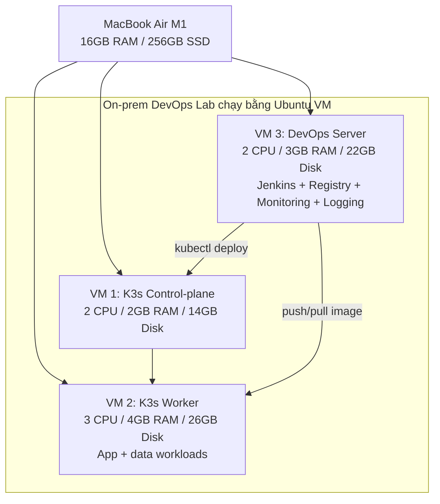
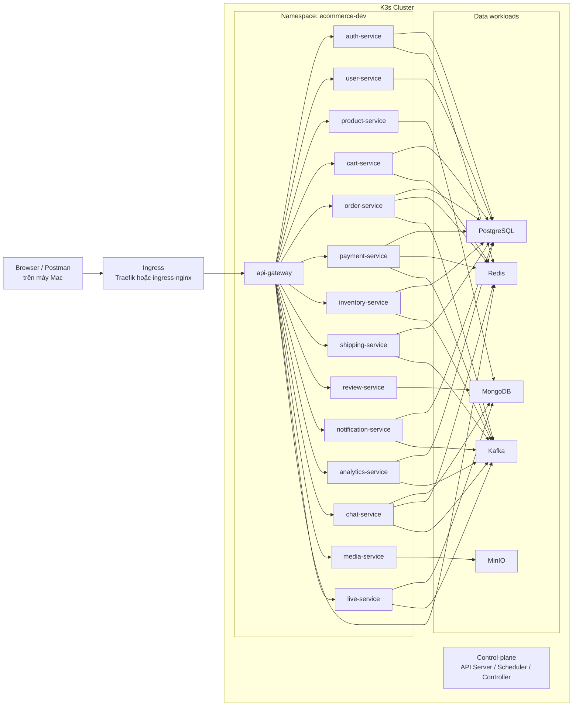
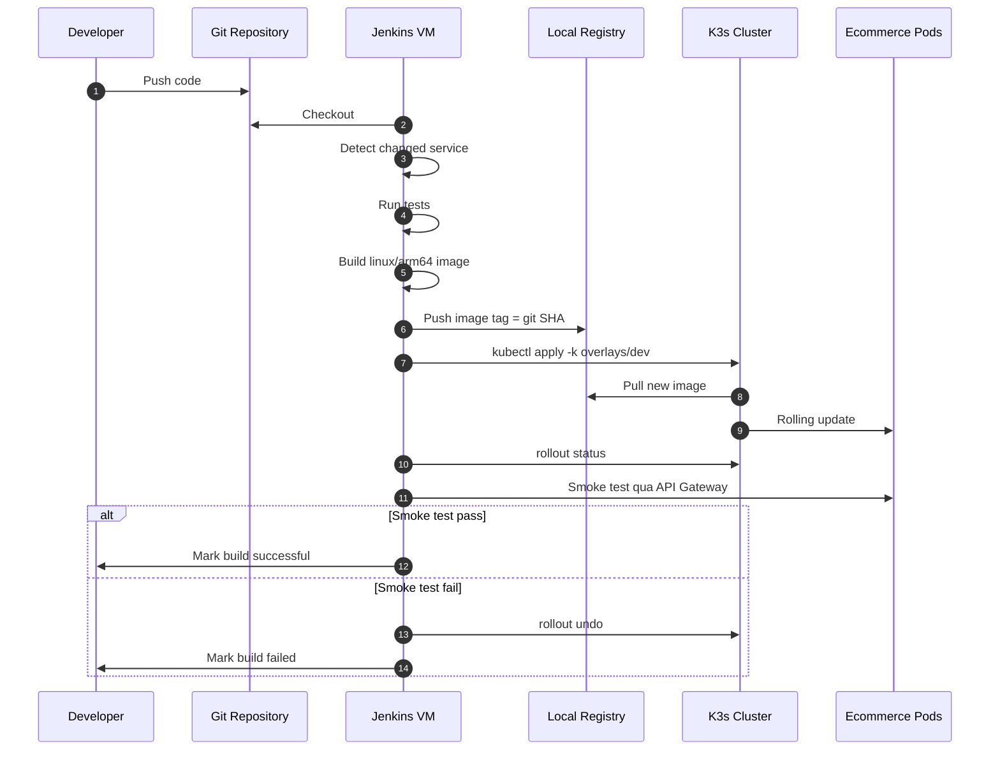
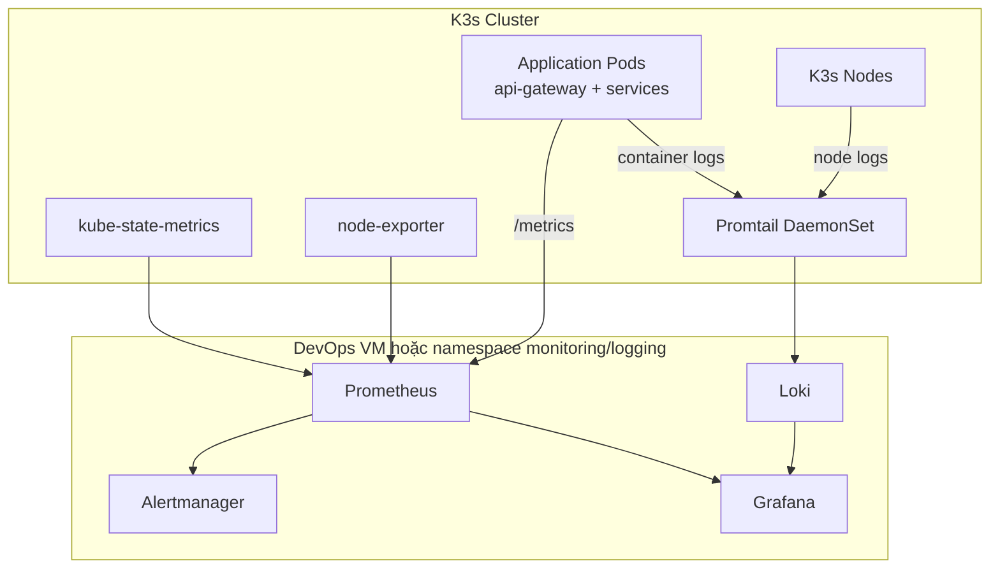

# Kế Hoạch Lab DevOps On-Prem Cho Dự Án Ecommerce Microservices

Tài liệu này giúp bạn mô phỏng cách một dự án microservices thật được build, deploy, giám sát, logging, rollback và vận hành trong môi trường gần giống on-premise production, nhưng vẫn phù hợp với MacBook Air M1 16GB RAM/256GB storage.

Mục tiêu chính không phải là nhồi thật nhiều công nghệ vào laptop, mà là học đúng tư duy và workflow của role DevOps ngoài thực tế.

## 1. Kết Luận Nhanh

Thiết kế ban đầu của bạn gồm 6 node/VM là đúng về mặt mô hình production nhỏ:

- 1 control-plane.
- 2 worker.
- 1 Jenkins server.
- 1 monitoring server.
- 1 logging server.

Nhưng nếu mỗi VM dùng 2 CPU, 4GB RAM thì tổng RAM đã tối thiểu 24-28GB, chưa tính macOS, IDE, browser, Docker cache và image layer. Vì vậy không phù hợp để chạy đồng thời trên MacBook Air M1 16GB.

Theo ảnh bạn gửi, máy đang dùng `159,57GB / 245,11GB`, còn khoảng `85,54GB` trống. Với mức này, lab nên giới hạn tổng disk VM khoảng `60-65GB` và giữ lại ít nhất `20GB` cho macOS, swap, cache, IDE và file tạm.

Phương án nên dùng:

- Giai đoạn triển khai được ngay với 85,54GB trống: 3 VM.
- Giai đoạn mô phỏng rõ hơn worker HA: 4 VM, chỉ nên dùng khi còn tối thiểu 110GB trống.
- Giai đoạn nâng cấp sau: chuyển lên đúng 6 VM khi có thêm RAM/storage hoặc máy riêng.

Stack khuyến nghị:

- Kubernetes: K3s, nhẹ hơn kubeadm và phù hợp laptop.
- CI/CD: Jenkins chạy ngoài cluster.
- Registry: Docker Registry nhẹ trên VM Jenkins.
- Monitoring: Prometheus + Grafana + node-exporter + kube-state-metrics.
- Logging: Loki + Promtail, không dùng ELK lúc đầu.
- Ingress: Traefik mặc định của K3s hoặc ingress-nginx. Chỉ chọn một.

## 2. Sơ Đồ Tổng Quan Lab

Sơ đồ này mô phỏng 6 vai trò thực tế nhưng nén lại thành 3 VM để vừa dung lượng hiện tại.



Nếu sau này dọn thêm dung lượng, bạn thêm `vm-k3s-worker-02`. Nếu có máy mạnh hơn, bạn tách `devops` thành 3 VM riêng:

- Jenkins server.
- Monitoring server.
- Logging server.

## 3. Đánh Giá Hiện Trạng Repo

Repo này rất phù hợp để học DevOps vì có nhiều thành phần giống dự án thật:

- Backend microservices trong `services/*`: **13 Go + 1 NestJS** (`auth-service`); catalog/shipping/live đều là Go trong compose mặc định.
- Root `docker-compose.yml` đã gom app services và hạ tầng phụ trợ: Kafka, PostgreSQL, MongoDB, Redis, MinIO, MediaMTX.
- API Gateway có `/health`, `/ready`, `/live`, `/metrics`.
- Nhiều service có health endpoint dạng `/api/v1/health`, `/api/v1/ready`, `/api/v1/live`.
- Các service dùng biến môi trường rõ ràng: `DATABASE_URL`, `REDIS_URL`, `KAFKA_BROKERS`, `JWT_ACCESS_SECRET`, `MONGODB_URI`, `MINIO_*`.
- Có sẵn thư mục `infrastructure/k3s`, `infrastructure/monitoring`, `infrastructure/logging`, `cicd`.

Điểm cần xử lý trước khi deploy lên K3s:

- Nhiều Dockerfile Go đang hard-code `GOARCH=amd64`. Trên Mac M1, Ubuntu VM thường là ARM64, nên cần sửa Dockerfile sang multi-arch.
- `cicd/Jenkinsfile` và các script deploy K3s hiện chưa có nội dung thật.
- `infrastructure/k3s/base/*` và `overlays/dev/*` đang là placeholder rỗng.
- Monitoring/logging config gần như chưa có nội dung.
- Root `docker-compose.yml` là nguồn tham chiếu tốt để chuyển sang Kubernetes manifest, nhưng không nên copy nguyên xi.

## 4. Topology Khuyến Nghị

### Phương Án A: 3 VM, Nên Dùng Với 85,54GB Trống

| VM | Role | CPU | RAM | Disk | Ghi chú |
|---|---:|---:|---:|---:|---|
| `vm-k3s-cp-01` | K3s control-plane | 2 | 2GB | 14GB | Chạy Kubernetes control-plane |
| `vm-k3s-worker-01` | Worker app/data | 3 | 4GB | 26GB | Chạy app, DB, Redis, Kafka single broker |
| `vm-devops-01` | Jenkins + registry + monitoring + logging | 2 | 3GB | 22GB | Mô phỏng server DevOps riêng |

Tổng disk VM khoảng 62GB. Máy còn khoảng 85,54GB trống, nên vẫn giữ được khoảng 20GB cho macOS và cache. Tổng RAM cấp cho VM khoảng 9GB, macOS còn khoảng 7GB, dễ thở hơn phương án 4 VM.

Với phương án này, bạn vẫn học được đầy đủ workflow DevOps: provision VM, bootstrap cluster, Jenkins pipeline, image registry, deploy, monitoring, logging, rollback. Điểm thiếu duy nhất là chưa mô phỏng được scheduling qua 2 worker thật.

Ngân sách disk nên giữ:

| Hạng mục | Dung lượng |
|---|---:|
| VM control-plane | 14GB |
| VM worker | 26GB |
| VM DevOps | 22GB |
| Buffer cho VM tăng trưởng | 3GB |
| Phần giữ lại cho macOS/cache | khoảng 20GB |

Quy tắc vận hành: nếu dung lượng trống của Mac xuống dưới 15GB thì dừng lab và dọn image/log trước, không tiếp tục build thêm image.

### Phương Án B: 4 VM, Dùng Khi Dọn Được Tối Thiểu 110GB Trống

| VM | Role | CPU | RAM | Disk | Ghi chú |
|---|---:|---:|---:|---:|---|
| `vm-k3s-cp-01` | K3s control-plane | 2 | 2GB | 16GB | Control-plane |
| `vm-k3s-worker-01` | Worker app | 2 | 3GB | 26GB | App workloads |
| `vm-k3s-worker-02` | Worker data/app | 2 | 3GB | 26GB | Data + app workloads |
| `vm-devops-01` | Jenkins + registry + monitoring + logging | 2 | 3GB | 28GB | DevOps tools |

Tổng disk VM khoảng 96GB. Phương án này hợp hơn với mô hình bạn thiết kế ban đầu, nhưng không nên dùng khi máy chỉ còn 85,54GB vì sẽ rất nhanh đầy disk.

### Phương Án C: 6 VM Siêu Nhẹ, Chỉ Dùng Khi Muốn Mô Phỏng Đúng Số Node

| VM | Role | CPU | RAM | Disk |
|---|---:|---:|---:|---:|
| `vm-k3s-cp-01` | Control-plane | 2 | 2GB | 20GB |
| `vm-k3s-worker-01` | Worker 1 | 2 | 2.5GB | 25GB |
| `vm-k3s-worker-02` | Worker 2 | 2 | 2.5GB | 25GB |
| `vm-jenkins-01` | Jenkins + registry | 2 | 2GB | 35GB |
| `vm-monitoring-01` | Prometheus + Grafana | 1 | 1.5GB | 20GB |
| `vm-logging-01` | Loki + Promtail/Grafana datasource | 1 | 1.5GB | 25GB |

Phương án 6 VM giúp bạn học networking, SSH, role separation tốt hơn, nhưng nhiều VM sẽ tốn overhead và disk I/O hơn. Với máy hiện tại, chỉ nên xem đây là roadmap.

## 5. Sơ Đồ Triển Khai Kubernetes

Đây là sơ đồ logic của hệ thống khi hoàn chỉnh. Với máy hiện tại, nên deploy theo từng slice, không bật toàn bộ service cùng lúc ngay từ đầu.



## 6. Những Việc Không Nên Làm Lúc Đầu

- Không dùng ELK full stack ngay. Elasticsearch cần RAM và disk cao.
- Không cài Harbor lúc đầu. Docker Registry là đủ để học image lifecycle.
- Không chạy replica > 1 cho tất cả service. Bắt đầu mỗi service 1 replica.
- Không deploy toàn bộ frontend, backend, Kafka, DB, monitoring, logging cùng lúc nếu chưa có baseline tài nguyên.
- Không bật HPA thật trước khi có metrics-server và resource request/limit đúng.

## 7. Phân Bổ Workload Trong Kubernetes

Namespace nên có:

- `ecommerce-dev`: app services và data stores cho lab.
- `monitoring`: Prometheus, Grafana, exporters.
- `logging`: Loki, Promtail.
- `ingress-nginx`: chỉ dùng nếu bạn không dùng Traefik mặc định của K3s.

Node label nên có với phương án 3 VM:

```bash
kubectl label node vm-k3s-worker-01 node-role=app
kubectl label node vm-k3s-worker-01 storage-role=lab-data
```

Nếu sau này thêm worker thứ hai:

```bash
kubectl label node vm-k3s-worker-02 node-role=data
```

Phân bổ khuyến nghị với 3 VM:

- Worker 1: API Gateway, auth, user, product, cart, order, payment, inventory, PostgreSQL, MongoDB, Redis, Kafka, MinIO.
- Các service còn lại triển khai sau theo từng đợt, không bật toàn bộ ngay từ đầu.
- Control-plane: ưu tiên chỉ chạy system pod. Nếu thiếu tài nguyên thì cho phép schedule một số pod nhẹ.

## 8. Sơ Đồ CI/CD



Pipeline Jenkins nên có các stage:

1. Checkout.
2. Detect changed services.
3. Test.
4. Build image `linux/arm64`.
5. Push image vào local registry.
6. Render Kustomize overlay.
7. Deploy vào `ecommerce-dev`.
8. Wait rollout.
9. Smoke test qua API Gateway.
10. Rollback nếu fail.

Ban đầu không cần build tất cả service mỗi lần. Nên build theo Jenkins parameter:

```txt
SERVICE_NAME=api-gateway
IMAGE_TAG=<git-sha>
ENVIRONMENT=dev
```

## 9. Phase 0: Chuẩn Bị Máy Host Với UTM + Ubuntu 22.04

Mục tiêu: tránh hết disk/RAM giữa chừng.

Việc cần làm:

- Giữ tổng dung lượng VM khoảng `60-65GB`, vì máy hiện còn khoảng `85,54GB` trống.
- Không tạo snapshot VM lúc đầu, vì snapshot có thể làm disk tăng rất nhanh.
- Chạy `docker system prune` định kỳ trên VM DevOps để dọn image layer cũ.
- Dùng UTM với Ubuntu Server 22.04 ARM64.
- Không dùng Ubuntu Desktop cho lab này vì tốn RAM/disk hơn Server.
- Đặt static IP cho các VM.
- Tạo SSH key riêng cho lab.

### Cấu Hình UTM Khuyến Nghị

Khi tạo VM trong UTM:

- Chọn `Virtualize`, không chọn `Emulate`, vì MacBook M1 chạy ARM64 native.
- Chọn Linux.
- ISO nên dùng: Ubuntu Server 22.04 LTS ARM64.
- Network nên dùng `Shared Network` trước cho dễ ra internet. Nếu cần IP cố định dễ hơn, có thể chuyển sang bridged network sau.
- Bật OpenSSH server trong lúc cài Ubuntu để SSH từ máy Mac vào VM.
- Không bật snapshot lúc đầu.
- Không cài GUI trong Ubuntu.

Disk/RAM trong UTM nên đặt đúng ngân sách:

| VM | RAM | CPU | Disk trong UTM |
|---|---:|---:|---:|
| `vm-k3s-cp-01` | 2GB | 2 | 14GB |
| `vm-k3s-worker-01` | 4GB | 3 | 26GB |
| `vm-devops-01` | 3GB | 2 | 22GB |

Sau khi cài Ubuntu 22.04, chạy trên từng VM:

```bash
sudo apt update
sudo apt -y upgrade
sudo apt -y install curl wget git vim htop net-tools ca-certificates gnupg lsb-release openssh-server
sudo systemctl enable --now ssh
```

Ví dụ IP:

| Hostname | IP |
|---|---|
| `vm-k3s-cp-01` | `192.168.64.10` |
| `vm-k3s-worker-01` | `192.168.64.11` |
| `vm-devops-01` | `192.168.64.20` |

## 10. Phase 1: Dựng K3s Cluster

Mục tiêu với máy hiện tại: có cluster 1 control-plane + 1 worker.

Khi dọn được thêm dung lượng, thêm `vm-k3s-worker-02` vào cluster để mô phỏng 2 worker như thiết kế ban đầu.

Trên control-plane:

```bash
curl -sfL https://get.k3s.io | sh -s - server --write-kubeconfig-mode 644
sudo cat /var/lib/rancher/k3s/server/node-token
```

Trên worker:

```bash
curl -sfL https://get.k3s.io | K3S_URL=https://192.168.64.10:6443 K3S_TOKEN=<token> sh -
```

Kiểm tra:

```bash
kubectl get nodes -o wide
kubectl get pods -A
```

Nếu chọn ingress-nginx, nên cài K3s với Traefik disabled ngay từ đầu:

```bash
curl -sfL https://get.k3s.io | sh -s - server --disable traefik --write-kubeconfig-mode 644
```

## 11. Phase 2: Dựng DevOps VM

Mục tiêu: Jenkins server nằm ngoài cluster, có local registry, SSH/kubectl deploy vào cluster.

Trên `vm-devops-01`:

- Cài Docker.
- Chạy Docker Registry `registry:2` ở port `5000`.
- Cài Jenkins LTS.
- Cài `kubectl`, `kustomize`, `docker buildx`.
- Copy kubeconfig từ control-plane về Jenkins credential.
- Tạo Jenkins credentials:
  - registry credential,
  - kubeconfig,
  - Git credential nếu repo private,
  - app secrets như JWT, DB password.

K3s nodes cần pull image từ registry nội bộ:

- Registry URL: `192.168.64.20:5000`.
- Nếu dùng HTTP/insecure registry, cấu hình `/etc/rancher/k3s/registries.yaml` trên tất cả K3s nodes.
- Restart K3s/k3s-agent sau khi cấu hình.

## 12. Phase 3: Sửa Image Build Cho ARM64

Mục tiêu: image chạy native trên Ubuntu ARM64 VM.

Nhiều Dockerfile Go hiện đang có dạng:

```dockerfile
RUN CGO_ENABLED=0 GOOS=linux GOARCH=amd64 go build -o /service ./cmd/server
```

Nên sửa sang dạng:

```dockerfile
ARG TARGETOS=linux
ARG TARGETARCH
RUN CGO_ENABLED=0 GOOS=$TARGETOS GOARCH=$TARGETARCH go build -trimpath -ldflags="-s -w" -o /service ./cmd/server
```

Jenkins build image:

```bash
docker buildx build --platform linux/arm64 \
  -t 192.168.64.20:5000/ecommerce/api-gateway:<git-sha> \
  --push services/api-gateway
```

Ghi chú: image Kafka/MinIO/Mongo/Postgres/Redis cần kiểm tra ARM64 trước khi dùng. Nếu image Kafka Confluent gặp lỗi trên ARM64, đổi sang Bitnami Kafka hoặc Redpanda cho lab.

## 13. Phase 4: Viết Kubernetes Manifests

Mục tiêu: biến `infrastructure/k3s` từ placeholder thành deployable Kustomize.

Cấu trúc nên có:

```txt
infrastructure/k3s/
  base/
    namespaces/
    configmaps/
    secrets/
    apps/
    data/
    ingress/
  overlays/
    dev/
      kustomization.yaml
      resource-limits.yaml
      replicas-patch.yaml
```

Viết theo thứ tự:

1. Namespace.
2. Secrets và ConfigMaps.
3. Data stores: PostgreSQL, Redis, MongoDB, Kafka, MinIO.
4. App services: từng Deployment + Service.
5. API Gateway Ingress.
6. Resource requests/limits.
7. Probes.

Resource request ban đầu:

| Loại pod | Request | Limit |
|---|---:|---:|
| Go service | 50m CPU, 64-128Mi RAM | 300m CPU, 256Mi RAM |
| NestJS service | 100m CPU, 256Mi RAM | 500m CPU, 512Mi RAM |
| API Gateway | 100m CPU, 128Mi RAM | 500m CPU, 512Mi RAM |
| PostgreSQL | 200m CPU, 512Mi RAM | 1 CPU, 1Gi RAM |
| MongoDB | 200m CPU, 512Mi RAM | 1 CPU, 1Gi RAM |
| Kafka single broker | 300m CPU, 768Mi RAM | 1 CPU, 1.5Gi RAM |
| Redis | 50m CPU, 128Mi RAM | 300m CPU, 256Mi RAM |
| MinIO | 100m CPU, 256Mi RAM | 500m CPU, 512Mi RAM |

Probe mapping:

- API Gateway:
  - liveness: `/live`
  - readiness: `/ready`
  - metrics: `/metrics`
- Go domain services:
  - liveness: `/api/v1/live`
  - readiness: `/api/v1/ready`
  - health: `/api/v1/health`
- `auth-service` (NestJS):
  - kiểm tra controller health hiện có rồi map tương ứng, thường là `/api/v1/health`.

## 14. Phase 5: Deploy Tối Thiểu Trước

Mục tiêu: có một slice nhỏ chạy được end-to-end.

Thứ tự nên deploy:

1. PostgreSQL, Redis, MongoDB.
2. Kafka.
3. MinIO.
4. `auth-service`.
5. `user-service`.
6. `product-service`.
7. `cart-service`.
8. `api-gateway`.

Kiểm tra:

```bash
kubectl -n ecommerce-dev get pods
kubectl -n ecommerce-dev get svc
kubectl -n ecommerce-dev logs deploy/api-gateway
curl http://<ingress-ip>/health
curl http://<ingress-ip>/ready
```

Sau khi slice đầu ổn định mới deploy tiếp:

- `order-service`
- `payment-service`
- `inventory-service`
- `shipping-service`
- `review-service`
- `notification-service`
- `analytics-service`
- `chat-service`
- `media-service`
- `live-service`

## 15. Sơ Đồ Observability



Mục tiêu monitoring:

- Biết service nào down.
- Biết pod nào restart.
- Biết API latency/status code.
- Biết node nào hết RAM/disk.
- Có alert có ý nghĩa.

Dashboard tối thiểu:

- Cluster nodes: CPU, RAM, disk, network.
- Kubernetes workload: pod restarts, pending pods, deployment replicas.
- API Gateway: request rate, latency, status code từ `/metrics`.
- Data stores: PostgreSQL/Mongo/Redis/Kafka basic availability.

Alert tối thiểu:

- Node memory > 85%.
- Node disk > 85%.
- Pod crash looping.
- Deployment unavailable > 2 phút.
- API Gateway 5xx rate tăng.
- Kafka unavailable.
- PostgreSQL unavailable.

## 16. Logging Plan

Dùng Loki + Promtail:

- Promtail chạy DaemonSet trên K3s nodes.
- Lấy log container từ `/var/log/pods`.
- Label log theo namespace, pod, container, app.
- Grafana dùng Loki datasource.

Query cần học:

```logql
{namespace="ecommerce-dev", app="api-gateway"}
{namespace="ecommerce-dev"} |= "error"
{namespace="ecommerce-dev", container="order-service"} |= "outbox"
```

Không dùng ELK lúc đầu vì:

- Elasticsearch cần RAM và disk cao.
- Index lifecycle, shard, heap tuning sẽ làm lab nặng hơn mức cần thiết.
- Loki phù hợp hơn để học Kubernetes logging trên laptop.

## 17. Security Và Config

Cần làm tối thiểu:

- Secrets không commit giá trị production.
- Tạo `Secret` riêng cho JWT, DB password, MinIO secret.
- Dùng `ConfigMap` cho URL nội bộ, feature flags, topic names.
- Bật NetworkPolicy sau khi app đã chạy ổn định.
- Jenkins credentials không lưu plain text trong Jenkinsfile.
- Local registry nên có basic auth nếu VM expose ra LAN.
- Dùng non-root container nếu Dockerfile đã hỗ trợ.

NetworkPolicy sau khi ổn định:

- Ingress chỉ vào API Gateway.
- API Gateway được gọi các service.
- Service chỉ gọi DB/Kafka/Redis cần thiết.
- Monitoring được scrape metrics endpoint.
- Logging được đọc log node.

## 18. Backup Và Rollback Drill

Đây là phần quan trọng để học role DevOps thực tế.

Cần luyện:

- Backup PostgreSQL bằng `pg_dump`.
- Backup MongoDB bằng `mongodump`.
- Backup MinIO bucket.
- Backup Kubernetes manifests và Jenkins config.
- Rollback deployment:

```bash
kubectl -n ecommerce-dev rollout undo deploy/api-gateway
```

- Restore DB vào namespace lab mới.
- Giả lập sự cố:
  - kill pod bất kỳ và xem Deployment tự tạo lại,
  - làm sai image tag và rollback,
  - tắt Kafka và xem service log/error,
  - đẩy node gần hết disk và xem alert,
  - sau khi có worker thứ hai, drain một worker node rồi quan sát pod reschedule.

## 19. Lộ Trình Học Theo Tuần

### Tuần 1: VM Và Cluster

- Tạo VM, static IP, SSH.
- Cài K3s 2 node: 1 control-plane + 1 worker.
- Label node, xem pod system.
- Cài local registry.

Kết quả cần đạt: `kubectl get nodes` thấy 2 node `Ready`.

### Tuần 2: Container Và Manifest

- Sửa Dockerfile Go cho ARM64.
- Build/push 2 image đầu tiên: `api-gateway`, `user-service`.
- Viết Deployment/Service/ConfigMap/Secret đầu tiên.
- Deploy API Gateway health endpoint.

Kết quả cần đạt: curl vào API Gateway từ máy host.

### Tuần 3: Data Stores Và Service Slice

- Deploy PostgreSQL, Redis, MongoDB, Kafka.
- Deploy `auth-service`, `user-service`, `product-service`, `cart-service`.
- Thêm readiness/liveness probes.

Kết quả cần đạt: pod Ready, API Gateway gọi được service downstream.

### Tuần 4: Jenkins CI/CD

- Cài Jenkins.
- Tạo pipeline parameterized theo service.
- Build image, push registry, deploy K3s.
- Rollback khi smoke test fail.

Kết quả cần đạt: commit/pipeline tạo image mới và rollout thành công.

### Tuần 5: Observability

- Cài Prometheus, Grafana, node-exporter, kube-state-metrics.
- Scrape `/metrics` của API Gateway.
- Cài Loki + Promtail.
- Tạo dashboard và alert cơ bản.

Kết quả cần đạt: xem được metrics, logs, pod restarts, node RAM/disk.

### Tuần 6: Production-Like Operations

- NetworkPolicy.
- Backup/restore drill.
- Rollout/rollback drill.
- Incident runbook.
- Resource tuning.

Kết quả cần đạt: có runbook xử lý sự cố và checklist deploy.

## 20. Definition Of Done Cho Lab

Lab được xem là đạt mục tiêu khi:

- Có K3s cluster 2 node `Ready` với phương án hiện tại, hoặc 3 node `Ready` nếu đã thêm worker thứ hai.
- Jenkins build được ít nhất 1 Go service và 1 NestJS service.
- Image được push vào local registry.
- `kubectl apply -k infrastructure/k3s/overlays/dev` deploy được app.
- API Gateway expose qua Ingress.
- Ít nhất 5 backend services `Ready`.
- Có PostgreSQL, MongoDB, Redis, Kafka, MinIO đang chạy.
- Prometheus/Grafana xem được node và workload metrics.
- Loki/Grafana xem được log theo service.
- Pipeline có smoke test và rollback.
- Có backup/restore DB demo.

## 21. Thứ Tự File Nên Tạo/Sửa Trong Repo

Làm theo thứ tự này để ít rối nhất:

1. Sửa Dockerfile Go để support ARM64/multi-arch.
2. Tạo `infrastructure/k3s/base/namespaces`.
3. Tạo `infrastructure/k3s/base/configmaps` và `secrets`.
4. Tạo manifest data stores.
5. Tạo manifest cho `api-gateway` và 4 service đầu.
6. Tạo `infrastructure/k3s/overlays/dev/kustomization.yaml`.
7. Viết `cicd/Jenkinsfile`.
8. Viết `cicd/scripts/docker-build.sh`.
9. Viết `cicd/scripts/k3s-deploy.sh`.
10. Viết `cicd/scripts/smoke-tests.sh`.
11. Bổ sung monitoring/logging manifests.
12. Bổ sung README/runbook vận hành.

## 22. Roadmap Lên Mô Hình 6 Node Thật

Khi có máy mạnh hơn hoặc server riêng:

- Mốc gần nhất: dọn máy lên tối thiểu 110GB trống rồi thêm `vm-k3s-worker-02` để có 1 control-plane + 2 worker.
- Tách Jenkins ra VM riêng 4GB RAM.
- Tách monitoring ra VM riêng 4GB RAM.
- Tách logging ra VM riêng, dùng Loki 4GB RAM hoặc ELK 8GB RAM.
- Chuyển PostgreSQL/MongoDB/Kafka ra data VM riêng hoặc managed-like VM.
- K3s có thể giữ 1 control-plane + 2 worker, hoặc tăng lên 3 control-plane nếu học HA.
- Thêm staging namespace và production namespace, hoặc tách 2 cluster nếu đủ tài nguyên.

## 23. Tư Duy DevOps Cần Học Qua Lab Này

Mỗi bước nên gắn với một công việc DevOps ngoài đời:

- Provision VM: quản lý server, SSH, IP, package.
- K3s install: cluster bootstrap.
- Registry: image lifecycle.
- Jenkins: CI/CD automation.
- Kustomize: environment promotion.
- Secrets/ConfigMap: config management.
- Probes/resource limits: production readiness.
- Prometheus/Grafana: monitoring/SLO.
- Loki: debugging bằng log.
- Rollback: release safety.
- Backup/restore: disaster recovery.
- NetworkPolicy: zero-trust nội bộ.

Điểm quan trọng nhất: mô phỏng đúng quy trình vận hành production, không phải chạy mọi thứ ở cấu hình production thật trên laptop.
