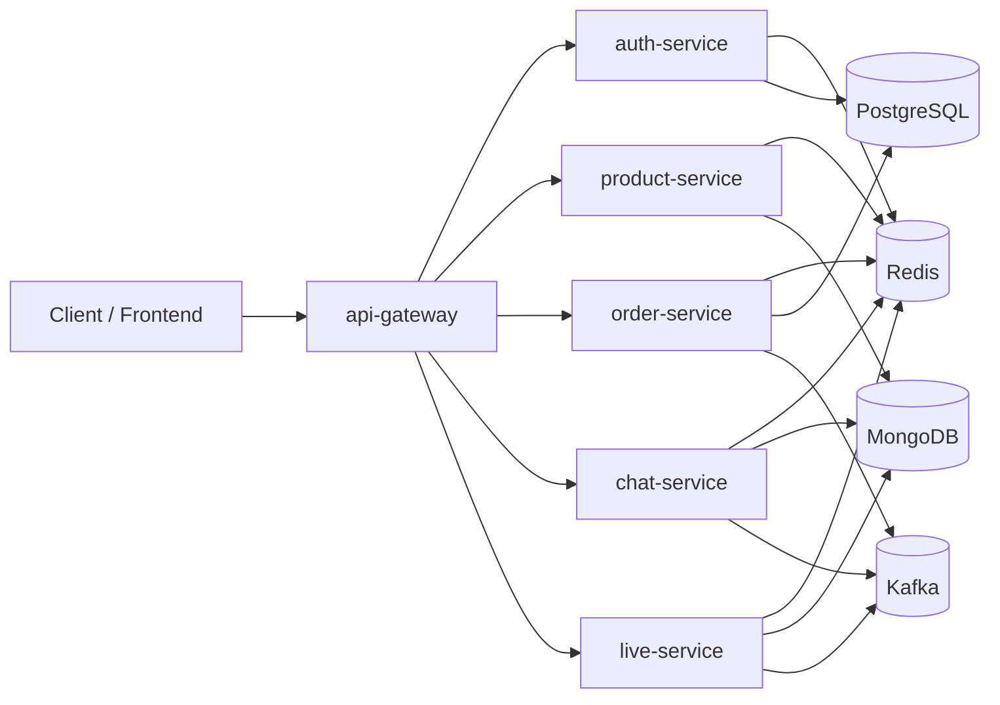
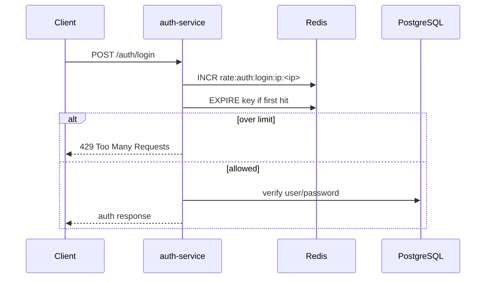
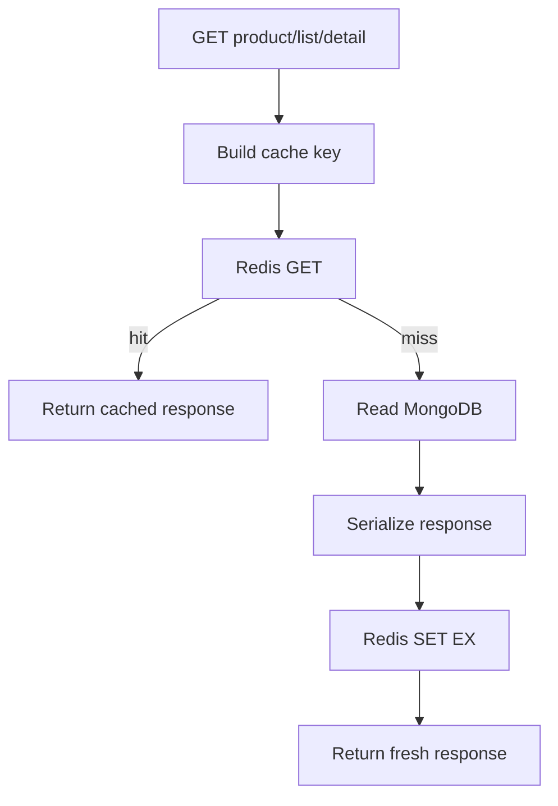
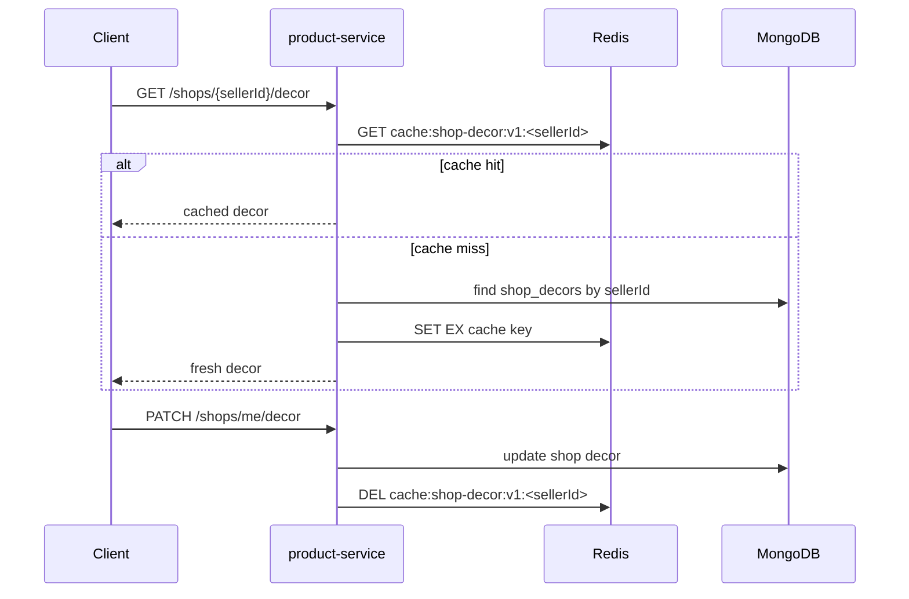
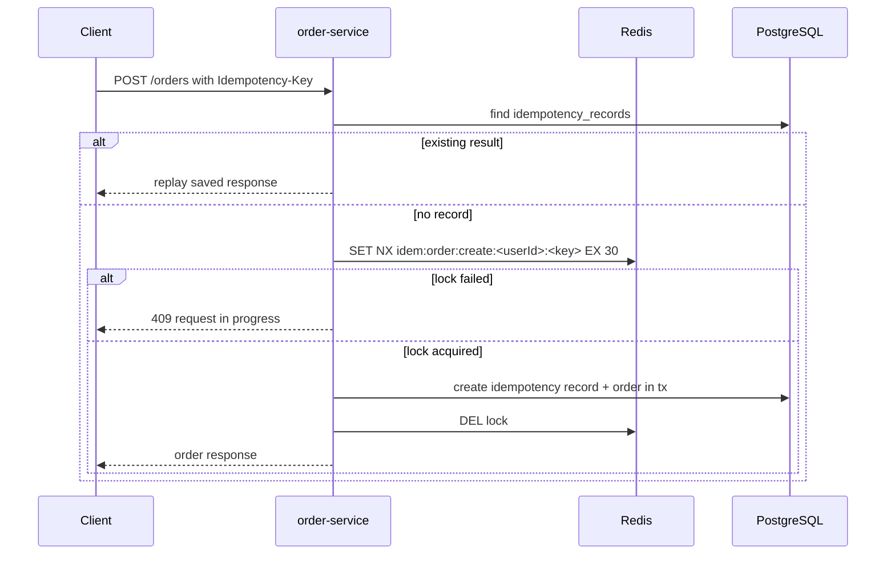
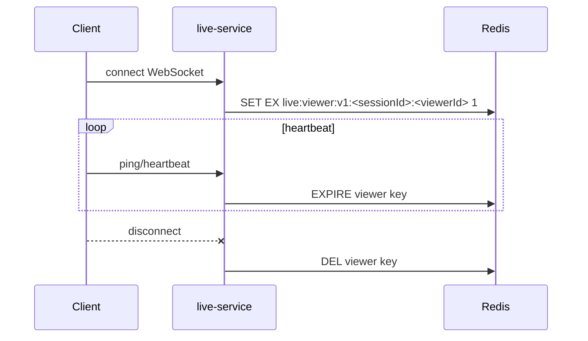
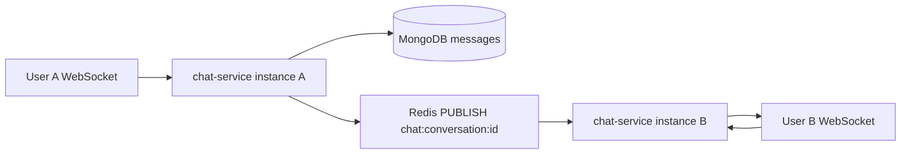

# Redis Adoption Plan

Status: planned
Last updated: 2026-05-21

## 1. Goal

Mở rộng cách dùng Redis trong ecommerce microservices theo hướng an toàn:

- Redis chỉ giữ dữ liệu tạm, cache, lock, pub/sub và presence.
- PostgreSQL/MongoDB vẫn là source of truth.
- Mỗi key phải có owner service, mục đích rõ, TTL rõ nếu là dữ liệu tạm.
- Ưu tiên các use case giúp giảm tải DB hoặc bảo vệ endpoint quan trọng.

6 use case ưu tiên:

```txt
1. Auth rate limit
2. Product cache
3. Shop decor cache
4. Order/checkout idempotency lock
5. Live viewer presence
6. Chat/live PubSub
```

## 2. Current Redis Baseline

Redis hiện đã được dùng cho:

| Area | Service | Current usage |
|---|---|---|
| Auth revocation | `auth-service` | `revoked:session:*`, `revoked:access:*` |
| Token revocation check | Multiple services | Check `revoked:access:<jti>` |
| Product video feed cache | `product-service` | `product-videos:feed:v1:*` |
| Order idempotency lock | `order-service` | `idem:lock:*` |
| Chat realtime | `chat-service` | Pub/Sub `chat:conversation:*` |
| Live realtime/presence | `live-service` | Pub/Sub + `live:presence:*` |

Observed local keys can look small because most Redis keys expire quickly or are Pub/Sub channels that do not appear as persisted keys.

## 3. Design Rules

### 3.1 Redis Is Not The Source Of Truth

Do not store these only in Redis:

```txt
orders
payments
inventory final quantity
users
audit logs
outbox/inbox events
product catalog source records
```

Redis may cache or coordinate these flows, but durable state must remain in PostgreSQL/MongoDB.

### 3.2 Key Naming Convention

Use this form:

```txt
<purpose>:<service-or-domain>:<resource>:<identifier>
```

Examples:

```txt
rate:auth:login:ip:<ip>
cache:product:detail:<productId>
cache:product:list:<queryHash>
cache:shop-decor:<sellerId>
lock:checkout:user:<userId>
idem:order:create:<userId>:<idempotencyKey>
live:presence:<sessionId>
chat:conversation:<conversationId>
```

Rules:

- Keep keys lowercase.
- Use `:` as separator.
- Put the broad purpose first: `rate`, `cache`, `lock`, `idem`, `live`, `chat`, `revoked`.
- Avoid raw long query strings in keys; use stable hashes for complex filters.
- Never include secrets, raw tokens, passwords, or full PII in Redis keys.

### 3.3 TTL Policy

| Key type | Suggested TTL | Required |
|---|---:|---|
| Auth rate limit | 1m-15m | Yes |
| Forgot password/email resend limit | 15m-1h | Yes |
| Product list cache | 30s-2m | Yes |
| Product detail cache | 1m-5m | Yes |
| Shop decor cache | 5m-30m | Yes |
| Checkout/order lock | 10s-60s | Yes |
| Live presence | 30s-2m | Yes |
| Revoked access token | access token remaining TTL | Yes |
| Revoked session | refresh/session TTL policy | Yes |
| Pub/Sub channel | no persisted key | N/A |

Default rule: if a key is not durable business state, it should have TTL.

### 3.4 Failure Behavior

Redis failure must not corrupt durable data.

| Use case | If Redis is down |
|---|---|
| Auth rate limit | Fail closed for sensitive auth endpoints or fallback to stricter behavior |
| Product cache | Bypass cache and read MongoDB |
| Shop decor cache | Bypass cache and read MongoDB |
| Checkout lock | Prefer fail closed with `503` or use DB idempotency record fallback |
| Live presence | Return degraded viewer count or hide count |
| Pub/Sub | Realtime broadcast degraded; persisted messages still go MongoDB |

## 4. Target Architecture



## 5. Use Case 1: Auth Rate Limit

### 5.1 Scope

Apply rate limit to:

```txt
POST /auth/login
POST /auth/register
POST /auth/forgot-password
POST /auth/resend-verify-email
GET  /auth/oauth/google/authorize
POST /auth/oauth/exchange-ticket
```

### 5.2 Goals

- Reduce brute-force login attempts.
- Reduce email abuse for reset/verification flows.
- Keep behavior deterministic across multiple `auth-service` instances.

### 5.3 Key Design

```txt
rate:auth:login:ip:<ip>
rate:auth:login:email:<emailHash>
rate:auth:register:ip:<ip>
rate:auth:forgot-password:email:<emailHash>
rate:auth:resend-verify-email:email:<emailHash>
rate:auth:oauth:ip:<ip>
```

Use normalized email hash instead of raw email:

```txt
sha256(lowercase(trim(email)))
```

### 5.4 Suggested Limits

| Endpoint | Limit | Window |
|---|---:|---:|
| login per IP | 20 | 1m |
| login per email | 10 | 15m |
| register per IP | 10 | 10m |
| forgot-password per email | 3 | 15m |
| resend-verify-email per email | 3 | 15m |
| oauth authorize per IP | 60 | 1m |

### 5.5 Flow



### 5.6 Implementation Notes

- Add a small `RateLimiterService` in `auth-service`.
- Use atomic Redis operation through Lua script or `MULTI`/`INCR` + `EXPIRE`.
- Return `429` with a stable error code such as `RATE_LIMITED`.
- Include `retryAfterSeconds` in response metadata if practical.
- Do not store raw email in Redis key.

## 6. Use Case 2: Product Cache

### 6.1 Scope

Cache read-heavy product APIs:

```txt
GET /api/v1/products
GET /api/v1/products/{id}
GET /api/v1/videos/feed
```

Video feed cache already exists. This plan standardizes and extends product cache.

### 6.2 Key Design

```txt
cache:product:list:v1:<queryHash>
cache:product:detail:v1:<productId>
cache:video:feed:v1:<queryHash>
cache:product:keys:v1
cache:video:feed:keys:v1
```

Use key sets to invalidate groups:

```txt
SADD cache:product:keys:v1 <cache-key>
SADD cache:video:feed:keys:v1 <cache-key>
```

### 6.3 TTL

```txt
product list:   30s-120s
product detail: 60s-300s
video feed:     keep current 45s or move to 60s
```

### 6.4 Flow



### 6.5 Invalidation

Invalidate product cache when:

```txt
product created
product updated
product deleted/archived
product status changed
video created/updated/published/unpublished/archived
```

Basic approach:

- Delete product detail key for affected product.
- Delete all list/feed keys from key set.
- Delete key set after clearing members.

### 6.6 Implementation Notes

- Keep cached value as compact JSON.
- Do not cache user-specific management lists unless key includes user and role.
- Keep public list/detail cache separate from seller/admin views.
- Add logs for cache hit/miss at debug level only.

## 7. Use Case 3: Shop Decor Cache

### 7.1 Scope

Cache shop decor because it is read frequently and changes rarely.

Endpoints:

```txt
GET /api/v1/shops/{sellerId}/decor
GET /api/v1/shops/me/decor
PATCH /api/v1/shops/me/decor
```

### 7.2 Key Design

```txt
cache:shop-decor:v1:<sellerId>
```

### 7.3 TTL

```txt
5m-30m
```

Recommended local/dev default:

```txt
10m
```

### 7.4 Flow



### 7.5 Implementation Notes

- Cache only public-safe response shape.
- Invalidate immediately on update.
- If Redis is unavailable, return MongoDB result without failing the endpoint.

## 8. Use Case 4: Order/Checkout Idempotency Lock

### 8.1 Current State

`order-service` already uses Redis lock during order creation:

```txt
idem:lock:<userId>:<idempotencyKey>
```

PostgreSQL `idempotency_records` stores durable idempotency state.

### 8.2 Target Standard

Normalize key names:

```txt
idem:order:create:<userId>:<idempotencyKey>
lock:checkout:user:<userId>
lock:payment:order:<orderId>
```

### 8.3 Goals

- Prevent duplicate checkout from double click.
- Prevent two concurrent requests with same idempotency key.
- Prevent repeated payment processing for same order.
- Keep durable idempotency record in PostgreSQL.

### 8.4 TTL

| Key | TTL |
|---|---:|
| `idem:order:create:*` | 30s |
| `lock:checkout:user:*` | 30s-60s |
| `lock:payment:order:*` | 30s-60s |

### 8.5 Flow



### 8.6 Implementation Notes

- Keep PostgreSQL idempotency record as final protection.
- Redis lock is only fast concurrency guard.
- Always `DEL` lock on success/failure where safe.
- Keep TTL short so stale locks self-heal.

## 9. Use Case 5: Live Viewer Presence

### 9.1 Current State

`live-service` has Redis presence primitives:

```txt
live:presence:<sessionId>
```

### 9.2 Target Behavior

Use Redis to track currently connected viewers.

Possible models:

Option A: counter per session:

```txt
live:presence:<sessionId> = count
```

Option B: per-viewer heartbeat:

```txt
live:viewer:<sessionId>:<viewerId> = 1
```

Recommended: Option B for better correctness. Count by scanning/sorted set or maintain counter with careful connect/disconnect handling.

### 9.3 Key Design

```txt
live:viewer:v1:<sessionId>:<viewerId>
live:presence:v1:<sessionId>
```

### 9.4 TTL

```txt
viewer heartbeat: 30s-90s
presence aggregate: 30s-90s
```

### 9.5 Flow



### 9.6 Implementation Notes

- Presence can be eventually consistent.
- UI should tolerate approximate counts.
- Do not store viewer PII; use user ID or anonymous connection ID.
- If Redis is down, hide viewer count or return `null`.

## 10. Use Case 6: Chat/Live PubSub

### 10.1 Current State

`chat-service` and `live-service` already have Redis Pub/Sub helpers.

Channels:

```txt
chat:conversation:<conversationId>
live:session:<sessionId>
```

### 10.2 Goal

Allow multiple service instances to broadcast messages to WebSocket clients connected to different instances.

### 10.3 Flow



### 10.4 Important Limits

Redis Pub/Sub is not durable:

- If subscriber is down, message is missed.
- Durable chat/live records must still be written to MongoDB.
- Pub/Sub is only for realtime fan-out.

### 10.5 Implementation Notes

- Persist message first in MongoDB.
- Publish lightweight event after persistence.
- WebSocket receiver can re-fetch missed messages from MongoDB.
- Add message envelope with event type and version:

```json
{
  "type": "chat.message.created",
  "version": 1,
  "conversationId": "...",
  "messageId": "...",
  "occurredAt": "..."
}
```

## 11. Shared Redis Helper Requirements

Each Go service currently has its own small Redis helper. That is acceptable short term. Before Redis usage grows too much, standardize behavior:

- Parse Redis URL consistently.
- Add `Ping`.
- Add `GetJSON`/`SetJSON`.
- Add `SetNXWithTTL`.
- Add safe `Delete`.
- Add no-op fallback when Redis is disabled where appropriate.

Do not move runtime helper across services unless using `packages/backend-shared` or an approved shared package boundary. Avoid direct service-to-service runtime imports.

## 12. Observability

Add minimal metrics/logging per service:

```txt
redis_cache_hit_total{service,cache}
redis_cache_miss_total{service,cache}
redis_rate_limited_total{service,endpoint}
redis_lock_acquire_total{service,lock,result}
redis_operation_errors_total{service,operation}
```

Logs:

- Log Redis unavailable at warn level with rate limiting.
- Do not log full keys when they contain user IDs or hashes unless needed for debug.
- Log cache invalidation failures as warn, not fatal, for read caches.

## 13. Local Operations

Useful commands:

```bash
docker compose exec redis redis-cli --scan
docker compose exec redis redis-cli --scan --pattern "cache:*"
docker compose exec redis redis-cli --scan --pattern "rate:*"
docker compose exec redis redis-cli TTL "key-name"
docker compose exec redis redis-cli TYPE "key-name"
docker compose exec redis redis-cli INFO keyspace
```

Recommended local Redis memory guard if usage grows:

```yaml
redis:
  image: redis:7-alpine
  command: redis-server --maxmemory 256mb --maxmemory-policy allkeys-lru
```

Production note: choose maxmemory policy carefully. For critical revocation/lock keys, avoid treating Redis as the only security boundary.

## 14. Rollout Plan

### Phase 1: Auth Rate Limit

Files likely touched:

```txt
services/auth-service/src/common/utils/redis.service.ts
services/auth-service/src/modules/auth/services/*
services/auth-service/src/modules/auth/controllers/*
```

Validation:

```txt
npm --workspace services/auth-service run test
npm --workspace services/auth-service run build
manual curl repeated login -> expect 429 after threshold
```

### Phase 2: Product + Shop Cache

Files likely touched:

```txt
services/product-service/internal/service/product_service.go
services/product-service/internal/service/shop_decor_service.go
services/product-service/internal/service/video_service.go
services/product-service/internal/service/redis_service.go
```

Validation:

```txt
cd services/product-service && go test ./...
curl product list/detail twice
redis-cli --scan --pattern "cache:product:*"
update product -> verify cache invalidated
```

### Phase 3: Checkout Lock Standardization

Files likely touched:

```txt
services/order-service/internal/service/idempotency_service.go
services/order-service/internal/service/redis_service.go
```

Validation:

```txt
cd services/order-service && go test ./...
scripts/test-checkout-saga.sh
manual duplicate idempotency request -> one succeeds, one conflicts/replays
```

### Phase 4: Live Presence

Files likely touched:

```txt
services/live-service/internal/service/redis_service.go
services/live-service/internal/handler/ws_handler.go
services/live-service/internal/service/live_service.go
```

Validation:

```txt
cd services/live-service && go test ./...
connect WebSocket client
redis-cli --scan --pattern "live:*"
disconnect -> key expires/deletes
```

### Phase 5: Chat/Live PubSub Hardening

Files likely touched:

```txt
services/chat-service/internal/service/redis_service.go
services/chat-service/internal/handler/chat_handler.go
services/chat-service/internal/service/chat_service.go
services/live-service/internal/service/redis_service.go
```

Validation:

```txt
cd services/chat-service && go test ./...
cd services/live-service && go test ./...
run two service instances locally if needed
verify message persisted in MongoDB and broadcast through Redis
```

## 15. Risks And Mitigations

| Risk | Mitigation |
|---|---|
| Cache stale data | Short TTL + targeted invalidation on writes |
| Redis memory grows | TTL every cache/rate/lock key + maxmemory policy |
| Redis outage breaks reads | Cache reads fallback to DB |
| Redis outage breaks checkout lock | Use DB idempotency as durable fallback or return `503` |
| Sensitive data in keys | Hash emails, never store raw tokens/passwords |
| Pub/Sub message loss | Persist to MongoDB/PostgreSQL before publishing |
| Too many query cache keys | Normalize query + hash + cap page/pageSize |

## 16. Definition Of Done

A Redis use case is done only when:

- Key naming follows this document.
- TTL is documented and implemented.
- Redis failure behavior is explicit.
- Unit/service tests cover hit/miss or lock/rate-limit behavior.
- Manual verification command is documented.
- No durable business data depends only on Redis.

## 17. Implementation Checklist

### Planning

- [ ] Confirm Redis key naming convention.
- [ ] Confirm TTL defaults per use case.
- [ ] Confirm local Redis memory policy for development.
- [ ] Decide whether to keep per-service Redis helpers or introduce shared helper later.

### Auth Rate Limit

- [ ] Add auth rate limiter service.
- [ ] Add login IP limit.
- [ ] Add login email limit with hashed email key.
- [ ] Add register IP limit.
- [ ] Add forgot-password email limit.
- [ ] Add resend-verify-email limit.
- [ ] Add OAuth flow limit.
- [ ] Add auth-service tests.
- [ ] Verify repeated auth calls return `429`.

### Product Cache

- [ ] Add product list cache.
- [ ] Add product detail cache.
- [ ] Standardize video feed cache key naming if needed.
- [ ] Add cache key set for group invalidation.
- [ ] Invalidate cache on product create/update/delete/status change.
- [ ] Invalidate video feed cache on video write actions.
- [ ] Add product-service tests.
- [ ] Verify Redis keys appear and expire.

### Shop Decor Cache

- [ ] Add public shop decor cache.
- [ ] Add my shop decor cache only if response is safe for user-specific caching.
- [ ] Invalidate on decor update.
- [ ] Add tests for cache hit/miss/invalidate.

### Checkout Lock

- [ ] Normalize idempotency lock key names.
- [ ] Add optional user checkout lock if needed.
- [ ] Add payment/order lock if payment callback flow needs it.
- [ ] Verify stale locks expire.
- [ ] Run order-service tests.
- [ ] Run checkout saga scripts.

### Live Presence

- [ ] Decide counter vs per-viewer heartbeat model.
- [ ] Add viewer heartbeat key.
- [ ] Add disconnect cleanup.
- [ ] Add viewer count endpoint or response field if needed.
- [ ] Add tests.
- [ ] Verify keys expire after viewer disconnect/timeout.

### Chat/Live PubSub

- [ ] Standardize event envelope.
- [ ] Ensure persistence happens before publish.
- [ ] Add reconnect/re-fetch behavior for missed messages where needed.
- [ ] Add tests for publish/subscribe path.

### Observability And Docs

- [ ] Add basic cache hit/miss metrics.
- [ ] Add Redis operation error metrics.
- [ ] Add troubleshooting notes to local setup docs if useful.
- [ ] Add manual Redis inspection commands for each use case.
