# DevSecOps Platform Design

This document describes the current GitLab CI DevSecOps pipeline in this repository and the target production workflow. This is the new pipeline direction for the project. It should not be read as the old legacy pipeline.

Local development is currently Docker Compose based. Kubernetes, Harbor, Argo CD, Kyverno, and in-cluster observability are represented by manifests and pipeline scripts, but they still require real environment values before production use.

## Current Repository State

Implemented:

- `.gitlab-ci.yml` with stages for discovery, validation, security, build, publish, and GitOps value updates.
- Changed-target detection in `ci/scripts/detect-changed-targets.sh`.
- Service quality checks through `ci/scripts/run-quality-gates.sh`.
- Gitleaks, Semgrep, Trivy filesystem scan, Trivy image scan, and CycloneDX SBOM generation.
- Docker image build and push scripts for Harbor-compatible image names.
- Optional Cosign signing logic in `ci/scripts/publish-images.sh` when Cosign and `COSIGN_PRIVATE_KEY` are available.
- Helm chart and dev values under `deploy/helm/ecommerce`.
- Argo CD application manifest under `deploy/argocd`.
- Kyverno policies under `deploy/kyverno/policies`.
- Local ELK stack through `docker-compose.elk.yml`.

## Current GitLab CI Pipeline

The active pipeline is defined in `.gitlab-ci.yml`.

| Stage | Job | What It Does | Output |
|---|---|---|---|
| `discover` | `detect_changed_targets` | Detects changed service/app folders from the Git diff. | `changed-targets.txt`, `changed-targets.env` |
| `validate` | `lint_and_test` | Runs scoped quality gates for each changed target. Go targets run `go test ./...`; npm targets run available lint/test/build scripts. | pass/fail validation |
| `security` | `gitleaks_secret_scan` | Scans the full repo for committed secrets. | fail on detected secrets |
| `security` | `semgrep_sast` | Runs Semgrep CI, secrets, and OWASP Top 10 rules. | fail on detected blocking findings |
| `security` | `trivy_filesystem_scan` | Scans source filesystem and dependencies for high/critical vulnerabilities. | fail on high/critical findings |
| `build` | `build_images` | Builds Docker images for changed targets using Harbor-style names. | `built-images.txt`, `image-tars/` |
| `build` | `trivy_image_scan` | Scans built image tarballs and generates CycloneDX SBOMs. | `sbom-*.json` |
| `publish` | `publish_images` | Pushes images to Harbor-compatible registry on `main` or `develop` when registry credentials exist. | `published-images.txt` |
| `gitops` | `update_gitops_dev` | Updates Helm dev image references for GitOps deployment. | commit to `deploy/helm/ecommerce/values-dev.yaml` |

Important boundaries:

- Cosign signing is optional in the script, but the current GitLab publish job image does not install Cosign yet.
- Harbor publishing needs real `HARBOR_*` CI variables.
- The GitOps update job needs `GITOPS_PUSH_TOKEN` and a real GitLab remote.
- Argo CD and Kyverno manifests exist, but they are not automatically installed by this pipeline.
- Prometheus/Grafana and in-cluster ELK are target platform components, not active GitLab CI jobs.

Not fully wired yet:

- Real Harbor registry credentials and registry hostname.
- Cosign installation in the GitLab publish job image.
- Real GitLab project URL in Argo CD.
- Real Kubernetes cluster, ingress, secrets, and environment-specific values.
- In-cluster Prometheus/Grafana deployment.
- In-cluster Filebeat/Logstash/Elasticsearch/Kibana deployment.

## Target Stack

- GitLab CI for pipeline automation.
- Harbor for private container images.
- Argo CD for GitOps deployment.
- Kubernetes for runtime.
- Trivy, Semgrep, Gitleaks, and Kyverno for security gates.
- Prometheus and Grafana for metrics.
- Elasticsearch, Logstash, Kibana, and Filebeat for logs.

## Code Flow

Current implemented CI flow:

```txt
Developer push / merge request
-> GitLab CI
-> detect changed targets
-> lint/test/build checks per changed target
-> Gitleaks secret scan
-> Semgrep SAST scan
-> Trivy filesystem scan
-> Docker image build
-> Trivy image scan
-> SBOM generation
-> publish to Harbor-compatible registry when configured
-> update Helm dev values for GitOps when configured
```



```mermaid
flowchart LR
  dev[Developer] -->|Push / Merge Request| repo[GitLab Repository]
  repo --> pipeline[GitLab CI Pipeline]

  subgraph current["Current implemented pipeline"]
    pipeline --> discover[discover<br/>detect_changed_targets]
    discover --> validate[validate<br/>lint_and_test]
    validate --> gitleaks[security<br/>Gitleaks secret scan]
    gitleaks --> semgrep[security<br/>Semgrep SAST]
    semgrep --> trivyfs[security<br/>Trivy filesystem scan]
    trivyfs --> build[build<br/>Docker build images]
    build --> trivyimg[build<br/>Trivy image scan]
    trivyimg --> sbom[build<br/>Generate SBOM]
    sbom --> publish[publish<br/>Push images if Harbor is configured]
    publish --> gitops[gitops<br/>Update Helm dev values]
  end

  subgraph target["Target platform after environment setup"]
    harbor[(Harbor Registry)]
    argocd[Argo CD]
    kyverno[Kyverno Admission Policies]
    k8s[Kubernetes Cluster]
    prom[Prometheus]
    grafana[Grafana]
    filebeat[Filebeat]
    logstash[Logstash]
    elastic[(Elasticsearch)]
    kibana[Kibana]
  end

  publish -.->|requires HARBOR_* variables| harbor
  gitops -.->|requires GITOPS_PUSH_TOKEN| argocd
  argocd -.->|sync desired state| kyverno
  kyverno -.->|allow compliant workloads| k8s
  k8s -.->|pull images| harbor
  k8s -.->|scrape metrics| prom
  prom -.-> grafana
  k8s -.->|container logs| filebeat
  filebeat -.-> logstash
  logstash -.-> elastic
  elastic -.-> kibana

  subgraph future["Future research extension"]
    rag[RAG Risk Gate<br/>PASS / WARNING / BLOCK]
  end

  gitleaks -.-> rag
  semgrep -.-> rag
  trivyfs -.-> rag
  trivyimg -.-> rag
  sbom -.-> rag
  rag -.->|future gate decision| publish
```

If your Markdown viewer does not render Mermaid, open the draw.io version:

```txt
docs/diagram/devsecops-current-target-rag.drawio
```

Target production flow:

```txt
Developer
-> GitLab repository
-> GitLab CI merge request pipeline
-> lint, test, Gitleaks, Semgrep, Trivy filesystem scan
-> Docker build
-> Trivy image scan
-> SBOM generation
-> optional Cosign image signing
-> Harbor registry
-> GitOps values update
-> Argo CD sync
-> Kyverno admission policies
-> Kubernetes rollout
-> smoke tests
-> Prometheus/Grafana metrics
-> Filebeat/Logstash/Elasticsearch/Kibana logs
```

## Repository Layout

```txt
.gitlab-ci.yml
ci/scripts/
deploy/helm/ecommerce/
deploy/argocd/
deploy/kyverno/policies/
docs/devsecops/
```

## GitLab CI Variables

Configure these variables in GitLab project settings:

```txt
HARBOR_REGISTRY
HARBOR_PROJECT
HARBOR_USERNAME
HARBOR_PASSWORD
GITOPS_PUSH_TOKEN
COSIGN_PRIVATE_KEY
COSIGN_PASSWORD
```

`COSIGN_PRIVATE_KEY` and `COSIGN_PASSWORD` are only useful after the publish job image includes Cosign or the job installs Cosign before `ci/scripts/publish-images.sh` runs.

## Phased Rollout

1. Run MR validation only: lint, test, Gitleaks, Semgrep, Trivy filesystem scan.
2. Enable Docker build and Trivy image scan.
3. Connect Harbor and publish images.
4. Deploy the Helm chart manually to a dev cluster.
5. Install Argo CD and apply `deploy/argocd/ecommerce-dev-application.yaml`.
6. Install Kyverno and apply policies from `deploy/kyverno/policies`.
7. Add Prometheus/Grafana and ELK into the cluster.
8. Switch image updates to digest-only GitOps promotion.

## Proposed RAG Risk Gate

A proposed research extension is documented in [`rag-risk-gate-proposal.md`](./rag-risk-gate-proposal.md). The idea is to consume scanner reports from Trivy, Semgrep, and Gitleaks, retrieve additional context from CVE/CWE/OWASP references and service architecture metadata, then output a deployment decision:

```txt
PASS | WARNING | BLOCK
```

This RAG-based decision layer is not implemented yet. It should be treated as future work on top of the existing CI security reports and deployment metadata.

## Local ELK

Local ELK is available through `docker-compose.elk.yml`. Startup commands, Kibana data view setup, test queries, and local Elasticsearch notes are documented in [`deploy/observability/elk/README.md`](../../deploy/observability/elk/README.md).

## Notes

- Replace `harbor.example.com` and `gitlab.example.com` placeholders before using this in a real environment.
- `require-signed-images` starts in `Audit` mode because it needs a real Cosign public key and a signed-image promotion path.
- The Helm chart assumes every service exposes `/health` and `/metrics`. Override `healthPath` per service if needed.
- The dev Helm values set `APP_ENV=production` so Go services use zap JSON logs, which are easier for Logstash and Elasticsearch to parse.

## ELK Readiness Check

The current source is mostly ready for ELK because services log to stdout/stderr and Kubernetes/Filebeat can collect those container logs.

What is already in place:

- Go services use `zap`.
- Go HTTP middleware emits request logs with request ID, method, path, status, duration, and client IP.
- HTTP request logs use ELK-friendly fields such as `service`, `request_id`, `status`, and `duration_ms`.
- `X-Request-ID` is generated or propagated by middleware.
- `auth-service` writes JSON lines to stdout through `AppLogger`.

Items to verify before deploying ELK:

1. Keep application logs on stdout/stderr. Do not write application logs to files inside containers.
2. Run Kubernetes services with `APP_ENV=production` or update the code to support a dedicated `LOG_FORMAT=json` flag.
3. Use Kubernetes metadata as a fallback for `service` when a non-HTTP log line does not include it.
4. Avoid logging secrets, tokens, passwords, authorization headers, and sensitive personal data.

Recommended Logstash normalization:

```txt
request_id = request_id || kubernetes.labels.request_id
service = service || kubernetes.labels.app.kubernetes.io/component || kubernetes.container.name
status = status
duration_ms = duration_ms || parsed duration
```
