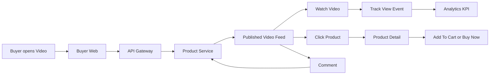

# Buyer Video Watch Flow

Last updated: 2026-06-01

## Main Idea

- `Product Service` owns published video feed, video product tags, metrics, and comments.
- `Analytics` receives view/click events for video KPI.
- Buyer can watch, click product, buy, or comment from the video flow.

## Note

`add-to-cart` tracking endpoint exists, but `buyer-web` currently does not auto-send that event after local cart add.
