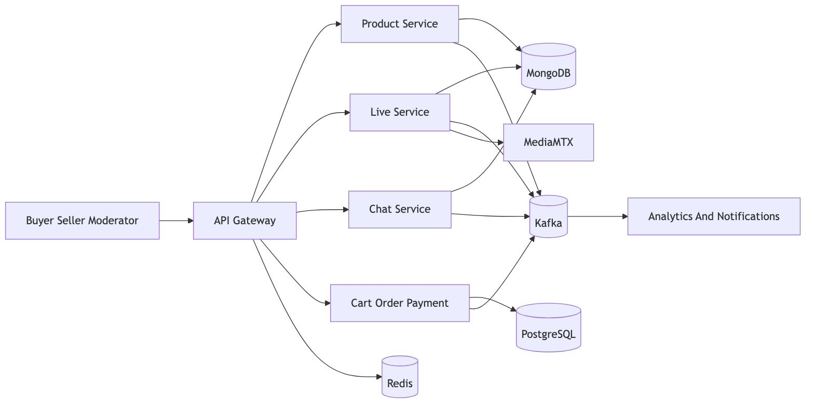
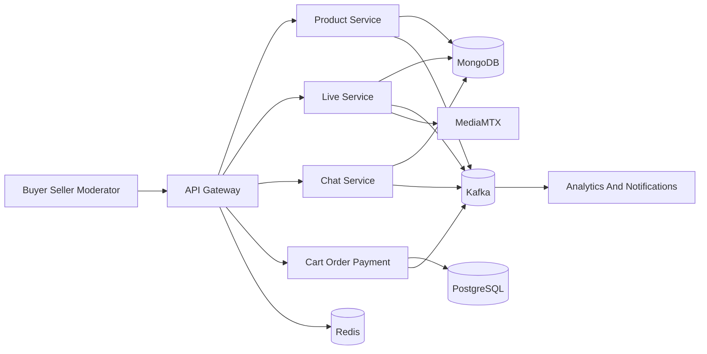
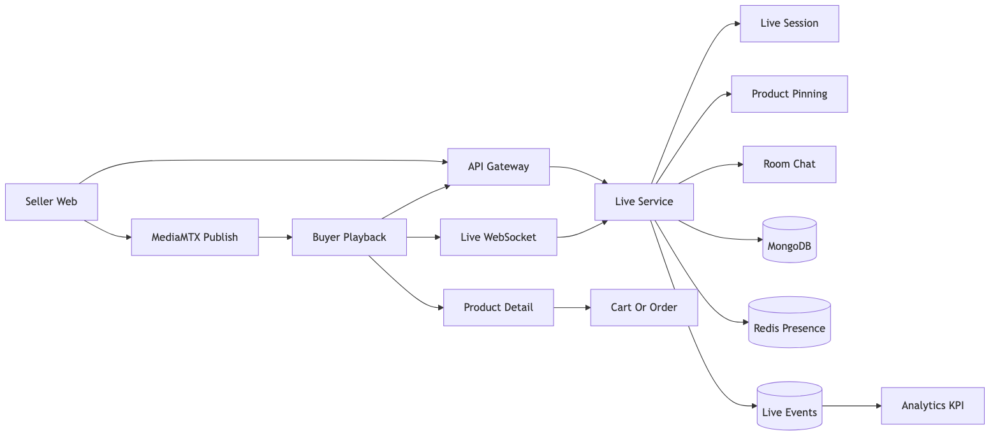
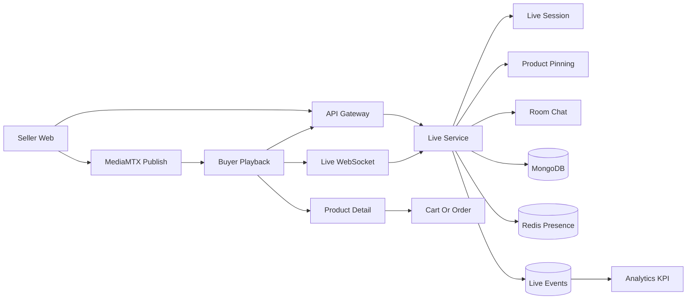
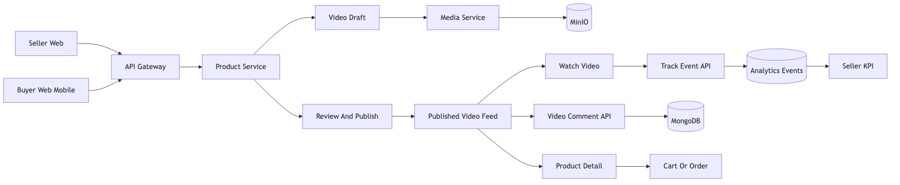
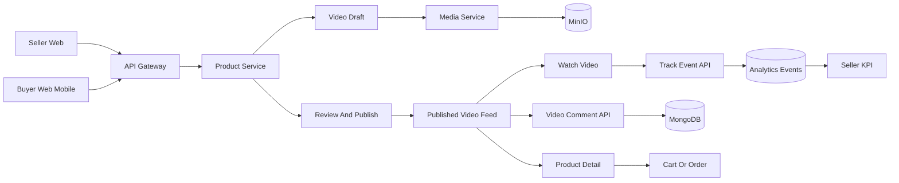
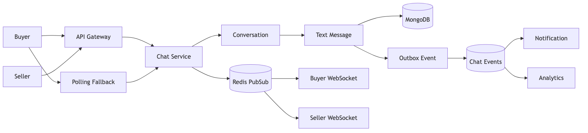
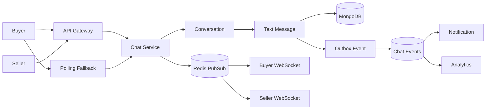
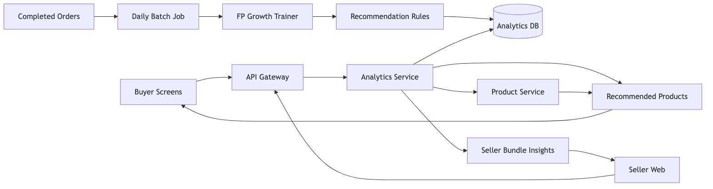
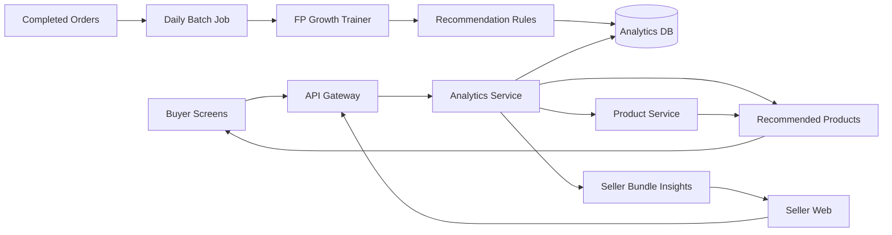

# Media Commerce Presentation Flows

Last updated: 2026-06-01

Mục tiêu của file này là gom các sơ đồ ngắn, dễ trình bày cho phần livestream, shoppable video và chat. Các hình dưới đây lấy ý chính từ `docs/architecture/*`, `docs/development/video-live-comments-implementation-plan.md`, `docs/img-uc/livestream-flow-technology-algorithm.md` và đối chiếu thêm với route hiện tại trong services.

File này dùng PNG đã render sẵn để preview hiện hình ổn định. SVG cùng tên cũng được giữ lại nếu cần ảnh vector; Mermaid source nằm trong phần thu gọn để sửa lại khi cần.

## 1. Kiến Trúc Runtime Rút Gọn

Mermaid source

Ý chính:

- `api-gateway` là cổng duy nhất cho web/mobile.
- MongoDB lưu catalog/video, live room, chat và review.
- PostgreSQL lưu các domain giao dịch như cart, order, payment, inventory.
- Kafka phục vụ event bất đồng bộ cho analytics, notification và audit.
- MediaMTX chỉ lo đường media realtime của livestream.

## 3. Luồng Livestream

Mermaid source

Luồng trình bày:

1. Seller tạo phiên live, start live và pin sản phẩm qua `api-gateway` vào `live-service`.
2. Seller phát camera/screen lên MediaMTX; buyer xem stream từ MediaMTX.
3. Chat phòng live, viewer count, product pin và media metric đi qua Live WebSocket.
4. `live-service` lưu session/message/product pin ở MongoDB, dùng Redis cho presence/rate-limit và publish Kafka event.
5. Buyer click sản phẩm trong live rồi đi tiếp sang product detail, cart hoặc order.

## 4. Luồng Shoppable Video

Mermaid source

Luồng trình bày:

1. Seller tạo video draft trong `product-service`, upload asset qua `media-service` lên MinIO.
2. Seller gắn sản phẩm, submit review; moderator approve thì video mới vào feed public.
3. Buyer mở feed video, xem video, click sản phẩm, comment hoặc thêm giỏ hàng.
4. `product-service` sở hữu metadata video, tag sản phẩm, comment video và tracking event.
5. Analytics nhận view/click/cart event để tính KPI cho seller.

## 5. Luồng Chat 1-1 Buyer Seller

Mermaid source

Luồng trình bày:

1. Buyer hoặc seller tạo/lấy conversation 1-1 qua `chat-service`.
2. Message text được lưu MongoDB với `clientMessageId` để chống gửi trùng.
3. WebSocket đẩy realtime cho hai bên; nếu WS lỗi thì client polling lịch sử message.
4. Outbox publish `chat.message.created` hoặc `chat.message.read` lên Kafka cho notification và analytics.

## 6. Luồng FP-Growth Recommendation

Mermaid source

Luồng trình bày:

1. Hệ thống lấy các đơn hàng đã hoàn thành làm dữ liệu đầu vào.
2. Batch job hằng ngày chạy FP-Growth để tìm các sản phẩm thường được mua cùng.
3. Kết quả được lưu thành `recommendation_rules` trong Analytics DB.
4. Khi buyer mở product, cart, video hoặc live, frontend gọi API Gateway sang Analytics Service để lấy gợi ý.
5. Analytics Service có thể lấy thêm thông tin sản phẩm từ Product Service rồi trả về danh sách recommended products.
6. Seller cũng xem được insight các cặp sản phẩm hay đi chung để tạo combo hoặc tối ưu bán hàng.

## 7. Ranh Giới Chức Năng

| Phần | Service sở hữu | Ghi chú thuyết trình |
|---|---|---|
| Video feed, video tags, video comments | `product-service` | Comment video là public comment, không phải chat 1-1 |
| Live session, pinned products, live room chat | `live-service` | Live WebSocket phục vụ room realtime |
| Live media realtime | MediaMTX | Seller publish một stream, buyer playback từ media engine |
| Buyer seller private chat | `chat-service` | Chỉ dành cho hội thoại 1-1 buyer-seller |
| Recommendation FP-Growth | `analytics-service` | Batch training từ completed orders, request đọc rule đã tính sẵn |
| Commerce sau khi click sản phẩm | Cart, order, payment services | Video/live chỉ dẫn buyer sang luồng mua hàng |
