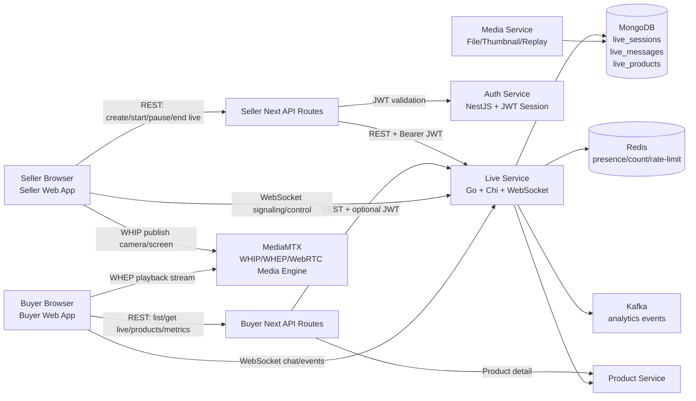
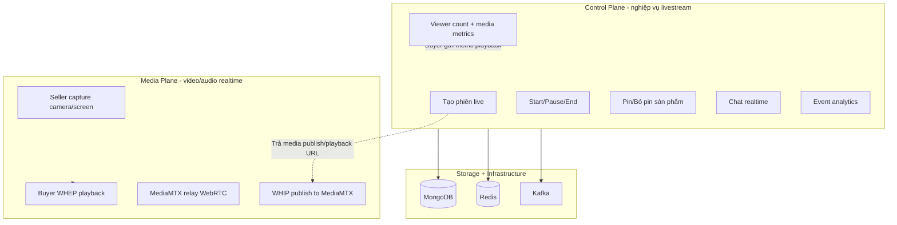
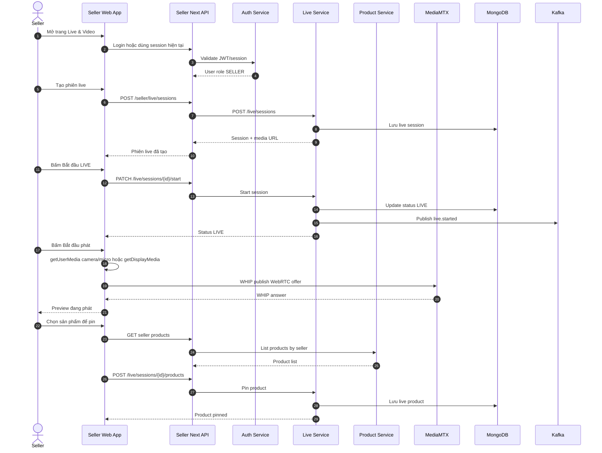
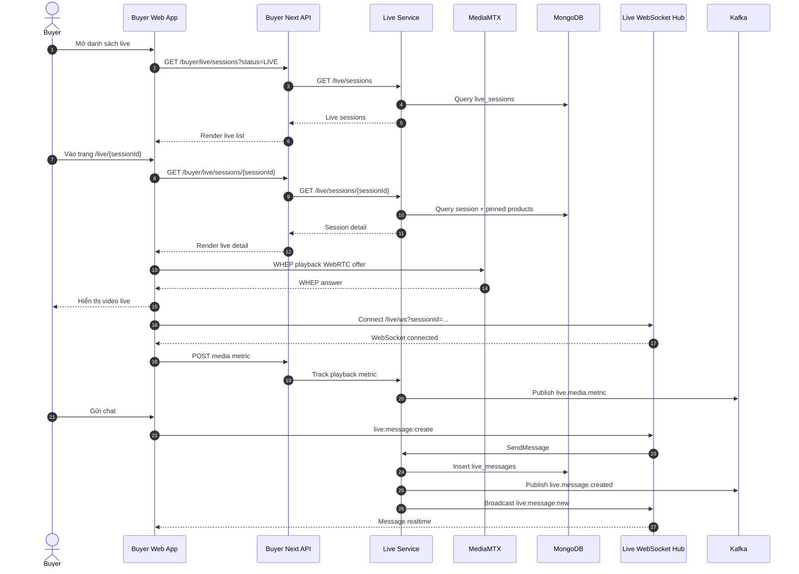
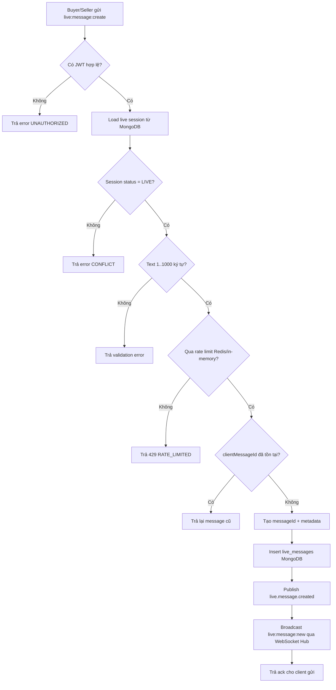
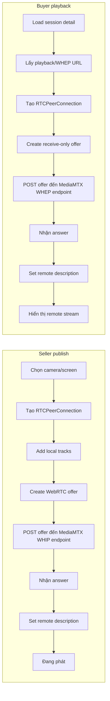
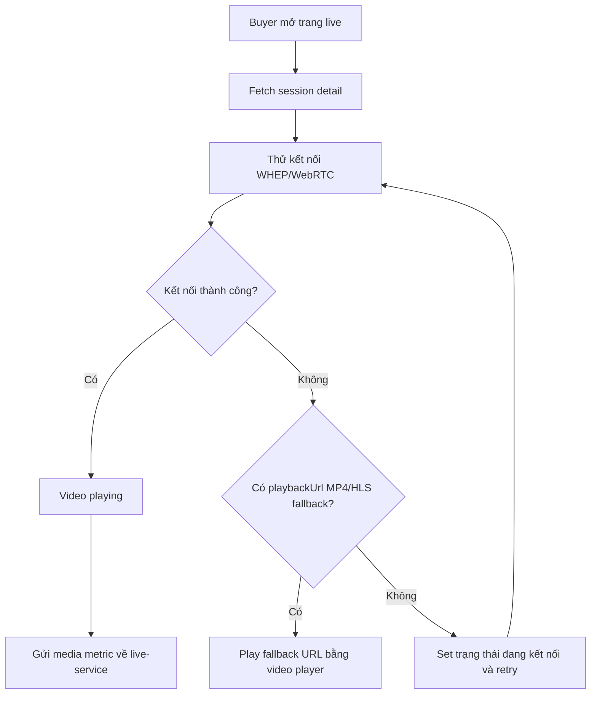

# Livestream Flow, Technology, And Algorithms

Tài liệu này mô tả luồng hoạt động livestream hiện tại của hệ thống eMall theo hướng production-like: `live-service` quản lý nghiệp vụ live, còn `MediaMTX` xử lý video/audio realtime.

## 1. Sơ đồ tổng quan

## 2. Phân tách control plane và media plane

## 3. Luồng seller tạo và phát livestream

## 4. Luồng buyer xem livestream

## 5. Thuật toán gửi chat realtime

Ghi chú hiện tại: message đã được lưu vào `live_messages`, nhưng UI chưa có API load lịch sử chat khi refresh trang. Chat hiện đang hiển thị realtime message trong state của trang.

## 6. Thuật toán phát và xem WebRTC qua MediaMTX

## 7. Thuật toán reconnect phía buyer

## 8. Công nghệ sử dụng

| Thành phần | Công nghệ | Vai trò |
| --- | --- | --- |
| Buyer Web | Next.js, React, WebRTC WHEP, WebSocket | Xem livestream, chat, click sản phẩm, gửi media metrics |
| Seller Web | Next.js, React, WebRTC WHIP, Media Capture API | Tạo phiên live, publish camera/screen, pin sản phẩm |
| Live Service | Go, Chi router, Gorilla WebSocket | Quản lý session live, chat, product pin, metrics, event tracking |
| Media Engine | MediaMTX | Nhận WHIP stream từ seller và phát WHEP stream cho buyer |
| Auth Service | NestJS, JWT, session revocation | Xác thực buyer/seller và kiểm soát session đăng nhập |
| Product Service | Go service | Cung cấp sản phẩm để seller pin trong live |
| MongoDB | Document database | Lưu live sessions, pinned products, live messages |
| Redis | Cache/presence/rate limit | Viewer presence, rate limit, session/token revocation hỗ trợ |
| Kafka | Event broker | Gửi event analytics như live started, message created, product clicked, media metric |

## 9. Ranh giới trách nhiệm

```mermaid
flowchart TB
    LiveService["Live Service"]
    MediaMTX["MediaMTX"]
    ProductService["Product Service"]
    AuthService["Auth Service"]
    MediaService["Media Service"]

    LiveService --> L1["Tạo/quản lý phiên live"]
    LiveService --> L2["Chat realtime"]
    LiveService --> L3["Pin sản phẩm"]
    LiveService --> L4["Viewer count + metrics"]
    LiveService --> L5["Publish analytics event"]

    MediaMTX --> M1["Nhận media từ seller"]
    MediaMTX --> M2["Relay video/audio cho buyer"]
    MediaMTX --> M3["Giảm tải upload phía seller"]

    ProductService --> P1["Danh sách sản phẩm của shop"]
    ProductService --> P2["Thông tin sản phẩm được pin"]

    AuthService --> A1["Login/JWT/session"]
    AuthService --> A2["Một user chỉ có một session active"]

    MediaService --> MS1["Thumbnail/file/replay nếu mở rộng recording"]
```

## 10. Trạng thái hiện tại và phần có thể mở rộng

| Hạng mục | Trạng thái hiện tại |
| --- | --- |
| Seller publish video | Đã có luồng WHIP lên MediaMTX |
| Buyer xem video | Đã có luồng WHEP từ MediaMTX |
| Live session lifecycle | Đã có create/start/pause/end |
| Pin sản phẩm | Đã có chọn sản phẩm và pin vào live |
| Chat realtime | Đã có WebSocket và lưu MongoDB |
| Load lịch sử chat | Chưa có API load history sau refresh |
| Metrics playback | Đã có endpoint media metric |
| Analytics event | Đã publish Kafka theo các event chính |
| Recording/replay | Chưa triển khai đầy đủ |
| CDN/HLS quy mô lớn | Chưa triển khai, hiện ưu tiên WebRTC low-latency |
