# 3. Kiến trúc tổng thể (Overall Architecture)
## 3.1 Kiến trúc tổng thể – Microservices

Dưới đây là sơ đồ kiến trúc hệ thống tổng thể của dự án `ecommerce-microservices`, được vẽ mô phỏng theo cấu trúc mẫu:

```mermaid
flowchart TD
    %% Định dạng CSS cho các node
    classDef clientLayer fill:#f9f9f9,stroke:#333,stroke-width:1px;
    classDef gateway fill:#fff,stroke:#333,stroke-width:2px;
    classDef service fill:#fff,stroke:#333,stroke-width:1px;
    classDef db fill:#fff,stroke:#333,stroke-width:1px,shape:cylinder;
    classDef broker fill:#fff,stroke:#333,stroke-width:1px;

    %% Client Layer
    subgraph ClientLayer [Client Layer]
        direction LR
        BuyerApp["Buyer App<br>ReactJS"]:::clientLayer
        SellerApp["Seller App<br>ReactJS"]:::clientLayer
        ModApp["Moderator App<br>ReactJS"]:::clientLayer
    end

    %% API Gateway
    subgraph GatewayLayer [API Gateway]
        AG["API Gateway<br>NodeJS"]:::gateway
    end

    %% Connections from Client to Gateway
    BuyerApp -- HTTPS --> AG
    SellerApp -- HTTPS --> AG
    ModApp -- HTTPS --> AG

    %% Microservices Layer
    subgraph MicroservicesLayer [Microservices Layer]
        direction LR
        Auth["Auth Service"]:::service
        User["User Service"]:::service
        Product["Product Service"]:::service
        Cart["Cart Service"]:::service
        Order["Order Service"]:::service
        Payment["Payment Service"]:::service
        Inventory["Inventory Service"]:::service
        Shipping["Shipping Service"]:::service
        Review["Review Service"]:::service
        Chat["Chat Service"]:::service
        Notif["Notification Service"]:::service
        Analytics["Analytics Service"]:::service
    end

    %% Connections from Gateway to Services
    AG --> Auth
    AG --> User
    AG --> Product
    AG --> Cart
    AG --> Order
    AG --> Payment
    AG --> Inventory
    AG --> Shipping
    AG --> Review
    AG --> Chat
    AG --> Notif
    AG --> Analytics

    %% Data Layer
    subgraph DataLayer [Data Layer]
        direction LR
        Postgres[("PostgreSQL")]:::db
        Mongo[("MongoDB")]:::db
        Redis[("Redis")]:::db
    end

    %% Message Broker Layer
    subgraph BrokerLayer [Message Broker]
        Kafka["Kafka / Zookeeper"]:::broker
    end

    %% Service to Database Connections (PostgreSQL)
    Auth & User & Cart & Order & Payment & Inventory & Shipping & Notif & Analytics --> Postgres
    
    %% Service to Database Connections (MongoDB)
    Product & Review & Chat --> Mongo
    
    %% Service to Redis (Caching / PubSub)
    Auth & User & Product & Cart & Order & Payment & Shipping & Review & Chat & Notif & Analytics --> Redis

    %% Service to Message Broker Connections
    Auth & User & Order & Payment & Inventory & Shipping & Chat & Notif --> Kafka
```

